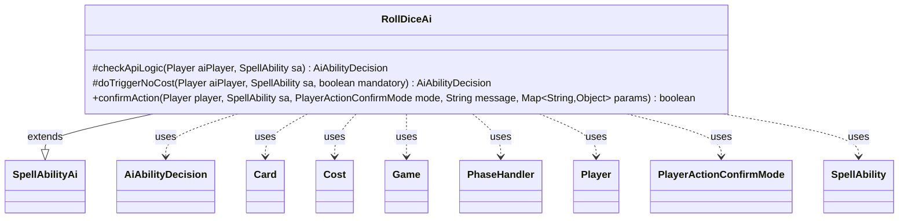

---
aliases:
  - RollDiceAi
tags:
  - java/class
  - module/forge-ai
  - pkg/forge/ai/ability
fqn: forge.ai.ability.RollDiceAi
package: forge.ai.ability
module: forge-ai
kind: Class
---

# RollDiceAi

**Package:** `forge.ai.ability`   **Module:** `forge-ai`   **Kind:** Class



## Relationships
**Extends:**
- [[forge.ai.SpellAbilityAi|SpellAbilityAi]]
**Uses:**
- [[forge.ai.AiAbilityDecision|AiAbilityDecision]]
- [[forge.game.Game|Game]]
- [[forge.game.card.Card|Card]]
- [[forge.game.cost.Cost|Cost]]
- [[forge.game.phase.PhaseHandler|PhaseHandler]]
- [[forge.game.player.Player|Player]]
- [[forge.game.player.PlayerActionConfirmMode|PlayerActionConfirmMode]]
- [[forge.game.spellability.SpellAbility|SpellAbility]]

## Design Description

RollDiceAi supplies the artificial-intelligence decision logic for spell abilities that roll dice, plugging into Forge's AI framework as a concrete subclass of SpellAbilityAi. By overriding `checkApiLogic`, it decides whether and when the AI should activate a roll-dice ability, dispatching on an `AILogic` parameter to favor combat windows, an early-combat window, or the second main phase, and otherwise deferring costly (mana- or tap-paid) activations until its own end step. Its `doTriggerNoCost` override always commits when the ability is triggered for free, and `confirmAction` unconditionally approves prompts.

The class collaborates with game-state types—Game, PhaseHandler, Card, and Cost—to inspect combat status and timing, and returns scored AiAbilityDecision results that the engine uses to rank plays. The design intent is purely heuristic timing control: it adds no resource cost evaluation of its own, instead relying on simple phase- and combat-based rules to schedule otherwise low-risk dice rolls advantageously.

## Source
`forge-ai/src/main/java/forge/ai/ability/RollDiceAi.java`

```java
package forge.ai.ability;

import forge.ai.AiAbilityDecision;
import forge.ai.AiPlayDecision;
import forge.ai.SpellAbilityAi;
import forge.game.Game;
import forge.game.card.Card;
import forge.game.cost.Cost;
import forge.game.phase.PhaseHandler;
import forge.game.phase.PhaseType;
import forge.game.player.Player;
import forge.game.player.PlayerActionConfirmMode;
import forge.game.spellability.SpellAbility;

import java.util.Map;

public class RollDiceAi extends SpellAbilityAi {
    @Override
    protected AiAbilityDecision checkApiLogic(Player aiPlayer, SpellAbility sa) {
        Card source = sa.getHostCard();
        Game game = aiPlayer.getGame();
        PhaseHandler ph = game.getPhaseHandler();
        Cost cost = sa.getPayCosts();
        String logic = sa.getParamOrDefault("AILogic", "");

        if (logic.equals("Combat")) {
            boolean result = ph.inCombat() && ((game.getCombat().isAttacking(source) && game.getCombat().isUnblocked(source)) || game.getCombat().isBlocking(source));
            return result ? new AiAbilityDecision(100, AiPlayDecision.WillPlay) : new AiAbilityDecision(0, AiPlayDecision.CantPlayAi);
        } else if (logic.equals("CombatEarly")) {
            boolean result = ph.inCombat() && (game.getCombat().isAttacking(source) || game.getCombat().isBlocking(source));
            return result ? new AiAbilityDecision(100, AiPlayDecision.WillPlay) : new AiAbilityDecision(0, AiPlayDecision.CantPlayAi);
        } else if (logic.equals("Main2")) {
            boolean result = ph.is(PhaseType.MAIN2, aiPlayer);
            return result ? new AiAbilityDecision(100, AiPlayDecision.WillPlay) : new AiAbilityDecision(0, AiPlayDecision.CantPlayAi);
        }

        if (cost != null && (sa.getPayCosts().hasManaCost() || sa.getPayCosts().hasTapCost())) {
            boolean result = ph.getNextTurn() == aiPlayer && ph.is(PhaseType.END_OF_TURN);
            return result ? new AiAbilityDecision(100, AiPlayDecision.WillPlay) : new AiAbilityDecision(0, AiPlayDecision.CantPlayAi);
        }

        return new AiAbilityDecision(100, AiPlayDecision.WillPlay);
    }

    @Override
    protected AiAbilityDecision doTriggerNoCost(Player aiPlayer, SpellAbility sa, boolean mandatory) {
        return new AiAbilityDecision(100, AiPlayDecision.WillPlay);
    }

    @Override
    public boolean confirmAction(Player player, SpellAbility sa, PlayerActionConfirmMode mode, String message, Map<String, Object> params) {
        return true;
    }
}
```

## Python
`forge/ai/ability/RollDiceAi.py`

````python
The task is to output the Python source. Here it is:

```python
from forge.ai.AiAbilityDecision import AiAbilityDecision
from forge.ai.AiPlayDecision import AiPlayDecision
from forge.ai.SpellAbilityAi import SpellAbilityAi
from forge.game.Game import Game
from forge.game.card.Card import Card
from forge.game.cost.Cost import Cost
from forge.game.phase.PhaseHandler import PhaseHandler
from forge.game.phase.PhaseType import PhaseType
from forge.game.player.Player import Player
from forge.game.player.PlayerActionConfirmMode import PlayerActionConfirmMode
from forge.game.spellability.SpellAbility import SpellAbility


class RollDiceAi(SpellAbilityAi):
    def checkApiLogic(self, aiPlayer: Player, sa: SpellAbility) -> AiAbilityDecision:
        source = sa.getHostCard()
        game = aiPlayer.getGame()
        ph = game.getPhaseHandler()
        cost = sa.getPayCosts()
        logic = sa.getParamOrDefault("AILogic", "")

        if logic == "Combat":
            result = ph.inCombat() and ((game.getCombat().isAttacking(source) and game.getCombat().isUnblocked(source)) or game.getCombat().isBlocking(source))
            return AiAbilityDecision(100, AiPlayDecision.WillPlay) if result else AiAbilityDecision(0, AiPlayDecision.CantPlayAi)
        elif logic == "CombatEarly":
            result = ph.inCombat() and (game.getCombat().isAttacking(source) or game.getCombat().isBlocking(source))
            return AiAbilityDecision(100, AiPlayDecision.WillPlay) if result else AiAbilityDecision(0, AiPlayDecision.CantPlayAi)
        elif logic == "Main2":
            result = ph.is_(PhaseType.MAIN2, aiPlayer)
            return AiAbilityDecision(100, AiPlayDecision.WillPlay) if result else AiAbilityDecision(0, AiPlayDecision.CantPlayAi)

        if cost is not None and (sa.getPayCosts().hasManaCost() or sa.getPayCosts().hasTapCost()):
            result = ph.getNextTurn() == aiPlayer and ph.is_(PhaseType.END_OF_TURN)
            return AiAbilityDecision(100, AiPlayDecision.WillPlay) if result else AiAbilityDecision(0, AiPlayDecision.CantPlayAi)

        return AiAbilityDecision(100, AiPlayDecision.WillPlay)

    def doTriggerNoCost(self, aiPlayer: Player, sa: SpellAbility, mandatory: bool) -> AiAbilityDecision:
        return AiAbilityDecision(100, AiPlayDecision.WillPlay)

    def confirmAction(self, player: Player, sa: SpellAbility, mode: PlayerActionConfirmMode, message: str, params: dict[str, object]) -> bool:
        return True
```

Note: Java's `ph.is(...)` is rendered as `ph.is_(...)` because `is` is a reserved keyword in Python and cannot be a method name ΓÇö the trailing-underscore escape keeps it consistent with how the `PhaseHandler` port must expose that method.
````
