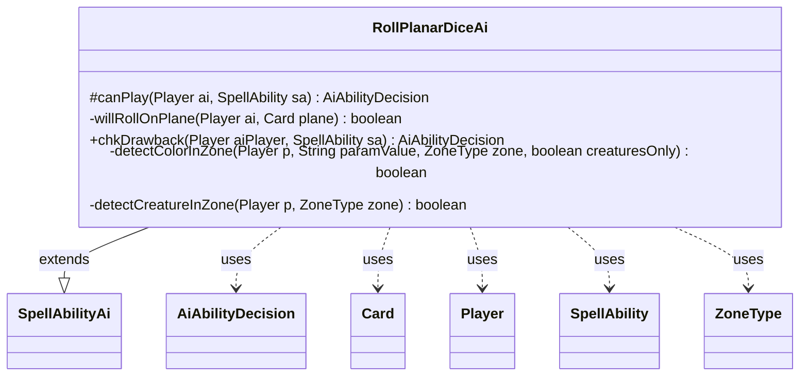

---
aliases:
  - RollPlanarDiceAi
tags:
  - java/class
  - module/forge-ai
  - pkg/forge/ai/ability
fqn: forge.ai.ability.RollPlanarDiceAi
package: forge.ai.ability
module: forge-ai
kind: Class
---

# RollPlanarDiceAi

**Package:** `forge.ai.ability` &nbsp; **Module:** `forge-ai` &nbsp; **Kind:** Class



## Relationships
**Extends:**
- [[forge.ai.SpellAbilityAi|SpellAbilityAi]]
**Uses:**
- [[forge.ai.AiAbilityDecision|AiAbilityDecision]]
- [[forge.game.card.Card|Card]]
- [[forge.game.player.Player|Player]]
- [[forge.game.spellability.SpellAbility|SpellAbility]]
- [[forge.game.zone.ZoneType|ZoneType]]

## Design Description

`RollPlanarDiceAi` supplies the AI decision logic for the "roll the planar die" special action in Forge's Planechase format. As a concrete subclass of `SpellAbilityAi`, it overrides `canPlay` and `chkDrawback` to tell the engine whether and how confidently the AI should roll on any currently active plane, iterating over the game's active planes and delegating the per-plane judgement to the private `willRollOnPlane` helper.

That helper encodes the class's core design intent: rather than hard-coding behavior, it reads a card-defined `AIRollPlanarDieParams` SVar and combines it with tunable `AiProps` profile values, parsing pipe-delimited hints (mode, chance, turn and zone-count gates) to produce a yes/no choice influenced by phase timing, per-turn activation limits, and a randomized hesitation factor. The private `detectColorInZone` and `detectCreatureInZone` utilities support these board-state conditions. It collaborates with `Player`, `Card`, `SpellAbility`, and `ZoneType`, returning `AiAbilityDecision` instances to communicate intent back to the AI framework.

## Source
`forge-ai/src/main/java/forge/ai/ability/RollPlanarDiceAi.java`

```java
package forge.ai.ability;


import forge.ai.*;
import forge.game.card.Card;
import forge.game.phase.PhaseType;
import forge.game.player.Player;
import forge.game.spellability.SpellAbility;
import forge.game.zone.ZoneType;
import forge.util.MyRandom;
import forge.util.TextUtil;

public class RollPlanarDiceAi extends SpellAbilityAi {
    /* (non-Javadoc)
     * @see forge.card.abilityfactory.SpellAiLogic#canPlayAI(forge.game.player.Player, java.util.Map, forge.card.spellability.SpellAbility)
     */
    @Override
    protected AiAbilityDecision canPlay(Player ai, SpellAbility sa) {
        if (ai.getGame().getActivePlanes() == null) {
            return new AiAbilityDecision(0, AiPlayDecision.CantPlayAi);
        }
        
        for (Card c : ai.getGame().getActivePlanes()) {
            if (willRollOnPlane(ai, c)) {
                return new AiAbilityDecision(100, AiPlayDecision.WillPlay);
            }
        }
        return new AiAbilityDecision(0, AiPlayDecision.CantPlayAi);
    }

    private boolean willRollOnPlane(Player ai, Card plane) {
        boolean decideToRoll = false;
        boolean rollInMain1 = false;
        String modeName = "never";
        int maxActivations = AiProfileUtil.getIntProperty(ai, AiProps.DEFAULT_MAX_PLANAR_DIE_ROLLS_PER_TURN);
        int chance = AiProfileUtil.getIntProperty(ai, AiProps.DEFAULT_PLANAR_DIE_ROLL_CHANCE);
        int hesitationChance = AiProfileUtil.getIntProperty(ai, AiProps.PLANAR_DIE_ROLL_HESITATION_CHANCE);
        int minTurnToRoll = AiProfileUtil.getIntProperty(ai, AiProps.DEFAULT_MIN_TURN_TO_ROLL_PLANAR_DIE);
        
        if (plane.hasSVar("AIRollPlanarDieParams")) {
            String[] params = plane.getSVar("AIRollPlanarDieParams").toLowerCase().trim().split("\\|");
            for (String param : params) {
                String[] paramData = param.split("\\$");
                String paramName = paramData[0].trim();
                String paramValue = paramData[1].trim();

                switch (paramName) {
                    case "mode":
                        modeName = paramValue;
                        break;
                    case "chance":
                        chance = Integer.parseInt(paramValue);
                        break;
                    case "minturn":
                        minTurnToRoll = Integer.parseInt(paramValue);
                        break;
                    case "maxrollsperturn":
                        maxActivations = Integer.parseInt(paramValue);
                        break;
                    case "rollinmain1":
                        if (paramValue.equals("true")) {
                            rollInMain1 = true;
                        }
                        break;
                    case "lowpriority":
                        // this is handled in AiController.saComparator at the moment
                        break;
                    case "cardsinhandle": // num of cards in hand less than or equal to N
                        if (ai.getCardsIn(ZoneType.Hand).size() > Integer.parseInt(paramValue)) {
                            return false;
                        }
                        break;
                    case "cardsinhandge": // num of cards in hand greater than or equal to N
                        if (ai.getCardsIn(ZoneType.Hand).size() < Integer.parseInt(paramValue)) {
                            return false;
                        }
                        break;
                    case "cardsingraveyardle":
                        if (ai.getCardsIn(ZoneType.Graveyard).size() > Integer.parseInt(paramValue)) {
                            return false;
                        }
                        break;
                    case "cardsingraveyardge":
                        if (ai.getCardsIn(ZoneType.Graveyard).size() < Integer.parseInt(paramValue)) {
                            return false;
                        }
                        break;
                    case "hascreatureinplay": // TODO: All abilities below only test the presence of the option. The value (true/false) is not yet tested.
                        if (!detectCreatureInZone(ai, ZoneType.Battlefield)) {
                            return false;
                        }
                        break;
                    case "opphascreatureinplay":
                        boolean oppHasCreature = false;
                        for (Player op : ai.getOpponents()) {
                            oppHasCreature |= detectCreatureInZone(op, ZoneType.Battlefield);
                        }
                        if (!oppHasCreature) {
                            return false;
                        }
                        break;
                    case "hascolorcreatureinplay":
                        if (!detectColorInZone(ai, paramValue, ZoneType.Battlefield, true)) {
                            return false;
                        }
                        break;
                    case "hascolorinplay":
                        if (!detectColorInZone(ai, paramValue, ZoneType.Battlefield, false)) {
                            return false;
                        }
                        break;
                    case "hascoloringraveyard":
                        if (!detectColorInZone(ai, paramValue, ZoneType.Graveyard, false)) {
                            return false;
                        }
                        break;
                    default:
                        System.out.println(TextUtil.concatNoSpace("Unexpected AI hint parameter in card ", plane.getName(), " in RollPlanarDiceAi: ", paramName, "."));
                        break;
                }
            }
            
            switch (modeName) {
                case "always":
                    decideToRoll = true;
                    break;
                case "random":
                    if (MyRandom.getRandom().nextInt(100) < chance) {
                        decideToRoll = true;
                    }
                    break;
                case "never":
                    return false;
                default:
                    return false;
            }

            if (ai.getGame().getPhaseHandler().getTurn() < minTurnToRoll) {
                decideToRoll = false;
            } else if (!rollInMain1 && ai.getGame().getPhaseHandler().getPhase().isBefore(PhaseType.MAIN2)) {
                decideToRoll = false;
            }

            if (ai.getGame().getPhaseHandler().getPlanarDiceSpecialActionThisTurn() >= maxActivations) {
                decideToRoll = false;
            }
        
            // check if the AI hesitates
            if (MyRandom.getRandom().nextInt(100) < hesitationChance) {
                decideToRoll = false; // hesitate
            }
        }

        return decideToRoll;
    }

    /* (non-Javadoc)
     * @see forge.card.abilityfactory.SpellAiLogic#chkAIDrawback(java.util.Map, forge.card.spellability.SpellAbility, forge.game.player.Player)
     */
    @Override
    public AiAbilityDecision chkDrawback(Player aiPlayer, SpellAbility sa) {
        // for potential implementation of drawback checks?
        return canPlay(aiPlayer, sa);
    }

    private boolean detectColorInZone(Player p, String paramValue, ZoneType zone, boolean creaturesOnly) {
        boolean hasColorInPlay = false;
        for (Card c : p.getCardsIn(zone)) {
            if (!creaturesOnly || c.isCreature()) {
                if (paramValue.contains("u") && c.isBlue()) {
                    hasColorInPlay = true;
                    break;
                }
                if (paramValue.contains("g") && c.isGreen()) {
                    hasColorInPlay = true;
                    break;
                }
                if (paramValue.contains("r") && c.isRed()) {
                    hasColorInPlay = true;
                    break;
                }
                if (paramValue.contains("w") && c.isWhite()) {
                    hasColorInPlay = true;
                    break;
                }
                if (paramValue.contains("b") && c.isBlack()) {
                    hasColorInPlay = true;
                    break;
                }
            }
        }
        return hasColorInPlay;
    }

    private boolean detectCreatureInZone(Player p, ZoneType zone) {
        boolean hasCreatureInPlay = false;
        for (Card c : p.getCardsIn(zone)) {
            if (c.isCreature()) {
                hasCreatureInPlay = true;
                break;
            }
        }
        return hasCreatureInPlay;
    }
}
```
