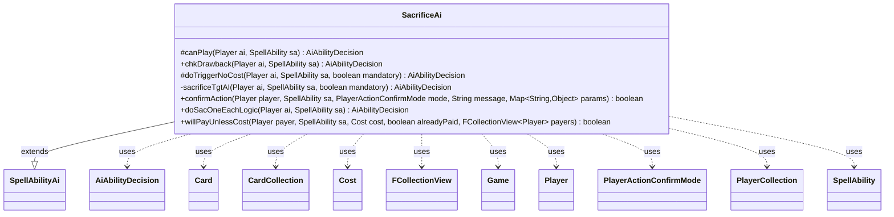

---
aliases:
  - SacrificeAi
tags:
  - java/class
  - module/forge-ai
  - pkg/forge/ai/ability
fqn: forge.ai.ability.SacrificeAi
package: forge.ai.ability
module: forge-ai
kind: Class
---

# SacrificeAi

**Package:** `forge.ai.ability` &nbsp; **Module:** `forge-ai` &nbsp; **Kind:** Class



## Relationships
**Extends:**
- [[forge.ai.SpellAbilityAi|SpellAbilityAi]]
**Uses:**
- [[forge.ai.AiAbilityDecision|AiAbilityDecision]]
- [[forge.game.Game|Game]]
- [[forge.game.card.Card|Card]]
- [[forge.game.card.CardCollection|CardCollection]]
- [[forge.game.cost.Cost|Cost]]
- [[forge.game.player.Player|Player]]
- [[forge.game.player.PlayerActionConfirmMode|PlayerActionConfirmMode]]
- [[forge.game.player.PlayerCollection|PlayerCollection]]
- [[forge.game.spellability.SpellAbility|SpellAbility]]
- [[forge.util.collect.FCollectionView|FCollectionView]]

## Design Description

SacrificeAi is the AI decision handler for sacrifice-based abilities in Forge's automated player. Extending `SpellAbilityAi`, it overrides the standard hooks—`canPlay`, `chkDrawback`, and `doTriggerNoCost`—delegating to the private `sacrificeTgtAI` helper that returns an `AiAbilityDecision` weighing whether the AI should activate the effect. Its logic branches on whether the ability targets, destroys versus sacrifices, and whom it affects, consulting `SacMe`/`SacValid` parameters and `ComputerUtilCard` creature evaluations to spare valuable permanents while forcing favorable trades against opponents.

Collaborating with core game types—`Player`, `Card`, `CardCollection`, `Cost`, and `SpellAbility`—it selects targets by life total or board value (e.g., picking the strongest opponent's matching permanents, or the AI's own worst creature). The static `doSacOneEachLogic` supports symmetric "each player sacrifices" effects, prioritizing opponents' best and the AI's worst, and sacrificing the host only as a last resort. `confirmAction` and `willPayUnlessCost` round out cost/confirmation prompts, the latter guarding cooperative "pay unless" effects so the AI only assists teammates.

## Source
`forge-ai/src/main/java/forge/ai/ability/SacrificeAi.java`

```java
package forge.ai.ability;

import forge.ai.AiAbilityDecision;
import forge.ai.AiPlayDecision;
import forge.ai.ComputerUtilCard;
import forge.ai.ComputerUtilCost;
import forge.ai.SpellAbilityAi;
import forge.game.Game;
import forge.game.ability.AbilityUtils;
import forge.game.card.Card;
import forge.game.card.CardCollection;
import forge.game.card.CardLists;
import forge.game.card.CardPredicates;
import forge.game.cost.Cost;
import forge.game.keyword.Keyword;
import forge.game.player.Player;
import forge.game.player.PlayerActionConfirmMode;
import forge.game.player.PlayerCollection;
import forge.game.player.PlayerPredicates;
import forge.game.spellability.SpellAbility;
import forge.game.zone.ZoneType;
import forge.util.collect.FCollectionView;

import java.util.List;
import java.util.Map;

public class SacrificeAi extends SpellAbilityAi {

    @Override
    protected AiAbilityDecision canPlay(Player ai, SpellAbility sa) {
        return sacrificeTgtAI(ai, sa, false);
    }

    @Override
    public AiAbilityDecision chkDrawback(Player ai, SpellAbility sa) {
        // AI should only activate this during Human's turn

        return sacrificeTgtAI(ai, sa, false);
    }

    @Override
    protected AiAbilityDecision doTriggerNoCost(Player ai, SpellAbility sa, boolean mandatory) {
        AiAbilityDecision decision = sacrificeTgtAI(ai, sa, mandatory);
        if (decision.willingToPlay()) {
            return decision;
        }

        if (mandatory) {
            return new AiAbilityDecision(50, AiPlayDecision.MandatoryPlay);
        }
        return decision;
    }

    private AiAbilityDecision sacrificeTgtAI(final Player ai, final SpellAbility sa, boolean mandatory) {
        final Card source = sa.getHostCard();
        final boolean destroy = sa.hasParam("Destroy");
        final String aiLogic = sa.getParamOrDefault("AILogic", "");
        final String valid = sa.getParamOrDefault("SacValid", "Self");

        if (sa.usesTargeting()) {
            final PlayerCollection targetableOpps = ai.getOpponents().filter(PlayerPredicates.isTargetableBy(sa));
            if (targetableOpps.isEmpty()) {
                // TODO also check if own SacMe makes this a reasonable (or even better) choice
                if (mandatory && sa.canTarget(ai)) {
                    sa.resetTargets();
                    sa.getTargets().add(ai);
                    return new AiAbilityDecision(100, AiPlayDecision.WillPlay);
                }
                return new AiAbilityDecision(0, AiPlayDecision.CantPlayAi);
            }
            final Player opp = targetableOpps.max(PlayerPredicates.compareByLife());
            sa.resetTargets();
            sa.getTargets().add(opp);
            if (mandatory) {
                return new AiAbilityDecision(100, AiPlayDecision.WillPlay);
            }
            String num = sa.getParamOrDefault("Amount" , "1");
            final int amount = AbilityUtils.calculateAmount(source, num, sa);

            List<Card> list = CardLists.getValidCards(opp.getCardsIn(ZoneType.Battlefield), valid, sa.getActivatingPlayer(), source, sa);

            for (Card c : list) {
                if (c.hasSVar("SacMe") && Integer.parseInt(c.getSVar("SacMe")) > 3) {
                    return new AiAbilityDecision(0, AiPlayDecision.CantPlayAi);
                }
            }
            if (!destroy) {
                list = CardLists.filter(list, CardPredicates.canBeSacrificedBy(sa, true));
            } else {
                if (!CardLists.getKeyword(list, Keyword.INDESTRUCTIBLE).isEmpty()) {
                    // human can choose to destroy indestructibles
                    return new AiAbilityDecision(0, AiPlayDecision.CantPlayAi);
                }
            }

            if (list.isEmpty()) {
                return new AiAbilityDecision(0, AiPlayDecision.CantPlayAi);
            }

            if (num.equals("X") && sa.getSVar(num).equals("Count$xPaid")) {
                sa.setXManaCostPaid(Math.min(ComputerUtilCost.setMaxXValue(sa, ai, sa.isTrigger()), amount));
            }

            final int half = (amount / 2) + (amount % 2); // Half of amount rounded up

            // If the Human has at least half rounded up of the amount to be
            // sacrificed, cast the spell
            if (!sa.isTrigger() && list.size() < half) {
                return new AiAbilityDecision(0, AiPlayDecision.CantPlayAi);
            }
        }

        final String defined = sa.getParamOrDefault("Defined", "You");
        final String targeted = sa.getParamOrDefault("ValidTgts", "");
        if (valid.equals("Self")) {
            // Self Sacrifice.
        } else if (defined.equals("Player") || targeted.equals("Player") || targeted.equals("Opponent")
                || ((defined.equals("Player.Opponent") || defined.equals("Opponent")) && !sa.isTrigger())) {
            // is either "Defined$ Player.Opponent" or "Defined$ Opponent" obsolete?

            // If Sacrifice hits both players:
            // Only cast it if Human has the full amount of valid
            // Only cast it if AI doesn't have the full amount of Valid
            // TODO: Cast if the type is favorable: my "worst" valid is worse than his "worst" valid
            final String num = sa.getParamOrDefault("Amount", "1");
            int amount = AbilityUtils.calculateAmount(source, num, sa);

            if (num.equals("X") && sa.getSVar(num).equals("Count$xPaid")) {
                amount = Math.min(ComputerUtilCost.setMaxXValue(sa, ai, sa.isTrigger()), amount);
            }

            List<Card> humanList = CardLists.getValidCards(ai.getStrongestOpponent().getCardsIn(ZoneType.Battlefield), valid, sa.getActivatingPlayer(), source, sa);

            // Since all of the cards have AI:RemoveDeck:All, I enabled 1 for 1
            // (or X for X) trades for special decks
            return humanList.size() >= amount ? new AiAbilityDecision(100, AiPlayDecision.WillPlay) : new AiAbilityDecision(0, AiPlayDecision.CantPlayAi);
        } else if (defined.equals("You")) {
            List<Card> computerList = CardLists.getValidCards(ai.getCardsIn(ZoneType.Battlefield), valid, sa.getActivatingPlayer(), source, sa);
            for (Card c : computerList) {
                if ("Lethal".equals(aiLogic)) {
                    boolean isLethal = false;
                    for (Player opp : ai.getOpponents()) {
                        if (opp.canLoseLife() && !opp.cantLoseForZeroOrLessLife() && c.getNetPower() >= opp.getLife()) {
                            isLethal = true;
                            break;
                        }
                    }
                    for (Card creature : ai.getOpponents().getCreaturesInPlay()) {
                        if (creature.canBeDestroyed() && c.getNetPower() >= creature.getNetToughness()) {
                            isLethal = true;
                            break;
                        }
                    }

                    if (c.hasSVar("SacMe") || isLethal) {
                        return new AiAbilityDecision(100, AiPlayDecision.WillPlay);
                    }
                    return new AiAbilityDecision(0, AiPlayDecision.CantPlayAi);
                }
                if (c.hasSVar("SacMe") || ComputerUtilCard.evaluateCreature(c) <= 135) {
                    return new AiAbilityDecision(100, AiPlayDecision.WillPlay);
                }
            }
            return new AiAbilityDecision(0, AiPlayDecision.CantPlayAi);
        }
        return new AiAbilityDecision(100, AiPlayDecision.WillPlay);
    }

    @Override
    public boolean confirmAction(Player player, SpellAbility sa, PlayerActionConfirmMode mode, String message, Map<String, Object> params) {
        return true;
    }

    public static AiAbilityDecision doSacOneEachLogic(Player ai, SpellAbility sa) {
        Game game = ai.getGame();
        sa.resetTargets();
        for (Player p : game.getPlayers()) {
            CardCollection targetable = CardLists.filter(p.getCardsIn(ZoneType.Battlefield), CardPredicates.isTargetableBy(sa));
            if (!targetable.isEmpty()) {
                CardCollection priorityTgts = new CardCollection();
                if (p.isOpponentOf(ai)) {
                    priorityTgts.addAll(CardLists.filter(targetable, CardPredicates.canBeSacrificedBy(sa, true)));
                    if (!priorityTgts.isEmpty()) {
                        sa.getTargets().add(ComputerUtilCard.getBestAI(priorityTgts));
                    } else {
                        sa.getTargets().add(ComputerUtilCard.getBestAI(targetable));
                    }
                } else {
                    for (Card c : targetable) {
                        if (c.canBeSacrificedBy(sa, true) && (c.hasSVar("SacMe") || (c.isCreature() && ComputerUtilCard.evaluateCreature(c) <= 135)) && !c.equals(sa.getHostCard())) {
                            priorityTgts.add(c);
                        }
                    }
                    if (!priorityTgts.isEmpty()) {
                        sa.getTargets().add(ComputerUtilCard.getWorstPermanentAI(priorityTgts, false, false, false, false));
                    } else {
                        targetable.remove(sa.getHostCard());
                        if (!targetable.isEmpty()) {
                            sa.getTargets().add(ComputerUtilCard.getWorstPermanentAI(targetable, true, true, true, false));
                        } else {
                            sa.getTargets().add(sa.getHostCard()); // sac self only as a last resort
                        }
                    }
                }
            }
        }
        return new AiAbilityDecision(100, AiPlayDecision.WillPlay);
    }

    @Override
    public boolean willPayUnlessCost(Player payer, SpellAbility sa, Cost cost, boolean alreadyPaid, FCollectionView<Player> payers) {
        // Icy Prison
        if (payers.size() > 1) {
            final Player p = sa.getActivatingPlayer();
            // not me or team mate
            if (!p.sameTeam(payer)) {
                return false;
            }
        }

        return super.willPayUnlessCost(payer, sa, cost, alreadyPaid, payers);
    }
}
```
