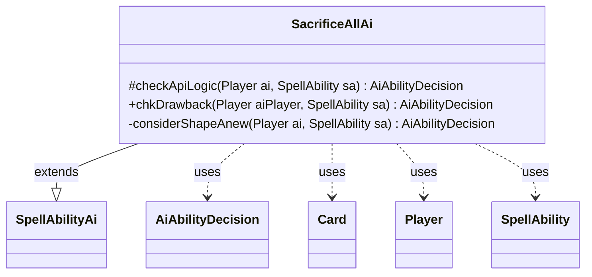

---
aliases:
  - SacrificeAllAi
tags:
  - java/class
  - module/forge-ai
  - pkg/forge/ai/ability
fqn: forge.ai.ability.SacrificeAllAi
package: forge.ai.ability
module: forge-ai
kind: Class
---

# SacrificeAllAi

**Package:** `forge.ai.ability`   **Module:** `forge-ai`   **Kind:** Class



## Relationships
**Extends:**
- [[forge.ai.SpellAbilityAi|SpellAbilityAi]]
**Uses:**
- [[forge.ai.AiAbilityDecision|AiAbilityDecision]]
- [[forge.game.card.Card|Card]]
- [[forge.game.player.Player|Player]]
- [[forge.game.spellability.SpellAbility|SpellAbility]]

## Design Description

The `SacrificeAllAi` class encapsulates the AI's decision-making for spell abilities whose effect sacrifices permanents in bulk. As a concrete subclass of `SpellAbilityAi`, it overrides `checkApiLogic` to judge whether the AI should cast such a spell, dispatching on the ability's `AILogic` parameter to handle named special cases—Hellion Eruption's creature-count and board-value threshold, Sarkhan the Mad's dragon transformation (delegated to `SpecialCardAi`), and Shape Anew's artifact swap—and otherwise reusing `DestroyAllAi.doMassRemovalLogic` for shared mass-removal heuristics. Each branch returns an `AiAbilityDecision` pairing a numeric score with an `AiPlayDecision` verdict.

It collaborates with `Player`, `SpellAbility`, and `Card`, leaning on `ComputerUtilCard` and `CardLists` to inspect the battlefield and library. The private `considerShapeAnew` helper captures the intended value judgment: sacrifice the cheapest artifact only when the worst artifact gained from the library outweighs what is given up. The placeholder `chkDrawback` and the opening comment mark this evaluation as deliberately provisional.

## Source
`forge-ai/src/main/java/forge/ai/ability/SacrificeAllAi.java`

```java
package forge.ai.ability;

import forge.ai.*;
import forge.game.card.*;
import forge.game.player.Player;
import forge.game.spellability.SpellAbility;
import forge.game.zone.ZoneType;

public class SacrificeAllAi extends SpellAbilityAi {

    @Override
    protected AiAbilityDecision checkApiLogic(Player ai, SpellAbility sa) {
        // AI needs to be expanded, since this function can be pretty complex
        // based on what the expected targets could be
        final String logic = sa.getParamOrDefault("AILogic", "");

        if (logic.equals("HellionEruption")) {
            if (ai.getCreaturesInPlay().size() < 5 || ai.getCreaturesInPlay().size() * 150 < ComputerUtilCard.evaluateCreatureList(ai.getCreaturesInPlay())) {
                return new AiAbilityDecision(0, AiPlayDecision.CantPlayAi);
            }
        } else if (logic.equals("MadSarkhanDragon")) {
            return SpecialCardAi.SarkhanTheMad.considerMakeDragon(ai, sa);
        } else if (logic.equals("ShapeAnew")) {
            return considerShapeAnew(ai, sa);
        }

        AiAbilityDecision decision = DestroyAllAi.doMassRemovalLogic(ai, sa);
        if (!decision.willingToPlay()) {
            return decision;
        }

        return new AiAbilityDecision(100, AiPlayDecision.WillPlay);
    }

    @Override
    public AiAbilityDecision chkDrawback(Player aiPlayer, SpellAbility sa) {
        //TODO: Add checks for bad outcome
        return new AiAbilityDecision(100, AiPlayDecision.WillPlay);

    }

    private AiAbilityDecision considerShapeAnew(Player ai, SpellAbility sa) {
        Card worstToSacrifice = ComputerUtilCard.getCheapestPermanentAI(CardLists.filter(ai.getCardsIn(ZoneType.Battlefield), CardPredicates.ARTIFACTS), sa, true);
        if (worstToSacrifice == null) {
            return new AiAbilityDecision(0, AiPlayDecision.TargetingFailed);
        }
        Card worstToGain = ComputerUtilCard.getWorstAI(CardLists.filter(ai.getCardsIn(ZoneType.Library), CardPredicates.ARTIFACTS));
        if (worstToGain != null && worstToGain.getCMC() > worstToSacrifice.getCMC() + sa.getHostCard().getCMC()) {
            sa.resetTargets();
            sa.getTargets().add(worstToSacrifice);
            return new AiAbilityDecision(100, AiPlayDecision.WillPlay);
        }
        return new AiAbilityDecision(0, AiPlayDecision.CantPlayAi);
    }
}
```

## Python
`forge/ai/ability/SacrificeAllAi.py`

```python
from forge.ai.SpellAbilityAi import SpellAbilityAi
from forge.ai.AiAbilityDecision import AiAbilityDecision
from forge.ai.AiPlayDecision import AiPlayDecision
from forge.ai.ComputerUtilCard import ComputerUtilCard
from forge.ai.SpecialCardAi import SpecialCardAi
from forge.ai.DestroyAllAi import DestroyAllAi
from forge.game.card.Card import Card
from forge.game.card.CardLists import CardLists
from forge.game.card.CardPredicates import CardPredicates
from forge.game.player.Player import Player
from forge.game.spellability.SpellAbility import SpellAbility
from forge.game.zone.ZoneType import ZoneType


class SacrificeAllAi(SpellAbilityAi):

    def checkApiLogic(self, ai: Player, sa: SpellAbility) -> AiAbilityDecision:
        # AI needs to be expanded, since this function can be pretty complex
        # based on what the expected targets could be
        logic = sa.getParamOrDefault("AILogic", "")

        if logic == "HellionEruption":
            if len(ai.getCreaturesInPlay()) < 5 or len(ai.getCreaturesInPlay()) * 150 < ComputerUtilCard.evaluateCreatureList(ai.getCreaturesInPlay()):
                return AiAbilityDecision(0, AiPlayDecision.CantPlayAi)
        elif logic == "MadSarkhanDragon":
            return SpecialCardAi.SarkhanTheMad.considerMakeDragon(ai, sa)
        elif logic == "ShapeAnew":
            return self.considerShapeAnew(ai, sa)

        decision = DestroyAllAi.doMassRemovalLogic(ai, sa)
        if not decision.willingToPlay():
            return decision

        return AiAbilityDecision(100, AiPlayDecision.WillPlay)

    def chkDrawback(self, aiPlayer: Player, sa: SpellAbility) -> AiAbilityDecision:
        #TODO: Add checks for bad outcome
        return AiAbilityDecision(100, AiPlayDecision.WillPlay)

    def considerShapeAnew(self, ai: Player, sa: SpellAbility) -> AiAbilityDecision:
        worstToSacrifice = ComputerUtilCard.getCheapestPermanentAI(CardLists.filter(ai.getCardsIn(ZoneType.Battlefield), CardPredicates.ARTIFACTS), sa, True)
        if worstToSacrifice is None:
            return AiAbilityDecision(0, AiPlayDecision.TargetingFailed)
        worstToGain = ComputerUtilCard.getWorstAI(CardLists.filter(ai.getCardsIn(ZoneType.Library), CardPredicates.ARTIFACTS))
        if worstToGain is not None and worstToGain.getCMC() > worstToSacrifice.getCMC() + sa.getHostCard().getCMC():
            sa.resetTargets()
            sa.getTargets().add(worstToSacrifice)
            return AiAbilityDecision(100, AiPlayDecision.WillPlay)
        return AiAbilityDecision(0, AiPlayDecision.CantPlayAi)
```
