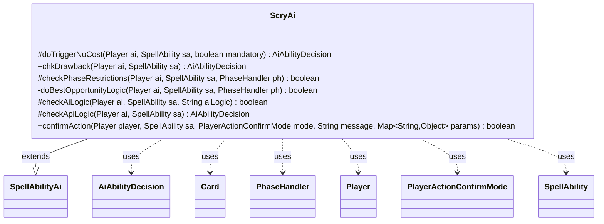

---
aliases:
  - ScryAi
tags:
  - java/class
  - module/forge-ai
  - pkg/forge/ai/ability
fqn: forge.ai.ability.ScryAi
package: forge.ai.ability
module: forge-ai
kind: Class
---

# ScryAi

**Package:** `forge.ai.ability` &nbsp; **Module:** `forge-ai` &nbsp; **Kind:** Class



## Relationships
**Extends:**
- [[forge.ai.SpellAbilityAi|SpellAbilityAi]]
**Uses:**
- [[forge.ai.AiAbilityDecision|AiAbilityDecision]]
- [[forge.game.card.Card|Card]]
- [[forge.game.phase.PhaseHandler|PhaseHandler]]
- [[forge.game.player.Player|Player]]
- [[forge.game.player.PlayerActionConfirmMode|PlayerActionConfirmMode]]
- [[forge.game.spellability.SpellAbility|SpellAbility]]

## Design Description

The ScryAi class encapsulates the artificial-intelligence decision logic for the Scry ability, letting the computer player judge whether and when to reorder the top of its library. Extending SpellAbilityAi, it overrides the framework's evaluation hooks—API-level reasoning, AI-logic dispatch, phase restrictions, drawback checks, and forced-trigger resolution—each returning an AiAbilityDecision the engine consumes.

Collaborating with Player, SpellAbility, PhaseHandler, and Card, it encodes deliberate timing intent: scrying is preferred at sorcery speed in Main 1 or at an opponent's end-of-turn to avoid mana-locking and to precede a draw, with random chance weighting and special cases like Brain in a Jar and "BestOpportunity" logic that defers scrying when stronger plays remain. Targeting favors the AI and its allies, falling back to opponents only when the effect is mandatory.

## Source
`forge-ai/src/main/java/forge/ai/ability/ScryAi.java`

```java
package forge.ai.ability;

import forge.ai.*;
import forge.game.ability.ApiType;
import forge.game.card.Card;
import forge.game.card.CardLists;
import forge.game.card.CardPredicates;
import forge.game.phase.PhaseHandler;
import forge.game.phase.PhaseType;
import forge.game.player.Player;
import forge.game.player.PlayerActionConfirmMode;
import forge.game.spellability.SpellAbility;
import forge.game.zone.ZoneType;
import forge.util.MyRandom;

import java.util.Map;

public class ScryAi extends SpellAbilityAi {

    /* (non-Javadoc)
     * @see forge.card.abilityfactory.SpellAiLogic#doTriggerAINoCost(forge.game.player.Player, java.util.Map, forge.card.spellability.SpellAbility, boolean)
     */
    @Override
    protected AiAbilityDecision doTriggerNoCost(Player ai, SpellAbility sa, boolean mandatory) {
        if (sa.usesTargeting()) {
            // ability is targeted
            sa.resetTargets();

            if (sa.canTarget(ai)) {
                sa.getTargets().add(ai);
            } else {
                for (Player p : ai.getAllies()) {
                    if (sa.canTarget(p)) {
                        sa.getTargets().add(p);
                        break;
                    }
                }
                if (mandatory && !sa.isTargetNumberValid()) {
                    for (Player p : ai.getOpponents()) {
                        if (sa.canTarget(p)) {
                            sa.getTargets().add(p);
                            break;
                        }
                    }
                }
            }

            if ("X".equals(sa.getParam("ScryNum")) && sa.getSVar("X").equals("Count$xPaid")) {
                int xPay = ComputerUtilCost.setMaxXValue(sa, ai, sa.isTrigger());
                if (xPay == 0) {
                    return new AiAbilityDecision(0, AiPlayDecision.CantPlayAi);
                }
                sa.getRootAbility().setXManaCostPaid(xPay);
            }

            if (mandatory) {
                return new AiAbilityDecision(50, AiPlayDecision.MandatoryPlay);
            }

            if (sa.isTargetNumberValid()) {
                return new AiAbilityDecision(100, AiPlayDecision.WillPlay);
            }
            return new AiAbilityDecision(0, AiPlayDecision.TargetingFailed);
        }

        return new AiAbilityDecision(100, AiPlayDecision.WillPlay);
    } // scryTargetAI()

    @Override
    public AiAbilityDecision chkDrawback(Player ai, SpellAbility sa) {
        return doTriggerNoCost(ai, sa, false);
    }
    
    /**
     * Checks if the AI will play a SpellAbility based on its phase restrictions
     */
    @Override
    protected boolean checkPhaseRestrictions(final Player ai, final SpellAbility sa, final PhaseHandler ph) {
        String logic = sa.getParamOrDefault("AILogic", "");

        // For Brain in a Jar, avoid competing against the other ability in the opponent's EOT.
        if ("BrainJar".equals(logic)) {
            return ph.getPhase().isAfter(PhaseType.MAIN2);
        }

        // if the Scry ability requires tapping and has a mana cost, it's best done at the end of opponent's turn
        // and right before the beginning of AI's turn, if possible, to avoid mana locking the AI and also to
        // try to scry right before drawing a card. Also, avoid tapping creatures in the AI's turn, if possible,
        // even if there's no mana cost.
        if (sa.getPayCosts().hasTapCost()
                && (sa.getPayCosts().hasManaCost() || sa.getHostCard().isCreature())
                && !isSorcerySpeed(sa, ai)) {
            return ph.getNextTurn() == ai && ph.is(PhaseType.END_OF_TURN);
        }

        // AI logic to scry in Main 1 if there is no better option, otherwise scry at opponent's EOT
        // (e.g. Glimmer of Genius)
        if ("BestOpportunity".equals(logic)) {
            return doBestOpportunityLogic(ai, sa, ph);
        }

        // in the playerturn Scry should only be done in Main1 or in upkeep if able
        if (ph.isPlayerTurn(ai)) {
            if (isSorcerySpeed(sa, ai)) {
                return ph.is(PhaseType.MAIN1) || sa.isPwAbility();
            } else {
                return ph.is(PhaseType.UPKEEP);
            }
        }
        return true;
    }

    private boolean doBestOpportunityLogic(Player ai, SpellAbility sa, PhaseHandler ph) {
        // Check to see if there are any cards in hand that may be worth casting
        boolean hasSomethingElse = false;
        for (Card c : CardLists.filter(ai.getCardsIn(ZoneType.Hand), CardPredicates.NON_LANDS)) {
            for (SpellAbility ab : c.getAllSpellAbilities()) {
                if (ab.getPayCosts().hasManaCost()
                        && ComputerUtilMana.hasEnoughManaSourcesToCast(ab, ai)) {
                    // TODO: currently looks for non-Scry cards, can most certainly be made smarter.
                    if (ab.getApi() != ApiType.Scry) {
                        hasSomethingElse = true;
                        break;
                    }
                }
            }
        }

        return (!hasSomethingElse && ph.getPlayerTurn() == ai && ph.getPhase().isAfter(PhaseType.DRAW))
                || (ph.getNextTurn() == ai && ph.is(PhaseType.END_OF_TURN));
    }

    /**
     * Checks if the AI will play a SpellAbility with the specified AiLogic
     */
    @Override
    protected boolean checkAiLogic(final Player ai, final SpellAbility sa, final String aiLogic) {
        if ("BrainJar".equals(aiLogic)) {
            return SpecialCardAi.BrainInAJar.consider(ai, sa);
        } else if ("MultipleChoice".equals(aiLogic)) {
            return SpecialCardAi.MultipleChoice.consider(ai, sa);
        }
        return super.checkAiLogic(ai, sa, aiLogic);
    }
    
    @Override
    protected AiAbilityDecision checkApiLogic(Player ai, SpellAbility sa) {
        // does Scry make sense with no Library cards?
        if (ai.getCardsIn(ZoneType.Library).isEmpty()) {
            return new AiAbilityDecision(0, AiPlayDecision.CantPlayAi);
        }

        double chance = .4; // 40 percent chance of milling with instant speed stuff
        if (isSorcerySpeed(sa, ai)) {
            chance = .667; // 66.7% chance for sorcery speed (since it will never activate EOT)
        }
        boolean randomReturn = MyRandom.getRandom().nextFloat() <= chance;

        if (playReusable(ai, sa)) {
            randomReturn = true;
        }

        if (sa.usesTargeting()) {
            sa.resetTargets();
            if (sa.canTarget(ai)) {
                sa.getTargets().add(ai);
            } else {
                for (Player p : ai.getAllies()) {
                    if (sa.canTarget(p)) {
                        sa.getTargets().add(p);
                        break;
                    }
                }
            }
            randomReturn = sa.isTargetNumberValid();
        }

        if ("X".equals(sa.getParam("ScryNum")) && sa.getSVar("X").equals("Count$xPaid")) {
            int xPay = ComputerUtilCost.setMaxXValue(sa, ai, sa.isTrigger());
            if (xPay == 0) {
                return new AiAbilityDecision(0, AiPlayDecision.CantAffordX);
            }
            sa.getRootAbility().setXManaCostPaid(xPay);
        }

        if (randomReturn) {
            return new AiAbilityDecision(100, AiPlayDecision.WillPlay);
        }
        return new AiAbilityDecision(0, AiPlayDecision.CantPlayAi);
    }

    @Override
    public boolean confirmAction(Player player, SpellAbility sa, PlayerActionConfirmMode mode, String message, Map<String, Object> params) {
        return true;
    }
}
```
