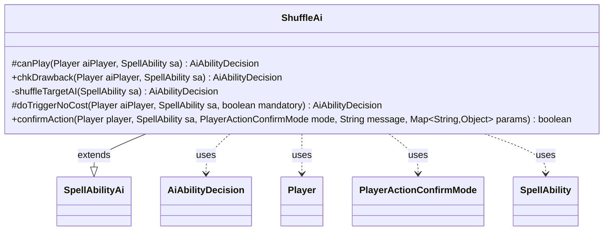

---
aliases:
  - ShuffleAi
tags:
  - java/class
  - module/forge-ai
  - pkg/forge/ai/ability
fqn: forge.ai.ability.ShuffleAi
package: forge.ai.ability
module: forge-ai
kind: Class
---

# ShuffleAi

**Package:** `forge.ai.ability`   **Module:** `forge-ai`   **Kind:** Class



## Relationships
**Extends:**
- [[forge.ai.SpellAbilityAi|SpellAbilityAi]]
**Uses:**
- [[forge.ai.AiAbilityDecision|AiAbilityDecision]]
- [[forge.game.player.Player|Player]]
- [[forge.game.player.PlayerActionConfirmMode|PlayerActionConfirmMode]]
- [[forge.game.spellability.SpellAbility|SpellAbility]]

## Design Description

ShuffleAi supplies the artificial-intelligence decision logic for spell abilities whose effect shuffles a library, acting as the AI counterpart to the corresponding game-side shuffle effect. As a concrete subclass of `SpellAbilityAi`, it overrides the framework's decision hooks—`canPlay`, `chkDrawback`, `doTriggerNoCost`, and `confirmAction`—each returning an `AiAbilityDecision` that pairs a confidence score with an `AiPlayDecision` verdict.

The class encodes deliberately conservative play heuristics: it activates only when explicit `AILogic` parameters ("Always", "OwnMain2") justify it, deferring to Main 2 phase or signaling intent to wait, and otherwise declines because the AI cannot evaluate the library's top card. A shared private helper, `shuffleTargetAI`, centralizes the common case of shuffling as a sub-ability of a parent effect, while `confirmAction` unconditionally consents. It collaborates with `Player` and `SpellAbility` for game state and with `PlayerActionConfirmMode` for confirmation prompts.

## Source
`forge-ai/src/main/java/forge/ai/ability/ShuffleAi.java`

```java
package forge.ai.ability;

import forge.ai.AiAbilityDecision;
import forge.ai.AiPlayDecision;
import forge.ai.SpellAbilityAi;
import forge.game.phase.PhaseType;
import forge.game.player.Player;
import forge.game.player.PlayerActionConfirmMode;
import forge.game.spellability.SpellAbility;

import java.util.Map;

public class ShuffleAi extends SpellAbilityAi {
    @Override
    protected AiAbilityDecision canPlay(Player aiPlayer, SpellAbility sa) {
        // TODO Does the AI know what's on top of the deck and is it something useful?

        String logic = sa.getParamOrDefault("AILogic", "");
        if (logic.equals("Always")) {
            // We may want to play this for the subability, e.g. Mind's Desire
            return new AiAbilityDecision(100, AiPlayDecision.WillPlay);
        } else if (logic.equals("OwnMain2")) {
            if (aiPlayer.getGame().getPhaseHandler().is(PhaseType.MAIN2, aiPlayer)) {
                // We may want to play this for the subability, e.g. Mind's Desire
                return new AiAbilityDecision(100, AiPlayDecision.WillPlay);
            } else {
                return new AiAbilityDecision(0, AiPlayDecision.WaitForMain2);
            }
        }

        // not really sure when the compy would use this; maybe only after a human
        // deliberately put a card on top of their library
        return new AiAbilityDecision(0, AiPlayDecision.CantPlayAi);
    }

    @Override
    public AiAbilityDecision chkDrawback(Player aiPlayer, SpellAbility sa) {
        return shuffleTargetAI(sa);
    }

    private AiAbilityDecision shuffleTargetAI(final SpellAbility sa) {
        /*
         *  Shuffle at the end of some other effect where we'd usually shuffle
         *  inside that effect, but can't for some reason.
         */
        if (sa.getParent() != null) {
            return new AiAbilityDecision(100, AiPlayDecision.WillPlay);
        } else {
            return new AiAbilityDecision(0, AiPlayDecision.CantPlayAi);
        }
    } // shuffleTargetAI()

    @Override
    protected AiAbilityDecision doTriggerNoCost(Player aiPlayer, SpellAbility sa, boolean mandatory) {
        return shuffleTargetAI(sa);
    }  

    @Override
    public boolean confirmAction(Player player, SpellAbility sa, PlayerActionConfirmMode mode, String message, Map<String, Object> params) {
        // ai could analyze parameter denoting the player to shuffle
        return true;
    }
}
```

## Python
`forge/ai/ability/ShuffleAi.py`

```python
from forge.ai.AiAbilityDecision import AiAbilityDecision
from forge.ai.AiPlayDecision import AiPlayDecision
from forge.ai.SpellAbilityAi import SpellAbilityAi
from forge.game.phase.PhaseType import PhaseType
from forge.game.player.Player import Player
from forge.game.player.PlayerActionConfirmMode import PlayerActionConfirmMode
from forge.game.spellability.SpellAbility import SpellAbility


class ShuffleAi(SpellAbilityAi):
    def canPlay(self, aiPlayer: Player, sa: SpellAbility) -> AiAbilityDecision:
        # TODO Does the AI know what's on top of the deck and is it something useful?

        logic = sa.getParamOrDefault("AILogic", "")
        if logic == "Always":
            # We may want to play this for the subability, e.g. Mind's Desire
            return AiAbilityDecision(100, AiPlayDecision.WillPlay)
        elif logic == "OwnMain2":
            if aiPlayer.getGame().getPhaseHandler().is_(PhaseType.MAIN2, aiPlayer):
                # We may want to play this for the subability, e.g. Mind's Desire
                return AiAbilityDecision(100, AiPlayDecision.WillPlay)
            else:
                return AiAbilityDecision(0, AiPlayDecision.WaitForMain2)

        # not really sure when the compy would use this; maybe only after a human
        # deliberately put a card on top of their library
        return AiAbilityDecision(0, AiPlayDecision.CantPlayAi)

    def chkDrawback(self, aiPlayer: Player, sa: SpellAbility) -> AiAbilityDecision:
        return self.shuffleTargetAI(sa)

    def shuffleTargetAI(self, sa: SpellAbility) -> AiAbilityDecision:
        #  Shuffle at the end of some other effect where we'd usually shuffle
        #  inside that effect, but can't for some reason.
        if sa.getParent() is not None:
            return AiAbilityDecision(100, AiPlayDecision.WillPlay)
        else:
            return AiAbilityDecision(0, AiPlayDecision.CantPlayAi)
    # shuffleTargetAI()

    def doTriggerNoCost(self, aiPlayer: Player, sa: SpellAbility, mandatory: bool) -> AiAbilityDecision:
        return self.shuffleTargetAI(sa)

    def confirmAction(self, player: Player, sa: SpellAbility, mode: PlayerActionConfirmMode, message: str, params: dict[str, object]) -> bool:
        # ai could analyze parameter denoting the player to shuffle
        return True
```
