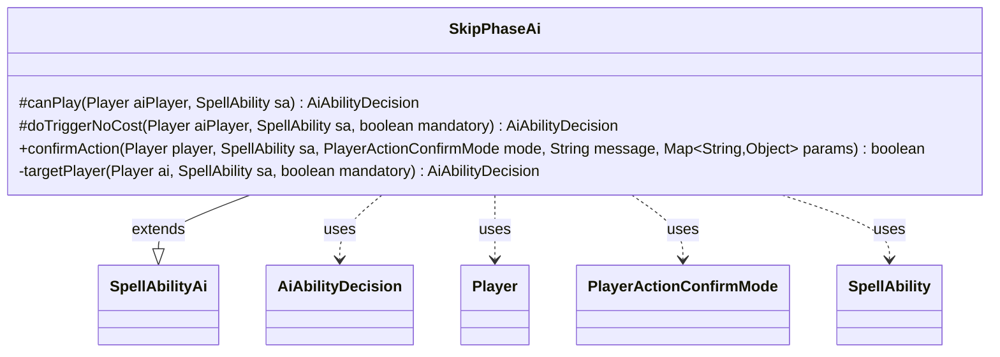

---
aliases:
  - SkipPhaseAi
tags:
  - java/class
  - module/forge-ai
  - pkg/forge/ai/ability
fqn: forge.ai.ability.SkipPhaseAi
package: forge.ai.ability
module: forge-ai
kind: Class
---

# SkipPhaseAi

**Package:** `forge.ai.ability`   **Module:** `forge-ai`   **Kind:** Class



## Relationships
**Extends:**
- [[forge.ai.SpellAbilityAi|SpellAbilityAi]]
**Uses:**
- [[forge.ai.AiAbilityDecision|AiAbilityDecision]]
- [[forge.game.player.Player|Player]]
- [[forge.game.player.PlayerActionConfirmMode|PlayerActionConfirmMode]]
- [[forge.game.spellability.SpellAbility|SpellAbility]]

## Design Description

SkipPhaseAi supplies the AI decision logic for spell abilities that cause a player to skip a phase, extending the `SpellAbilityAi` base class within Forge's ability-AI hierarchy. It overrides the hooks the AI framework invokes—`canPlay` for proactive casting and `doTriggerNoCost` for triggered resolution—delegating both to a shared `targetPlayer` helper that returns an `AiAbilityDecision` (a weighted score paired with an `AiPlayDecision` verdict).

The design intent centers on target selection: when the ability uses targeting, it picks an opponent via `AiAttackController.choosePreferredDefenderPlayer`, falling back to the AI itself only when resolution is mandatory, and otherwise reporting that it cannot play. The unconditional `true` from `confirmAction` shows the AI always commits once it has chosen, while a TODO flags unfinished refinement around life-loss and duration-overlap checks. It collaborates with `Player`, `SpellAbility`, and `PlayerActionConfirmMode` purely as transient inputs.

## Source
`forge-ai/src/main/java/forge/ai/ability/SkipPhaseAi.java`

```java
package forge.ai.ability;

import forge.ai.AiAbilityDecision;
import forge.ai.AiAttackController;
import forge.ai.SpellAbilityAi;
import forge.game.player.Player;
import forge.game.player.PlayerActionConfirmMode;
import forge.game.spellability.SpellAbility;

import java.util.Map;

public class SkipPhaseAi extends SpellAbilityAi {
    @Override
    protected AiAbilityDecision canPlay(Player aiPlayer, SpellAbility sa) {
        return targetPlayer(aiPlayer, sa, false);
    }

    @Override
    protected AiAbilityDecision doTriggerNoCost(Player aiPlayer, SpellAbility sa, boolean mandatory) {
        return targetPlayer(aiPlayer, sa, mandatory);
    }

    @Override
    public boolean confirmAction(Player player, SpellAbility sa, PlayerActionConfirmMode mode, String message, Map<String, Object> params) {
        return true;
    }
    
    private AiAbilityDecision targetPlayer(Player ai, SpellAbility sa, boolean mandatory) {
        if (sa.usesTargeting()) {
            final Player opp = AiAttackController.choosePreferredDefenderPlayer(ai);
            sa.resetTargets();
            if (sa.canTarget(opp)) {
                if (!mandatory) {
                    // TODO check wouldLoseLife + some Effect with Duration isn't already active
                }
                sa.getTargets().add(opp);
            }
            else if (mandatory && sa.canTarget(ai)) {
                sa.getTargets().add(ai); 
            }
            else {
                return new AiAbilityDecision(0, forge.ai.AiPlayDecision.CantPlayAi);
            }
        }
        return new AiAbilityDecision(100, forge.ai.AiPlayDecision.WillPlay);
    }
}
```

## Python
`forge/ai/ability/SkipPhaseAi.py`

```python
from forge.ai.AiAbilityDecision import AiAbilityDecision
from forge.ai.AiAttackController import AiAttackController
from forge.ai.SpellAbilityAi import SpellAbilityAi
from forge.game.player.Player import Player
from forge.game.player.PlayerActionConfirmMode import PlayerActionConfirmMode
from forge.game.spellability.SpellAbility import SpellAbility
from forge.ai.AiPlayDecision import AiPlayDecision


class SkipPhaseAi(SpellAbilityAi):
    def canPlay(self, aiPlayer: Player, sa: SpellAbility) -> AiAbilityDecision:
        return self.targetPlayer(aiPlayer, sa, False)

    def doTriggerNoCost(self, aiPlayer: Player, sa: SpellAbility, mandatory: bool) -> AiAbilityDecision:
        return self.targetPlayer(aiPlayer, sa, mandatory)

    def confirmAction(self, player: Player, sa: SpellAbility, mode: PlayerActionConfirmMode, message: str, params: dict[str, object]) -> bool:
        return True

    def targetPlayer(self, ai: Player, sa: SpellAbility, mandatory: bool) -> AiAbilityDecision:
        if sa.usesTargeting():
            opp = AiAttackController.choosePreferredDefenderPlayer(ai)
            sa.resetTargets()
            if sa.canTarget(opp):
                if not mandatory:
                    # TODO check wouldLoseLife + some Effect with Duration isn't already active
                    pass
                sa.getTargets().add(opp)
            elif mandatory and sa.canTarget(ai):
                sa.getTargets().add(ai)
            else:
                return AiAbilityDecision(0, AiPlayDecision.CantPlayAi)
        return AiAbilityDecision(100, AiPlayDecision.WillPlay)
```
