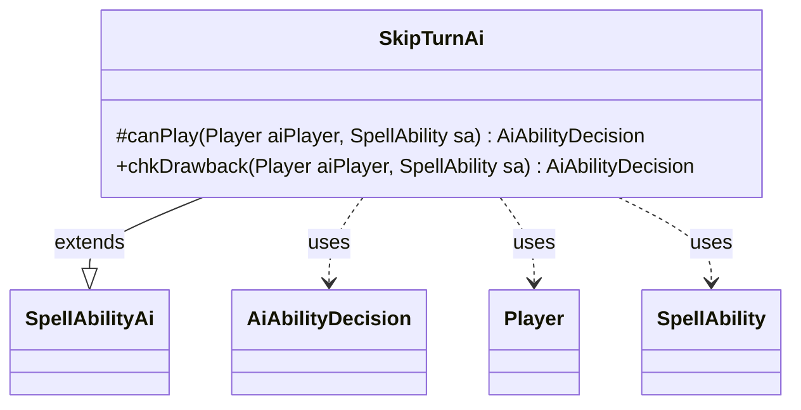

---
aliases:
  - SkipTurnAi
tags:
  - java/class
  - module/forge-ai
  - pkg/forge/ai/ability
fqn: forge.ai.ability.SkipTurnAi
package: forge.ai.ability
module: forge-ai
kind: Class
---

# SkipTurnAi

**Package:** `forge.ai.ability` &nbsp; **Module:** `forge-ai` &nbsp; **Kind:** Class



## Relationships
**Extends:**
- [[forge.ai.SpellAbilityAi|SpellAbilityAi]]
**Uses:**
- [[forge.ai.AiAbilityDecision|AiAbilityDecision]]
- [[forge.game.player.Player|Player]]
- [[forge.game.spellability.SpellAbility|SpellAbility]]

## Design Description

SkipTurnAi is the AI decision controller for "skip turn" spell abilities, determining whether the Forge AI should cast or activate them. As a concrete subclass of SpellAbilityAi, it overrides the framework's `canPlay` hook and gates the entire decision on the card-scripted `AILogic` parameter: only when that value equals "Always" does it commit (confidence 100, WillPlay); in every other case it declines (CantPlayAi). It reads context from the supplied Player and SpellAbility and reports its verdict as an AiAbilityDecision, which pairs a numeric score with an AiPlayDecision enum.

The design intent is deliberately conservative—forfeiting a turn is rarely advantageous, so the AI refuses unless a card explicitly opts in through scripting rather than relying on heuristic evaluation. `chkDrawback` simply delegates to `canPlay`, applying identical logic whether the effect is a primary spell or a subordinate drawback.

## Source
`forge-ai/src/main/java/forge/ai/ability/SkipTurnAi.java`

```java
package forge.ai.ability;

import forge.ai.AiAbilityDecision;
import forge.ai.AiPlayDecision;
import forge.ai.SpellAbilityAi;
import forge.game.player.Player;
import forge.game.spellability.SpellAbility;

public class SkipTurnAi extends SpellAbilityAi {
    /* (non-Javadoc)
     * @see forge.card.abilityfactory.SpellAiLogic#canPlayAI(forge.game.player.Player, java.util.Map, forge.card.spellability.SpellAbility)
     */
    @Override
    protected AiAbilityDecision canPlay(Player aiPlayer, SpellAbility sa) {
        if ("Always".equals(sa.getParam("AILogic"))) {
            return new AiAbilityDecision(100, AiPlayDecision.WillPlay);
        } else {
            return new AiAbilityDecision(0, AiPlayDecision.CantPlayAi);
        }
    }

    /* (non-Javadoc)
     * @see forge.card.abilityfactory.SpellAiLogic#chkAIDrawback(java.util.Map, forge.card.spellability.SpellAbility, forge.game.player.Player)
     */
    @Override
    public AiAbilityDecision chkDrawback(Player aiPlayer, SpellAbility sa) {
        return canPlay(aiPlayer, sa);
    }
}
```
