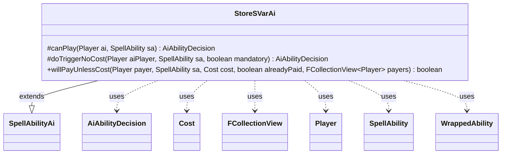

---
aliases:
  - StoreSVarAi
tags:
  - java/class
  - module/forge-ai
  - pkg/forge/ai/ability
fqn: forge.ai.ability.StoreSVarAi
package: forge.ai.ability
module: forge-ai
kind: Class
---

# StoreSVarAi

**Package:** `forge.ai.ability` &nbsp; **Module:** `forge-ai` &nbsp; **Kind:** Class



## Relationships
**Extends:**
- [[forge.ai.SpellAbilityAi|SpellAbilityAi]]
**Uses:**
- [[forge.ai.AiAbilityDecision|AiAbilityDecision]]
- [[forge.game.cost.Cost|Cost]]
- [[forge.game.player.Player|Player]]
- [[forge.game.spellability.SpellAbility|SpellAbility]]
- [[forge.game.trigger.WrappedAbility|WrappedAbility]]
- [[forge.util.collect.FCollectionView|FCollectionView]]

## Design Description

StoreSVarAi supplies the AI's decision logic for the StoreSVar effect, which records a value into a spell ability's stored variable (SVar). Extending `SpellAbilityAi`, it overrides the base hooks rather than introducing new behavior: `canPlay` and `doTriggerNoCost` both return a maximum-confidence WillPlay decision, treating the effect as always beneficial to resolve. The `doTriggerNoCost` override carries the only card-specific intent—detecting a `WrappedAbility` from "Maralen of the Mornsong Avatar" and forcing its X mana cost to 2 so the wrapped ability resolves with the intended magnitude.

The class also overrides `willPayUnlessCost` to govern optional "unless" payments, collaborating with `Cost`, `Player`, and `FCollectionView` to handle Join Forces cards: when the cost is switched and multiple payers exist, it declines to pay for opponents (players not on the activator's team) while delegating all other cases to the superclass. Overall it is a thin, mostly permissive AI handler with two narrow special cases.

## Source
`forge-ai/src/main/java/forge/ai/ability/StoreSVarAi.java`

```java
package forge.ai.ability;

import forge.ai.AiAbilityDecision;
import forge.ai.AiPlayDecision;
import forge.ai.SpellAbilityAi;
import forge.game.cost.Cost;
import forge.game.player.Player;
import forge.game.spellability.SpellAbility;
import forge.game.trigger.WrappedAbility;
import forge.util.collect.FCollectionView;

public class StoreSVarAi extends SpellAbilityAi {

    @Override
    protected AiAbilityDecision canPlay(Player ai, SpellAbility sa) {
        return new AiAbilityDecision(100, AiPlayDecision.WillPlay);
    }

    @Override
    protected AiAbilityDecision doTriggerNoCost(Player aiPlayer, SpellAbility sa, boolean mandatory) {
        if (sa instanceof WrappedAbility) {
            SpellAbility origSa = ((WrappedAbility)sa).getWrappedAbility();
            if (origSa.getHostCard().getName().equals("Maralen of the Mornsong Avatar")) {
                origSa.setXManaCostPaid(2);
            }
        }

        return new AiAbilityDecision(100, AiPlayDecision.WillPlay);
    }

    @Override
    public boolean willPayUnlessCost(Player payer, SpellAbility sa, Cost cost, boolean alreadyPaid, FCollectionView<Player> payers) {
        // Join Forces cards
        if (sa.hasParam("UnlessSwitched") && payers.size() > 1) {
            final Player p = sa.getActivatingPlayer();
            // not me or team mate
            if (!p.sameTeam(payer)) {
                return false;
            }
        }

        return super.willPayUnlessCost(payer, sa, cost, alreadyPaid, payers);
    }
}
```
