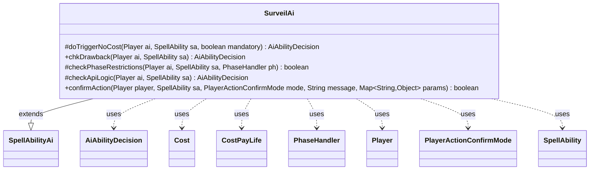

---
aliases:
  - SurveilAi
tags:
  - java/class
  - module/forge-ai
  - pkg/forge/ai/ability
fqn: forge.ai.ability.SurveilAi
package: forge.ai.ability
module: forge-ai
kind: Class
---

# SurveilAi

**Package:** `forge.ai.ability` &nbsp; **Module:** `forge-ai` &nbsp; **Kind:** Class



## Relationships
**Extends:**
- [[forge.ai.SpellAbilityAi|SpellAbilityAi]]
**Uses:**
- [[forge.ai.AiAbilityDecision|AiAbilityDecision]]
- [[forge.game.cost.Cost|Cost]]
- [[forge.game.cost.CostPayLife|CostPayLife]]
- [[forge.game.phase.PhaseHandler|PhaseHandler]]
- [[forge.game.player.Player|Player]]
- [[forge.game.player.PlayerActionConfirmMode|PlayerActionConfirmMode]]
- [[forge.game.spellability.SpellAbility|SpellAbility]]

## Design Description

SurveilAi is the forge-ai decision handler for the Surveil ability, extending `SpellAbilityAi` to override how the computer evaluates and times Surveil casts. Its core responsibility is judging *whether* and *when* to play: `checkApiLogic` rejects Surveil with an empty library, gates life-payment costs against an AI profile threshold, and otherwise commits probabilistically (40% at instant speed, 66.7% at sorcery speed, always when reusable). `checkPhaseRestrictions` encodes the timing intent—deferring tap/mana-costed activations to the opponent's end step before the AI's turn to avoid mana-locking and to scry right before drawing.

It collaborates with `Cost`/`CostPayLife` for cost analysis, `PhaseHandler`/`PhaseType` for turn timing, and `Player`/`SpellAbility` as the actors. Trigger and drawback paths (`doTriggerNoCost`, `chkDrawback`) and `confirmAction` unconditionally approve, reflecting that the harder evaluation lives in the play-decision logic rather than at confirmation time.

## Source
`forge-ai/src/main/java/forge/ai/ability/SurveilAi.java`

```java
package forge.ai.ability;

import forge.ai.*;
import forge.game.cost.Cost;
import forge.game.cost.CostPayLife;
import forge.game.phase.PhaseHandler;
import forge.game.phase.PhaseType;
import forge.game.player.Player;
import forge.game.player.PlayerActionConfirmMode;
import forge.game.spellability.SpellAbility;
import forge.game.zone.ZoneType;
import forge.util.MyRandom;

import java.util.Map;

public class SurveilAi extends SpellAbilityAi {

    /*
     * (non-Javadoc)
     * @see forge.ai.SpellAbilityAi#doTriggerAINoCost(forge.game.player.Player, forge.game.spellability.SpellAbility, boolean)
     */
    @Override
    protected AiAbilityDecision doTriggerNoCost(Player ai, SpellAbility sa, boolean mandatory) {
        return new AiAbilityDecision(100, AiPlayDecision.WillPlay);
    }

    /*
     * (non-Javadoc)
     * @see forge.ai.SpellAbilityAi#chkAIDrawback(forge.game.spellability.SpellAbility, forge.game.player.Player)
     */
    @Override
    public AiAbilityDecision chkDrawback(Player ai, SpellAbility sa) {
        return doTriggerNoCost(ai, sa, false);
    }

    /**
     * Checks if the AI will play a SpellAbility based on its phase restrictions
     */
    @Override
    protected boolean checkPhaseRestrictions(final Player ai, final SpellAbility sa, final PhaseHandler ph) {
        // if the Surveil ability requires tapping and has a mana cost, it's best done at the end of opponent's turn
        // and right before the beginning of AI's turn, if possible, to avoid mana locking the AI and also to
        // try to scry right before drawing a card. Also, avoid tapping creatures in the AI's turn, if possible,
        // even if there's no mana cost.
        if (sa.getPayCosts().hasTapCost()
                && (sa.getPayCosts().hasManaCost() || (sa.getHostCard() != null && sa.getHostCard().isCreature()))
                && !isSorcerySpeed(sa, ai)) {
            return ph.getNextTurn() == ai && ph.is(PhaseType.END_OF_TURN);
        }
        if (sa.getHostCard() != null && !sa.getHostCard().isPermanent() && !isSorcerySpeed(sa, ai))
            return ph.getNextTurn() == ai && ph.is(PhaseType.END_OF_TURN);
        // in the player's turn Surveil should only be done in Main1 or in Upkeep if able
        if (ph.isPlayerTurn(ai)) {
            if (isSorcerySpeed(sa, ai)) {
                return ph.is(PhaseType.MAIN1) || sa.isPwAbility();
            } else {
                return ph.is(PhaseType.UPKEEP);
            }
        }
        return true;
    }

    @Override
    protected AiAbilityDecision checkApiLogic(Player ai, SpellAbility sa) {
        // Makes no sense to do Surveil when there's nothing in the library
        if (ai.getCardsIn(ZoneType.Library).isEmpty()) {
            return new AiAbilityDecision(0, AiPlayDecision.MissingNeededCards);
        }

        // Only Surveil for life when at decent amount of life remaining
        final Cost cost = sa.getPayCosts();
        if (cost != null && cost.hasSpecificCostType(CostPayLife.class)) {
            final int maxLife = AiProfileUtil.getIntProperty(ai, AiProps.SURVEIL_LIFEPERC_AFTER_PAYING_LIFE);
            if (!ComputerUtilCost.checkLifeCost(ai, cost, sa.getHostCard(), ai.getStartingLife() * maxLife / 100, sa)) {
                return new AiAbilityDecision(0, AiPlayDecision.CostNotAcceptable);
            }
        }

        // TODO If EOT and I'm the next turn, the percent should probably be higher
        double chance = .4; // 40 percent chance for instant speed
        if (isSorcerySpeed(sa, ai)) {
            chance = .667; // 66.7% chance for sorcery speed (since it will never activate EOT)
        }

        boolean randomReturn = MyRandom.getRandom().nextFloat() <= chance;
        if (playReusable(ai, sa)) {
            randomReturn = true;
        }

        if (randomReturn) {
            return new AiAbilityDecision(100, AiPlayDecision.WillPlay);
        }

        return new AiAbilityDecision(0, AiPlayDecision.CantPlayAi);
    }

    @Override
    public boolean confirmAction(Player player, SpellAbility sa, PlayerActionConfirmMode mode, String message, Map<String, Object> params) {
        return true;
    }
}
```
