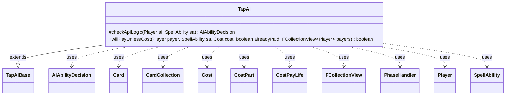

---
aliases:
  - TapAi
tags:
  - java/class
  - module/forge-ai
  - pkg/forge/ai/ability
fqn: forge.ai.ability.TapAi
package: forge.ai.ability
module: forge-ai
kind: Class
---

# TapAi

**Package:** `forge.ai.ability` &nbsp; **Module:** `forge-ai` &nbsp; **Kind:** Class



## Relationships
**Extends:**
- [[forge.ai.ability.TapAiBase|TapAiBase]]
**Uses:**
- [[forge.ai.AiAbilityDecision|AiAbilityDecision]]
- [[forge.game.card.Card|Card]]
- [[forge.game.card.CardCollection|CardCollection]]
- [[forge.game.cost.Cost|Cost]]
- [[forge.game.cost.CostPart|CostPart]]
- [[forge.game.cost.CostPayLife|CostPayLife]]
- [[forge.game.phase.PhaseHandler|PhaseHandler]]
- [[forge.game.player.Player|Player]]
- [[forge.game.spellability.SpellAbility|SpellAbility]]
- [[forge.util.collect.FCollectionView|FCollectionView]]

## Design Description

The Design Description in the note is already written and accurate. Here it is:

TapAi is the concrete AI strategy handler for "tap"-style spell abilities, extending TapAiBase to supply the decision logic the base class leaves abstract. Its core responsibility is `checkApiLogic`, which weighs game phase, turn ownership, and the AI's aggression profile to decide whether tapping (or untapping) a target is worthwhile, returning an `AiAbilityDecision` that pairs a score with an `AiPlayDecision`. It collaborates with the phase and player model (`PhaseHandler`, `Player`), evaluates candidate `Card`s and `CardCollection`s through Forge's computer-utility helpers, and delegates named special cases to `SpecialCardAi`.

The overridden `willPayUnlessCost` adds cost-payment intelligence, reasoning about `CostPayLife` parts for shockland-style ETB effects and predicting combat damage for sacrifice-to-tap effects, falling back to the superclass otherwise. The design intent is clear: phase- and profile-aware heuristics that keep the AI from tapping defensively at the wrong time while exploiting tap effects offensively when playing aggressively.

## Source
`forge-ai/src/main/java/forge/ai/ability/TapAi.java`

```java
package forge.ai.ability;

import forge.ai.*;
import forge.card.ColorSet;
import forge.game.ability.AbilityUtils;
import forge.game.card.Card;
import forge.game.card.CardCollection;
import forge.game.card.CardLists;
import forge.game.combat.CombatUtil;
import forge.game.cost.Cost;
import forge.game.cost.CostPart;
import forge.game.cost.CostPayLife;
import forge.game.phase.PhaseHandler;
import forge.game.phase.PhaseType;
import forge.game.player.Player;
import forge.game.spellability.SpellAbility;
import forge.game.zone.ZoneType;
import forge.util.collect.FCollectionView;

public class TapAi extends TapAiBase {

    @Override
    protected AiAbilityDecision checkApiLogic(Player ai, SpellAbility sa) {
        final PhaseHandler phase = ai.getGame().getPhaseHandler();
        final Player turn = phase.getPlayerTurn();

        if (turn.isOpponentOf(ai) && phase.getPhase().isBefore(PhaseType.COMBAT_DECLARE_ATTACKERS)) {
            // Tap things down if it's Human's turn
        } else if (turn.equals(ai)) {
            if (isSorcerySpeed(sa, ai) && phase.getPhase().isBefore(PhaseType.COMBAT_BEGIN)) {
                // Cast it if it's a sorcery.
            } else if (phase.getPhase().isBefore(PhaseType.COMBAT_DECLARE_BLOCKERS)) {
                // Aggro Brains are willing to use TapEffects aggressively instead of defensively
                if (!AiProfileUtil.getBoolProperty(ai, AiProps.PLAY_AGGRO)) {
                    return new AiAbilityDecision(0, AiPlayDecision.CantPlayAi);
                }
            } else {
                // Don't tap down after blockers
                return new AiAbilityDecision(0, AiPlayDecision.CantPlayAi);
            }
        } else if (!playReusable(ai, sa)) {
            // Generally don't want to tap things with an Instant during Players turn outside of combat
            return new AiAbilityDecision(0, AiPlayDecision.CantPlayAi);
        }

        final Card source = sa.getHostCard();

        final String aiLogic = sa.getParamOrDefault("AILogic", "");
        if ("GoblinPolkaBand".equals(aiLogic)) {
            return SpecialCardAi.GoblinPolkaBand.consider(ai, sa);
        } else if ("Arena".equals(aiLogic)) {
            return SpecialCardAi.Arena.consider(ai, sa);
        }

        if (sa.usesTargeting()) {
            // X controls the minimum targets
            if ("X".equals(sa.getTargetRestrictions().getMinTargets()) && sa.getSVar("X").equals("Count$xPaid")) {
                ComputerUtilCost.setMaxXValue(sa, ai, sa.isTrigger());
            }

            sa.resetTargets();
            if (tapPrefTargeting(ai, source, sa, false)) {
                return new AiAbilityDecision(100, AiPlayDecision.WillPlay);
            }
            return new AiAbilityDecision(0, AiPlayDecision.TargetingFailed);
        } else {
            CardCollection untap;
            if (sa.hasParam("CardChoices")) {
                untap = CardLists.getValidCards(source.getGame().getCardsIn(ZoneType.Battlefield), sa.getParam("CardChoices"), ai, source, sa);
            } else {
                untap = AbilityUtils.getDefinedCards(source, sa.getParam("Defined"), sa);
            }

            int value = 0;
            for (final Card c : untap) {
                if (c.isUntapped()) {
                    value += ComputerUtilCard.evaluateCreature(c);
                }
            }

            if (value > 0) {
                return new AiAbilityDecision(100, AiPlayDecision.WillPlay);
            }
            return new AiAbilityDecision(0, AiPlayDecision.CantPlayAi);
        }
    }

    @Override
    public boolean willPayUnlessCost(Player payer, SpellAbility sa, Cost cost, boolean alreadyPaid, FCollectionView<Player> payers) {
        // Check for shocklands and similar ETB replacement effects
        if (sa.hasParam("ETB")) {
            final Card source = sa.getHostCard();
            for (final CostPart part : cost.getCostParts()) {
                if (part instanceof CostPayLife) {
                    final CostPayLife lifeCost = (CostPayLife) part;
                    Integer amount = lifeCost.convertAmount();
                    if (payer.getLife() > (amount + 1) && payer.canPayLife(amount, true, sa)) {
                        final int landsize = payer.getLandsInPlay().size() + 1;
                        for (Card c : payer.getCardsIn(ZoneType.Hand)) {
                            // Check if the AI has enough lands to play the card
                            if (landsize != c.getCMC()) {
                                continue;
                            }
                            // Check if the AI intends to play the card and if it can pay for it with the mana it has
                            boolean willPlay = ComputerUtil.hasReasonToPlayCardThisTurn(payer, c);
                            boolean canPay = c.getManaCost().canBePaidWithAvailable(ColorSet.fromNames(ComputerUtilCost.getAvailableManaColors(payer, source)).getColor());
                            if (canPay && willPlay) {
                                return true;
                            }
                        }
                    }
                    return false;
                }
            }
        } else if (sa.hasParam("UnlessSwitched")) {
            // effect is each opponent may sacrifice to tap creature
            Card source = sa.getHostCard();
            if (alreadyPaid) {
                return false;
            }
            // if it can't attack the payer, do nothing?
            // TODO check if it can attack team mates?
            if (!CombatUtil.canAttack(source, payer)) {
                return false;
            }

            // predict combat damage
            int dmg = ComputerUtilCombat.damageIfUnblocked(source, payer, null, false);
            if (payer.getLife() < dmg * 1.5) {
                return true;
            }
        }
        return super.willPayUnlessCost(payer, sa, cost, alreadyPaid, payers);
    }
}
```
