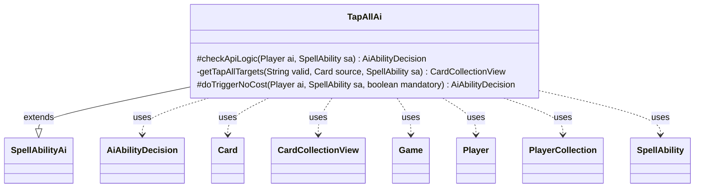

---
aliases:
  - TapAllAi
tags:
  - java/class
  - module/forge-ai
  - pkg/forge/ai/ability
fqn: forge.ai.ability.TapAllAi
package: forge.ai.ability
module: forge-ai
kind: Class
---

# TapAllAi

**Package:** `forge.ai.ability` &nbsp; **Module:** `forge-ai` &nbsp; **Kind:** Class



## Relationships
**Extends:**
- [[forge.ai.SpellAbilityAi|SpellAbilityAi]]
**Uses:**
- [[forge.ai.AiAbilityDecision|AiAbilityDecision]]
- [[forge.game.Game|Game]]
- [[forge.game.card.Card|Card]]
- [[forge.game.card.CardCollectionView|CardCollectionView]]
- [[forge.game.player.Player|Player]]
- [[forge.game.player.PlayerCollection|PlayerCollection]]
- [[forge.game.spellability.SpellAbility|SpellAbility]]

## Design Description

TapAllAi is the AI strategy that decides whether to play spell abilities tapping all valid permanents on the battlefield. Extending the abstract `SpellAbilityAi`, it overrides `checkApiLogic` for proactive casting and `doTriggerNoCost` for forced or triggered resolution, returning an `AiAbilityDecision` that pairs a score with an `AiPlayDecision` verdict. It collaborates with the game model—querying `Game`, `Player`, and `Card`, and assembling filtered `CardCollectionView`s of untapped, valid targets.

The design favors asymmetric value: the AI only commits when it would tap more opponent permanents than its own, refuses to act after combat begins, and on its own turn first confirms it has viable attackers before tapping down would-be blockers. When targeting, it selects the highest-life targetable opponent, and the `doTriggerNoCost` path always complies when the effect is mandatory.

## Source
`forge-ai/src/main/java/forge/ai/ability/TapAllAi.java`

```java
package forge.ai.ability;

import forge.ai.AiAbilityDecision;
import forge.ai.AiPlayDecision;
import forge.ai.ComputerUtilCombat;
import forge.ai.SpellAbilityAi;
import forge.game.Game;
import forge.game.ability.AbilityUtils;
import forge.game.card.Card;
import forge.game.card.CardCollectionView;
import forge.game.card.CardLists;
import forge.game.card.CardPredicates;
import forge.game.combat.CombatUtil;
import forge.game.phase.PhaseType;
import forge.game.player.Player;
import forge.game.player.PlayerCollection;
import forge.game.player.PlayerPredicates;
import forge.game.spellability.SpellAbility;
import forge.game.zone.ZoneType;

import java.util.List;

public class TapAllAi extends SpellAbilityAi {
    @Override
    protected AiAbilityDecision checkApiLogic(final Player ai, SpellAbility sa) {
        // If tapping all creatures do it either during declare attackers of AIs turn
        // or during upkeep/begin combat?

        final Card source = sa.getHostCard();
        final Player opp = ai.getStrongestOpponent();
        final Game game = ai.getGame();

        if (game.getPhaseHandler().getPhase().isAfter(PhaseType.COMBAT_BEGIN)) {
            return new AiAbilityDecision(0, AiPlayDecision.CantPlayAi);
        }

        final String valid = sa.getParamOrDefault("ValidCards", "");

        CardCollectionView validTappables = game.getCardsIn(ZoneType.Battlefield);

        if (sa.usesTargeting()) {
            sa.resetTargets();
            sa.getTargets().add(opp);
            validTappables = opp.getCardsIn(ZoneType.Battlefield);
        }

        validTappables = CardLists.getValidCards(validTappables, valid, source.getController(), source, sa);
        validTappables = CardLists.filter(validTappables, CardPredicates.UNTAPPED);

        if (sa.hasParam("AILogic")) {
            String logic = sa.getParam("AILogic");
            if (logic.startsWith("AtLeast")) {
                int num = AbilityUtils.calculateAmount(source, logic.substring(7), sa);
                if (validTappables.size() < num) {
                    return new AiAbilityDecision(0, AiPlayDecision.CantPlayAi);
                }
            }
        }

        if (validTappables.isEmpty()) {
            return new AiAbilityDecision(0, AiPlayDecision.CantPlayAi);
        }

        final List<Card> human = CardLists.filterControlledBy(validTappables, opp);
        final List<Card> compy = CardLists.filterControlledBy(validTappables, ai);
        if (human.size() <= compy.size()) {
            return new AiAbilityDecision(0, AiPlayDecision.CantPlayAi);
        }
        // in AI's turn, check if there are possible attackers, before tapping blockers
        if (game.getPhaseHandler().isPlayerTurn(ai)) {
            validTappables = ai.getCardsIn(ZoneType.Battlefield);
            final boolean any = validTappables.anyMatch(c -> CombatUtil.canAttack(c) && ComputerUtilCombat.canAttackNextTurn(c));
            return any ? new AiAbilityDecision(100, AiPlayDecision.WillPlay) : new AiAbilityDecision(0, AiPlayDecision.CantPlayAi);
        }
        return new AiAbilityDecision(100, AiPlayDecision.WillPlay);
    }

    private CardCollectionView getTapAllTargets(final String valid, final Card source, SpellAbility sa) {
        final Game game = source.getGame();
        CardCollectionView tmpList = game.getCardsIn(ZoneType.Battlefield);
        tmpList = CardLists.getValidCards(tmpList, valid, source.getController(), source, sa);
        tmpList = CardLists.filter(tmpList, CardPredicates.UNTAPPED);
        return tmpList;
    }

    @Override
    protected AiAbilityDecision doTriggerNoCost(final Player ai, SpellAbility sa, boolean mandatory) {
        final Card source = sa.getHostCard();

        final String valid = sa.getParamOrDefault("ValidCards", "");

        CardCollectionView validTappables = getTapAllTargets(valid, source, sa);

        if (sa.usesTargeting()) {
            final PlayerCollection targetableOpps = ai.getOpponents().filter(PlayerPredicates.isTargetableBy(sa));
            Player target = targetableOpps.max(PlayerPredicates.compareByLife());
            if (target == null && mandatory) {
                target = ai;
            }
            sa.resetTargets();
            sa.getTargets().add(target);
            validTappables = target.getCardsIn(ZoneType.Battlefield);
        }

        if (mandatory) {
            return new AiAbilityDecision(100, AiPlayDecision.WillPlay);
        }

        if (validTappables.size() > 0) {
            final int human = CardLists.count(validTappables, CardPredicates.isControlledByAnyOf(ai.getYourTeam()));
            final int compy = CardLists.count(validTappables, CardPredicates.isControlledByAnyOf(ai.getOpponents()));
            if (human > compy) {
                return new AiAbilityDecision(100, AiPlayDecision.WillPlay);
            }
        }
        return new AiAbilityDecision(0, AiPlayDecision.CantPlayAi);
    }
}
```
