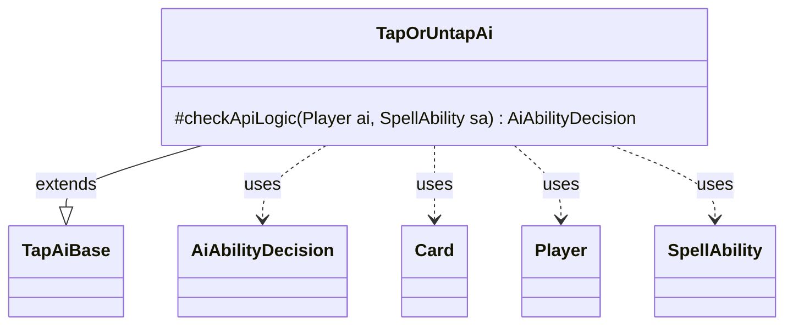

---
aliases:
  - TapOrUntapAi
tags:
  - java/class
  - module/forge-ai
  - pkg/forge/ai/ability
fqn: forge.ai.ability.TapOrUntapAi
package: forge.ai.ability
module: forge-ai
kind: Class
---

# TapOrUntapAi

**Package:** `forge.ai.ability` &nbsp; **Module:** `forge-ai` &nbsp; **Kind:** Class



## Relationships
**Extends:**
- [[forge.ai.ability.TapAiBase|TapAiBase]]
**Uses:**
- [[forge.ai.AiAbilityDecision|AiAbilityDecision]]
- [[forge.game.card.Card|Card]]
- [[forge.game.player.Player|Player]]
- [[forge.game.spellability.SpellAbility|SpellAbility]]


## Design Description

`TapOrUntapAi` provides the AI's play-decision logic for "tap or untap" spell abilities, deciding whether the computer should activate such an ability and returning an `AiAbilityDecision` that pairs a confidence score with an `AiPlayDecision` verdict. It extends `TapAiBase`, overriding the protected `checkApiLogic` hook to specialize behavior while reusing inherited tapping machinery such as `tapPrefTargeting`. For untargeted abilities it inspects the defined `Card`s via `AbilityUtils` and commits only when at least one is untapped and therefore worth tapping; for targeted abilities it delegates to the inherited preference-targeting routine. Both successful paths return full-confidence `WillPlay`, otherwise `CantPlayAi`. A `TODO` records an unimplemented refinement: skipping permanents that could simply untap themselves.

## Source
`forge-ai/src/main/java/forge/ai/ability/TapOrUntapAi.java`

```java
package forge.ai.ability;

import forge.ai.AiAbilityDecision;
import forge.ai.AiPlayDecision;
import forge.game.ability.AbilityUtils;
import forge.game.card.Card;
import forge.game.player.Player;
import forge.game.spellability.SpellAbility;

public class TapOrUntapAi extends TapAiBase {

    /* (non-Javadoc)
     * @see forge.card.abilityfactory.SpellAiLogic#canPlayAI(forge.game.player.Player, java.util.Map, forge.card.spellability.SpellAbility)
     */
    @Override
    protected AiAbilityDecision checkApiLogic(Player ai, SpellAbility sa) {
        final Card source = sa.getHostCard();

        if (!sa.usesTargeting()) {
            // assume we are looking to tap human's stuff
            // TODO - check for things with untap abilities, and don't tap those.

            boolean bFlag = false;
            for (final Card c : AbilityUtils.getDefinedCards(source, sa.getParam("Defined"), sa)) {
                bFlag |= c.isUntapped();
            }

            if (!bFlag) {
                return new AiAbilityDecision(0, AiPlayDecision.CantPlayAi);
            }
        } else {
            sa.resetTargets();
            if (!tapPrefTargeting(ai, source, sa, false)) {
                return new AiAbilityDecision(0, AiPlayDecision.CantPlayAi);
            }
        }

        return new AiAbilityDecision(100, AiPlayDecision.WillPlay);
    }

}
```
