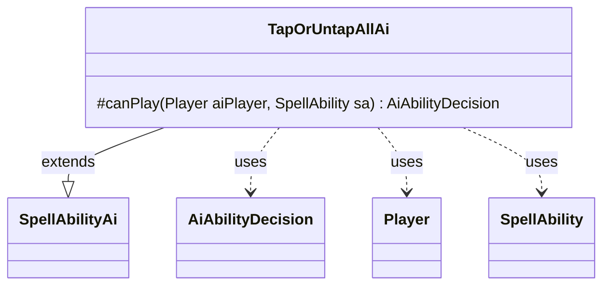

---
aliases:
  - TapOrUntapAllAi
tags:
  - java/class
  - module/forge-ai
  - pkg/forge/ai/ability
fqn: forge.ai.ability.TapOrUntapAllAi
package: forge.ai.ability
module: forge-ai
kind: Class
---

# TapOrUntapAllAi

**Package:** `forge.ai.ability` &nbsp; **Module:** `forge-ai` &nbsp; **Kind:** Class



## Relationships
**Extends:**
- [[forge.ai.SpellAbilityAi|SpellAbilityAi]]
**Uses:**
- [[forge.ai.AiAbilityDecision|AiAbilityDecision]]
- [[forge.game.player.Player|Player]]
- [[forge.game.spellability.SpellAbility|SpellAbility]]

## Design Description

`TapOrUntapAllAi` provides the AI decision logic for the "TapOrUntapAll" spell ability, determining whether a computer-controlled player should cast such an effect. As a concrete subclass of `SpellAbilityAi`, it overrides `canPlay` to return an `AiAbilityDecision`, plugging into Forge's ability-factory framework that dispatches AI evaluation by effect type. The method receives the deciding `Player` and the candidate `SpellAbility` and yields a decision object pairing a score with an `AiPlayDecision` verdict.

In its current state the class is effectively a stub: `canPlay` unconditionally returns `CantPlayAi`, meaning the AI never initiates this ability on its own. The inline comments record the design intent—only Turnabout presently relies on it, with Faces of the Past as a candidate—signalling that genuine evaluation heuristics are deferred future work rather than an intentional permanent refusal.

## Source
`forge-ai/src/main/java/forge/ai/ability/TapOrUntapAllAi.java`

```java
package forge.ai.ability;

import forge.ai.AiAbilityDecision;
import forge.ai.AiPlayDecision;
import forge.ai.SpellAbilityAi;
import forge.game.player.Player;
import forge.game.spellability.SpellAbility;

/** 
 * TODO: Write javadoc for this type.
 *
 */
public class TapOrUntapAllAi extends SpellAbilityAi {

    /* (non-Javadoc)
     * @see forge.card.abilityfactory.SpellAiLogic#canPlayAI(forge.game.player.Player, forge.card.spellability.SpellAbility)
     */
    @Override
    protected AiAbilityDecision canPlay(Player aiPlayer, SpellAbility sa) {
        // Only Turnabout currently uses this, it's hardcoded to always return false
        // Looks like Faces of the Past could also use this
        return new AiAbilityDecision(0, AiPlayDecision.CantPlayAi);
    }

}
```
