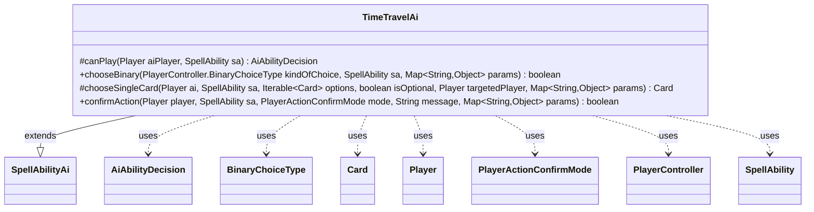

---
aliases:
  - TimeTravelAi
tags:
  - java/class
  - module/forge-ai
  - pkg/forge/ai/ability
fqn: forge.ai.ability.TimeTravelAi
package: forge.ai.ability
module: forge-ai
kind: Class
---

# TimeTravelAi

**Package:** `forge.ai.ability` &nbsp; **Module:** `forge-ai` &nbsp; **Kind:** Class



## Relationships
**Extends:**
- [[forge.ai.SpellAbilityAi|SpellAbilityAi]]
**Uses:**
- [[forge.ai.AiAbilityDecision|AiAbilityDecision]]
- [[forge.game.card.Card|Card]]
- [[forge.game.player.Player|Player]]
- [[forge.game.player.PlayerActionConfirmMode|PlayerActionConfirmMode]]
- [[forge.game.player.PlayerController|PlayerController]]
- [[forge.game.player.PlayerController.BinaryChoiceType|BinaryChoiceType]]
- [[forge.game.spellability.SpellAbility|SpellAbility]]

## Design Description

TimeTravelAi provides the AI decision logic for Forge's Time Travel keyword action, determining when and how the computer player adds or removes TIME counters. As a concrete subclass of `SpellAbilityAi`, it slots into the engine's generic ability-evaluation pipeline by overriding framework hook methods rather than defining its own interface. Its `canPlay` gate returns a weighted `AiAbilityDecision`, committing fully (weight 100) only when the AI has suspended cards in exile or battlefield permanents carrying TIME counters, and declining otherwise. The `chooseBinary` override delegates to `ComputerUtil.isNegativeCounter` so the AI adds beneficial counters and removes detrimental ones.

The class is stateless, collaborating with `Player`, `Card`, and `SpellAbility` solely through inherited contracts. Its trivial `chooseSingleCard` (take the first option), unconditionally affirmative `confirmAction`, and an explicit TODO mark it as a deliberately minimal placeholder heuristic awaiting more nuanced refinement.

## Source
`forge-ai/src/main/java/forge/ai/ability/TimeTravelAi.java`

```java
package forge.ai.ability;

import com.google.common.collect.Iterables;
import forge.ai.AiAbilityDecision;
import forge.ai.AiPlayDecision;
import forge.ai.ComputerUtil;
import forge.ai.SpellAbilityAi;
import forge.game.card.Card;
import forge.game.card.CardPredicates;
import forge.game.card.CounterEnumType;
import forge.game.player.Player;
import forge.game.player.PlayerActionConfirmMode;
import forge.game.player.PlayerController;
import forge.game.spellability.SpellAbility;
import forge.game.zone.ZoneType;

import java.util.Map;

public class TimeTravelAi extends SpellAbilityAi {
    @Override
    protected AiAbilityDecision canPlay(Player aiPlayer, SpellAbility sa) {
        boolean hasSuspendedCards = aiPlayer.getCardsIn(ZoneType.Exile).anyMatch(Card::hasSuspend);
        boolean hasRelevantCardsOTB = aiPlayer.getCardsIn(ZoneType.Battlefield).anyMatch(CardPredicates.hasCounter(CounterEnumType.TIME));

        if (hasSuspendedCards || hasRelevantCardsOTB) {
            // If there are cards with Time counters, we can play this ability
            return new AiAbilityDecision(100, AiPlayDecision.WillPlay);
        } else {
            // No cards to add/remove Time counters from, so don't play this ability
            return new AiAbilityDecision(0, AiPlayDecision.CantPlayAi);
        }
    }

    @Override
    public boolean chooseBinary(PlayerController.BinaryChoiceType kindOfChoice, SpellAbility sa, Map<String, Object> params) {
        // Returning true means "add counter", false means "remove counter"

        // TODO: extend this (usually, stuff in exile such as Suspended cards with Time counters is played once no Time counters are left,
        // so removing them is good; stuff on the battlefield is usually stuff like Vanishing or As Foretold, which favors adding Time
        // counters for better effect, but exceptions should be added here).
        Card target = (Card)params.get("Target");
        return !ComputerUtil.isNegativeCounter(CounterEnumType.TIME, target);
    }

    @Override
    protected Card chooseSingleCard(Player ai, SpellAbility sa, Iterable<Card> options, boolean isOptional, Player targetedPlayer, Map<String, Object> params) {
        return Iterables.getFirst(options, null);
    }

    @Override
    public boolean confirmAction(Player player, SpellAbility sa, PlayerActionConfirmMode mode, String message, Map<String, Object> params) {
        return true;
    }
}
```

## Python
`forge/ai/ability/TimeTravelAi.py`

```python
from typing import Iterable

from com.google.common.collect.Iterables import Iterables
from forge.ai.AiAbilityDecision import AiAbilityDecision
from forge.ai.AiPlayDecision import AiPlayDecision
from forge.ai.ComputerUtil import ComputerUtil
from forge.ai.SpellAbilityAi import SpellAbilityAi
from forge.game.card.Card import Card
from forge.game.card.CardPredicates import CardPredicates
from forge.game.card.CounterEnumType import CounterEnumType
from forge.game.player.Player import Player
from forge.game.player.PlayerActionConfirmMode import PlayerActionConfirmMode
from forge.game.player.PlayerController import PlayerController
from forge.game.spellability.SpellAbility import SpellAbility
from forge.game.zone.ZoneType import ZoneType


class TimeTravelAi(SpellAbilityAi):
    def canPlay(self, aiPlayer: Player, sa: SpellAbility) -> AiAbilityDecision:
        hasSuspendedCards = aiPlayer.getCardsIn(ZoneType.Exile).anyMatch(Card.hasSuspend)
        hasRelevantCardsOTB = aiPlayer.getCardsIn(ZoneType.Battlefield).anyMatch(CardPredicates.hasCounter(CounterEnumType.TIME))

        if hasSuspendedCards or hasRelevantCardsOTB:
            # If there are cards with Time counters, we can play this ability
            return AiAbilityDecision(100, AiPlayDecision.WillPlay)
        else:
            # No cards to add/remove Time counters from, so don't play this ability
            return AiAbilityDecision(0, AiPlayDecision.CantPlayAi)

    def chooseBinary(self, kindOfChoice: "PlayerController.BinaryChoiceType", sa: SpellAbility, params: dict[str, object]) -> bool:
        # Returning true means "add counter", false means "remove counter"

        # TODO: extend this (usually, stuff in exile such as Suspended cards with Time counters is played once no Time counters are left,
        # so removing them is good; stuff on the battlefield is usually stuff like Vanishing or As Foretold, which favors adding Time
        # counters for better effect, but exceptions should be added here).
        target = params.get("Target")
        return not ComputerUtil.isNegativeCounter(CounterEnumType.TIME, target)

    def chooseSingleCard(self, ai: Player, sa: SpellAbility, options: Iterable[Card], isOptional: bool, targetedPlayer: Player, params: dict[str, object]) -> Card:
        return Iterables.getFirst(options, None)

    def confirmAction(self, player: Player, sa: SpellAbility, mode: PlayerActionConfirmMode, message: str, params: dict[str, object]) -> bool:
        return True
```
