---
aliases:
  - TokenAi
tags:
  - java/class
  - module/forge-ai
  - pkg/forge/ai/ability
fqn: forge.ai.ability.TokenAi
package: forge.ai.ability
module: forge-ai
kind: Class
---

# TokenAi

**Package:** `forge.ai.ability`   **Module:** `forge-ai`   **Kind:** Class



```mermaid
classDiagram
    class TokenAi {
        #checkPhaseRestrictions(Player ai, SpellAbility sa, PhaseHandler ph) boolean
        #checkApiLogic(Player ai, SpellAbility sa) AiAbilityDecision
        -canInterruptSacrifice(Player ai, SpellAbility sa, Card token, String tokenAmount) boolean
        #doTriggerNoCost(Player ai, SpellAbility sa, boolean mandatory) AiAbilityDecision
        +confirmAction(Player player, SpellAbility sa, PlayerActionConfirmMode mode, String message, Map~String,Object~ params) boolean
        #chooseSinglePlayer(Player ai, SpellAbility sa, Iterable~Player~ options, Map~String,Object~ params) Player
        #chooseSingleAttackableEntity(Player ai, SpellAbility sa, Iterable~GameEntity~ options, Map~String,Object~ params) GameEntity
        +spawnToken(Player ai, SpellAbility sa) Card
        -tgtRoleAura(Player ai, SpellAbility sa, Card tok, boolean mandatory) boolean
        +willPayUnlessCost(Player payer, SpellAbility sa, Cost cost, boolean alreadyPaid, FCollectionView~Player~ payers) boolean
    }
    TokenAi --|> SpellAbilityAi : extends
    TokenAi ..> AiAbilityDecision : uses
    TokenAi ..> Card : uses
    TokenAi ..> CardCollection : uses
    TokenAi ..> Combat : uses
    TokenAi ..> Cost : uses
    TokenAi ..> CostDraw : uses
    TokenAi ..> CostPart : uses
    TokenAi ..> CostPutCounter : uses
    TokenAi ..> CostRemoveCounter : uses
    TokenAi ..> FCollectionView : uses
    TokenAi ..> Game : uses
    TokenAi ..> GameEntity : uses
    TokenAi ..> PhaseHandler : uses
    TokenAi ..> Player : uses
    TokenAi ..> PlayerActionConfirmMode : uses
    TokenAi ..> PlayerCollection : uses
    TokenAi ..> SpellAbility : uses
    TokenAi ..> TargetRestrictions : uses
```

## Relationships
**Extends:**
- [[forge.ai.SpellAbilityAi|SpellAbilityAi]]
**Uses:**
- [[forge.ai.AiAbilityDecision|AiAbilityDecision]]
- [[forge.game.Game|Game]]
- [[forge.game.GameEntity|GameEntity]]
- [[forge.game.card.Card|Card]]
- [[forge.game.card.CardCollection|CardCollection]]
- [[forge.game.combat.Combat|Combat]]
- [[forge.game.cost.Cost|Cost]]
- [[forge.game.cost.CostDraw|CostDraw]]
- [[forge.game.cost.CostPart|CostPart]]
- [[forge.game.cost.CostPutCounter|CostPutCounter]]
- [[forge.game.cost.CostRemoveCounter|CostRemoveCounter]]
- [[forge.game.phase.PhaseHandler|PhaseHandler]]
- [[forge.game.player.Player|Player]]
- [[forge.game.player.PlayerActionConfirmMode|PlayerActionConfirmMode]]
- [[forge.game.player.PlayerCollection|PlayerCollection]]
- [[forge.game.spellability.SpellAbility|SpellAbility]]
- [[forge.game.spellability.TargetRestrictions|TargetRestrictions]]
- [[forge.util.collect.FCollectionView|FCollectionView]]


## Design Description

TokenAi is the forge-ai decision layer governing token-creating spells and activated/triggered abilities. Extending `SpellAbilityAi`, it overrides the engine's AI hooks—`checkPhaseRestrictions`, `checkApiLogic`, `doTriggerNoCost`, `confirmAction`, the player/entity choosers, and `willPayUnlessCost`—to decide whether and when the AI should generate tokens. Its shared static helper `spawnToken` builds a prototype `Card` from the ability's `TokenScript` (with static continuous P/T applied) so candidate tokens can be evaluated before any commitment.

The class concentrates considerable strategic intent: it holds haste-less creatures until Main2, casts planeswalker plus-abilities eagerly, interrupts opponent sacrifice effects to shield a more valuable creature, routes Role-aura targeting through `tgtRoleAura`, and resolves Fabricate choices by comparing evaluated creature value against +1/+1 counters. It collaborates with game-state types (`Game`, `Combat`, `PhaseHandler`, `Player`, `Card`/`CardCollection`, `Cost` variants, `TargetRestrictions`), expressing each verdict as an `AiAbilityDecision` driven by Forge's `ComputerUtil*` evaluators.

## Source
`forge-ai/src/main/java/forge/ai/ability/TokenAi.java`

```java
package forge.ai.ability;

import java.util.List;
import java.util.Map;

import com.google.common.collect.Iterables;

import forge.ai.*;
import forge.game.Game;
import forge.game.GameEntity;
import forge.game.ability.AbilityUtils;
import forge.game.ability.ApiType;
import forge.game.card.*;
import forge.game.card.token.TokenInfo;
import forge.game.combat.Combat;
import forge.game.combat.CombatUtil;
import forge.game.cost.Cost;
import forge.game.cost.CostDraw;
import forge.game.cost.CostPart;
import forge.game.cost.CostPutCounter;
import forge.game.cost.CostRemoveCounter;
import forge.game.keyword.Keyword;
import forge.game.phase.PhaseHandler;
import forge.game.phase.PhaseType;
import forge.game.player.Player;
import forge.game.player.PlayerActionConfirmMode;
import forge.game.player.PlayerCollection;
import forge.game.player.PlayerPredicates;
import forge.game.spellability.SpellAbility;
import forge.game.spellability.TargetRestrictions;
import forge.game.zone.ZoneType;
import forge.util.MyRandom;
import forge.util.collect.FCollectionView;

/**
 * <p>
 * AbilityFactory_Token class.
 * </p>
 *
 * @author Forge
 * @version $Id: AbilityFactoryToken.java 17656 2012-10-22 19:32:56Z Max mtg $
 */
public class TokenAi extends SpellAbilityAi {

    @Override
    protected boolean checkPhaseRestrictions(final Player ai, final SpellAbility sa, final PhaseHandler ph) {
        final Card source = sa.getHostCard();
        // Planeswalker-related flags
        boolean pwMinus = false;
        boolean pwPlus = false;
        if (sa.isPwAbility()) {
            /*
             * Planeswalker token ability with loyalty costs should be played in
             * Main1 or it might never be used due to other positive abilities.
             * AI is kept from spamming them by the loyalty cost of each usage.
             * Zero/loyalty gain token abilities can be evaluated as per normal.
             */
            for (CostPart c : sa.getPayCosts().getCostParts()) {
                if (c instanceof CostRemoveCounter) {
                    pwMinus = true;
                    break;
                }
                if (c instanceof CostPutCounter && c.convertAmount() > 0) {
                    pwPlus = true;
                    break;
                }
            }
        }

        Card actualToken = spawnToken(ai, sa);

        String tokenAmount = sa.getParamOrDefault("TokenAmount", "1");
        String tokenPower = sa.getParamOrDefault("TokenPower", actualToken.getBasePowerString());
        String tokenToughness = sa.getParamOrDefault("TokenToughness", actualToken.getBaseToughnessString());

        // Don't check toughness yet if token has variable P/T based on X
        boolean tokenHasX = "X".equals(tokenAmount) || "X".equals(tokenPower) || "X".equals(tokenToughness);

        if (!tokenHasX && (actualToken == null || (actualToken.isCreature() && actualToken.getNetToughness() < 1))) {
            // planeswalker plus ability or sub-ability is useful
            return pwPlus || sa.getSubAbility() != null;
        }

        // X-cost spells
        if (tokenHasX) {
            int x = AbilityUtils.calculateAmount(sa.getHostCard(), tokenAmount, sa);
            if (source.getSVar("X").equals("Count$Converge")) {
                x = ComputerUtilMana.getConvergeCount(sa, ai);
            }
            if (sa.getSVar("X").equals("Count$xPaid")) {
                x = ComputerUtilCost.setMaxXValue(sa, ai, sa.isTrigger());
                sa.getRootAbility().setXManaCostPaid(x);
            }
            if (x <= 0) {
                if ("RandomPT".equals(sa.getParam("AILogic"))) {
                    // e.g. Necropolis of Azar - we're guaranteed at least 1 toughness from the ability
                    x = 1;
                } else {
                    return false; // 0 tokens or 0 toughness token(s)
                }
            }
        }

        if (canInterruptSacrifice(ai, sa, actualToken, tokenAmount)) {
            return true;
        }

        boolean haste = actualToken.hasKeyword(Keyword.HASTE);
        boolean oneShot = sa.getSubAbility() != null
                && sa.getSubAbility().getApi() == ApiType.DelayedTrigger;
        boolean isCreature = actualToken.isCreature();

        // Don't generate tokens without haste before main 2 if possible
        if (ph.getPhase().isBefore(PhaseType.MAIN2) && ph.isPlayerTurn(ai) && !haste && !sa.hasParam("ActivationPhases")
                && !ComputerUtil.castSpellInMain1(ai, sa)) {
            boolean buff = false;
            for (Card c : ai.getCardsIn(ZoneType.Battlefield)) {
                if (isCreature && "Creature".equals(c.getSVar("BuffedBy"))) {
                    buff = true;
                }
            }
            if (!buff && !pwMinus) {
                return false;
            }
        }
        if ((ph.isPlayerTurn(ai) || ph.getPhase().isBefore(PhaseType.COMBAT_DECLARE_ATTACKERS))
                && !sa.hasParam("ActivationPhases") && !sa.hasParam("PlayerTurn") && !isSorcerySpeed(sa, ai)
                && !haste && !pwMinus) {
            return false;
        }
        return (!ph.getPhase().isAfter(PhaseType.COMBAT_BEGIN) && ph.isPlayerTurn(ai)) || !oneShot;
    }

    @Override
    protected AiAbilityDecision checkApiLogic(final Player ai, final SpellAbility sa) {
        final Game game = ai.getGame();
        final Player opp = ai.getWeakestOpponent();

        Card actualToken = spawnToken(ai, sa);

        // Don't kill AIs Legendary tokens
        if (actualToken.getType().isLegendary() && ai.isCardInPlay(actualToken.getName())) {
            // TODO Check if Token is useless due to an aura or counters?
            return new AiAbilityDecision(0, AiPlayDecision.WouldDestroyLegend);
        }

        final TargetRestrictions tgt = sa.getTargetRestrictions();
        if (tgt != null) {
            sa.resetTargets();

            if (actualToken.getType().hasSubtype("Role")) {
                if (tgtRoleAura(ai, sa, actualToken, false)) {
                    return new AiAbilityDecision(100, AiPlayDecision.WillPlay);
                } else {
                    return new AiAbilityDecision(0, AiPlayDecision.TargetingFailed);
                }
            }

            if (tgt.canOnlyTgtOpponent() || "Opponent".equals(sa.getParam("AITgts"))) {
                if (sa.canTarget(opp)) {
                    sa.getTargets().add(opp);
                } else {
                    return new AiAbilityDecision(0, AiPlayDecision.CantPlayAi);
                }
            } else {
                if (sa.canTarget(ai)) {
                    sa.getTargets().add(ai);
                } else {
                    // Flash Foliage
                    CardCollection list = CardLists.getTargetableCards(ai.getOpponents().getCardsIn(ZoneType.Battlefield), sa);
                    CardCollection betterList = CardLists.filter(list, c -> c.getLethalDamage() == 1);
                    if (!betterList.isEmpty()) {
                        list = betterList;
                    }
                    betterList = CardLists.getNotKeyword(list, Keyword.TRAMPLE);
                    if (!betterList.isEmpty()) {
                        list = betterList;
                    }
                    if (!list.isEmpty()) {
                        sa.getTargets().add(ComputerUtilCard.getBestCreatureAI(list));
                    } else {
                        return new AiAbilityDecision(0, AiPlayDecision.CantPlayAi);
                    }
                }
            }
        }

        double chance = (double)AiProfileUtil.getIntProperty(ai, AiProps.TOKEN_GENERATION_ABILITY_CHANCE) / 100;
        boolean alwaysFromPW = AiProfileUtil.getBoolProperty(ai, AiProps.TOKEN_GENERATION_ALWAYS_IF_FROM_PLANESWALKER);
        boolean alwaysOnOppAttack = AiProfileUtil.getBoolProperty(ai, AiProps.TOKEN_GENERATION_ALWAYS_IF_OPP_ATTACKS);

        if (sa.isPwAbility() && alwaysFromPW) {
            return new AiAbilityDecision(100, AiPlayDecision.WillPlay);
        } else if (game.getPhaseHandler().is(PhaseType.COMBAT_DECLARE_ATTACKERS)
                && game.getPhaseHandler().getPlayerTurn().isOpponentOf(ai)
                && game.getCombat() != null
                && !game.getCombat().getAttackers().isEmpty()
                && alwaysOnOppAttack
                && actualToken.isCreature()) {
            for (Card attacker : game.getCombat().getAttackers()) {
                if (CombatUtil.canBlock(attacker, actualToken)) {
                    return new AiAbilityDecision(100, AiPlayDecision.WillPlay);
                }
            }
            // if the token can't block, then what's the point?
            return new AiAbilityDecision(0, AiPlayDecision.DoesntImpactCombat);
        }

        if (MyRandom.getRandom().nextFloat() <= chance) {
            return new AiAbilityDecision(100, AiPlayDecision.WillPlay);
        }

        return new AiAbilityDecision(0, AiPlayDecision.CantPlayAi);
    }

    /**
     * Checks if the token(s) can save a creature from a sacrifice effect
     */
    private boolean canInterruptSacrifice(final Player ai, final SpellAbility sa, final Card token, final String tokenAmount) {
        final Game game = ai.getGame();
        if (game.getStack().isEmpty()) {
            return false; // nothing to interrupt
        }
        final SpellAbility topStack = game.getStack().peekAbility();
        if (topStack.getApi() != ApiType.Sacrifice) {
            return false; // not sacrifice effect
        }
        final int nTokens = AbilityUtils.calculateAmount(sa.getHostCard(), tokenAmount, sa);
        final String valid = topStack.getParamOrDefault("SacValid", "Card.Self");
        String num = sa.getParamOrDefault("Amount", "1");
        final int nToSac = AbilityUtils.calculateAmount(topStack.getHostCard(), num, topStack);
        CardCollection list = CardLists.getValidCards(ai.getCardsIn(ZoneType.Battlefield), valid,
        		ai.getWeakestOpponent(), topStack.getHostCard(), sa);
        list = CardLists.filter(list, CardPredicates.canBeSacrificedBy(topStack, true));
        // only care about saving single creature for now
        if (!list.isEmpty() && nTokens > 0 && list.size() == nToSac) {
            ComputerUtilCard.sortByEvaluateCreature(list);
            list.add(token);
            list = CardLists.getValidCards(list, valid, ai.getWeakestOpponent(), topStack.getHostCard(), sa);
            list = CardLists.filter(list, CardPredicates.canBeSacrificedBy(topStack, true));
            return ComputerUtilCard.evaluateCreature(token) < ComputerUtilCard.evaluateCreature(list.get(0))
                    && list.contains(token);
        }
        return false;
    }

    @Override
    protected AiAbilityDecision doTriggerNoCost(Player ai, SpellAbility sa, boolean mandatory) {
        Card actualToken = spawnToken(ai, sa);

        final TargetRestrictions tgt = sa.getTargetRestrictions();
        if (tgt != null) {
            sa.resetTargets();

            if (actualToken.getType().hasSubtype("Role")) {
                if (tgtRoleAura(ai, sa, actualToken, mandatory)) {
                    // Targeting handled in tgtRoleAura
                    return new AiAbilityDecision(100, AiPlayDecision.WillPlay);
                }
                return new AiAbilityDecision(0, AiPlayDecision.TargetingFailed);
            }

            if (sa.canTarget(ai)) {
                sa.getTargets().add(ai);
            } else if (mandatory || tgt.canOnlyTgtOpponent()) {
                PlayerCollection targetableOpps = ai.getOpponents().filter(PlayerPredicates.isTargetableBy(sa));
                if (targetableOpps.isEmpty()) {
                    return new AiAbilityDecision(0, AiPlayDecision.TargetingFailed);
                }
                Player opp = targetableOpps.min(PlayerPredicates.compareByLife());
                sa.getTargets().add(opp);
            } else {
                return new AiAbilityDecision(0, AiPlayDecision.TargetingFailed);
            }
        }

        String tokenPower = sa.getParamOrDefault("TokenPower", actualToken.getBasePowerString());
        String tokenToughness = sa.getParamOrDefault("TokenToughness", actualToken.getBaseToughnessString());
        String tokenAmount = sa.getParamOrDefault("TokenAmount", "1");
        final Card source = sa.getHostCard();

        if ("X".equals(tokenAmount) || "X".equals(tokenPower) || "X".equals(tokenToughness)) {
            int x = AbilityUtils.calculateAmount(source, tokenAmount, sa);
            if (sa.getSVar("X").equals("Count$xPaid")) {
                if (x == 0) { // already paid outside trigger
                    x = ComputerUtilCost.setMaxXValue(sa, ai, true);
                }
            }
            if (x <= 0 && !mandatory) {
                return new AiAbilityDecision(0, AiPlayDecision.CantPlayAi);
            }
        }

        if (mandatory) {
            // Necessary because the AI goes into this method twice, first to set up targets (with mandatory=true)
            // and then the second time to confirm the trigger (where mandatory may be set to false).
            return new AiAbilityDecision(100, AiPlayDecision.WillPlay);
        }

        if ("OnlyOnAlliedAttack".equals(sa.getParam("AILogic"))) {
            Combat combat = ai.getGame().getCombat();
            if (combat != null && combat.getAttackingPlayer() != null
                    && !combat.getAttackingPlayer().isOpponentOf(ai)) {
                return new AiAbilityDecision(100, AiPlayDecision.WillPlay);
            }
            return new AiAbilityDecision(0, AiPlayDecision.CantPlayAi);
        }

        return new AiAbilityDecision(100, AiPlayDecision.WillPlay);
    }
    /* (non-Javadoc)
     * @see forge.card.ability.SpellAbilityAi#confirmAction(forge.game.player.Player, forge.card.spellability.SpellAbility, forge.game.player.PlayerActionConfirmMode, java.lang.String)
     */
    @Override
    public boolean confirmAction(Player player, SpellAbility sa, PlayerActionConfirmMode mode, String message, Map<String, Object> params) {
        // TODO: AILogic
        return true;
    }

    /*
     * @see forge.card.ability.SpellAbilityAi#chooseSinglePlayer(forge.game.player.Player, forge.card.spellability.SpellAbility, Iterable<forge.game.player.Player> options)
     */
    @Override
    protected Player chooseSinglePlayer(Player ai, SpellAbility sa, Iterable<Player> options, Map<String, Object> params) {
        if (params != null && params.containsKey("Attacker")) {
            return (Player) ComputerUtilCombat.addAttackerToCombat(sa, (Card) params.get("Attacker"), options);
        }
        return Iterables.getFirst(options, null);
    }

    /* (non-Javadoc)
     * @see forge.card.ability.SpellAbilityAi#chooseSinglePlayerOrPlaneswalker(forge.game.player.Player, forge.card.spellability.SpellAbility, Iterable<forge.game.GameEntity> options)
     */
    @Override
    protected GameEntity chooseSingleAttackableEntity(Player ai, SpellAbility sa, Iterable<GameEntity> options, Map<String, Object> params) {
        if (params != null && params.containsKey("Attacker")) {
            return ComputerUtilCombat.addAttackerToCombat(sa, (Card) params.get("Attacker"), options);
        }
        // should not be reached
        return super.chooseSingleAttackableEntity(ai, sa, options, params);
    }

    /**
     * Create the token as a Card object.
     * @param ai owner of the new token
     * @param sa Token SpellAbility
     * @return token creature created by ability
     */
    public static Card spawnToken(Player ai, SpellAbility sa) {
        if (!sa.hasParam("TokenScript")) {
            throw new RuntimeException("Spell Ability has no TokenScript: " + sa);
        }
        // TODO for now, only checking the first token is good enough
        Card result = TokenInfo.getProtoType(sa.getParam("TokenScript").split(",")[0], sa, ai);

        if (result == null) {
            throw new RuntimeException("don't find Token for TokenScript: " + sa.getParam("TokenScript"));
        }

        // set battlefield zone for LKI checks
        result.setLastKnownZone(ai.getZone(ZoneType.Battlefield));

        // Apply static abilities
        final Game game = ai.getGame();
        ComputerUtilCard.applyStaticContPT(game, result, null);
        return result;
    }

    private boolean tgtRoleAura(final Player ai, final SpellAbility sa, final Card tok, final boolean mandatory) {
        boolean isCurse = "Curse".equals(sa.getParam("AILogic")) || "Curse".equals(tok.getSVar("AttachAILogic"));
        List<Card> tgts = CardUtil.getValidCardsToTarget(sa);

        // look for card without role from ai
        List<Card> prefListSBA = CardLists.filter(tgts, c ->
                !c.getAttachedCards().anyMatch(att ->
                        att.getController() == ai && att.getType().hasSubtype("Role")));

        List<Card> prefList;
        if (isCurse) {
            prefList = CardLists.filterControlledBy(prefListSBA, ai.getOpponents());
        } else {
            prefList = CardLists.filterControlledBy(prefListSBA, ai.getYourTeam());
        }

        if (prefList.isEmpty()) {
            if (mandatory) {
                if (sa.isTargetNumberValid()) {
                    // TODO try replace Curse <-> Pump depending on target controller
                    return true;
                }
                if (!prefListSBA.isEmpty()) {
                    sa.getTargets().add(ComputerUtilCard.getWorstCreatureAI(prefListSBA));
                    return true;
                }
                if (!tgts.isEmpty()) {
                    sa.getTargets().add(ComputerUtilCard.getWorstCreatureAI(tgts));
                    return true;
                }
            }
        } else {
            sa.getTargets().add(ComputerUtilCard.getBestCreatureAI(prefList));
            return true;
        }

        return false;
    }

    @Override
    public boolean willPayUnlessCost(Player payer, SpellAbility sa, Cost cost, boolean alreadyPaid, FCollectionView<Player> payers) {
        final Card source = sa.getHostCard();
        Player p = sa.getActivatingPlayer();
        if (sa.isKeyword(Keyword.FABRICATE)) {
            final int n = Integer.parseInt(sa.getParam("TokenAmount"));

            // if host would leave the play or if host is useless, create tokens
            if (source.hasSVar("EndOfTurnLeavePlay") || ComputerUtilCard.isUselessCreature(payer, source)) {
                return false;
            }

            // need a copy for one with extra +1/+1 counter boost,
            // without causing triggers to run
            final Card copy = CardCopyService.getLKICopy(source);
            copy.setCounters(CounterEnumType.P1P1, copy.getCounters(CounterEnumType.P1P1) + n);
            copy.setZone(source.getZone());

            // if host would put into the battlefield attacking
            Combat combat = source.getGame().getCombat();
            if (combat != null && combat.isAttacking(source)) {
                final Player defender = combat.getDefenderPlayerByAttacker(source);
                if (defender.canLoseLife() && !ComputerUtilCard.canBeBlockedProfitably(defender, copy, true)) {
                    return true;
                }
                return false;
            }

            // if the host has haste and can attack
            if (CombatUtil.canAttack(copy)) {
                for (final Player opp : payer.getOpponents()) {
                    if (CombatUtil.canAttack(copy, opp) &&
                            opp.canLoseLife() &&
                            !ComputerUtilCard.canBeBlockedProfitably(opp, copy, true))
                        return true;
                }
            }

            // TODO check for trigger to turn token ETB into +1/+1 counter for host
            // TODO check for trigger to turn token ETB into damage or life loss for opponent
            // in this cases Token might be preferred even if they would not survive
            final Card tokenCard = TokenAi.spawnToken(payer, sa);

            // Token would not survive
            if (!tokenCard.isCreature() || tokenCard.getNetToughness() < 1) {
                return true;
            }

            // Special Card logic, this one try to median its power with the number of artifacts
            if ("Marionette Master".equals(source.getName())) {
                CardCollection list = CardLists.filter(payer.getCardsIn(ZoneType.Battlefield), CardPredicates.ARTIFACTS);
                return list.size() >= copy.getNetPower();
            } else if ("Cultivator of Blades".equals(source.getName())) {
                // Cultivator does try to median with number of Creatures
                CardCollection list = payer.getCreaturesInPlay();
                return list.size() >= copy.getNetPower();
            }

            // evaluate Creature with +1/+1
            int evalCounter = ComputerUtilCard.evaluateCreature(copy);

            final CardCollection tokenList = new CardCollection(source);
            for (int i = 0; i < n; ++i) {
                tokenList.add(TokenAi.spawnToken(payer, sa));
            }

            // evaluate Host with Tokens
            int evalToken = ComputerUtilCard.evaluateCreatureList(tokenList);

            return evalToken < evalCounter;
        }

        // Development effect, Payer can let Opponent draw, or they get a token
        if (payer.isOpponentOf(sa.getActivatingPlayer())) {
            if (cost.hasSpecificCostType(CostDraw.class)) {
                CostDraw draw = cost.getCostPartByType(CostDraw.class);
                // try to deck out opponent
                if (draw.getPotentialPlayers(payer, sa).contains(p) && p.getCardsIn(ZoneType.Library).size() < 5) {
                    if (!p.isCardInPlay("Laboratory Maniac") || p.cantWin()) {
                        return true;
                    }
                }
            }

            if (alreadyPaid) {
                return false;
            }
            final Card tokenCard = TokenAi.spawnToken(p, sa);

            // Token would not survive
            if (!tokenCard.isCreature() || tokenCard.getNetToughness() < 1) {
                return false;
            }
            int evalActivator = ComputerUtilCard.evaluateCreature(tokenCard) + ComputerUtilCard.evaluateCreatureList(p.getCreaturesInPlay());
            int evalPayerCreatures = ComputerUtilCard.evaluateCreatureList(payer.getCreaturesInPlay());

            if (evalActivator > evalPayerCreatures) {
                return true;
            }
        }
        return super.willPayUnlessCost(payer, sa, cost, alreadyPaid, payers);
    }
}
```

## Python
`forge/ai/ability/TokenAi.py`

```python
from typing import List, Map

from forge.ai.SpellAbilityAi import SpellAbilityAi
from forge.ai.AiAbilityDecision import AiAbilityDecision
from forge.ai.AiPlayDecision import AiPlayDecision
from forge.ai.AiProfileUtil import AiProfileUtil
from forge.ai.AiProps import AiProps
from forge.ai.ComputerUtil import ComputerUtil
from forge.ai.ComputerUtilCard import ComputerUtilCard
from forge.ai.ComputerUtilCombat import ComputerUtilCombat
from forge.ai.ComputerUtilCost import ComputerUtilCost
from forge.ai.ComputerUtilMana import ComputerUtilMana
from forge.game.Game import Game
from forge.game.GameEntity import GameEntity
from forge.game.ability.AbilityUtils import AbilityUtils
from forge.game.ability.ApiType import ApiType
from forge.game.card.Card import Card
from forge.game.card.CardCollection import CardCollection
from forge.game.card.CardCopyService import CardCopyService
from forge.game.card.CardLists import CardLists
from forge.game.card.CardPredicates import CardPredicates
from forge.game.card.CardUtil import CardUtil
from forge.game.card.CounterEnumType import CounterEnumType
from forge.game.card.token.TokenInfo import TokenInfo
from forge.game.combat.Combat import Combat
from forge.game.combat.CombatUtil import CombatUtil
from forge.game.cost.Cost import Cost
from forge.game.cost.CostDraw import CostDraw
from forge.game.cost.CostPart import CostPart
from forge.game.cost.CostPutCounter import CostPutCounter
from forge.game.cost.CostRemoveCounter import CostRemoveCounter
from forge.game.keyword.Keyword import Keyword
from forge.game.phase.PhaseHandler import PhaseHandler
from forge.game.phase.PhaseType import PhaseType
from forge.game.player.Player import Player
from forge.game.player.PlayerActionConfirmMode import PlayerActionConfirmMode
from forge.game.player.PlayerCollection import PlayerCollection
from forge.game.player.PlayerPredicates import PlayerPredicates
from forge.game.spellability.SpellAbility import SpellAbility
from forge.game.spellability.TargetRestrictions import TargetRestrictions
from forge.game.zone.ZoneType import ZoneType
from forge.util.MyRandom import MyRandom
from forge.util.collect.FCollectionView import FCollectionView


class TokenAi(SpellAbilityAi):

    def checkPhaseRestrictions(self, ai: Player, sa: SpellAbility, ph: PhaseHandler) -> bool:
        source = sa.getHostCard()
        # Planeswalker-related flags
        pwMinus = False
        pwPlus = False
        if sa.isPwAbility():
            #
            # Planeswalker token ability with loyalty costs should be played in
            # Main1 or it might never be used due to other positive abilities.
            # AI is kept from spamming them by the loyalty cost of each usage.
            # Zero/loyalty gain token abilities can be evaluated as per normal.
            #
            for c in sa.getPayCosts().getCostParts():
                if isinstance(c, CostRemoveCounter):
                    pwMinus = True
                    break
                if isinstance(c, CostPutCounter) and c.convertAmount() > 0:
                    pwPlus = True
                    break

        actualToken = self.spawnToken(ai, sa)

        tokenAmount = sa.getParamOrDefault("TokenAmount", "1")
        tokenPower = sa.getParamOrDefault("TokenPower", actualToken.getBasePowerString())
        tokenToughness = sa.getParamOrDefault("TokenToughness", actualToken.getBaseToughnessString())

        # Don't check toughness yet if token has variable P/T based on X
        tokenHasX = "X" == tokenAmount or "X" == tokenPower or "X" == tokenToughness

        if not tokenHasX and (actualToken is None or (actualToken.isCreature() and actualToken.getNetToughness() < 1)):
            # planeswalker plus ability or sub-ability is useful
            return pwPlus or sa.getSubAbility() is not None

        # X-cost spells
        if tokenHasX:
            x = AbilityUtils.calculateAmount(sa.getHostCard(), tokenAmount, sa)
            if source.getSVar("X") == "Count$Converge":
                x = ComputerUtilMana.getConvergeCount(sa, ai)
            if sa.getSVar("X") == "Count$xPaid":
                x = ComputerUtilCost.setMaxXValue(sa, ai, sa.isTrigger())
                sa.getRootAbility().setXManaCostPaid(x)
            if x <= 0:
                if "RandomPT" == sa.getParam("AILogic"):
                    # e.g. Necropolis of Azar - we're guaranteed at least 1 toughness from the ability
                    x = 1
                else:
                    return False  # 0 tokens or 0 toughness token(s)

        if self.canInterruptSacrifice(ai, sa, actualToken, tokenAmount):
            return True

        haste = actualToken.hasKeyword(Keyword.HASTE)
        oneShot = sa.getSubAbility() is not None \
            and sa.getSubAbility().getApi() == ApiType.DelayedTrigger
        isCreature = actualToken.isCreature()

        # Don't generate tokens without haste before main 2 if possible
        if ph.getPhase().isBefore(PhaseType.MAIN2) and ph.isPlayerTurn(ai) and not haste and not sa.hasParam("ActivationPhases") \
                and not ComputerUtil.castSpellInMain1(ai, sa):
            buff = False
            for c in ai.getCardsIn(ZoneType.Battlefield):
                if isCreature and "Creature" == c.getSVar("BuffedBy"):
                    buff = True
            if not buff and not pwMinus:
                return False
        if (ph.isPlayerTurn(ai) or ph.getPhase().isBefore(PhaseType.COMBAT_DECLARE_ATTACKERS)) \
                and not sa.hasParam("ActivationPhases") and not sa.hasParam("PlayerTurn") and not self.isSorcerySpeed(sa, ai) \
                and not haste and not pwMinus:
            return False
        return (not ph.getPhase().isAfter(PhaseType.COMBAT_BEGIN) and ph.isPlayerTurn(ai)) or not oneShot

    def checkApiLogic(self, ai: Player, sa: SpellAbility) -> AiAbilityDecision:
        game = ai.getGame()
        opp = ai.getWeakestOpponent()

        actualToken = self.spawnToken(ai, sa)

        # Don't kill AIs Legendary tokens
        if actualToken.getType().isLegendary() and ai.isCardInPlay(actualToken.getName()):
            # TODO Check if Token is useless due to an aura or counters?
            return AiAbilityDecision(0, AiPlayDecision.WouldDestroyLegend)

        tgt = sa.getTargetRestrictions()
        if tgt is not None:
            sa.resetTargets()

            if actualToken.getType().hasSubtype("Role"):
                if self.tgtRoleAura(ai, sa, actualToken, False):
                    return AiAbilityDecision(100, AiPlayDecision.WillPlay)
                else:
                    return AiAbilityDecision(0, AiPlayDecision.TargetingFailed)

            if tgt.canOnlyTgtOpponent() or "Opponent" == sa.getParam("AITgts"):
                if sa.canTarget(opp):
                    sa.getTargets().add(opp)
                else:
                    return AiAbilityDecision(0, AiPlayDecision.CantPlayAi)
            else:
                if sa.canTarget(ai):
                    sa.getTargets().add(ai)
                else:
                    # Flash Foliage
                    list = CardLists.getTargetableCards(ai.getOpponents().getCardsIn(ZoneType.Battlefield), sa)
                    betterList = CardLists.filter(list, lambda c: c.getLethalDamage() == 1)
                    if not betterList.isEmpty():
                        list = betterList
                    betterList = CardLists.getNotKeyword(list, Keyword.TRAMPLE)
                    if not betterList.isEmpty():
                        list = betterList
                    if not list.isEmpty():
                        sa.getTargets().add(ComputerUtilCard.getBestCreatureAI(list))
                    else:
                        return AiAbilityDecision(0, AiPlayDecision.CantPlayAi)

        chance = AiProfileUtil.getIntProperty(ai, AiProps.TOKEN_GENERATION_ABILITY_CHANCE) / 100
        alwaysFromPW = AiProfileUtil.getBoolProperty(ai, AiProps.TOKEN_GENERATION_ALWAYS_IF_FROM_PLANESWALKER)
        alwaysOnOppAttack = AiProfileUtil.getBoolProperty(ai, AiProps.TOKEN_GENERATION_ALWAYS_IF_OPP_ATTACKS)

        if sa.isPwAbility() and alwaysFromPW:
            return AiAbilityDecision(100, AiPlayDecision.WillPlay)
        elif game.getPhaseHandler().is_(PhaseType.COMBAT_DECLARE_ATTACKERS) \
                and game.getPhaseHandler().getPlayerTurn().isOpponentOf(ai) \
                and game.getCombat() is not None \
                and not game.getCombat().getAttackers().isEmpty() \
                and alwaysOnOppAttack \
                and actualToken.isCreature():
            for attacker in game.getCombat().getAttackers():
                if CombatUtil.canBlock(attacker, actualToken):
                    return AiAbilityDecision(100, AiPlayDecision.WillPlay)
            # if the token can't block, then what's the point?
            return AiAbilityDecision(0, AiPlayDecision.DoesntImpactCombat)

        if MyRandom.getRandom().nextFloat() <= chance:
            return AiAbilityDecision(100, AiPlayDecision.WillPlay)

        return AiAbilityDecision(0, AiPlayDecision.CantPlayAi)

    def canInterruptSacrifice(self, ai: Player, sa: SpellAbility, token: Card, tokenAmount: str) -> bool:
        """Checks if the token(s) can save a creature from a sacrifice effect"""
        game = ai.getGame()
        if game.getStack().isEmpty():
            return False  # nothing to interrupt
        topStack = game.getStack().peekAbility()
        if topStack.getApi() != ApiType.Sacrifice:
            return False  # not sacrifice effect
        nTokens = AbilityUtils.calculateAmount(sa.getHostCard(), tokenAmount, sa)
        valid = topStack.getParamOrDefault("SacValid", "Card.Self")
        num = sa.getParamOrDefault("Amount", "1")
        nToSac = AbilityUtils.calculateAmount(topStack.getHostCard(), num, topStack)
        list = CardLists.getValidCards(ai.getCardsIn(ZoneType.Battlefield), valid,
                                       ai.getWeakestOpponent(), topStack.getHostCard(), sa)
        list = CardLists.filter(list, CardPredicates.canBeSacrificedBy(topStack, True))
        # only care about saving single creature for now
        if not list.isEmpty() and nTokens > 0 and list.size() == nToSac:
            ComputerUtilCard.sortByEvaluateCreature(list)
            list.add(token)
            list = CardLists.getValidCards(list, valid, ai.getWeakestOpponent(), topStack.getHostCard(), sa)
            list = CardLists.filter(list, CardPredicates.canBeSacrificedBy(topStack, True))
            return ComputerUtilCard.evaluateCreature(token) < ComputerUtilCard.evaluateCreature(list.get(0)) \
                and list.contains(token)
        return False

    def doTriggerNoCost(self, ai: Player, sa: SpellAbility, mandatory: bool) -> AiAbilityDecision:
        actualToken = self.spawnToken(ai, sa)

        tgt = sa.getTargetRestrictions()
        if tgt is not None:
            sa.resetTargets()

            if actualToken.getType().hasSubtype("Role"):
                if self.tgtRoleAura(ai, sa, actualToken, mandatory):
                    # Targeting handled in tgtRoleAura
                    return AiAbilityDecision(100, AiPlayDecision.WillPlay)
                return AiAbilityDecision(0, AiPlayDecision.TargetingFailed)

            if sa.canTarget(ai):
                sa.getTargets().add(ai)
            elif mandatory or tgt.canOnlyTgtOpponent():
                targetableOpps = ai.getOpponents().filter(PlayerPredicates.isTargetableBy(sa))
                if targetableOpps.isEmpty():
                    return AiAbilityDecision(0, AiPlayDecision.TargetingFailed)
                opp = targetableOpps.min(PlayerPredicates.compareByLife())
                sa.getTargets().add(opp)
            else:
                return AiAbilityDecision(0, AiPlayDecision.TargetingFailed)

        tokenPower = sa.getParamOrDefault("TokenPower", actualToken.getBasePowerString())
        tokenToughness = sa.getParamOrDefault("TokenToughness", actualToken.getBaseToughnessString())
        tokenAmount = sa.getParamOrDefault("TokenAmount", "1")
        source = sa.getHostCard()

        if "X" == tokenAmount or "X" == tokenPower or "X" == tokenToughness:
            x = AbilityUtils.calculateAmount(source, tokenAmount, sa)
            if sa.getSVar("X") == "Count$xPaid":
                if x == 0:  # already paid outside trigger
                    x = ComputerUtilCost.setMaxXValue(sa, ai, True)
            if x <= 0 and not mandatory:
                return AiAbilityDecision(0, AiPlayDecision.CantPlayAi)

        if mandatory:
            # Necessary because the AI goes into this method twice, first to set up targets (with mandatory=true)
            # and then the second time to confirm the trigger (where mandatory may be set to false).
            return AiAbilityDecision(100, AiPlayDecision.WillPlay)

        if "OnlyOnAlliedAttack" == sa.getParam("AILogic"):
            combat = ai.getGame().getCombat()
            if combat is not None and combat.getAttackingPlayer() is not None \
                    and not combat.getAttackingPlayer().isOpponentOf(ai):
                return AiAbilityDecision(100, AiPlayDecision.WillPlay)
            return AiAbilityDecision(0, AiPlayDecision.CantPlayAi)

        return AiAbilityDecision(100, AiPlayDecision.WillPlay)

    def confirmAction(self, player: Player, sa: SpellAbility, mode: PlayerActionConfirmMode, message: str, params: dict) -> bool:
        # TODO: AILogic
        return True

    def chooseSinglePlayer(self, ai: Player, sa: SpellAbility, options, params: dict) -> Player:
        if params is not None and "Attacker" in params:
            return ComputerUtilCombat.addAttackerToCombat(sa, params.get("Attacker"), options)
        return next(iter(options), None)

    def chooseSingleAttackableEntity(self, ai: Player, sa: SpellAbility, options, params: dict) -> GameEntity:
        if params is not None and "Attacker" in params:
            return ComputerUtilCombat.addAttackerToCombat(sa, params.get("Attacker"), options)
        # should not be reached
        return super().chooseSingleAttackableEntity(ai, sa, options, params)

    @staticmethod
    def spawnToken(ai: Player, sa: SpellAbility) -> Card:
        """
        Create the token as a Card object.
        :param ai: owner of the new token
        :param sa: Token SpellAbility
        :return: token creature created by ability
        """
        if not sa.hasParam("TokenScript"):
            raise RuntimeError("Spell Ability has no TokenScript: " + str(sa))
        # TODO for now, only checking the first token is good enough
        result = TokenInfo.getProtoType(sa.getParam("TokenScript").split(",")[0], sa, ai)

        if result is None:
            raise RuntimeError("don't find Token for TokenScript: " + sa.getParam("TokenScript"))

        # set battlefield zone for LKI checks
        result.setLastKnownZone(ai.getZone(ZoneType.Battlefield))

        # Apply static abilities
        game = ai.getGame()
        ComputerUtilCard.applyStaticContPT(game, result, None)
        return result

    def tgtRoleAura(self, ai: Player, sa: SpellAbility, tok: Card, mandatory: bool) -> bool:
        isCurse = "Curse" == sa.getParam("AILogic") or "Curse" == tok.getSVar("AttachAILogic")
        tgts = CardUtil.getValidCardsToTarget(sa)

        # look for card without role from ai
        prefListSBA = CardLists.filter(tgts, lambda c:
                                       not c.getAttachedCards().anyMatch(lambda att:
                                                                         att.getController() == ai and att.getType().hasSubtype("Role")))

        if isCurse:
            prefList = CardLists.filterControlledBy(prefListSBA, ai.getOpponents())
        else:
            prefList = CardLists.filterControlledBy(prefListSBA, ai.getYourTeam())

        if prefList.isEmpty():
            if mandatory:
                if sa.isTargetNumberValid():
                    # TODO try replace Curse <-> Pump depending on target controller
                    return True
                if not prefListSBA.isEmpty():
                    sa.getTargets().add(ComputerUtilCard.getWorstCreatureAI(prefListSBA))
                    return True
                if not tgts.isEmpty():
                    sa.getTargets().add(ComputerUtilCard.getWorstCreatureAI(tgts))
                    return True
        else:
            sa.getTargets().add(ComputerUtilCard.getBestCreatureAI(prefList))
            return True

        return False

    def willPayUnlessCost(self, payer: Player, sa: SpellAbility, cost: Cost, alreadyPaid: bool, payers: FCollectionView) -> bool:
        source = sa.getHostCard()
        p = sa.getActivatingPlayer()
        if sa.isKeyword(Keyword.FABRICATE):
            n = int(sa.getParam("TokenAmount"))

            # if host would leave the play or if host is useless, create tokens
            if source.hasSVar("EndOfTurnLeavePlay") or ComputerUtilCard.isUselessCreature(payer, source):
                return False

            # need a copy for one with extra +1/+1 counter boost,
            # without causing triggers to run
            copy = CardCopyService.getLKICopy(source)
            copy.setCounters(CounterEnumType.P1P1, copy.getCounters(CounterEnumType.P1P1) + n)
            copy.setZone(source.getZone())

            # if host would put into the battlefield attacking
            combat = source.getGame().getCombat()
            if combat is not None and combat.isAttacking(source):
                defender = combat.getDefenderPlayerByAttacker(source)
                if defender.canLoseLife() and not ComputerUtilCard.canBeBlockedProfitably(defender, copy, True):
                    return True
                return False

            # if the host has haste and can attack
            if CombatUtil.canAttack(copy):
                for opp in payer.getOpponents():
                    if CombatUtil.canAttack(copy, opp) and \
                            opp.canLoseLife() and \
                            not ComputerUtilCard.canBeBlockedProfitably(opp, copy, True):
                        return True

            # TODO check for trigger to turn token ETB into +1/+1 counter for host
            # TODO check for trigger to turn token ETB into damage or life loss for opponent
            # in this cases Token might be preferred even if they would not survive
            tokenCard = TokenAi.spawnToken(payer, sa)

            # Token would not survive
            if not tokenCard.isCreature() or tokenCard.getNetToughness() < 1:
                return True

            # Special Card logic, this one try to median its power with the number of artifacts
            if "Marionette Master" == source.getName():
                list = CardLists.filter(payer.getCardsIn(ZoneType.Battlefield), CardPredicates.ARTIFACTS)
                return list.size() >= copy.getNetPower()
            elif "Cultivator of Blades" == source.getName():
                # Cultivator does try to median with number of Creatures
                list = payer.getCreaturesInPlay()
                return list.size() >= copy.getNetPower()

            # evaluate Creature with +1/+1
            evalCounter = ComputerUtilCard.evaluateCreature(copy)

            tokenList = CardCollection(source)
            for i in range(n):
                tokenList.add(TokenAi.spawnToken(payer, sa))

            # evaluate Host with Tokens
            evalToken = ComputerUtilCard.evaluateCreatureList(tokenList)

            return evalToken < evalCounter

        # Development effect, Payer can let Opponent draw, or they get a token
        if payer.isOpponentOf(sa.getActivatingPlayer()):
            if cost.hasSpecificCostType(CostDraw):
                draw = cost.getCostPartByType(CostDraw)
                # try to deck out opponent
                if draw.getPotentialPlayers(payer, sa).contains(p) and p.getCardsIn(ZoneType.Library).size() < 5:
                    if not p.isCardInPlay("Laboratory Maniac") or p.cantWin():
                        return True

            if alreadyPaid:
                return False
            tokenCard = TokenAi.spawnToken(p, sa)

            # Token would not survive
            if not tokenCard.isCreature() or tokenCard.getNetToughness() < 1:
                return False
            evalActivator = ComputerUtilCard.evaluateCreature(tokenCard) + ComputerUtilCard.evaluateCreatureList(p.getCreaturesInPlay())
            evalPayerCreatures = ComputerUtilCard.evaluateCreatureList(payer.getCreaturesInPlay())

            if evalActivator > evalPayerCreatures:
                return True
        return super().willPayUnlessCost(payer, sa, cost, alreadyPaid, payers)
```
