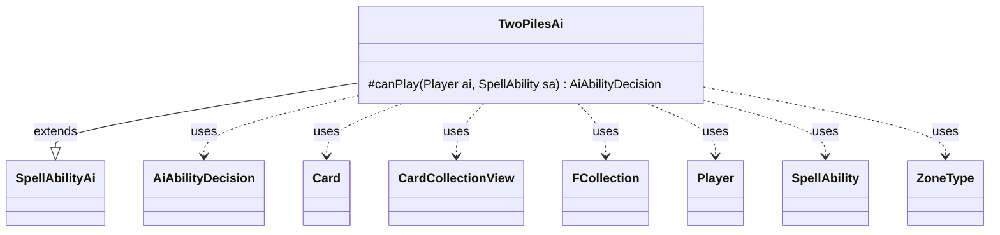

---
aliases:
  - TwoPilesAi
tags:
  - java/class
  - module/forge-ai
  - pkg/forge/ai/ability
fqn: forge.ai.ability.TwoPilesAi
package: forge.ai.ability
module: forge-ai
kind: Class
---

# TwoPilesAi

**Package:** `forge.ai.ability`   **Module:** `forge-ai`   **Kind:** Class



## Relationships
**Extends:**
- [[forge.ai.SpellAbilityAi|SpellAbilityAi]]
**Uses:**
- [[forge.ai.AiAbilityDecision|AiAbilityDecision]]
- [[forge.game.card.Card|Card]]
- [[forge.game.card.CardCollectionView|CardCollectionView]]
- [[forge.game.player.Player|Player]]
- [[forge.game.spellability.SpellAbility|SpellAbility]]
- [[forge.game.zone.ZoneType|ZoneType]]
- [[forge.util.collect.FCollection|FCollection]]


## Design Description

TwoPilesAi is the AI decision component for "two piles" division abilities, where one player partitions a card pool into two groups and an opponent selects which to keep. Extending `SpellAbilityAi`, it overrides `canPlay` to judge whether the computer should activate the ability, returning an `AiAbilityDecision` that couples a score with an `AiPlayDecision` verdict. It resolves the target player and card pool from the ability's `Zone`, `Defined`, `DefinedCards`, and `ValidCards` parameters—preferring an opponent via `AiAttackController` when targeting is used—then filters the pool through `CardLists`.

The heuristic is intentionally minimal and stateless: it commits to play (score 100, `WillPlay`) only when more than two cards qualify, since splitting a smaller pool yields no meaningful advantage. Collaborations with `Card`, `Player`, `CardCollectionView`, `ZoneType`, and `FCollection` are limited to reading game state and assigning targets.

## Source
`forge-ai/src/main/java/forge/ai/ability/TwoPilesAi.java`

```java
package forge.ai.ability;

import forge.ai.AiAbilityDecision;
import forge.ai.AiAttackController;
import forge.ai.AiPlayDecision;
import forge.ai.SpellAbilityAi;
import forge.game.ability.AbilityUtils;
import forge.game.card.Card;
import forge.game.card.CardCollectionView;
import forge.game.card.CardLists;
import forge.game.player.Player;
import forge.game.spellability.SpellAbility;
import forge.game.zone.ZoneType;
import forge.util.collect.FCollection;

import java.util.List;

public class TwoPilesAi extends SpellAbilityAi {
    @Override
    protected AiAbilityDecision canPlay(Player ai, SpellAbility sa) {
        final Card card = sa.getHostCard();
        ZoneType zone = null;

        if (sa.hasParam("Zone")) {
            zone = ZoneType.smartValueOf(sa.getParam("Zone"));
        }

        final String valid = sa.getParamOrDefault("ValidCards", "");

        final Player opp = AiAttackController.choosePreferredDefenderPlayer(ai);

        if (sa.usesTargeting()) {
            sa.resetTargets();
            if (sa.canTarget(opp)) {
                sa.getTargets().add(opp);
            } else {
                return new AiAbilityDecision(0, AiPlayDecision.CantPlayAi);
            }
        }

        final List<Player> tgtPlayers = sa.usesTargeting() && !sa.hasParam("Defined")
                ? new FCollection<>(sa.getTargets().getTargetPlayers())
                : AbilityUtils.getDefinedPlayers(card, sa.getParam("Defined"), sa);

        final Player p = tgtPlayers.get(0);
        CardCollectionView pool;
        if (sa.hasParam("DefinedCards")) {
            pool = AbilityUtils.getDefinedCards(card, sa.getParam("DefinedCards"), sa);
        } else {
            pool = p.getCardsIn(zone);
        }
        pool = CardLists.getValidCards(pool, valid, card.getController(), card, sa);
        int size = pool.size();
        if (size > 2) {
            return new AiAbilityDecision(100, AiPlayDecision.WillPlay);
        } else {
            return new AiAbilityDecision(0, AiPlayDecision.CantPlayAi);
        }
    }
}
```

## Python
`forge/ai/ability/TwoPilesAi.py`

```python
from forge.ai.AiAbilityDecision import AiAbilityDecision
from forge.ai.AiAttackController import AiAttackController
from forge.ai.AiPlayDecision import AiPlayDecision
from forge.ai.SpellAbilityAi import SpellAbilityAi
from forge.game.ability.AbilityUtils import AbilityUtils
from forge.game.card.Card import Card
from forge.game.card.CardCollectionView import CardCollectionView
from forge.game.card.CardLists import CardLists
from forge.game.player.Player import Player
from forge.game.spellability.SpellAbility import SpellAbility
from forge.game.zone.ZoneType import ZoneType
from forge.util.collect.FCollection import FCollection


class TwoPilesAi(SpellAbilityAi):
    def canPlay(self, ai: Player, sa: SpellAbility) -> AiAbilityDecision:
        card = sa.getHostCard()
        zone = None

        if sa.hasParam("Zone"):
            zone = ZoneType.smartValueOf(sa.getParam("Zone"))

        valid = sa.getParamOrDefault("ValidCards", "")

        opp = AiAttackController.choosePreferredDefenderPlayer(ai)

        if sa.usesTargeting():
            sa.resetTargets()
            if sa.canTarget(opp):
                sa.getTargets().add(opp)
            else:
                return AiAbilityDecision(0, AiPlayDecision.CantPlayAi)

        tgtPlayers = (FCollection(sa.getTargets().getTargetPlayers())
                      if sa.usesTargeting() and not sa.hasParam("Defined")
                      else AbilityUtils.getDefinedPlayers(card, sa.getParam("Defined"), sa))

        p = tgtPlayers[0]
        if sa.hasParam("DefinedCards"):
            pool = AbilityUtils.getDefinedCards(card, sa.getParam("DefinedCards"), sa)
        else:
            pool = p.getCardsIn(zone)
        pool = CardLists.getValidCards(pool, valid, card.getController(), card, sa)
        size = pool.size()
        if size > 2:
            return AiAbilityDecision(100, AiPlayDecision.WillPlay)
        else:
            return AiAbilityDecision(0, AiPlayDecision.CantPlayAi)
```
