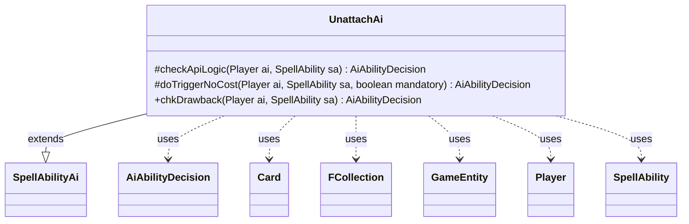

---
aliases:
  - UnattachAi
tags:
  - java/class
  - module/forge-ai
  - pkg/forge/ai/ability
fqn: forge.ai.ability.UnattachAi
package: forge.ai.ability
module: forge-ai
kind: Class
---

# UnattachAi

**Package:** `forge.ai.ability`   **Module:** `forge-ai`   **Kind:** Class



## Relationships
**Extends:**
- [[forge.ai.SpellAbilityAi|SpellAbilityAi]]
**Uses:**
- [[forge.ai.AiAbilityDecision|AiAbilityDecision]]
- [[forge.game.GameEntity|GameEntity]]
- [[forge.game.card.Card|Card]]
- [[forge.game.player.Player|Player]]
- [[forge.game.spellability.SpellAbility|SpellAbility]]
- [[forge.util.collect.FCollection|FCollection]]


## Design Description

UnattachAi provides the AI's decision logic for spell abilities that detach an Equipment, Aura, or Fortification from a game entity. Extending `SpellAbilityAi`, it overrides the framework's evaluation hooks—`checkApiLogic`, `doTriggerNoCost`, and `chkDrawback`—each returning an `AiAbilityDecision` that couples a confidence score with an `AiPlayDecision` verdict so the engine can rank and schedule the play.

By design the class never initiates the effect proactively: `checkApiLogic` always returns `CantPlayAi`, signaling that unattaching is only worthwhile as a triggered or drawback effect. In that role, `doTriggerNoCost` resolves non-targeted recipients through `AbilityUtils.getDefinedEntities` into an `FCollection<GameEntity>`, and when the action is non-mandatory it refuses to strip a friendly Equipment controlled by a teammate, otherwise endorsing the play with full confidence. It collaborates with `Card`, `Player`, and `SpellAbility` to inspect host, ownership, and targeting state, and `chkDrawback` simply delegates to the non-mandatory trigger path.

## Source
`forge-ai/src/main/java/forge/ai/ability/UnattachAi.java`

```java
package forge.ai.ability;

import forge.ai.*;
import forge.game.GameEntity;
import forge.game.ability.AbilityUtils;
import forge.game.card.Card;
import forge.game.player.Player;
import forge.game.spellability.SpellAbility;
import forge.util.collect.FCollection;

public class UnattachAi extends SpellAbilityAi {

    /* (non-Javadoc)
     * @see forge.card.abilityfactory.SpellAiLogic#canPlayAI(forge.game.player.Player, java.util.Map, forge.card.spellability.SpellAbility)
     */
    @Override
    protected AiAbilityDecision checkApiLogic(Player ai, SpellAbility sa) {
        return new AiAbilityDecision(0, AiPlayDecision.CantPlayAi);
    }

    /* (non-Javadoc)
     * @see forge.card.abilityfactory.SpellAiLogic#doTriggerAINoCost(forge.game.player.Player, java.util.Map, forge.card.spellability.SpellAbility, boolean)
     */
    @Override
    protected AiAbilityDecision doTriggerNoCost(Player ai, SpellAbility sa, boolean mandatory) {
        final Card host = sa.getHostCard();
        FCollection<GameEntity> targets = new FCollection<>();
        if (!sa.usesTargeting()) {
            targets = AbilityUtils.getDefinedEntities(host, sa.getParam("Defined"), sa);
        }

        if (!mandatory && !targets.isEmpty()) {
            Card attachment = (Card) targets.get(0);
            if (attachment.isEquipment() && ai.getYourTeam().contains(attachment.getController())) {
                return new AiAbilityDecision(0, AiPlayDecision.CantPlayAi);
            }

            // currently no card exists to get rid of curse aura this way
        }

        return new AiAbilityDecision(100, AiPlayDecision.WillPlay);
    }

    @Override
    public AiAbilityDecision chkDrawback(Player ai, SpellAbility sa) {
        return doTriggerNoCost(ai, sa, false);
    }

}
```

## Python
`forge/ai/ability/UnattachAi.py`

```python
from forge.ai.SpellAbilityAi import SpellAbilityAi
from forge.ai.AiAbilityDecision import AiAbilityDecision
from forge.ai.AiPlayDecision import AiPlayDecision
from forge.game.GameEntity import GameEntity
from forge.game.ability.AbilityUtils import AbilityUtils
from forge.game.card.Card import Card
from forge.game.player.Player import Player
from forge.game.spellability.SpellAbility import SpellAbility
from forge.util.collect.FCollection import FCollection


class UnattachAi(SpellAbilityAi):

    # (non-Javadoc)
    # @see forge.card.abilityfactory.SpellAiLogic#canPlayAI(forge.game.player.Player, java.util.Map, forge.card.spellability.SpellAbility)
    def checkApiLogic(self, ai: Player, sa: SpellAbility) -> AiAbilityDecision:
        return AiAbilityDecision(0, AiPlayDecision.CantPlayAi)

    # (non-Javadoc)
    # @see forge.card.abilityfactory.SpellAiLogic#doTriggerAINoCost(forge.game.player.Player, java.util.Map, forge.card.spellability.SpellAbility, boolean)
    def doTriggerNoCost(self, ai: Player, sa: SpellAbility, mandatory: bool) -> AiAbilityDecision:
        host = sa.getHostCard()
        targets = FCollection()
        if not sa.usesTargeting():
            targets = AbilityUtils.getDefinedEntities(host, sa.getParam("Defined"), sa)

        if not mandatory and not targets.isEmpty():
            attachment = targets.get(0)
            if attachment.isEquipment() and ai.getYourTeam().contains(attachment.getController()):
                return AiAbilityDecision(0, AiPlayDecision.CantPlayAi)

            # currently no card exists to get rid of curse aura this way

        return AiAbilityDecision(100, AiPlayDecision.WillPlay)

    def chkDrawback(self, ai: Player, sa: SpellAbility) -> AiAbilityDecision:
        return self.doTriggerNoCost(ai, sa, False)
```
