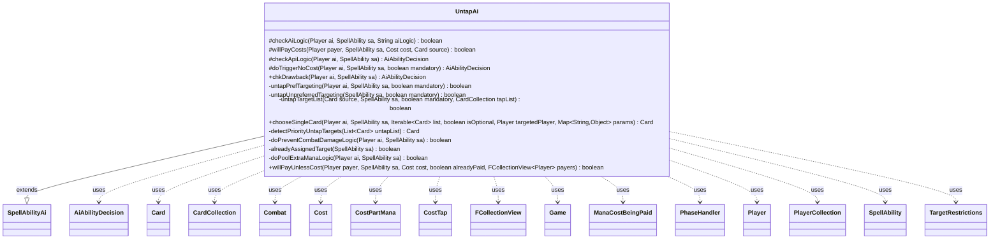

---
aliases:
  - UntapAi
tags:
  - java/class
  - module/forge-ai
  - pkg/forge/ai/ability
fqn: forge.ai.ability.UntapAi
package: forge.ai.ability
module: forge-ai
kind: Class
---

# UntapAi

**Package:** `forge.ai.ability`   **Module:** `forge-ai`   **Kind:** Class



## Relationships
**Extends:**
- [[forge.ai.SpellAbilityAi|SpellAbilityAi]]
**Uses:**
- [[forge.ai.AiAbilityDecision|AiAbilityDecision]]
- [[forge.game.Game|Game]]
- [[forge.game.card.Card|Card]]
- [[forge.game.card.CardCollection|CardCollection]]
- [[forge.game.combat.Combat|Combat]]
- [[forge.game.cost.Cost|Cost]]
- [[forge.game.cost.CostPartMana|CostPartMana]]
- [[forge.game.cost.CostTap|CostTap]]
- [[forge.game.mana.ManaCostBeingPaid|ManaCostBeingPaid]]
- [[forge.game.phase.PhaseHandler|PhaseHandler]]
- [[forge.game.player.Player|Player]]
- [[forge.game.player.PlayerCollection|PlayerCollection]]
- [[forge.game.spellability.SpellAbility|SpellAbility]]
- [[forge.game.spellability.TargetRestrictions|TargetRestrictions]]
- [[forge.util.collect.FCollectionView|FCollectionView]]


## Design Description

UntapAi is the AI controller for the "Untap" spell ability, deciding when and how the computer player should play effects that untap permanents. As a concrete subclass of `SpellAbilityAi`, it overrides the standard decision hooks — `checkApiLogic`, `doTriggerNoCost`, `chkDrawback`, `willPayCosts`, `chooseSingleCard`, and `willPayUnlessCost` — returning `AiAbilityDecision` verdicts that gate play and cost payment.

Its central concern is target selection: preferred targeting favors the AI's own tapped, non-self-untapping permanents while explicitly guarding against infinite untap recursion, with an unpreferred fallback chain for mandatory plays. It collaborates closely with the game model (`Card`/`CardCollection`, `Player`, `Combat`, `PhaseHandler`, `Cost` types) and delegates evaluation to the `ComputerUtil*` helpers. Notable design intent appears in the dispatch on named `AILogic` strings (`PoolExtraMana`, `PreventCombatDamage`) and the phase- and combat-aware heuristics handling mana ramp and combat-damage prevention for specific cards.

## Source
`forge-ai/src/main/java/forge/ai/ability/UntapAi.java`

```java
package forge.ai.ability;

import java.util.List;
import java.util.Map;

import forge.ai.AiAbilityDecision;
import forge.ai.AiPlayDecision;
import forge.ai.ComputerUtil;
import forge.ai.ComputerUtilAbility;
import forge.ai.ComputerUtilCard;
import forge.ai.ComputerUtilCombat;
import forge.ai.ComputerUtilCost;
import forge.ai.ComputerUtilMana;
import forge.ai.SpellAbilityAi;
import forge.card.mana.ManaCostShard;
import forge.game.Game;
import forge.game.ability.AbilityUtils;
import forge.game.ability.ApiType;
import forge.game.card.Card;
import forge.game.card.CardCollection;
import forge.game.card.CardLists;
import forge.game.card.CardPredicates;
import forge.game.combat.Combat;
import forge.game.cost.Cost;
import forge.game.cost.CostPartMana;
import forge.game.cost.CostTap;
import forge.game.mana.ManaCostBeingPaid;
import forge.game.phase.PhaseHandler;
import forge.game.phase.PhaseType;
import forge.game.player.Player;
import forge.game.player.PlayerCollection;
import forge.game.spellability.SpellAbility;
import forge.game.spellability.TargetRestrictions;
import forge.game.zone.ZoneType;
import forge.util.collect.FCollectionView;

public class UntapAi extends SpellAbilityAi {
    @Override
    protected boolean checkAiLogic(final Player ai, final SpellAbility sa, final String aiLogic) {
        if ("PoolExtraMana".equals(aiLogic)) {
            return doPoolExtraManaLogic(ai, sa);
        }
        if ("PreventCombatDamage".equals(aiLogic)) {
            return doPreventCombatDamageLogic(ai, sa);
            // In the future if you want to give Pseudo vigilance to a creature you attacked with
            // activate during your own during the end of combat step
        }

        return super.checkAiLogic(ai, sa, aiLogic);
    }

    @Override
    protected boolean willPayCosts(final Player payer, final SpellAbility sa, final Cost cost, final Card source) {
        if (!ComputerUtilCost.checkAddM1M1CounterCost(cost, source)) {
            return false;
        }

        return ComputerUtilCost.checkDiscardCost(payer, cost, source, sa);
    }

    @Override
    protected AiAbilityDecision checkApiLogic(Player ai, SpellAbility sa) {
        final Card source = sa.getHostCard();

        if (sa.usesTargeting()) {
            if (untapPrefTargeting(ai, sa, false)) {
                return new AiAbilityDecision(100, AiPlayDecision.WillPlay);
            }
            return new AiAbilityDecision(0, AiPlayDecision.TargetingFailed);
        }

        final List<Card> pDefined = AbilityUtils.getDefinedCards(source, sa.getParam("Defined"), sa);
        if (pDefined.isEmpty() || (pDefined.get(0).isTapped() && pDefined.get(0).getController() == ai)) {
            // If the defined card is tapped, or if there are no defined cards, we can play this ability
            return new AiAbilityDecision(100, AiPlayDecision.WillPlay);
        }
        return new AiAbilityDecision(0, AiPlayDecision.MissingNeededCards);
    }

    @Override
    protected AiAbilityDecision doTriggerNoCost(Player ai, SpellAbility sa, boolean mandatory) {
        if (!sa.usesTargeting()) {
            if (mandatory) {
                return new AiAbilityDecision(100, AiPlayDecision.WillPlay);
            }
            if ("Never".equals(sa.getParam("AILogic"))) {
                return new AiAbilityDecision(0, AiPlayDecision.CantPlayAi);
            }

            final List<Card> pDefined = AbilityUtils.getDefinedCards(sa.getHostCard(), sa.getParam("Defined"), sa);
            if (pDefined.isEmpty() || (pDefined.get(0).isTapped() && pDefined.get(0).getController() == ai)) {
                return new AiAbilityDecision(100, AiPlayDecision.WillPlay);
            }
            return new AiAbilityDecision(0, AiPlayDecision.MissingNeededCards);
        } else if (untapPrefTargeting(ai, sa, mandatory)) {
            return new AiAbilityDecision(100, AiPlayDecision.WillPlay);
        } else if (mandatory) {
            // not enough preferred targets, but mandatory so keep going:
            if (untapUnpreferredTargeting(sa, mandatory)) {
                return new AiAbilityDecision(50, AiPlayDecision.MandatoryPlay);
            }
            return new AiAbilityDecision(0, AiPlayDecision.CantPlayAi);
        }

        return new AiAbilityDecision(0, AiPlayDecision.CantPlayAi);
    }

    @Override
    public AiAbilityDecision chkDrawback(Player ai, SpellAbility sa) {
        if (!sa.usesTargeting()) {
            // who cares if its already untapped, it's only a subability?
        } else {
            if (!untapPrefTargeting(ai, sa, false)) {
                return new AiAbilityDecision(0, AiPlayDecision.CantPlayAi);
            }
        }

        return new AiAbilityDecision(100, AiPlayDecision.WillPlay);
    }

    /**
     * <p>
     * untapPrefTargeting.
     * </p>
     * 
     * @param sa
     *            a {@link forge.game.spellability.SpellAbility} object.
     * @param mandatory
     *            a boolean.
     * @return a boolean.
     */
    private static boolean untapPrefTargeting(final Player ai, final SpellAbility sa, final boolean mandatory) {
        final Card source = sa.getHostCard();

        if (alreadyAssignedTarget(sa)) {
            if (sa.getTargets().size() > 0) {
                // If we selected something lets assume its valid
                return true;
            }
        }
        sa.resetTargets();

        final PlayerCollection targetController;
        if (sa.isCurse() || (sa.getSubAbility() != null && sa.getSubAbility().getApi() == ApiType.GainControl)) {
            targetController = ai.getOpponents();
        } else {
            targetController = ai.getYourTeam();
        }

        CardCollection list = CardLists.getTargetableCards(targetController.getCardsIn(ZoneType.Battlefield), sa);

        if (!sa.isCurse()) {
            list = ComputerUtil.getSafeTargets(ai, sa, list);
        }

        if (list.isEmpty()) {
            return false;
        }

        // For some abilities, it may be worth to target even an untapped card if we're targeting mostly for the subability
        boolean targetUntapped = false;
        if (sa.getSubAbility() != null) {
            SpellAbility subSa = sa.getSubAbility();
            if (subSa.getApi() == ApiType.RemoveFromCombat && "RemoveBestAttacker".equals(subSa.getParam("AILogic"))) {
                targetUntapped = true;
                Combat combat = ai.getGame().getCombat();
                if (combat == null) {
                    return false;
                }
                list = CardLists.filter(list, c -> combat.isAttacking(c, ai));
                if (list.isEmpty()) {
                    return false;
                }
            }
        }

        CardCollection untapList = targetUntapped ? list : CardLists.filter(list, CardPredicates.TAPPED);
        // filter out enchantments and planeswalkers, their tapped state doesn't matter.
        final String[] tappablePermanents = {"Creature", "Land", "Artifact"};
        untapList = CardLists.getValidCards(untapList, tappablePermanents, source.getController(), source, sa);

        // Try to avoid potential infinite recursion,
        // e.g. Kiora's Follower untapping another Kiora's Follower and repeating infinitely
        if (sa.getPayCosts().hasOnlySpecificCostType(CostTap.class)) {
            CardCollection toRemove = new CardCollection();
            for (Card c : untapList) {
                for (SpellAbility ab : c.getAllSpellAbilities()) {
                    if (ab.getApi() == ApiType.Untap
                            && ab.getPayCosts().hasOnlySpecificCostType(CostTap.class)
                            && ab.canTarget(source)) {
                        toRemove.add(c);
                        break;
                    }
                }
            }
            untapList.removeAll(toRemove);
        }

        //try to exclude things that will already be untapped due to something on stack or because something is
        //already targeted in a parent or sub SA
        if (!sa.isTrigger() || mandatory) { // but if just confirming trigger no need to look for other targets and might still help anyway
            CardCollection toExclude = ComputerUtilAbility.getCardsTargetedWithApi(ai, untapList, sa, ApiType.Untap);
            untapList.removeAll(toExclude);
        }

        while (sa.canAddMoreTarget()) {
            Card choice = null;

            if (untapList.isEmpty()) {
                // Animate untapped lands (Koth of the Hammer)
                if (sa.getSubAbility() != null && sa.getSubAbility().getApi() == ApiType.Animate && !list.isEmpty()
                        && ai.getGame().getPhaseHandler().getPhase().isBefore(PhaseType.COMBAT_DECLARE_ATTACKERS)) {
                    choice = ComputerUtilCard.getWorstPermanentAI(list, false, false, false, false);
                } else if (!sa.isMinTargetChosen() || sa.isZeroTargets()) {
                    // check if the cost is acceptable anyway (e.g. Planeswalker +Loyalty)
                    if (ComputerUtil.activateForCost(sa, ai)) {
                        return true;
                    }
                    sa.resetTargets();
                    return false;
                } else {
                    // TODO is this good enough? for up to amounts?
                    break;
                }
            } else {
                choice = detectPriorityUntapTargets(untapList);

                if (choice == null) {
                    if (CardLists.getNotType(untapList, "Creature").isEmpty()) {
                        choice = ComputerUtilCard.getBestCreatureAI(untapList); // if only creatures take the best
                    } else if (!sa.getPayCosts().hasManaCost() || sa.isTrigger()
                            || "Always".equals(sa.getParam("AILogic"))) {
                        choice = ComputerUtilCard.getMostExpensivePermanentAI(untapList);
                    }
                }
            }

            if (choice == null) { // can't find anything left
                if (!sa.isMinTargetChosen() || sa.isZeroTargets()) {
                    sa.resetTargets();
                    return false;
                } else {
                    // TODO is this good enough? for up to amounts?
                    break;
                }
            }

            untapList.remove(choice);
            list.remove(choice);
            // TODO ComputerUtilCard.willUntap(ai, choice)
            sa.getTargets().add(choice);
        }
        return true;
    }

    /**
     * <p>
     * untapUnpreferredTargeting.
     * </p>
     *
     * @param sa
     *            a {@link forge.game.spellability.SpellAbility} object.
     * @param mandatory
     *            a boolean.
     * @return a boolean.
     */
    private boolean untapUnpreferredTargeting(final SpellAbility sa, final boolean mandatory) {
        final Card source = sa.getHostCard();
        final TargetRestrictions tgt = sa.getTargetRestrictions();

        CardCollection list = CardLists.getTargetableCards(source.getGame().getCardsIn(ZoneType.Battlefield), sa);

        // filter by enchantments and planeswalkers, their tapped state doesn't matter.
        final String[] tappablePermanents = { "Enchantment", "Planeswalker" };
        CardCollection tapList = CardLists.getValidCards(list, tappablePermanents, source.getController(), source, sa);

        if (untapTargetList(source, sa, mandatory, tapList)) {
            return true;
        }

        // try to just tap already tapped things
        tapList = CardLists.filter(list, CardPredicates.UNTAPPED);

        if (untapTargetList(source, sa, mandatory, tapList)) {
            return true;
        }

        // just tap whatever we can
        tapList = list;

        return untapTargetList(source, sa, mandatory, tapList);
    }

    private boolean untapTargetList(final Card source, final SpellAbility sa, final boolean mandatory,
            final CardCollection tapList) {
        tapList.removeAll(sa.getTargets().getTargetCards());

        if (tapList.isEmpty()) {
            return false;
        }

        while (sa.canAddMoreTarget()) {
            Card choice = null;

            if (tapList.isEmpty()) {
                if (sa.getTargets().size() < sa.getMinTargets() || sa.getTargets().size() == 0) {
                    if (!mandatory) {
                        sa.resetTargets();
                    }
                    return false;
                } else {
                    // TODO is this good enough? for up to amounts?
                    break;
                }
            }

            choice = ComputerUtilCard.getBestAI(tapList);

            if (choice == null) { // can't find anything left
                if (sa.getTargets().size() < sa.getMinTargets() || sa.getTargets().size() == 0) {
                    if (!mandatory) {
                        sa.resetTargets();
                    }
                    return false;
                } else {
                    // TODO is this good enough? for up to amounts?
                    break;
                }
            }

            tapList.remove(choice);
            sa.getTargets().add(choice);
        }

        return true;
    }

    @Override
    public Card chooseSingleCard(Player ai, SpellAbility sa, Iterable<Card> list, boolean isOptional, Player targetedPlayer, Map<String, Object> params) {
        CardCollection filteredList = CardLists.filterControlledBy(list, ai.getYourTeam());
        if (!filteredList.isEmpty()) {
            return ComputerUtilCard.getBestAI(filteredList);
        }
        if (isOptional) {
            return null;
        }
        return ComputerUtilCard.getWorstAI(list);
    }

    private static Card detectPriorityUntapTargets(final List<Card> untapList) {
        // See if there are cards that are *especially* worth untapping, like Time Vault
        for (Card c : untapList) {
            if ("True".equals(c.getSVar("UntapMe"))) {
                return c;
            }
        }

        // See if there's anything to untap that is tapped and that doesn't untap during the next untap step by itself
        CardCollection noAutoUntap = CardLists.filter(untapList, c -> !c.canUntap(c.getController(), true));
        if (!noAutoUntap.isEmpty()) {
            return ComputerUtilCard.getBestAI(noAutoUntap);
        }

        return null;
    }

    private boolean doPreventCombatDamageLogic(final Player ai, final SpellAbility sa) {
        // Only Maze of Ith and Maze of Shadows uses this. Feel free to use it aggressively.
        Game game = ai.getGame();
        sa.resetTargets();

        if (!game.getPhaseHandler().getPlayerTurn().isOpponentOf(ai)) {
            return false;
        }

        Combat activeCombat = game.getCombat();
        if (activeCombat == null) {
            return false;
        }

        CardCollection list = CardLists.getTargetableCards(activeCombat.getAttackers(), sa);
        list = CardLists.filter(list, c -> activeCombat.isAttacking(c, ai));

        if (list.isEmpty()) {
            return false;
        }

        if (game.getPhaseHandler().is(PhaseType.COMBAT_DECLARE_BLOCKERS)) {
            // Blockers already set. Are there any dangerous unblocked creatures? Sort by creature that will deal the most damage?
            Card card = ComputerUtilCombat.mostDangerousAttacker(list, ai, activeCombat, true);

            if (card == null) { return false; }

            sa.getTargets().add(card);
            return true;
        }

        return false;
    }

    private static boolean alreadyAssignedTarget(final SpellAbility sa) {
        if (sa.hasParam("AILogic")) {
            String aiLogic = sa.getParam("AILogic");
            return "PreventCombatDamage".equals(aiLogic);
        }
        return false;
    }

    private boolean doPoolExtraManaLogic(final Player ai, final SpellAbility sa) {
        final Card source = sa.getHostCard();
        final PhaseHandler ph = source.getGame().getPhaseHandler();
        final Game game = ai.getGame();

        if (source.isTapped()) {
            return true;
        }

        // Check if something is playable if we untap for an additional mana with this, then proceed
        CardCollection inHand = CardLists.filter(ai.getCardsIn(ZoneType.Hand), CardPredicates.NON_LANDS);
        // The AI is not very good at timing non-permanent spells this way, so filter them out
        // (it may actually be possible to enable this for sorceries, but that'll need some canPlay shenanigans)
        CardCollection playable = CardLists.filter(inHand, CardPredicates.PERMANENTS);

        CardCollection untappingCards = CardLists.filter(ai.getCardsIn(ZoneType.Battlefield), card -> {
            boolean hasUntapLandLogic = false;
            for (SpellAbility sa1 : card.getSpellAbilities()) {
                if ("PoolExtraMana".equals(sa1.getParam("AILogic"))) {
                    hasUntapLandLogic = true;
                    break;
                }
            }
            return hasUntapLandLogic && card.isUntapped();
        });

        // TODO: currently limited to Main 2, somehow improve to let the AI use this SA at other time?
        if (ph.is(PhaseType.MAIN2, ai)) {
            for (Card c : playable) {
                for (SpellAbility ab : c.getBasicSpells()) {
                    if (!ComputerUtilMana.hasEnoughManaSourcesToCast(ab, ai)) {
                        // TODO: Currently limited to predicting something that can be paid with any color,
                        // can ideally be improved to work by color.
                        ManaCostBeingPaid reduced = new ManaCostBeingPaid(ab.getPayCosts().getCostMana().getManaCostFor(ab));
                        reduced.decreaseShard(ManaCostShard.GENERIC, untappingCards.size());
                        if (ComputerUtilMana.canPayManaCost(reduced, ab, ai, false)) {
                            CardCollection manaLandsTapped = CardLists.filter(ai.getCardsIn(ZoneType.Battlefield),
                                    CardPredicates.LANDS_PRODUCING_MANA, CardPredicates.TAPPED);
                            manaLandsTapped = CardLists.getValidCards(manaLandsTapped, sa.getParam("ValidTgts"), ai, source, null);

                            if (!manaLandsTapped.isEmpty()) {
                                // already have a tapped land, so agree to proceed with untapping it
                                return true;
                            }

                            // pool one additional mana by tapping a land to try to ramp to something
                            CardCollection manaLands = CardLists.filter(ai.getCardsIn(ZoneType.Battlefield),
                                    CardPredicates.LANDS_PRODUCING_MANA, CardPredicates.CAN_TAP);
                            manaLands = CardLists.getValidCards(manaLands, sa.getParam("ValidTgts"), ai, source, null);

                            if (manaLands.isEmpty()) {
                                // nothing to untap
                                return false;
                            }

                            Card landToPool = manaLands.getFirst();
                            SpellAbility manaAb = landToPool.getManaAbilities().getFirst();

                            ComputerUtil.playNoStack(ai, manaAb, game, false);

                            return true;
                        }
                    }
                }
            }
        }

        // no harm in doing this past declare blockers during the opponent's turn and right before our turn,
        // maybe we'll serendipitously untap into something like a removal spell or burn spell that'll help
        return ph.getNextTurn() == ai
                && (ph.is(PhaseType.COMBAT_DECLARE_BLOCKERS) || ph.getPhase().isAfter(PhaseType.COMBAT_DECLARE_BLOCKERS));
    }

    @Override
    public boolean willPayUnlessCost(Player payer, SpellAbility sa, Cost cost, boolean alreadyPaid, FCollectionView<Player> payers) {
        // Paralyze effects
        if (sa.hasParam("UnlessSwitched")) {
            final Card host = sa.getHostCard();
            final Game game = host.getGame();
            for (Card card : AbilityUtils.getDefinedCards(host, null, sa)) {
                final Card gameCard = game.getCardState(card, null);
                if (gameCard == null
                        || !gameCard.isInPlay() // not in play
                        || gameCard.isUntapped() // already untapped
                        ) {
                    return false;
                }

                // if the ManaCost would cost more than the creatures CMC, it is not worth it
                CostPartMana mana = cost.getCostMana();
                if (mana != null && mana.getManaCostFor(sa).getCMC() > card.getCMC()) {
                    return false;
                }
            }
        }

        return super.willPayUnlessCost(payer, sa, cost, alreadyPaid, payers);
    }
}
```

## Python
`forge/ai/ability/UntapAi.py`

```python
from typing import List, Map

from forge.ai.AiAbilityDecision import AiAbilityDecision
from forge.ai.AiPlayDecision import AiPlayDecision
from forge.ai.ComputerUtil import ComputerUtil
from forge.ai.ComputerUtilAbility import ComputerUtilAbility
from forge.ai.ComputerUtilCard import ComputerUtilCard
from forge.ai.ComputerUtilCombat import ComputerUtilCombat
from forge.ai.ComputerUtilCost import ComputerUtilCost
from forge.ai.ComputerUtilMana import ComputerUtilMana
from forge.ai.SpellAbilityAi import SpellAbilityAi
from forge.card.mana.ManaCostShard import ManaCostShard
from forge.game.Game import Game
from forge.game.ability.AbilityUtils import AbilityUtils
from forge.game.ability.ApiType import ApiType
from forge.game.card.Card import Card
from forge.game.card.CardCollection import CardCollection
from forge.game.card.CardLists import CardLists
from forge.game.card.CardPredicates import CardPredicates
from forge.game.combat.Combat import Combat
from forge.game.cost.Cost import Cost
from forge.game.cost.CostPartMana import CostPartMana
from forge.game.cost.CostTap import CostTap
from forge.game.mana.ManaCostBeingPaid import ManaCostBeingPaid
from forge.game.phase.PhaseHandler import PhaseHandler
from forge.game.phase.PhaseType import PhaseType
from forge.game.player.Player import Player
from forge.game.player.PlayerCollection import PlayerCollection
from forge.game.spellability.SpellAbility import SpellAbility
from forge.game.spellability.TargetRestrictions import TargetRestrictions
from forge.game.zone.ZoneType import ZoneType
from forge.util.collect.FCollectionView import FCollectionView


class UntapAi(SpellAbilityAi):
    def checkAiLogic(self, ai: Player, sa: SpellAbility, aiLogic: str) -> bool:
        if "PoolExtraMana" == aiLogic:
            return self.doPoolExtraManaLogic(ai, sa)
        if "PreventCombatDamage" == aiLogic:
            return self.doPreventCombatDamageLogic(ai, sa)
            # In the future if you want to give Pseudo vigilance to a creature you attacked with
            # activate during your own during the end of combat step

        return super().checkAiLogic(ai, sa, aiLogic)

    def willPayCosts(self, payer: Player, sa: SpellAbility, cost: Cost, source: Card) -> bool:
        if not ComputerUtilCost.checkAddM1M1CounterCost(cost, source):
            return False

        return ComputerUtilCost.checkDiscardCost(payer, cost, source, sa)

    def checkApiLogic(self, ai: Player, sa: SpellAbility) -> AiAbilityDecision:
        source = sa.getHostCard()

        if sa.usesTargeting():
            if UntapAi.untapPrefTargeting(ai, sa, False):
                return AiAbilityDecision(100, AiPlayDecision.WillPlay)
            return AiAbilityDecision(0, AiPlayDecision.TargetingFailed)

        pDefined = AbilityUtils.getDefinedCards(source, sa.getParam("Defined"), sa)
        if pDefined.isEmpty() or (pDefined.get(0).isTapped() and pDefined.get(0).getController() == ai):
            # If the defined card is tapped, or if there are no defined cards, we can play this ability
            return AiAbilityDecision(100, AiPlayDecision.WillPlay)
        return AiAbilityDecision(0, AiPlayDecision.MissingNeededCards)

    def doTriggerNoCost(self, ai: Player, sa: SpellAbility, mandatory: bool) -> AiAbilityDecision:
        if not sa.usesTargeting():
            if mandatory:
                return AiAbilityDecision(100, AiPlayDecision.WillPlay)
            if "Never" == sa.getParam("AILogic"):
                return AiAbilityDecision(0, AiPlayDecision.CantPlayAi)

            pDefined = AbilityUtils.getDefinedCards(sa.getHostCard(), sa.getParam("Defined"), sa)
            if pDefined.isEmpty() or (pDefined.get(0).isTapped() and pDefined.get(0).getController() == ai):
                return AiAbilityDecision(100, AiPlayDecision.WillPlay)
            return AiAbilityDecision(0, AiPlayDecision.MissingNeededCards)
        elif UntapAi.untapPrefTargeting(ai, sa, mandatory):
            return AiAbilityDecision(100, AiPlayDecision.WillPlay)
        elif mandatory:
            # not enough preferred targets, but mandatory so keep going:
            if self.untapUnpreferredTargeting(sa, mandatory):
                return AiAbilityDecision(50, AiPlayDecision.MandatoryPlay)
            return AiAbilityDecision(0, AiPlayDecision.CantPlayAi)

        return AiAbilityDecision(0, AiPlayDecision.CantPlayAi)

    def chkDrawback(self, ai: Player, sa: SpellAbility) -> AiAbilityDecision:
        if not sa.usesTargeting():
            # who cares if its already untapped, it's only a subability?
            pass
        else:
            if not UntapAi.untapPrefTargeting(ai, sa, False):
                return AiAbilityDecision(0, AiPlayDecision.CantPlayAi)

        return AiAbilityDecision(100, AiPlayDecision.WillPlay)

    @staticmethod
    def untapPrefTargeting(ai: Player, sa: SpellAbility, mandatory: bool) -> bool:
        source = sa.getHostCard()

        if UntapAi.alreadyAssignedTarget(sa):
            if sa.getTargets().size() > 0:
                # If we selected something lets assume its valid
                return True
        sa.resetTargets()

        if sa.isCurse() or (sa.getSubAbility() is not None and sa.getSubAbility().getApi() == ApiType.GainControl):
            targetController = ai.getOpponents()
        else:
            targetController = ai.getYourTeam()

        list = CardLists.getTargetableCards(targetController.getCardsIn(ZoneType.Battlefield), sa)

        if not sa.isCurse():
            list = ComputerUtil.getSafeTargets(ai, sa, list)

        if list.isEmpty():
            return False

        # For some abilities, it may be worth to target even an untapped card if we're targeting mostly for the subability
        targetUntapped = False
        if sa.getSubAbility() is not None:
            subSa = sa.getSubAbility()
            if subSa.getApi() == ApiType.RemoveFromCombat and "RemoveBestAttacker" == subSa.getParam("AILogic"):
                targetUntapped = True
                combat = ai.getGame().getCombat()
                if combat is None:
                    return False
                list = CardLists.filter(list, lambda c: combat.isAttacking(c, ai))
                if list.isEmpty():
                    return False

        untapList = list if targetUntapped else CardLists.filter(list, CardPredicates.TAPPED)
        # filter out enchantments and planeswalkers, their tapped state doesn't matter.
        tappablePermanents = ["Creature", "Land", "Artifact"]
        untapList = CardLists.getValidCards(untapList, tappablePermanents, source.getController(), source, sa)

        # Try to avoid potential infinite recursion,
        # e.g. Kiora's Follower untapping another Kiora's Follower and repeating infinitely
        if sa.getPayCosts().hasOnlySpecificCostType(CostTap):
            toRemove = CardCollection()
            for c in untapList:
                for ab in c.getAllSpellAbilities():
                    if (ab.getApi() == ApiType.Untap
                            and ab.getPayCosts().hasOnlySpecificCostType(CostTap)
                            and ab.canTarget(source)):
                        toRemove.add(c)
                        break
            untapList.removeAll(toRemove)

        # try to exclude things that will already be untapped due to something on stack or because something is
        # already targeted in a parent or sub SA
        if not sa.isTrigger() or mandatory:  # but if just confirming trigger no need to look for other targets and might still help anyway
            toExclude = ComputerUtilAbility.getCardsTargetedWithApi(ai, untapList, sa, ApiType.Untap)
            untapList.removeAll(toExclude)

        while sa.canAddMoreTarget():
            choice = None

            if untapList.isEmpty():
                # Animate untapped lands (Koth of the Hammer)
                if (sa.getSubAbility() is not None and sa.getSubAbility().getApi() == ApiType.Animate and not list.isEmpty()
                        and ai.getGame().getPhaseHandler().getPhase().isBefore(PhaseType.COMBAT_DECLARE_ATTACKERS)):
                    choice = ComputerUtilCard.getWorstPermanentAI(list, False, False, False, False)
                elif not sa.isMinTargetChosen() or sa.isZeroTargets():
                    # check if the cost is acceptable anyway (e.g. Planeswalker +Loyalty)
                    if ComputerUtil.activateForCost(sa, ai):
                        return True
                    sa.resetTargets()
                    return False
                else:
                    # TODO is this good enough? for up to amounts?
                    break
            else:
                choice = UntapAi.detectPriorityUntapTargets(untapList)

                if choice is None:
                    if CardLists.getNotType(untapList, "Creature").isEmpty():
                        choice = ComputerUtilCard.getBestCreatureAI(untapList)  # if only creatures take the best
                    elif (not sa.getPayCosts().hasManaCost() or sa.isTrigger()
                            or "Always" == sa.getParam("AILogic")):
                        choice = ComputerUtilCard.getMostExpensivePermanentAI(untapList)

            if choice is None:  # can't find anything left
                if not sa.isMinTargetChosen() or sa.isZeroTargets():
                    sa.resetTargets()
                    return False
                else:
                    # TODO is this good enough? for up to amounts?
                    break

            untapList.remove(choice)
            list.remove(choice)
            # TODO ComputerUtilCard.willUntap(ai, choice)
            sa.getTargets().add(choice)
        return True

    def untapUnpreferredTargeting(self, sa: SpellAbility, mandatory: bool) -> bool:
        source = sa.getHostCard()
        tgt = sa.getTargetRestrictions()

        list = CardLists.getTargetableCards(source.getGame().getCardsIn(ZoneType.Battlefield), sa)

        # filter by enchantments and planeswalkers, their tapped state doesn't matter.
        tappablePermanents = ["Enchantment", "Planeswalker"]
        tapList = CardLists.getValidCards(list, tappablePermanents, source.getController(), source, sa)

        if self.untapTargetList(source, sa, mandatory, tapList):
            return True

        # try to just tap already tapped things
        tapList = CardLists.filter(list, CardPredicates.UNTAPPED)

        if self.untapTargetList(source, sa, mandatory, tapList):
            return True

        # just tap whatever we can
        tapList = list

        return self.untapTargetList(source, sa, mandatory, tapList)

    def untapTargetList(self, source: Card, sa: SpellAbility, mandatory: bool, tapList: CardCollection) -> bool:
        tapList.removeAll(sa.getTargets().getTargetCards())

        if tapList.isEmpty():
            return False

        while sa.canAddMoreTarget():
            choice = None

            if tapList.isEmpty():
                if sa.getTargets().size() < sa.getMinTargets() or sa.getTargets().size() == 0:
                    if not mandatory:
                        sa.resetTargets()
                    return False
                else:
                    # TODO is this good enough? for up to amounts?
                    break

            choice = ComputerUtilCard.getBestAI(tapList)

            if choice is None:  # can't find anything left
                if sa.getTargets().size() < sa.getMinTargets() or sa.getTargets().size() == 0:
                    if not mandatory:
                        sa.resetTargets()
                    return False
                else:
                    # TODO is this good enough? for up to amounts?
                    break

            tapList.remove(choice)
            sa.getTargets().add(choice)

        return True

    def chooseSingleCard(self, ai: Player, sa: SpellAbility, list: "Iterable[Card]", isOptional: bool, targetedPlayer: Player, params: "Map[str, object]") -> Card:
        filteredList = CardLists.filterControlledBy(list, ai.getYourTeam())
        if not filteredList.isEmpty():
            return ComputerUtilCard.getBestAI(filteredList)
        if isOptional:
            return None
        return ComputerUtilCard.getWorstAI(list)

    @staticmethod
    def detectPriorityUntapTargets(untapList: List[Card]) -> Card:
        # See if there are cards that are *especially* worth untapping, like Time Vault
        for c in untapList:
            if "True" == c.getSVar("UntapMe"):
                return c

        # See if there's anything to untap that is tapped and that doesn't untap during the next untap step by itself
        noAutoUntap = CardLists.filter(untapList, lambda c: not c.canUntap(c.getController(), True))
        if not noAutoUntap.isEmpty():
            return ComputerUtilCard.getBestAI(noAutoUntap)

        return None

    def doPreventCombatDamageLogic(self, ai: Player, sa: SpellAbility) -> bool:
        # Only Maze of Ith and Maze of Shadows uses this. Feel free to use it aggressively.
        game = ai.getGame()
        sa.resetTargets()

        if not game.getPhaseHandler().getPlayerTurn().isOpponentOf(ai):
            return False

        activeCombat = game.getCombat()
        if activeCombat is None:
            return False

        list = CardLists.getTargetableCards(activeCombat.getAttackers(), sa)
        list = CardLists.filter(list, lambda c: activeCombat.isAttacking(c, ai))

        if list.isEmpty():
            return False

        if game.getPhaseHandler().is_(PhaseType.COMBAT_DECLARE_BLOCKERS):
            # Blockers already set. Are there any dangerous unblocked creatures? Sort by creature that will deal the most damage?
            card = ComputerUtilCombat.mostDangerousAttacker(list, ai, activeCombat, True)

            if card is None:
                return False

            sa.getTargets().add(card)
            return True

        return False

    @staticmethod
    def alreadyAssignedTarget(sa: SpellAbility) -> bool:
        if sa.hasParam("AILogic"):
            aiLogic = sa.getParam("AILogic")
            return "PreventCombatDamage" == aiLogic
        return False

    def doPoolExtraManaLogic(self, ai: Player, sa: SpellAbility) -> bool:
        source = sa.getHostCard()
        ph = source.getGame().getPhaseHandler()
        game = ai.getGame()

        if source.isTapped():
            return True

        # Check if something is playable if we untap for an additional mana with this, then proceed
        inHand = CardLists.filter(ai.getCardsIn(ZoneType.Hand), CardPredicates.NON_LANDS)
        # The AI is not very good at timing non-permanent spells this way, so filter them out
        # (it may actually be possible to enable this for sorceries, but that'll need some canPlay shenanigans)
        playable = CardLists.filter(inHand, CardPredicates.PERMANENTS)

        def untapPredicate(card):
            hasUntapLandLogic = False
            for sa1 in card.getSpellAbilities():
                if "PoolExtraMana" == sa1.getParam("AILogic"):
                    hasUntapLandLogic = True
                    break
            return hasUntapLandLogic and card.isUntapped()

        untappingCards = CardLists.filter(ai.getCardsIn(ZoneType.Battlefield), untapPredicate)

        # TODO: currently limited to Main 2, somehow improve to let the AI use this SA at other time?
        if ph.is_(PhaseType.MAIN2, ai):
            for c in playable:
                for ab in c.getBasicSpells():
                    if not ComputerUtilMana.hasEnoughManaSourcesToCast(ab, ai):
                        # TODO: Currently limited to predicting something that can be paid with any color,
                        # can ideally be improved to work by color.
                        reduced = ManaCostBeingPaid(ab.getPayCosts().getCostMana().getManaCostFor(ab))
                        reduced.decreaseShard(ManaCostShard.GENERIC, untappingCards.size())
                        if ComputerUtilMana.canPayManaCost(reduced, ab, ai, False):
                            manaLandsTapped = CardLists.filter(ai.getCardsIn(ZoneType.Battlefield),
                                    CardPredicates.LANDS_PRODUCING_MANA, CardPredicates.TAPPED)
                            manaLandsTapped = CardLists.getValidCards(manaLandsTapped, sa.getParam("ValidTgts"), ai, source, None)

                            if not manaLandsTapped.isEmpty():
                                # already have a tapped land, so agree to proceed with untapping it
                                return True

                            # pool one additional mana by tapping a land to try to ramp to something
                            manaLands = CardLists.filter(ai.getCardsIn(ZoneType.Battlefield),
                                    CardPredicates.LANDS_PRODUCING_MANA, CardPredicates.CAN_TAP)
                            manaLands = CardLists.getValidCards(manaLands, sa.getParam("ValidTgts"), ai, source, None)

                            if manaLands.isEmpty():
                                # nothing to untap
                                return False

                            landToPool = manaLands.getFirst()
                            manaAb = landToPool.getManaAbilities().getFirst()

                            ComputerUtil.playNoStack(ai, manaAb, game, False)

                            return True

        # no harm in doing this past declare blockers during the opponent's turn and right before our turn,
        # maybe we'll serendipitously untap into something like a removal spell or burn spell that'll help
        return (ph.getNextTurn() == ai
                and (ph.is_(PhaseType.COMBAT_DECLARE_BLOCKERS) or ph.getPhase().isAfter(PhaseType.COMBAT_DECLARE_BLOCKERS)))

    def willPayUnlessCost(self, payer: Player, sa: SpellAbility, cost: Cost, alreadyPaid: bool, payers: FCollectionView[Player]) -> bool:
        # Paralyze effects
        if sa.hasParam("UnlessSwitched"):
            host = sa.getHostCard()
            game = host.getGame()
            for card in AbilityUtils.getDefinedCards(host, None, sa):
                gameCard = game.getCardState(card, None)
                if (gameCard is None
                        or not gameCard.isInPlay()  # not in play
                        or gameCard.isUntapped()  # already untapped
                        ):
                    return False

                # if the ManaCost would cost more than the creatures CMC, it is not worth it
                mana = cost.getCostMana()
                if mana is not None and mana.getManaCostFor(sa).getCMC() > card.getCMC():
                    return False

        return super().willPayUnlessCost(payer, sa, cost, alreadyPaid, payers)
```
