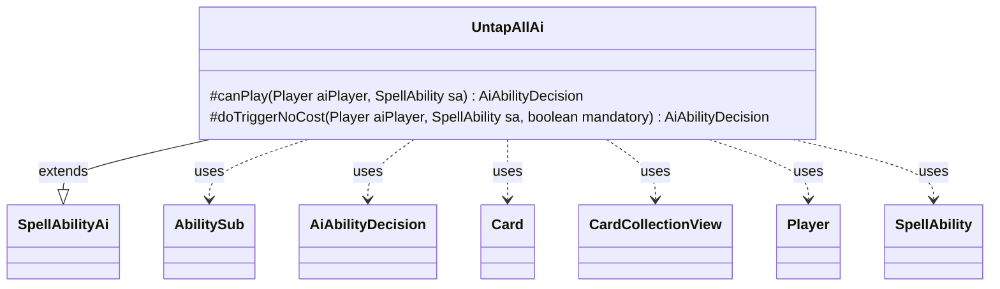

---
aliases:
  - UntapAllAi
tags:
  - java/class
  - module/forge-ai
  - pkg/forge/ai/ability
fqn: forge.ai.ability.UntapAllAi
package: forge.ai.ability
module: forge-ai
kind: Class
---

# UntapAllAi

**Package:** `forge.ai.ability` &nbsp; **Module:** `forge-ai` &nbsp; **Kind:** Class



## Relationships
**Extends:**
- [[forge.ai.SpellAbilityAi|SpellAbilityAi]]
**Uses:**
- [[forge.ai.AiAbilityDecision|AiAbilityDecision]]
- [[forge.game.card.Card|Card]]
- [[forge.game.card.CardCollectionView|CardCollectionView]]
- [[forge.game.player.Player|Player]]
- [[forge.game.spellability.AbilitySub|AbilitySub]]
- [[forge.game.spellability.SpellAbility|SpellAbility]]


## Design Description

UntapAllAi supplies the AI decision logic for the "untap all" spell effect, telling the engine whether and when the computer player should activate an UntapAll ability. As a concrete subclass of `SpellAbilityAi`, it overrides two hooks: `canPlay`, which evaluates voluntary casting, and `doTriggerNoCost`, which handles triggered or mandatory resolutions. Both return an `AiAbilityDecision` pairing a confidence score with an `AiPlayDecision` verdict.

The class collaborates with the game model—filtering `CardCollectionView` battlefield contents for tapped, valid `Card`s and inspecting the host card and `Player`'s team. Its notable design intent is self-serving play: it casts only when the AI's own team controls a tapped target, declining when the untap would solely benefit the opponent. It also inspects the `SpellAbility`'s `AbilitySub`, suppressing play when chained to an AddPhase effect before combat ends, and treats mandatory triggers as always-willing regardless of board state.

## Source
`forge-ai/src/main/java/forge/ai/ability/UntapAllAi.java`

```java
package forge.ai.ability;

import forge.ai.AiAbilityDecision;
import forge.ai.AiPlayDecision;
import forge.ai.SpellAbilityAi;
import forge.game.ability.ApiType;
import forge.game.card.Card;
import forge.game.card.CardCollectionView;
import forge.game.card.CardLists;
import forge.game.card.CardPredicates;
import forge.game.phase.PhaseType;
import forge.game.player.Player;
import forge.game.spellability.AbilitySub;
import forge.game.spellability.SpellAbility;
import forge.game.zone.ZoneType;

public class UntapAllAi extends SpellAbilityAi {
    @Override
    protected AiAbilityDecision canPlay(Player aiPlayer, SpellAbility sa) {
        final Card source = sa.getHostCard();

        final AbilitySub abSub = sa.getSubAbility();
        if (abSub != null) {
        	if (ApiType.AddPhase == abSub.getApi() 
        			&& source.getGame().getPhaseHandler().getPhase().isBefore(PhaseType.COMBAT_END)) {
        		return new AiAbilityDecision(0, AiPlayDecision.CantPlayAi);
        	}
            CardCollectionView list = CardLists.filter(aiPlayer.getGame().getCardsIn(ZoneType.Battlefield), CardPredicates.TAPPED);
            final String valid = sa.getParamOrDefault("ValidCards", "");
            list = CardLists.getValidCards(list, valid, source.getController(), source, sa);
            // don't untap if only opponent benefits
            if (list.anyMatch(CardPredicates.isControlledByAnyOf(aiPlayer.getYourTeam()))) {
                return new AiAbilityDecision(100, AiPlayDecision.WillPlay);
            } else {
                return new AiAbilityDecision(0, AiPlayDecision.CantPlayAi);
            }
        }
        return new AiAbilityDecision(0, AiPlayDecision.CantPlayAi);
    }

    @Override
    protected AiAbilityDecision doTriggerNoCost(Player aiPlayer, SpellAbility sa, boolean mandatory) {
        Card source = sa.getHostCard();

        if (sa.hasParam("ValidCards")) {
            String valid = sa.getParam("ValidCards");
            CardCollectionView list = CardLists.filter(aiPlayer.getGame().getCardsIn(ZoneType.Battlefield), CardPredicates.TAPPED);
            list = CardLists.getValidCards(list, valid, source.getController(), source, sa);
            return (mandatory || !list.isEmpty()) ? new AiAbilityDecision(100, AiPlayDecision.WillPlay) : new AiAbilityDecision(0, AiPlayDecision.CantPlayAi);
        }

        return mandatory ? new AiAbilityDecision(100, AiPlayDecision.WillPlay) : new AiAbilityDecision(0, AiPlayDecision.CantPlayAi);
    }
}
```
