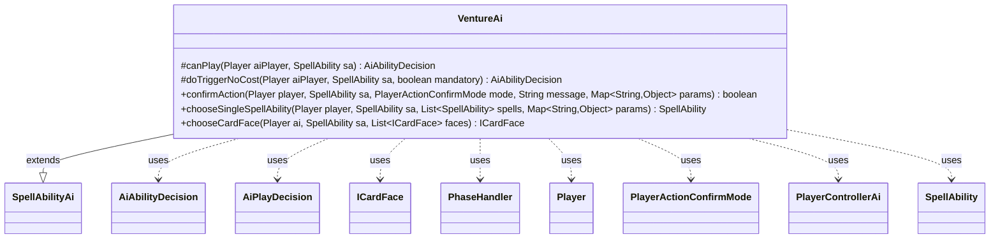

---
aliases:
  - VentureAi
tags:
  - java/class
  - module/forge-ai
  - pkg/forge/ai/ability
fqn: forge.ai.ability.VentureAi
package: forge.ai.ability
module: forge-ai
kind: Class
---

# VentureAi

**Package:** `forge.ai.ability` &nbsp; **Module:** `forge-ai` &nbsp; **Kind:** Class



## Relationships
**Extends:**
- [[forge.ai.SpellAbilityAi|SpellAbilityAi]]
**Uses:**
- [[forge.ai.AiAbilityDecision|AiAbilityDecision]]
- [[forge.ai.AiPlayDecision|AiPlayDecision]]
- [[forge.ai.PlayerControllerAi|PlayerControllerAi]]
- [[forge.card.ICardFace|ICardFace]]
- [[forge.game.phase.PhaseHandler|PhaseHandler]]
- [[forge.game.player.Player|Player]]
- [[forge.game.player.PlayerActionConfirmMode|PlayerActionConfirmMode]]
- [[forge.game.spellability.SpellAbility|SpellAbility]]


## Design Description

VentureAi implements the AI decision logic for "venture into the dungeon" abilities, extending `SpellAbilityAi` to override how a computer-controlled player times and resolves these effects. Its `canPlay`/`doTriggerNoCost` overrides encode timing intent: when a mana or tap cost is involved, the AI restricts sorcery-speed ventures to its own main phase two and instant-speed ones to the opponent's end step immediately before its turn, conserving mana otherwise; cost-free ventures play unconditionally.

Collaborating with `PhaseHandler` and `Player` for game-state queries, it returns `AiAbilityDecision`/`AiPlayDecision` verdicts that the surrounding AI framework consumes. It also drives in-dungeon navigation: `chooseSingleSpellAbility` consults the `PlayerControllerAi` to filter playable rooms and picks one at random, while `chooseCardFace` selects a dungeon, deliberately avoiding Tomb of Annihilation's life-loss room when the AI's life is endangered unless it can win immediately or cannot lose at zero life.

## Source
`forge-ai/src/main/java/forge/ai/ability/VentureAi.java`

```java
package forge.ai.ability;

import com.google.common.collect.Lists;
import forge.ai.AiAbilityDecision;
import forge.ai.AiPlayDecision;
import forge.ai.AiProfileUtil;
import forge.ai.AiProps;
import forge.ai.PlayerControllerAi;
import forge.ai.SpellAbilityAi;
import forge.card.ICardFace;
import forge.game.phase.PhaseHandler;
import forge.game.phase.PhaseType;
import forge.game.player.Player;
import forge.game.player.PlayerActionConfirmMode;
import forge.game.spellability.SpellAbility;
import forge.util.Aggregates;

import java.util.List;
import java.util.Map;

public class VentureAi extends SpellAbilityAi {
    @Override
    protected AiAbilityDecision canPlay(Player aiPlayer, SpellAbility sa) {
        // do it at opponent's EOT if able to prevent spending mana early
        PhaseHandler ph = aiPlayer.getGame().getPhaseHandler();
        if (sa.getPayCosts().hasManaCost() || sa.getPayCosts().hasTapCost()) {
            if (isSorcerySpeed(sa, aiPlayer)) {
                if (ph.is(PhaseType.MAIN2, aiPlayer)) {
                    return new AiAbilityDecision(100, AiPlayDecision.WillPlay);
                }
                return new AiAbilityDecision(0, AiPlayDecision.CantPlayAi);
            } else if (ph.is(PhaseType.END_OF_TURN) && ph.getNextTurn() == aiPlayer) {
                return new AiAbilityDecision(100, AiPlayDecision.WillPlay);
            }
            return new AiAbilityDecision(0, AiPlayDecision.CantPlayAi);
        }
        return new AiAbilityDecision(100, AiPlayDecision.WillPlay);
    }

    @Override
    protected AiAbilityDecision doTriggerNoCost(Player aiPlayer, SpellAbility sa, boolean mandatory) {
        if (mandatory) {
            return new AiAbilityDecision(100, AiPlayDecision.WillPlay);
        }
        AiAbilityDecision decision = canPlay(aiPlayer, sa);
        return decision;
    }

    @Override
    public boolean confirmAction(Player player, SpellAbility sa, PlayerActionConfirmMode mode, String message, Map<String, Object> params) {
        return true;
    }

    // AI that handles choosing the next room in a dungeon
    @Override
    public SpellAbility chooseSingleSpellAbility(Player player, SpellAbility sa, List<SpellAbility> spells, Map<String, Object> params) {
        List<SpellAbility> viableRooms = Lists.newArrayList();

        for (SpellAbility room : spells) {
            if (player.getController().isAI()) {
                room.setActivatingPlayer(player);
                AiPlayDecision playDecision = ((PlayerControllerAi)player.getController()).getAi().canPlaySa(room);
                if (playDecision == AiPlayDecision.WillPlay) {
                    viableRooms.add(room);
                }
            }
        }

        if (!viableRooms.isEmpty()) {
            return Aggregates.random(viableRooms);
        }

        return Aggregates.random(spells);
    }

    @Override
    public ICardFace chooseCardFace(Player ai, SpellAbility sa, List<ICardFace> faces) {
        if (faces.size() == 1) {
            return faces.get(0);
        }

        // Don't choose Tomb of Annihilation when life in danger unless we can win right away or can't lose for 0 life
        int lifeInDanger = AiProfileUtil.getIntProperty(ai, AiProps.AI_IN_DANGER_THRESHOLD);
        if ((ai.getLife() <= lifeInDanger && !ai.cantLoseForZeroOrLessLife())
                && !(ai.getLife() > 1 && ai.getWeakestOpponent().getLife() == 1)) {
            faces.removeIf(f -> "Tomb of Annihilation".equals(f.getName()));
        }

        return Aggregates.random(faces);
    }
}
```

## Python
`forge/ai/ability/VentureAi.py`

```python
from forge.ai.AiAbilityDecision import AiAbilityDecision
from forge.ai.AiPlayDecision import AiPlayDecision
from forge.ai.AiProfileUtil import AiProfileUtil
from forge.ai.AiProps import AiProps
from forge.ai.PlayerControllerAi import PlayerControllerAi
from forge.ai.SpellAbilityAi import SpellAbilityAi
from forge.card.ICardFace import ICardFace
from forge.game.phase.PhaseHandler import PhaseHandler
from forge.game.phase.PhaseType import PhaseType
from forge.game.player.Player import Player
from forge.game.player.PlayerActionConfirmMode import PlayerActionConfirmMode
from forge.game.spellability.SpellAbility import SpellAbility
from forge.util.Aggregates import Aggregates

from typing import List, Map
import typing


class VentureAi(SpellAbilityAi):
    def canPlay(self, aiPlayer: Player, sa: SpellAbility) -> AiAbilityDecision:
        # do it at opponent's EOT if able to prevent spending mana early
        ph = aiPlayer.getGame().getPhaseHandler()
        if sa.getPayCosts().hasManaCost() or sa.getPayCosts().hasTapCost():
            if self.isSorcerySpeed(sa, aiPlayer):
                if ph.is_(PhaseType.MAIN2, aiPlayer):
                    return AiAbilityDecision(100, AiPlayDecision.WillPlay)
                return AiAbilityDecision(0, AiPlayDecision.CantPlayAi)
            elif ph.is_(PhaseType.END_OF_TURN) and ph.getNextTurn() == aiPlayer:
                return AiAbilityDecision(100, AiPlayDecision.WillPlay)
            return AiAbilityDecision(0, AiPlayDecision.CantPlayAi)
        return AiAbilityDecision(100, AiPlayDecision.WillPlay)

    def doTriggerNoCost(self, aiPlayer: Player, sa: SpellAbility, mandatory: bool) -> AiAbilityDecision:
        if mandatory:
            return AiAbilityDecision(100, AiPlayDecision.WillPlay)
        decision = self.canPlay(aiPlayer, sa)
        return decision

    def confirmAction(self, player: Player, sa: SpellAbility, mode: PlayerActionConfirmMode, message: str, params: dict[str, object]) -> bool:
        return True

    # AI that handles choosing the next room in a dungeon
    def chooseSingleSpellAbility(self, player: Player, sa: SpellAbility, spells: list[SpellAbility], params: dict[str, object]) -> SpellAbility:
        viableRooms = []

        for room in spells:
            if player.getController().isAI():
                room.setActivatingPlayer(player)
                playDecision = player.getController().getAi().canPlaySa(room)
                if playDecision == AiPlayDecision.WillPlay:
                    viableRooms.append(room)

        if viableRooms:
            return Aggregates.random(viableRooms)

        return Aggregates.random(spells)

    def chooseCardFace(self, ai: Player, sa: SpellAbility, faces: list[ICardFace]) -> ICardFace:
        if len(faces) == 1:
            return faces[0]

        # Don't choose Tomb of Annihilation when life in danger unless we can win right away or can't lose for 0 life
        lifeInDanger = AiProfileUtil.getIntProperty(ai, AiProps.AI_IN_DANGER_THRESHOLD)
        if ((ai.getLife() <= lifeInDanger and not ai.cantLoseForZeroOrLessLife())
                and not (ai.getLife() > 1 and ai.getWeakestOpponent().getLife() == 1)):
            faces[:] = [f for f in faces if "Tomb of Annihilation" != f.getName()]

        return Aggregates.random(faces)
```
