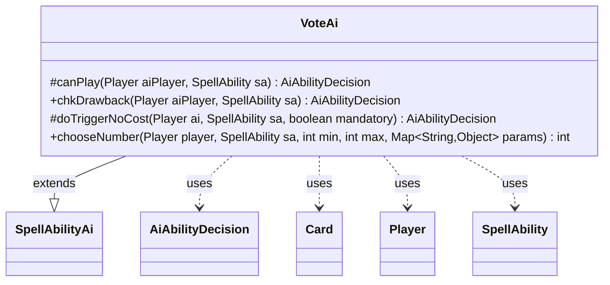

---
aliases:
  - VoteAi
tags:
  - java/class
  - module/forge-ai
  - pkg/forge/ai/ability
fqn: forge.ai.ability.VoteAi
package: forge.ai.ability
module: forge-ai
kind: Class
---

# VoteAi

**Package:** `forge.ai.ability`   **Module:** `forge-ai`   **Kind:** Class



## Relationships
**Extends:**
- [[forge.ai.SpellAbilityAi|SpellAbilityAi]]
**Uses:**
- [[forge.ai.AiAbilityDecision|AiAbilityDecision]]
- [[forge.game.card.Card|Card]]
- [[forge.game.player.Player|Player]]
- [[forge.game.spellability.SpellAbility|SpellAbility]]


## Design Description

The description is already written. Here it is:

VoteAi is the forge-ai decision module for spell abilities that conduct votes, supplying the AI's behavior for both whether to activate a voting effect and how to cast its ballots. Extending `SpellAbilityAi`, it overrides the standard hooks—`canPlay`, `chkDrawback`, and `doTriggerNoCost`—to plug into Forge's ability-evaluation framework, returning `AiAbilityDecision` objects that pair a confidence score with an `AiPlayDecision` rationale.

Its play logic is dispatched on a card-defined `AILogic` parameter, handling specific cases (`Always`, `Judgment`, which checks the battlefield for a valid `VoteCard`, and `Torture`, which defers until after Main 1) and otherwise declining. The overridden `chooseNumber` encodes the core voting intent: the AI casts an adversarial ballot, choosing the minimum when the voter or activating `Player` is an opponent and the maximum otherwise. Collaboration with `Card`, `Player`, and `SpellAbility` is read-only, reflecting an advisory role that informs rather than mutates game state.

## Source
`forge-ai/src/main/java/forge/ai/ability/VoteAi.java`

```java
package forge.ai.ability;

import forge.ai.AiAbilityDecision;
import forge.ai.AiPlayDecision;
import forge.ai.SpellAbilityAi;
import forge.game.card.Card;
import forge.game.card.CardLists;
import forge.game.phase.PhaseType;
import forge.game.player.Player;
import forge.game.spellability.SpellAbility;
import forge.game.zone.ZoneType;

import java.util.Map;

public class VoteAi extends SpellAbilityAi {
    /* (non-Javadoc)
     * @see forge.card.abilityfactory.SpellAiLogic#canPlayAI(forge.game.player.Player, java.util.Map, forge.card.spellability.SpellAbility)
     */
    @Override
    protected AiAbilityDecision canPlay(Player aiPlayer, SpellAbility sa) {
        // TODO: add ailogic
        String logic = sa.getParam("AILogic");
        final Card host = sa.getHostCard();
        if ("Always".equals(logic)) {
            return new AiAbilityDecision(100, AiPlayDecision.WillPlay);
        } else if ("Judgment".equals(logic)) {
            if (!CardLists.getValidCards(host.getGame().getCardsIn(ZoneType.Battlefield),
                    sa.getParam("VoteCard"), host.getController(), host, sa).isEmpty()) {
                return new AiAbilityDecision(100, AiPlayDecision.WillPlay);
            } else {
                return new AiAbilityDecision(0, AiPlayDecision.MissingNeededCards);
            }
        } else if ("Torture".equals(logic)) {
            if (aiPlayer.getGame().getPhaseHandler().getPhase().isAfter(PhaseType.MAIN1)) {
                return new AiAbilityDecision(100, AiPlayDecision.WillPlay);
            } else {
                return new AiAbilityDecision(0, AiPlayDecision.WaitForMain2);
            }
        }
        return new AiAbilityDecision(0, AiPlayDecision.CantPlayAi);
    }

    /* (non-Javadoc)
     * @see forge.card.abilityfactory.SpellAiLogic#chkAIDrawback(java.util.Map, forge.card.spellability.SpellAbility, forge.game.player.Player)
     */
    @Override
    public AiAbilityDecision chkDrawback(Player aiPlayer, SpellAbility sa) {
        return canPlay(aiPlayer, sa);
    }

    @Override
    protected AiAbilityDecision doTriggerNoCost(Player ai, SpellAbility sa, boolean mandatory) {
        return new AiAbilityDecision(100, AiPlayDecision.WillPlay);
    }

    @Override
    public int chooseNumber(Player player, SpellAbility sa, int min, int max, Map<String, Object> params) {
        if (params.containsKey("Voter")) {
            Player p = (Player)params.get("Voter");
            if (p.isOpponentOf(player)) {
                return min;
            }
        }
        if (sa.getActivatingPlayer().isOpponentOf(player)) {
            return min;
        }
        return max;
    }
}
```

## Python
`forge/ai/ability/VoteAi.py`

```python
from forge.ai.AiAbilityDecision import AiAbilityDecision
from forge.ai.AiPlayDecision import AiPlayDecision
from forge.ai.SpellAbilityAi import SpellAbilityAi
from forge.game.card.Card import Card
from forge.game.card.CardLists import CardLists
from forge.game.phase.PhaseType import PhaseType
from forge.game.player.Player import Player
from forge.game.spellability.SpellAbility import SpellAbility
from forge.game.zone.ZoneType import ZoneType

from typing import Map


class VoteAi(SpellAbilityAi):
    # (non-Javadoc)
    # @see forge.card.abilityfactory.SpellAiLogic#canPlayAI(forge.game.player.Player, java.util.Map, forge.card.spellability.SpellAbility)
    def canPlay(self, aiPlayer: Player, sa: SpellAbility) -> AiAbilityDecision:
        # TODO: add ailogic
        logic = sa.getParam("AILogic")
        host = sa.getHostCard()
        if "Always" == logic:
            return AiAbilityDecision(100, AiPlayDecision.WillPlay)
        elif "Judgment" == logic:
            if CardLists.getValidCards(host.getGame().getCardsIn(ZoneType.Battlefield),
                    sa.getParam("VoteCard"), host.getController(), host, sa):
                return AiAbilityDecision(100, AiPlayDecision.WillPlay)
            else:
                return AiAbilityDecision(0, AiPlayDecision.MissingNeededCards)
        elif "Torture" == logic:
            if aiPlayer.getGame().getPhaseHandler().getPhase().isAfter(PhaseType.MAIN1):
                return AiAbilityDecision(100, AiPlayDecision.WillPlay)
            else:
                return AiAbilityDecision(0, AiPlayDecision.WaitForMain2)
        return AiAbilityDecision(0, AiPlayDecision.CantPlayAi)

    # (non-Javadoc)
    # @see forge.card.abilityfactory.SpellAiLogic#chkAIDrawback(java.util.Map, forge.card.spellability.SpellAbility, forge.game.player.Player)
    def chkDrawback(self, aiPlayer: Player, sa: SpellAbility) -> AiAbilityDecision:
        return self.canPlay(aiPlayer, sa)

    def doTriggerNoCost(self, ai: Player, sa: SpellAbility, mandatory: bool) -> AiAbilityDecision:
        return AiAbilityDecision(100, AiPlayDecision.WillPlay)

    def chooseNumber(self, player: Player, sa: SpellAbility, min: int, max: int, params: Map[str, object]) -> int:
        if "Voter" in params:
            p = params.get("Voter")
            if p.isOpponentOf(player):
                return min
        if sa.getActivatingPlayer().isOpponentOf(player):
            return min
        return max
```
