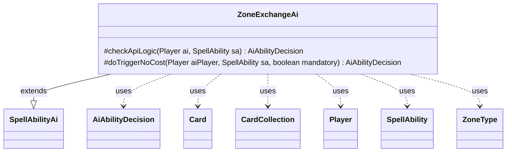

---
aliases:
  - ZoneExchangeAi
tags:
  - java/class
  - module/forge-ai
  - pkg/forge/ai/ability
fqn: forge.ai.ability.ZoneExchangeAi
package: forge.ai.ability
module: forge-ai
kind: Class
---

# ZoneExchangeAi

**Package:** `forge.ai.ability`   **Module:** `forge-ai`   **Kind:** Class



## Relationships
**Extends:**
- [[forge.ai.SpellAbilityAi|SpellAbilityAi]]
**Uses:**
- [[forge.ai.AiAbilityDecision|AiAbilityDecision]]
- [[forge.game.card.Card|Card]]
- [[forge.game.card.CardCollection|CardCollection]]
- [[forge.game.player.Player|Player]]
- [[forge.game.spellability.SpellAbility|SpellAbility]]
- [[forge.game.zone.ZoneType|ZoneType]]


## Design Description

`ZoneExchangeAi` provides the computer-player decision logic for the "ZoneExchange" spell ability, which swaps a card in one zone (typically the battlefield) for a card drawn from another (defaulting to the hand). As a concrete subclass of `SpellAbilityAi`, it overrides the `checkApiLogic` hook: it resolves the outgoing object and its source zone, filters the AI's candidate zone for valid swap targets, and calls `ComputerUtilCard.getBestAI` to select the strongest partner. The design intent is value-driven — it returns a `WillPlay` decision only when the incoming card's converted mana cost exceeds the outgoing card's, with an extra legality guard for Aura attachment, otherwise reporting `CantPlayAi`. It collaborates with the game model (`Card`, `CardCollection`, `Player`, `ZoneType`) for state inspection and wraps each outcome in an `AiAbilityDecision`, while `doTriggerNoCost` unconditionally accepts the effect when it is triggered rather than freely chosen.

## Source
`forge-ai/src/main/java/forge/ai/ability/ZoneExchangeAi.java`

```java
package forge.ai.ability;

import forge.ai.AiAbilityDecision;
import forge.ai.AiPlayDecision;
import forge.ai.ComputerUtilCard;
import forge.ai.SpellAbilityAi;
import forge.game.ability.AbilityUtils;
import forge.game.card.Card;
import forge.game.card.CardCollection;
import forge.game.card.CardLists;
import forge.game.player.Player;
import forge.game.spellability.SpellAbility;
import forge.game.zone.ZoneType;

public class ZoneExchangeAi extends SpellAbilityAi {

/* (non-Javadoc)
 * @see forge.card.abilityfactory.SpellAiLogic#canPlayAI(forge.game.player.Player, java.util.Map, forge.card.spellability.SpellAbility)
 */
    @Override
    protected AiAbilityDecision checkApiLogic(Player ai, final SpellAbility sa) {
        Card object1 = null;
        Card object2 = null;
        final Card source = sa.getHostCard();
        final String type = sa.getParam("Type");
        if (sa.hasParam("Object")) {
            object1 = AbilityUtils.getDefinedCards(source, sa.getParam("Object"), sa).get(0);
        } else {
            object1 = source;
        }
        final ZoneType zone1 = sa.hasParam("Zone1") ? ZoneType.smartValueOf(sa.getParam("Zone1")) : ZoneType.Battlefield;
        final ZoneType zone2 = sa.hasParam("Zone2") ? ZoneType.smartValueOf(sa.getParam("Zone2")) : ZoneType.Hand;
        CardCollection list = new CardCollection(ai.getCardsIn(zone2));
        if (type != null) {
            list = CardLists.getValidCards(list, type, ai, source, sa);
        }
        object2 = ComputerUtilCard.getBestAI(list);
        if (object1 == null || object2 == null || !object1.isInZone(zone1) || !object1.getOwner().equals(ai)) {
            return new AiAbilityDecision(0, AiPlayDecision.CantPlayAi);
        }
        if (type.equals("Aura")) {
            Card c = object1.getEnchantingCard();
            if (!c.canBeAttached(object2, sa)) {
                return new AiAbilityDecision(0, AiPlayDecision.CantPlayAi);
            }
        }
        if (object2.getCMC() > object1.getCMC()) {
            return new AiAbilityDecision(100, AiPlayDecision.WillPlay);
        }
        return new AiAbilityDecision(0, AiPlayDecision.CantPlayAi);
    }

    /* (non-Javadoc)
     * @see forge.card.abilityfactory.SpellAiLogic#doTriggerAINoCost(forge.game.player.Player, java.util.Map, forge.card.spellability.SpellAbility, boolean)
     */
    @Override
    protected AiAbilityDecision doTriggerNoCost(Player aiPlayer, SpellAbility sa, boolean mandatory) {
        return new AiAbilityDecision(100, AiPlayDecision.WillPlay);
    }
}
```

## Python
`forge/ai/ability/ZoneExchangeAi.py`

```python
from forge.ai.AiAbilityDecision import AiAbilityDecision
from forge.ai.AiPlayDecision import AiPlayDecision
from forge.ai.ComputerUtilCard import ComputerUtilCard
from forge.ai.SpellAbilityAi import SpellAbilityAi
from forge.game.ability.AbilityUtils import AbilityUtils
from forge.game.card.Card import Card
from forge.game.card.CardCollection import CardCollection
from forge.game.card.CardLists import CardLists
from forge.game.player.Player import Player
from forge.game.spellability.SpellAbility import SpellAbility
from forge.game.zone.ZoneType import ZoneType


class ZoneExchangeAi(SpellAbilityAi):

    # (non-Javadoc)
    # @see forge.card.abilityfactory.SpellAiLogic#canPlayAI(forge.game.player.Player, java.util.Map, forge.card.spellability.SpellAbility)
    def checkApiLogic(self, ai: Player, sa: SpellAbility) -> AiAbilityDecision:
        object1 = None
        object2 = None
        source = sa.getHostCard()
        type = sa.getParam("Type")
        if sa.hasParam("Object"):
            object1 = AbilityUtils.getDefinedCards(source, sa.getParam("Object"), sa).get(0)
        else:
            object1 = source
        zone1 = ZoneType.smartValueOf(sa.getParam("Zone1")) if sa.hasParam("Zone1") else ZoneType.Battlefield
        zone2 = ZoneType.smartValueOf(sa.getParam("Zone2")) if sa.hasParam("Zone2") else ZoneType.Hand
        list = CardCollection(ai.getCardsIn(zone2))
        if type is not None:
            list = CardLists.getValidCards(list, type, ai, source, sa)
        object2 = ComputerUtilCard.getBestAI(list)
        if object1 is None or object2 is None or not object1.isInZone(zone1) or not object1.getOwner().equals(ai):
            return AiAbilityDecision(0, AiPlayDecision.CantPlayAi)
        if type == "Aura":
            c = object1.getEnchantingCard()
            if not c.canBeAttached(object2, sa):
                return AiAbilityDecision(0, AiPlayDecision.CantPlayAi)
        if object2.getCMC() > object1.getCMC():
            return AiAbilityDecision(100, AiPlayDecision.WillPlay)
        return AiAbilityDecision(0, AiPlayDecision.CantPlayAi)

    # (non-Javadoc)
    # @see forge.card.abilityfactory.SpellAiLogic#doTriggerAINoCost(forge.game.player.Player, java.util.Map, forge.card.spellability.SpellAbility, boolean)
    def doTriggerNoCost(self, aiPlayer: Player, sa: SpellAbility, mandatory: bool) -> AiAbilityDecision:
        return AiAbilityDecision(100, AiPlayDecision.WillPlay)
```
