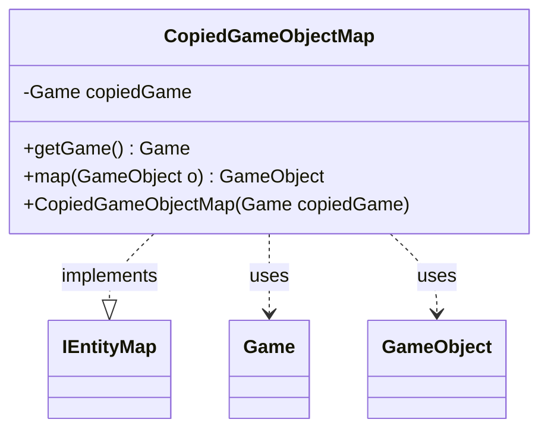

---
aliases:
  - CopiedGameObjectMap
tags:
  - java/class
  - module/forge-ai
  - pkg/forge/ai/simulation
fqn: forge.ai.simulation.GameCopier.CopiedGameObjectMap
package: forge.ai.simulation
module: forge-ai
kind: Class
---

# CopiedGameObjectMap

**Package:** `forge.ai.simulation`   **Module:** `forge-ai`   **Kind:** Class



## Relationships
**Implements:**
- [[forge.game.IEntityMap|IEntityMap]]
**Uses:**
- [[forge.game.Game|Game]]
- [[forge.game.GameObject|GameObject]]

## Design Description

The CopiedGameObjectMap is a private inner class of GameCopier that implements the IEntityMap interface, serving as a lightweight adapter that bridges the AI simulation's copied game state to objects in the original game. Its sole responsibility is to translate references: given a GameObject from one game context, its `map` method delegates to the enclosing GameCopier's `find` method to resolve the corresponding object in the copied Game, while `getGame` exposes the copied Game instance it wraps.

The design intent is minimal and focused — it holds only a single immutable `copiedGame` field, and as an inner class it leverages the outer GameCopier's state and `find` logic rather than duplicating mapping infrastructure. By conforming to IEntityMap, it lets simulation code consume copied entities through the same abstraction used elsewhere in the engine, decoupling callers from the copy mechanism.

## Source
`forge-ai/src/main/java/forge/ai/simulation/GameCopier.java` — declaration excerpt

```java
    private class CopiedGameObjectMap implements IEntityMap {
        private final Game copiedGame;

        public CopiedGameObjectMap(Game copiedGame) {
            this.copiedGame = copiedGame;
        }

        @Override
        public Game getGame() {
            return copiedGame;
        }

        @Override
        public GameObject map(GameObject o) {
            return find(o);
        }
    }
```
