---
aliases:
  - GameCopier
tags:
  - java/class
  - module/forge-ai
  - pkg/forge/ai/simulation
fqn: forge.ai.simulation.GameCopier
package: forge.ai.simulation
module: forge-ai
kind: Class
---

# GameCopier

**Package:** `forge.ai.simulation` &nbsp; **Module:** `forge-ai` &nbsp; **Kind:** Class

```mermaid
classDiagram
    class GameCopier {
        -ZoneType[] ZONES
        -Game origGame
        -BiMap~Player,Player~ playerMap
        -BiMap~Card,Card~ cardMap
        -CopiedGameObjectMap gameObjectMap
        -GameSnapshot snapshot
        -PaperCard hidden_info_card
        -boolean PRUNE_HIDDEN_INFO
        -boolean USE_FROM_PAPER_CARD
        +getOriginalGame() Game
        +getCopiedGame() Game
        +makeCopy() Game
        +makeCopy(PhaseType advanceToPhase, Player aiPlayer) Game
        -copyStack(Game origGame, Game newGame, IEntityMap map) void
        -clonePlayer(RegisteredPlayer p) RegisteredPlayer
        -copyGameState(Game newGame, Player aiPlayer) void
        -createCardCopy(Game newGame, Player newOwner, Card c, Player aiPlayer) Card
        -addCard(Game newGame, ZoneType zone, Card c, Player aiPlayer) void
        -findSAInCard(SpellAbility sa, Card c) SpellAbility
        +find(GameObject o) GameObject
        +reverseFind(GameObject o) GameObject
        +GameCopier(Game origGame)
    }
    GameCopier ..> Card : uses
    GameCopier ..> CardCloneStates : uses
    GameCopier ..> CardCopyService : uses
    GameCopier ..> CardType : uses
    GameCopier ..> Combat : uses
    GameCopier ..> CopiedGameObjectMap : uses
    GameCopier ..> CounterType : uses
    GameCopier ..> DetachedCardEffect : uses
    GameCopier ..> Game : uses
    GameCopier ..> GameEntity : uses
    GameCopier ..> GameObject : uses
    GameCopier ..> GameRules : uses
    GameCopier ..> GameSnapshot : uses
    GameCopier ..> IEntityMap : uses
    GameCopier ..> LobbyPlayer : uses
    GameCopier ..> LobbyPlayerAi : uses
    GameCopier ..> Mana : uses
    GameCopier ..> Match : uses
    GameCopier ..> PaperCard : uses
    GameCopier ..> PhaseHandler : uses
    GameCopier ..> PhaseType : uses
    GameCopier ..> Player : uses
    GameCopier ..> PlayerZoneBattlefield : uses
    GameCopier ..> RegisteredPlayer : uses
    GameCopier ..> SpellAbility : uses
    GameCopier ..> SpellAbilityStackInstance : uses
    GameCopier ..> StaticAbility : uses
    GameCopier ..> StaticEffect : uses
    GameCopier ..> TokenInfo : uses
    GameCopier ..> ZoneType : uses
```



## Relationships
**Uses:**
- [[forge.LobbyPlayer|LobbyPlayer]]
- [[forge.ai.LobbyPlayerAi|LobbyPlayerAi]]
- [[forge.ai.simulation.GameCopier.CopiedGameObjectMap|CopiedGameObjectMap]]
- [[forge.card.CardType|CardType]]
- [[forge.game.Game|Game]]
- [[forge.game.GameEntity|GameEntity]]
- [[forge.game.GameObject|GameObject]]
- [[forge.game.GameRules|GameRules]]
- [[forge.game.GameSnapshot|GameSnapshot]]
- [[forge.game.IEntityMap|IEntityMap]]
- [[forge.game.Match|Match]]
- [[forge.game.StaticEffect|StaticEffect]]
- [[forge.game.ability.effects.DetachedCardEffect|DetachedCardEffect]]
- [[forge.game.card.Card|Card]]
- [[forge.game.card.CardCloneStates|CardCloneStates]]
- [[forge.game.card.CardCopyService|CardCopyService]]
- [[forge.game.card.CounterType|CounterType]]
- [[forge.game.card.token.TokenInfo|TokenInfo]]
- [[forge.game.combat.Combat|Combat]]
- [[forge.game.mana.Mana|Mana]]
- [[forge.game.phase.PhaseHandler|PhaseHandler]]
- [[forge.game.phase.PhaseType|PhaseType]]
- [[forge.game.player.Player|Player]]
- [[forge.game.player.RegisteredPlayer|RegisteredPlayer]]
- [[forge.game.spellability.SpellAbility|SpellAbility]]
- [[forge.game.spellability.SpellAbilityStackInstance|SpellAbilityStackInstance]]
- [[forge.game.staticability.StaticAbility|StaticAbility]]
- [[forge.game.zone.PlayerZoneBattlefield|PlayerZoneBattlefield]]
- [[forge.game.zone.ZoneType|ZoneType]]
- [[forge.item.PaperCard|PaperCard]]


## Design Description

`GameCopier` constructs a deep, independent clone of a live `Game` so the AI's simulation engine can explore hypothetical lines of play without mutating real state. Its `makeCopy` entry point rebuilds the `Match`, clones each `RegisteredPlayer` (coercing non-AI lobby players into `LobbyPlayerAi`), and recreates every `Card` across all zones, transferring life, counters, mana, phase, combat, the stack, and per-card attributes. It maintains `BiMap` registries (`playerMap`, `cardMap`) and exposes `find`/`reverseFind` plus an inner `CopiedGameObjectMap` (implementing `IEntityMap`) so collaborators can translate objects between original and copy in either direction.

The design favors correctness over speed: cards are reparsed from their `PaperCard` via `CardCopyService`, which the code explicitly flags as the dominant cost and a target for future state-based copying. Tokens, detached effects, and remembered objects are special-cased, and an experimental `GameSnapshot` path offers an alternative restore mechanism.

## Source
`forge-ai/src/main/java/forge/ai/simulation/GameCopier.java`

```java
package forge.ai.simulation;

import com.google.common.collect.*;
import forge.LobbyPlayer;
import forge.ai.AIOption;
import forge.ai.LobbyPlayerAi;
import forge.card.CardRarity;
import forge.card.CardRules;
import forge.card.CardType;
import forge.game.*;
import forge.game.ability.effects.DetachedCardEffect;
import forge.game.card.Card;
import forge.game.card.CardCloneStates;
import forge.game.card.CardCopyService;
import forge.game.card.CounterType;
import forge.game.card.token.TokenInfo;
import forge.game.combat.Combat;
import forge.game.mana.Mana;
import forge.game.phase.PhaseHandler;
import forge.game.phase.PhaseType;
import forge.game.player.Player;
import forge.game.player.RegisteredPlayer;
import forge.game.spellability.SpellAbility;
import forge.game.spellability.SpellAbilityStackInstance;
import forge.game.staticability.StaticAbility;
import forge.game.trigger.TriggerType;
import forge.game.zone.PlayerZoneBattlefield;
import forge.game.zone.ZoneType;
import forge.item.PaperCard;

import java.util.ArrayList;
import java.util.List;
import java.util.Map;

public class GameCopier {
    private static final ZoneType[] ZONES = new ZoneType[] {
        ZoneType.Battlefield,
        ZoneType.Hand,
        ZoneType.Graveyard,
        ZoneType.Library,
        ZoneType.Exile,
        ZoneType.Stack,
        ZoneType.Command,
    };

    private Game origGame;
    private BiMap<Player, Player> playerMap = HashBiMap.create();
    private BiMap<Card, Card> cardMap = HashBiMap.create();
    private CopiedGameObjectMap gameObjectMap;
    private GameSnapshot snapshot = null;

    public GameCopier(Game origGame) {
        this.origGame = origGame;
        if (origGame.EXPERIMENTAL_RESTORE_SNAPSHOT) {
            this.snapshot = new GameSnapshot(origGame);
        }
    }

    public Game getOriginalGame() {
        return origGame;
    }

    public Game getCopiedGame() {
        return gameObjectMap.getGame();
    }

    public Game makeCopy() {
        return makeCopy(null, null);
    }
    public Game makeCopy(PhaseType advanceToPhase, Player aiPlayer) {
        if (origGame.EXPERIMENTAL_RESTORE_SNAPSHOT) {
            // How do we advance to phase when using restores?
            return snapshot.makeCopy();
        }

        List<RegisteredPlayer> origPlayers = origGame.getMatch().getPlayers();
        List<RegisteredPlayer> newPlayers = new ArrayList<>();
        for (RegisteredPlayer p : origPlayers) {
            newPlayers.add(clonePlayer(p));
        }

        GameRules currentRules = origGame.getRules();
        Match newMatch = new Match(currentRules, newPlayers, origGame.getView().getTitle());
        Game newGame = new Game(newPlayers, currentRules, newMatch);
        newGame.dangerouslySetTimestamp(origGame.getTimestamp());

        for (int i = 0; i < origGame.getPlayers().size(); i++) {
            Player origPlayer = origGame.getPlayers().get(i);
            Player newPlayer = newGame.getPlayer(origPlayer.getId());
            newPlayer.setLife(origPlayer.getLife(), null);
            newPlayer.setLifeLostLastTurn(origPlayer.getLifeLostLastTurn());
            newPlayer.setLifeLostThisTurn(origPlayer.getLifeLostThisTurn());
            newPlayer.setLifeGainedThisTurn(origPlayer.getLifeGainedThisTurn());
            newPlayer.setCommitedCrimeThisTurn(origPlayer.getCommittedCrimeThisTurn());
            newPlayer.setLifeStartedThisTurnWith(origPlayer.getLifeStartedThisTurnWith());
            newPlayer.setDamageReceivedThisTurn(origPlayer.getDamageReceivedThisTurn());
            newPlayer.setLandsPlayedThisTurn(origPlayer.getLandsPlayedThisTurn());
            newPlayer.setCounters(Maps.newHashMap(origPlayer.getCounters()));
            newPlayer.setSpeed(origPlayer.getSpeed());
            newPlayer.setBlessing(origPlayer.hasBlessing(), null);
            newPlayer.setDescended(origPlayer.getDescended());
            newPlayer.setLibrarySearched(origPlayer.getLibrarySearched());
            newPlayer.setSpellsCastLastTurn(origPlayer.getSpellsCastLastTurn());
            for (int j = 0; j < origPlayer.getSpellsCastThisTurn(); j++) {
                newPlayer.addSpellCastThisTurn();
            }
            newPlayer.setMaxHandSize(origPlayer.getMaxHandSize());
            newPlayer.setUnlimitedHandSize(origPlayer.isUnlimitedHandSize());
            newPlayer.setCrankCounter(origPlayer.getCrankCounter());
            // TODO creatureAttackedThisTurn
            for (Mana m : origPlayer.getManaPool()) {
                newPlayer.getManaPool().addMana(m, false);
            }
            playerMap.put(origPlayer, newPlayer);
        }

        PhaseHandler origPhaseHandler = origGame.getPhaseHandler();
        Player newPlayerTurn = playerMap.get(origPhaseHandler.getPlayerTurn());
        newGame.getPhaseHandler().devModeSet(origPhaseHandler.getPhase(), newPlayerTurn, origPhaseHandler.getTurn());
        newGame.getTriggerHandler().suppressMode(TriggerType.ChangesZone);
        for (Player p : newGame.getPlayers()) {
            ((PlayerZoneBattlefield) p.getZone(ZoneType.Battlefield)).setTriggers(false);
        }

        copyGameState(newGame, aiPlayer);

        for (Player origPlayer : playerMap.keySet()) {
            Player newPlayer = playerMap.get(origPlayer);
            origPlayer.copyCommandersToSnapshot(newPlayer, gameObjectMap::map);
            ((PlayerZoneBattlefield) newPlayer.getZone(ZoneType.Battlefield)).setTriggers(true);
        }
        newGame.getTriggerHandler().clearSuppression(TriggerType.ChangesZone);

        for (Card c : newGame.getCardsInGame()) {
            Card origCard = (Card) reverseFind(c);
            if (origCard.hasRemembered()) {
                for (Object o : origCard.getRemembered()) {
                    if (o instanceof GameObject) {
                        // Sometimes, a spell can "remember" a token card that's not in any zone
                        // (and thus wouldn't have been copied) - for example Swords to Plowshares
                        // remembering its target for LKI. Skip these to not crash in find().
                        if (o instanceof Card && ((Card)o).getZone() == null) {
                           continue;
                        }
                        c.addRemembered(find((GameObject) o));
                    } else {
                        System.err.println(c + " Remembered: " + o + "/" + o.getClass());
                        c.addRemembered(o);
                    }
                }
            }
            for (SpellAbility sa : c.getSpellAbilities()) {
                Player activatingPlayer = sa.getActivatingPlayer();
                if (activatingPlayer != null && activatingPlayer.getGame() != newGame) {
                    sa.setActivatingPlayer(gameObjectMap.map(activatingPlayer));
                }
            }
        }

        // Undo effects first before calculating them below, to avoid them applying twice.
        for (StaticEffect effect : origGame.getStaticEffects().getEffects()) {
            effect.removeMapped(gameObjectMap);
        }

        if (origPhaseHandler.getCombat() != null) {
            newGame.getPhaseHandler().setCombat(new Combat(origPhaseHandler.getCombat(), gameObjectMap));
        }

        newGame.getAction().checkStateEffects(true); //ensure state based effects and triggers are updated
        newGame.getTriggerHandler().resetActiveTriggers();

        if (GameSimulator.COPY_STACK)
            copyStack(origGame, newGame, gameObjectMap);

        // TODO update thisTurnCast

        if (advanceToPhase != null) {
            newGame.getPhaseHandler().devAdvanceToPhase(advanceToPhase, () -> GameSimulator.resolveStack(newGame, aiPlayer.getWeakestOpponent()));
        }

        return newGame;
    }

    private static void copyStack(Game origGame, Game newGame, IEntityMap map) {
        for (SpellAbilityStackInstance origEntry : origGame.getStack()) {
            SpellAbility origSa = origEntry.getSpellAbility();
            Card origHostCard = origSa.getHostCard();
            Card newCard = map.map(origHostCard);
            SpellAbility newSa = null;
            if (origSa.isSpell()) {
                newSa = findSAInCard(origSa, newCard);
            }
            if (newSa != null) {
                newSa.setActivatingPlayer(map.map(origSa.getActivatingPlayer()));
                if (origSa.usesTargeting()) {
                    for (GameObject o : origSa.getTargets()) {
                        newSa.getTargets().add(map.map(o));
                    }
                }
                newGame.getStack().add(newSa);
            }
        } 
    }

    private RegisteredPlayer clonePlayer(RegisteredPlayer p) {
        RegisteredPlayer clone = new RegisteredPlayer(p.getDeck());
        LobbyPlayer lp = p.getPlayer();
        if (!(lp instanceof LobbyPlayerAi)) {
            // TODO should probably also override them if they're normal AI
            lp = new LobbyPlayerAi(p.getPlayer().getName(), Sets.newHashSet(AIOption.USE_SIMULATION));
        }
        clone.setPlayer(lp);
        return clone;
    }

    private void copyGameState(Game newGame, Player aiPlayer) {
        newGame.EXPERIMENTAL_RESTORE_SNAPSHOT = origGame.EXPERIMENTAL_RESTORE_SNAPSHOT;
        newGame.AI_TIMEOUT = origGame.AI_TIMEOUT;
        newGame.AI_CAN_USE_TIMEOUT = origGame.AI_CAN_USE_TIMEOUT;
        newGame.setAge(origGame.getAge());

        // TODO countersAddedThisTurn

        if (origGame.getStartingPlayer() != null) {
            newGame.setStartingPlayer(playerMap.get(origGame.getStartingPlayer()));
        }
        if (origGame.getMonarch() != null) {
            newGame.setMonarch(playerMap.get(origGame.getMonarch()));
        }
        if (origGame.getMonarchBeginTurn() != null) {
            newGame.setMonarchBeginTurn(playerMap.get(origGame.getMonarchBeginTurn()));
        }
        if (origGame.getHasInitiative() != null) {
            newGame.setHasInitiative(playerMap.get(origGame.getHasInitiative()));
        }
        if (origGame.getDayTime() != null) {
            newGame.setDayTime(origGame.getDayTime());
        }

        for (ZoneType zone : ZONES) {
            for (Card card : origGame.getCardsIn(zone)) {
                addCard(newGame, zone, card, aiPlayer);
            }
            // TODO CardsAddedThisTurn is now messed up
        }
        gameObjectMap = new CopiedGameObjectMap(newGame);

        for (Card card : origGame.getCardsIn(ZoneType.Battlefield)) {
            Card otherCard = cardMap.get(card);
            otherCard.setGameTimestamp(card.getGameTimestamp());
            otherCard.setLayerTimestamp(card.getLayerTimestamp());
            otherCard.setSickness(card.hasSickness());
            otherCard.setState(card.getCurrentStateName(), false);
            if (card.isAttachedToEntity()) {
                GameEntity ge = gameObjectMap.map(card.getEntityAttachedTo());
                otherCard.setEntityAttachedTo(ge);
                ge.addAttachedCard(otherCard);
            }
            if (card.getCrewedByThisTurn() != null) {
                otherCard.setCrewedByThisTurn(card.getCrewedByThisTurn());
            }
            if (card.getCloneOrigin() != null) {
                otherCard.setCloneOrigin(cardMap.get(card.getCloneOrigin()));
            }
            if (card.getHaunting() != null) {
                otherCard.setHaunting(cardMap.get(card.getHaunting()));
            }
            if (card.getSaddledByThisTurn() != null) {
                otherCard.setSaddledByThisTurn(card.getSaddledByThisTurn());
            }
            if (card.getEffectSource() != null) {
                otherCard.setEffectSource(cardMap.get(card.getEffectSource()));
            }
            if (card.isPaired()) {
                otherCard.setPairedWith(cardMap.get(card.getPairedWith()));
            }
            if (card.getCopiedPermanent() != null) {
                // TODO would it be safe to simply reuse the prototype?
                otherCard.setCopiedPermanent(new CardCopyService(card.getCopiedPermanent()).copyCard(false));
            }
            // TODO: Verify that the above relationships are preserved bi-directionally or not.
        }
    }

    private static PaperCard hidden_info_card = new PaperCard(CardRules.fromScript(Lists.newArrayList("Name:hidden", "Types:Artifact", "Oracle:")), "", CardRarity.Common);
    private static final boolean PRUNE_HIDDEN_INFO = false;
    private static final boolean USE_FROM_PAPER_CARD = true;
    private Card createCardCopy(Game newGame, Player newOwner, Card c, Player aiPlayer) {
        if (c.isToken() && !c.isImmutable()) {
            Card result = new TokenInfo(c).makeOneToken(newOwner);
            new CardCopyService(c).copyCopiableCharacteristics(result, null, null);
            return result;
        }
        if (USE_FROM_PAPER_CARD && !c.isImmutable() && c.getPaperCard() != null) {
            Card newCard;
            if (PRUNE_HIDDEN_INFO && !c.getView().canBeShownTo(aiPlayer.getView())) {
                // TODO also check REVEALED_CARDS memory
                newCard = new Card(newGame.nextCardId(), hidden_info_card, newGame);
                newCard.setOwner(newOwner);
            } else {
                newCard = Card.fromPaperCard(c.getPaperCard(), newOwner);
            }
            newCard.setCommander(c.isCommander());
            return newCard;
        }

        // TODO: The above is very expensive and accounts for the vast majority of GameCopier execution time.
        // The issue is that it requires parsing the original card from scratch from the paper card. We should
        // improve the copier to accurately copy the card from its actual state, so that the paper card shouldn't
        // be needed. Once the below code accurately copies the card, remove the USE_FROM_PAPER_CARD code path.
        Card newCard;
        if (c instanceof DetachedCardEffect)
            newCard = new DetachedCardEffect((DetachedCardEffect) c, newGame, true);
        else
            newCard = new Card(newGame.nextCardId(), c.getPaperCard(), newGame);
        newCard.setOwner(newOwner);
        newCard.setName(c.getName());
        newCard.setCommander(c.isCommander());
        newCard.setType(new CardType(c.getType()));
        for (StaticAbility stAb : c.getStaticAbilities()) {
            newCard.addStaticAbility(stAb.copy(newCard, true));
        }
        for (SpellAbility sa : c.getSpellAbilities()) {
            SpellAbility saCopy = sa.copy(newCard, true);
            if (saCopy != null) {
                newCard.addSpellAbility(saCopy);
            } else {
                System.err.println(sa.toString());
            }
        }

        return newCard;
    }

    private void addCard(Game newGame, ZoneType zone, Card c, Player aiPlayer) {
        final Player owner = playerMap.get(c.getOwner());
        final Card newCard = createCardCopy(newGame, owner, c, aiPlayer);
        cardMap.put(c, newCard);

        // TODO ExiledWith

        Player zoneOwner = owner;
        // everything the CreatureEvaluator checks must be set here
        if (zone == ZoneType.Battlefield) {
            // TODO: Controllers' list with timestamps should be copied.
            zoneOwner = playerMap.get(c.getController());
            newCard.setController(zoneOwner, 0);

            if (c.isBattle()) {
                newCard.setProtectingPlayer(playerMap.get(c.getProtectingPlayer()));
            }

            newCard.setCameUnderControlSinceLastUpkeep(c.cameUnderControlSinceLastUpkeep());

            newCard.setPTTable(c.getSetPTTable());
            newCard.setPTCharacterDefiningTable(c.getSetPTCharacterDefiningTable());

            newCard.setPTBoost(c.getPTBoostTable());
            // TODO copy by map
            newCard.setDamage(c.getDamage());
            newCard.setDamageReceivedThisTurn(c.getDamageReceivedThisTurn());

            newCard.copyFrom(c);

            for (Table.Cell<Long, Long, List<String>> kw : c.getHiddenExtrinsicKeywordsTable().cellSet()) {
                newCard.addHiddenExtrinsicKeywords(kw.getRowKey(), kw.getColumnKey(), kw.getValue());
            }
            newCard.updateKeywordsCache();

            if (c.isTapped()) {
                newCard.setTapped(true);
            }
            if (c.isFaceDown()) {
                newCard.turnFaceDown(true);
                if (c.isManifested()) {
                    newCard.setManifested(c.getManifestedSA());
                }
                if (c.isCloaked()) {
                    newCard.setCloaked(c.getCloakedSA());
                }
            }
            if (c.isMonstrous()) {
                newCard.setMonstrous(true);
            }
            if (c.isRenowned()) {
                newCard.setRenowned(true);
            }
            if (c.isSolved()) {
                newCard.setSolved(true);
            }
            if (c.isSaddled()) {
                newCard.setSaddled(true);
            }
            if (c.isSuspected()) {
                newCard.setSuspected(true);
            }
            if (c.isPlaneswalker()) {
                for (SpellAbility sa : c.getAllSpellAbilities()) {
                    int active = sa.getActivationsThisTurn();
                    if (sa.isPwAbility() && active > 0) {
                        SpellAbility newSa = findSAInCard(sa, newCard);
                        if (newSa != null) {
                            for (int i = 0; i < active; i++) {
                                newCard.addAbilityActivated(newSa);
                            }
                        }
                    }
                }
            }

            newCard.setFlipped(c.isFlipped());
            for (Map.Entry<Long, CardCloneStates> e : c.getCloneStates().entrySet()) {
                newCard.addCloneState(e.getValue().copy(newCard, true), e.getKey());
            }

            Map<CounterType, Integer> counters = c.getCounters();
            if (!counters.isEmpty()) {
                newCard.setCounters(Maps.newHashMap(counters));
            }
            if (c.hasChosenPlayer()) {
                newCard.setChosenPlayer(playerMap.get(c.getChosenPlayer()));
            }
            if (c.hasChosenType()) {
                newCard.setChosenType(c.getChosenType());
            }
            if (c.hasChosenType2()) {
                newCard.setChosenType2(c.getChosenType2());
            }
            if (c.hasChosenColor()) {
                newCard.setChosenColors(Lists.newArrayList(c.getChosenColors()));
            }
            if (c.hasNamedCard()) {
                newCard.setNamedCards(Lists.newArrayList(c.getNamedCards()));
            }

            newCard.setSprocket(c.getSprocket());

            newCard.setSVars(c.getSVars());
            newCard.copyChangedSVarsFrom(c);
        }

        if (zone == ZoneType.Stack) {
            newGame.getStackZone().add(newCard);
        } else {
            zoneOwner.getZone(zone).add(newCard);
        }
    }

    private static SpellAbility findSAInCard(SpellAbility sa, Card c) {
        String saDesc = sa.getDescription();
        for (SpellAbility cardSa : c.getAllSpellAbilities()) {
            if (saDesc.equals(cardSa.getDescription())) {
                return cardSa;
            }
        }
        return null;
    }

    private class CopiedGameObjectMap implements IEntityMap {
        private final Game copiedGame;

        public CopiedGameObjectMap(Game copiedGame) {
            this.copiedGame = copiedGame;
        }

        @Override
        public Game getGame() {
            return copiedGame;
        }

        @Override
        public GameObject map(GameObject o) {
            return find(o);
        }
    }

    public GameObject find(GameObject o) {
        if (origGame.EXPERIMENTAL_RESTORE_SNAPSHOT) {
            return snapshot.find(o);
        }

        GameObject result = null;
        if (o instanceof Card) {
            result = cardMap.get(o);
            if (result != null) {
                return result;
            } else {
                System.out.println("Couldn't map " + o + "/" + System.identityHashCode(o));
            }
        } else if (o instanceof Player) {
            result = playerMap.get(o);
            if (result != null)
                return result;
        }
        if (o != null)
            throw new RuntimeException("Couldn't map " + o + "/" + System.identityHashCode(o));
        return result;
    }
    public GameObject reverseFind(GameObject o) {
        if (origGame.EXPERIMENTAL_RESTORE_SNAPSHOT) {
            return snapshot.reverseFind(o);
        }

        GameObject result = cardMap.inverse().get(o);
        if (result != null)
            return result;
        // TODO: Have only one GameObject map?
        return playerMap.inverse().get(o);
    }
}
```

## Python
`forge/ai/simulation/GameCopier.py`

```python
from forge.LobbyPlayer import LobbyPlayer
from forge.ai.AIOption import AIOption
from forge.ai.LobbyPlayerAi import LobbyPlayerAi
from forge.ai.simulation.GameSimulator import GameSimulator
from forge.card.CardRarity import CardRarity
from forge.card.CardRules import CardRules
from forge.card.CardType import CardType
from forge.game.Game import Game
from forge.game.GameEntity import GameEntity
from forge.game.GameObject import GameObject
from forge.game.GameRules import GameRules
from forge.game.GameSnapshot import GameSnapshot
from forge.game.IEntityMap import IEntityMap
from forge.game.Match import Match
from forge.game.StaticEffect import StaticEffect
from forge.game.ability.effects.DetachedCardEffect import DetachedCardEffect
from forge.game.card.Card import Card
from forge.game.card.CardCloneStates import CardCloneStates
from forge.game.card.CardCopyService import CardCopyService
from forge.game.card.CounterType import CounterType
from forge.game.card.token.TokenInfo import TokenInfo
from forge.game.combat.Combat import Combat
from forge.game.mana.Mana import Mana
from forge.game.phase.PhaseHandler import PhaseHandler
from forge.game.phase.PhaseType import PhaseType
from forge.game.player.Player import Player
from forge.game.player.RegisteredPlayer import RegisteredPlayer
from forge.game.spellability.SpellAbility import SpellAbility
from forge.game.spellability.SpellAbilityStackInstance import SpellAbilityStackInstance
from forge.game.staticability.StaticAbility import StaticAbility
from forge.game.trigger.TriggerType import TriggerType
from forge.game.zone.PlayerZoneBattlefield import PlayerZoneBattlefield
from forge.game.zone.ZoneType import ZoneType
from forge.item.PaperCard import PaperCard

import sys


class GameCopier:
    ZONES = [
        ZoneType.Battlefield,
        ZoneType.Hand,
        ZoneType.Graveyard,
        ZoneType.Library,
        ZoneType.Exile,
        ZoneType.Stack,
        ZoneType.Command,
    ]

    hidden_info_card = PaperCard(CardRules.fromScript(["Name:hidden", "Types:Artifact", "Oracle:"]), "", CardRarity.Common)
    PRUNE_HIDDEN_INFO = False
    USE_FROM_PAPER_CARD = True

    def __init__(self, origGame):
        self.origGame = origGame
        self.playerMap = {}
        self.cardMap = {}
        self.gameObjectMap = None
        self.snapshot = None
        if origGame.EXPERIMENTAL_RESTORE_SNAPSHOT:
            self.snapshot = GameSnapshot(origGame)

    def getOriginalGame(self):
        return self.origGame

    def getCopiedGame(self):
        return self.gameObjectMap.getGame()

    def makeCopy(self, advanceToPhase=None, aiPlayer=None):
        if self.origGame.EXPERIMENTAL_RESTORE_SNAPSHOT:
            # How do we advance to phase when using restores?
            return self.snapshot.makeCopy()

        origPlayers = self.origGame.getMatch().getPlayers()
        newPlayers = []
        for p in origPlayers:
            newPlayers.append(self.clonePlayer(p))

        currentRules = self.origGame.getRules()
        newMatch = Match(currentRules, newPlayers, self.origGame.getView().getTitle())
        newGame = Game(newPlayers, currentRules, newMatch)
        newGame.dangerouslySetTimestamp(self.origGame.getTimestamp())

        for i in range(len(self.origGame.getPlayers())):
            origPlayer = self.origGame.getPlayers().get(i)
            newPlayer = newGame.getPlayer(origPlayer.getId())
            newPlayer.setLife(origPlayer.getLife(), None)
            newPlayer.setLifeLostLastTurn(origPlayer.getLifeLostLastTurn())
            newPlayer.setLifeLostThisTurn(origPlayer.getLifeLostThisTurn())
            newPlayer.setLifeGainedThisTurn(origPlayer.getLifeGainedThisTurn())
            newPlayer.setCommitedCrimeThisTurn(origPlayer.getCommittedCrimeThisTurn())
            newPlayer.setLifeStartedThisTurnWith(origPlayer.getLifeStartedThisTurnWith())
            newPlayer.setDamageReceivedThisTurn(origPlayer.getDamageReceivedThisTurn())
            newPlayer.setLandsPlayedThisTurn(origPlayer.getLandsPlayedThisTurn())
            newPlayer.setCounters(dict(origPlayer.getCounters()))
            newPlayer.setSpeed(origPlayer.getSpeed())
            newPlayer.setBlessing(origPlayer.hasBlessing(), None)
            newPlayer.setDescended(origPlayer.getDescended())
            newPlayer.setLibrarySearched(origPlayer.getLibrarySearched())
            newPlayer.setSpellsCastLastTurn(origPlayer.getSpellsCastLastTurn())
            for j in range(origPlayer.getSpellsCastThisTurn()):
                newPlayer.addSpellCastThisTurn()
            newPlayer.setMaxHandSize(origPlayer.getMaxHandSize())
            newPlayer.setUnlimitedHandSize(origPlayer.isUnlimitedHandSize())
            newPlayer.setCrankCounter(origPlayer.getCrankCounter())
            # TODO creatureAttackedThisTurn
            for m in origPlayer.getManaPool():
                newPlayer.getManaPool().addMana(m, False)
            self.playerMap[origPlayer] = newPlayer

        origPhaseHandler = self.origGame.getPhaseHandler()
        newPlayerTurn = self.playerMap.get(origPhaseHandler.getPlayerTurn())
        newGame.getPhaseHandler().devModeSet(origPhaseHandler.getPhase(), newPlayerTurn, origPhaseHandler.getTurn())
        newGame.getTriggerHandler().suppressMode(TriggerType.ChangesZone)
        for p in newGame.getPlayers():
            p.getZone(ZoneType.Battlefield).setTriggers(False)

        self.copyGameState(newGame, aiPlayer)

        for origPlayer in list(self.playerMap.keys()):
            newPlayer = self.playerMap.get(origPlayer)
            origPlayer.copyCommandersToSnapshot(newPlayer, self.gameObjectMap.map)
            newPlayer.getZone(ZoneType.Battlefield).setTriggers(True)
        newGame.getTriggerHandler().clearSuppression(TriggerType.ChangesZone)

        for c in newGame.getCardsInGame():
            origCard = self.reverseFind(c)
            if origCard.hasRemembered():
                for o in origCard.getRemembered():
                    if isinstance(o, GameObject):
                        # Sometimes, a spell can "remember" a token card that's not in any zone
                        # (and thus wouldn't have been copied) - for example Swords to Plowshares
                        # remembering its target for LKI. Skip these to not crash in find().
                        if isinstance(o, Card) and o.getZone() is None:
                            continue
                        c.addRemembered(self.find(o))
                    else:
                        print(str(c) + " Remembered: " + str(o) + "/" + str(type(o)), file=sys.stderr)
                        c.addRemembered(o)
            for sa in c.getSpellAbilities():
                activatingPlayer = sa.getActivatingPlayer()
                if activatingPlayer is not None and activatingPlayer.getGame() != newGame:
                    sa.setActivatingPlayer(self.gameObjectMap.map(activatingPlayer))

        # Undo effects first before calculating them below, to avoid them applying twice.
        for effect in self.origGame.getStaticEffects().getEffects():
            effect.removeMapped(self.gameObjectMap)

        if origPhaseHandler.getCombat() is not None:
            newGame.getPhaseHandler().setCombat(Combat(origPhaseHandler.getCombat(), self.gameObjectMap))

        newGame.getAction().checkStateEffects(True)  # ensure state based effects and triggers are updated
        newGame.getTriggerHandler().resetActiveTriggers()

        if GameSimulator.COPY_STACK:
            self.copyStack(self.origGame, newGame, self.gameObjectMap)

        # TODO update thisTurnCast

        if advanceToPhase is not None:
            newGame.getPhaseHandler().devAdvanceToPhase(advanceToPhase, lambda: GameSimulator.resolveStack(newGame, aiPlayer.getWeakestOpponent()))

        return newGame

    @staticmethod
    def copyStack(origGame, newGame, map):
        for origEntry in origGame.getStack():
            origSa = origEntry.getSpellAbility()
            origHostCard = origSa.getHostCard()
            newCard = map.map(origHostCard)
            newSa = None
            if origSa.isSpell():
                newSa = GameCopier.findSAInCard(origSa, newCard)
            if newSa is not None:
                newSa.setActivatingPlayer(map.map(origSa.getActivatingPlayer()))
                if origSa.usesTargeting():
                    for o in origSa.getTargets():
                        newSa.getTargets().add(map.map(o))
                newGame.getStack().add(newSa)

    def clonePlayer(self, p):
        clone = RegisteredPlayer(p.getDeck())
        lp = p.getPlayer()
        if not isinstance(lp, LobbyPlayerAi):
            # TODO should probably also override them if they're normal AI
            lp = LobbyPlayerAi(p.getPlayer().getName(), {AIOption.USE_SIMULATION})
        clone.setPlayer(lp)
        return clone

    def copyGameState(self, newGame, aiPlayer):
        newGame.EXPERIMENTAL_RESTORE_SNAPSHOT = self.origGame.EXPERIMENTAL_RESTORE_SNAPSHOT
        newGame.AI_TIMEOUT = self.origGame.AI_TIMEOUT
        newGame.AI_CAN_USE_TIMEOUT = self.origGame.AI_CAN_USE_TIMEOUT
        newGame.setAge(self.origGame.getAge())

        # TODO countersAddedThisTurn

        if self.origGame.getStartingPlayer() is not None:
            newGame.setStartingPlayer(self.playerMap.get(self.origGame.getStartingPlayer()))
        if self.origGame.getMonarch() is not None:
            newGame.setMonarch(self.playerMap.get(self.origGame.getMonarch()))
        if self.origGame.getMonarchBeginTurn() is not None:
            newGame.setMonarchBeginTurn(self.playerMap.get(self.origGame.getMonarchBeginTurn()))
        if self.origGame.getHasInitiative() is not None:
            newGame.setHasInitiative(self.playerMap.get(self.origGame.getHasInitiative()))
        if self.origGame.getDayTime() is not None:
            newGame.setDayTime(self.origGame.getDayTime())

        for zone in GameCopier.ZONES:
            for card in self.origGame.getCardsIn(zone):
                self.addCard(newGame, zone, card, aiPlayer)
            # TODO CardsAddedThisTurn is now messed up
        self.gameObjectMap = GameCopier.CopiedGameObjectMap(self, newGame)

        for card in self.origGame.getCardsIn(ZoneType.Battlefield):
            otherCard = self.cardMap.get(card)
            otherCard.setGameTimestamp(card.getGameTimestamp())
            otherCard.setLayerTimestamp(card.getLayerTimestamp())
            otherCard.setSickness(card.hasSickness())
            otherCard.setState(card.getCurrentStateName(), False)
            if card.isAttachedToEntity():
                ge = self.gameObjectMap.map(card.getEntityAttachedTo())
                otherCard.setEntityAttachedTo(ge)
                ge.addAttachedCard(otherCard)
            if card.getCrewedByThisTurn() is not None:
                otherCard.setCrewedByThisTurn(card.getCrewedByThisTurn())
            if card.getCloneOrigin() is not None:
                otherCard.setCloneOrigin(self.cardMap.get(card.getCloneOrigin()))
            if card.getHaunting() is not None:
                otherCard.setHaunting(self.cardMap.get(card.getHaunting()))
            if card.getSaddledByThisTurn() is not None:
                otherCard.setSaddledByThisTurn(card.getSaddledByThisTurn())
            if card.getEffectSource() is not None:
                otherCard.setEffectSource(self.cardMap.get(card.getEffectSource()))
            if card.isPaired():
                otherCard.setPairedWith(self.cardMap.get(card.getPairedWith()))
            if card.getCopiedPermanent() is not None:
                # TODO would it be safe to simply reuse the prototype?
                otherCard.setCopiedPermanent(CardCopyService(card.getCopiedPermanent()).copyCard(False))
            # TODO: Verify that the above relationships are preserved bi-directionally or not.

    def createCardCopy(self, newGame, newOwner, c, aiPlayer):
        if c.isToken() and not c.isImmutable():
            result = TokenInfo(c).makeOneToken(newOwner)
            CardCopyService(c).copyCopiableCharacteristics(result, None, None)
            return result
        if GameCopier.USE_FROM_PAPER_CARD and not c.isImmutable() and c.getPaperCard() is not None:
            if GameCopier.PRUNE_HIDDEN_INFO and not c.getView().canBeShownTo(aiPlayer.getView()):
                # TODO also check REVEALED_CARDS memory
                newCard = Card(newGame.nextCardId(), GameCopier.hidden_info_card, newGame)
                newCard.setOwner(newOwner)
            else:
                newCard = Card.fromPaperCard(c.getPaperCard(), newOwner)
            newCard.setCommander(c.isCommander())
            return newCard

        # TODO: The above is very expensive and accounts for the vast majority of GameCopier execution time.
        # The issue is that it requires parsing the original card from scratch from the paper card. We should
        # improve the copier to accurately copy the card from its actual state, so that the paper card shouldn't
        # be needed. Once the below code accurately copies the card, remove the USE_FROM_PAPER_CARD code path.
        if isinstance(c, DetachedCardEffect):
            newCard = DetachedCardEffect(c, newGame, True)
        else:
            newCard = Card(newGame.nextCardId(), c.getPaperCard(), newGame)
        newCard.setOwner(newOwner)
        newCard.setName(c.getName())
        newCard.setCommander(c.isCommander())
        newCard.setType(CardType(c.getType()))
        for stAb in c.getStaticAbilities():
            newCard.addStaticAbility(stAb.copy(newCard, True))
        for sa in c.getSpellAbilities():
            saCopy = sa.copy(newCard, True)
            if saCopy is not None:
                newCard.addSpellAbility(saCopy)
            else:
                print(str(sa), file=sys.stderr)

        return newCard

    def addCard(self, newGame, zone, c, aiPlayer):
        owner = self.playerMap.get(c.getOwner())
        newCard = self.createCardCopy(newGame, owner, c, aiPlayer)
        self.cardMap[c] = newCard

        # TODO ExiledWith

        zoneOwner = owner
        # everything the CreatureEvaluator checks must be set here
        if zone == ZoneType.Battlefield:
            # TODO: Controllers' list with timestamps should be copied.
            zoneOwner = self.playerMap.get(c.getController())
            newCard.setController(zoneOwner, 0)

            if c.isBattle():
                newCard.setProtectingPlayer(self.playerMap.get(c.getProtectingPlayer()))

            newCard.setCameUnderControlSinceLastUpkeep(c.cameUnderControlSinceLastUpkeep())

            newCard.setPTTable(c.getSetPTTable())
            newCard.setPTCharacterDefiningTable(c.getSetPTCharacterDefiningTable())

            newCard.setPTBoost(c.getPTBoostTable())
            # TODO copy by map
            newCard.setDamage(c.getDamage())
            newCard.setDamageReceivedThisTurn(c.getDamageReceivedThisTurn())

            newCard.copyFrom(c)

            for kw in c.getHiddenExtrinsicKeywordsTable().cellSet():
                newCard.addHiddenExtrinsicKeywords(kw.getRowKey(), kw.getColumnKey(), kw.getValue())
            newCard.updateKeywordsCache()

            if c.isTapped():
                newCard.setTapped(True)
            if c.isFaceDown():
                newCard.turnFaceDown(True)
                if c.isManifested():
                    newCard.setManifested(c.getManifestedSA())
                if c.isCloaked():
                    newCard.setCloaked(c.getCloakedSA())
            if c.isMonstrous():
                newCard.setMonstrous(True)
            if c.isRenowned():
                newCard.setRenowned(True)
            if c.isSolved():
                newCard.setSolved(True)
            if c.isSaddled():
                newCard.setSaddled(True)
            if c.isSuspected():
                newCard.setSuspected(True)
            if c.isPlaneswalker():
                for sa in c.getAllSpellAbilities():
                    active = sa.getActivationsThisTurn()
                    if sa.isPwAbility() and active > 0:
                        newSa = GameCopier.findSAInCard(sa, newCard)
                        if newSa is not None:
                            for i in range(active):
                                newCard.addAbilityActivated(newSa)

            newCard.setFlipped(c.isFlipped())
            for key, value in c.getCloneStates().entrySet():
                newCard.addCloneState(value.copy(newCard, True), key)

            counters = c.getCounters()
            if len(counters) != 0:
                newCard.setCounters(dict(counters))
            if c.hasChosenPlayer():
                newCard.setChosenPlayer(self.playerMap.get(c.getChosenPlayer()))
            if c.hasChosenType():
                newCard.setChosenType(c.getChosenType())
            if c.hasChosenType2():
                newCard.setChosenType2(c.getChosenType2())
            if c.hasChosenColor():
                newCard.setChosenColors(list(c.getChosenColors()))
            if c.hasNamedCard():
                newCard.setNamedCards(list(c.getNamedCards()))

            newCard.setSprocket(c.getSprocket())

            newCard.setSVars(c.getSVars())
            newCard.copyChangedSVarsFrom(c)

        if zone == ZoneType.Stack:
            newGame.getStackZone().add(newCard)
        else:
            zoneOwner.getZone(zone).add(newCard)

    @staticmethod
    def findSAInCard(sa, c):
        saDesc = sa.getDescription()
        for cardSa in c.getAllSpellAbilities():
            if saDesc == cardSa.getDescription():
                return cardSa
        return None

    class CopiedGameObjectMap(IEntityMap):
        def __init__(self, outer, copiedGame):
            self.outer = outer
            self.copiedGame = copiedGame

        def getGame(self):
            return self.copiedGame

        def map(self, o):
            return self.outer.find(o)

    def find(self, o):
        if self.origGame.EXPERIMENTAL_RESTORE_SNAPSHOT:
            return self.snapshot.find(o)

        result = None
        if isinstance(o, Card):
            result = self.cardMap.get(o)
            if result is not None:
                return result
            else:
                print("Couldn't map " + str(o) + "/" + str(id(o)))
        elif isinstance(o, Player):
            result = self.playerMap.get(o)
            if result is not None:
                return result
        if o is not None:
            raise RuntimeError("Couldn't map " + str(o) + "/" + str(id(o)))
        return result

    def reverseFind(self, o):
        if self.origGame.EXPERIMENTAL_RESTORE_SNAPSHOT:
            return self.snapshot.reverseFind(o)

        result = next((k for k, v in self.cardMap.items() if v == o), None)
        if result is not None:
            return result
        # TODO: Have only one GameObject map?
        return next((k for k, v in self.playerMap.items() if v == o), None)
```
