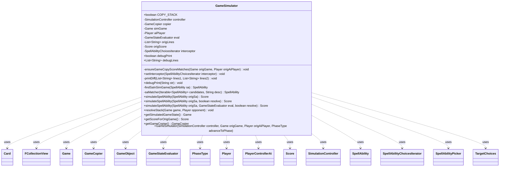

---
aliases:
  - GameSimulator
tags:
  - java/class
  - module/forge-ai
  - pkg/forge/ai/simulation
fqn: forge.ai.simulation.GameSimulator
package: forge.ai.simulation
module: forge-ai
kind: Class
---

# GameSimulator

**Package:** `forge.ai.simulation` &nbsp; **Module:** `forge-ai` &nbsp; **Kind:** Class



## Relationships
**Uses:**
- [[forge.ai.PlayerControllerAi|PlayerControllerAi]]
- [[forge.ai.simulation.GameCopier|GameCopier]]
- [[forge.ai.simulation.GameStateEvaluator|GameStateEvaluator]]
- [[forge.ai.simulation.GameStateEvaluator.Score|Score]]
- [[forge.ai.simulation.SimulationController|SimulationController]]
- [[forge.ai.simulation.SpellAbilityChoicesIterator|SpellAbilityChoicesIterator]]
- [[forge.ai.simulation.SpellAbilityPicker|SpellAbilityPicker]]
- [[forge.game.Game|Game]]
- [[forge.game.GameObject|GameObject]]
- [[forge.game.card.Card|Card]]
- [[forge.game.phase.PhaseType|PhaseType]]
- [[forge.game.player.Player|Player]]
- [[forge.game.spellability.SpellAbility|SpellAbility]]
- [[forge.game.spellability.TargetChoices|TargetChoices]]
- [[forge.util.collect.FCollectionView|FCollectionView]]


## Design Description

GameSimulator is the AI's lookahead engine: it deep-copies the live `Game` through a `GameCopier`, advances the copy to a target `PhaseType`, then plays a candidate `SpellAbility` in that sandbox and returns a `GameStateEvaluator.Score` rating the outcome. By operating entirely on the copy, it lets the AI evaluate moves without mutating the real game, remapping original abilities, targets, and divided allocations onto their copied counterparts before resolution.

It collaborates with `SimulationController` to cache scores and recurse into follow-up plays via a `SpellAbilityPicker`, while an optional `SpellAbilityChoicesIterator` interceptor injects forced choices (X values, targets). Design intent is visible in the `ensureGameCopyScoreMatches` invariant that hard-fails on any copy divergence, the optional `COPY_STACK` path that resolves a pending stack before scoring, and static debug hooks for diffing simulated against original state. TODOs flag known limits: single-opponent resolution and pre-combat blocker simulation.

## Source
`forge-ai/src/main/java/forge/ai/simulation/GameSimulator.java`

```java
package forge.ai.simulation;


import forge.ai.ComputerUtil;
import forge.ai.PlayerControllerAi;
import forge.ai.simulation.GameStateEvaluator.Score;
import forge.game.Game;
import forge.game.GameActionUtil;
import forge.game.GameObject;
import forge.game.card.Card;
import forge.game.phase.PhaseType;
import forge.game.player.Player;
import forge.game.spellability.SpellAbility;
import forge.game.spellability.TargetChoices;
import forge.util.collect.FCollectionView;

import java.util.*;

public class GameSimulator {
    public static boolean COPY_STACK = false;
    final private SimulationController controller;
    private GameCopier copier;
    private Game simGame;
    private Player aiPlayer;
    private GameStateEvaluator eval;
    private List<String> origLines;
    private Score origScore;
    private SpellAbilityChoicesIterator interceptor;

    public GameSimulator(SimulationController controller, Game origGame, Player origAiPlayer, PhaseType advanceToPhase) {
        this.controller = controller;
        copier = new GameCopier(origGame);
        simGame = copier.makeCopy(advanceToPhase, origAiPlayer);

        aiPlayer = (Player) copier.find(origAiPlayer);
        eval = new GameStateEvaluator();

        origLines = new ArrayList<>();
        debugLines = origLines;

        debugPrint = false;
        origScore = eval.getScoreForGameState(origGame, origAiPlayer);

        if (advanceToPhase == null) {
            ensureGameCopyScoreMatches(origGame, origAiPlayer);
        }

        // If the stack on the original game is not empty, resolve it
        // first and get the updated eval score, since this is what we'll
        // want to compare to the eval score after simulating.
        if (COPY_STACK && !origGame.getStackZone().isEmpty()) {
            origLines = new ArrayList<>();
            debugLines = origLines;
            Game copyOrigGame = copier.makeCopy();
            Player copyOrigAiPlayer = copyOrigGame.getPlayers().get(1);
            resolveStack(copyOrigGame, copyOrigGame.getPlayers().get(0));
            origScore = eval.getScoreForGameState(copyOrigGame, copyOrigAiPlayer);
        }

        debugPrint = false;
        debugLines = null;
    }

    private void ensureGameCopyScoreMatches(Game origGame, Player origAiPlayer) {
        eval.setDebugging(true);
        List<String> simLines = new ArrayList<>();
        debugLines = simLines;
        Score simScore = eval.getScoreForGameState(simGame, aiPlayer);
        if (!simScore.equals(origScore)) {
            // Re-eval orig with debug printing.
            origLines = new ArrayList<>();
            debugLines = origLines;
            eval.getScoreForGameState(origGame, origAiPlayer);
            // Print debug info.
            printDiff(origLines, simLines);
            // make sure it gets printed
            System.out.flush();
            throw new RuntimeException("Game copy error. See diff output above for details.");
        }
        eval.setDebugging(false);
    }

    public void setInterceptor(SpellAbilityChoicesIterator interceptor) {
        this.interceptor = interceptor;
        ((PlayerControllerAi) aiPlayer.getController()).getAi().getSimulationPicker().setInterceptor(interceptor);
    }

    private void printDiff(List<String> lines1, List<String> lines2) {
        int i = 0;
        int j = 0;
        Collections.sort(lines1);
        Collections.sort(lines2);
        while (i < lines1.size() && j < lines2.size()) {
            String left = lines1.get(i);
            String right = lines2.get(j);
            int cmp = left.compareTo(right);
            if (cmp == 0) {
                i++; j++;
            } else if (cmp < 0) {
                System.out.println("-" + left);
                i++;
            } else { 
                System.out.println("+"  + right);
                j++;
            }
        }
        while (i < lines1.size()) {
            System.out.println("-" + lines1.get(i++));
        }
        while (j < lines2.size()) {
            System.out.println("+" + lines2.get(j++));
        }
    }

    public static boolean debugPrint;
    public static List<String> debugLines;
    public static void debugPrint(String str) {
        if (debugPrint) {
            System.out.println(str);
        }
        if (debugLines != null) {
            debugLines.add(str);
        }
    }

    private SpellAbility findSaInSimGame(final SpellAbility sa) {
        // is already an ability from sim game
        if (sa.getHostCard().getGame().equals(this.simGame)) {
            return sa;
        }
        Card origHostCard = sa.getHostCard();
        Card hostCard = (Card) copier.find(origHostCard);
        String desc = sa.getDescription();
        FCollectionView<SpellAbility> candidates = hostCard.getSpellAbilities();

        SpellAbility result = saMatcher(candidates, desc);
        for (SpellAbility cSa : candidates) {
            if (result != null) {
                break;
            }
            result = saMatcher(GameActionUtil.getAlternativeCosts(cSa, aiPlayer, true), desc);
        }

        return result;
    }

    private SpellAbility saMatcher(Iterable<SpellAbility> candidates, String desc) {
        // first pass for accuracy (spells with alternative costs)
        for (SpellAbility cSa : candidates) {
            if (desc.equals(cSa.getDescription())) {
                return cSa;
            }
        }
        // fall back for safety
        for (SpellAbility cSa : candidates) {
            if (desc.startsWith(cSa.getDescription())) {
                return cSa;
            }
        }
        return null;
    }

    public Score simulateSpellAbility(SpellAbility origSa) {
        return simulateSpellAbility(origSa, this.eval, true);
    }
    public Score simulateSpellAbility(SpellAbility origSa, boolean resolve) {
        return simulateSpellAbility(origSa, this.eval, resolve);
    }
    public Score simulateSpellAbility(SpellAbility origSa, GameStateEvaluator eval, boolean resolve) {
        SpellAbility sa;
        if (origSa.isLandAbility()) {
            Card hostCard = (Card) copier.find(origSa.getHostCard());
            if (origSa.canPlay()) {
                aiPlayer.playLand(hostCard, origSa);
            } else {
                System.err.println("Simulation: Couldn't play land! " + origSa);
            }
            sa = origSa;
        } else {
            // TODO: optimize: prune identical SA (e.g. two of the same card in hand)
            sa = findSaInSimGame(origSa);
            if (sa == null) {
                System.err.println("Simulation: SA not found! " + origSa + " / " + origSa.getClass());
                return new Score(Integer.MIN_VALUE);
            }

            debugPrint("Found SA " + sa + " on host card " + sa.getHostCard() + " with owner:"+ sa.getHostCard().getOwner());
            sa.setActivatingPlayer(aiPlayer);
            SpellAbility origSaOrSubSa = origSa;
            SpellAbility saOrSubSa = sa;
            do {
                if (origSaOrSubSa.usesTargeting()) {
                    final boolean divided = origSaOrSubSa.isDividedAsYouChoose();
                    for (final GameObject o : origSaOrSubSa.getTargets()) {
                        final GameObject target = copier.find(o);
                        saOrSubSa.getTargets().add(target);
                        if (divided) {
                            saOrSubSa.addDividedAllocation(target, origSaOrSubSa.getDividedValue(o));
                        }
                    }
                }
                origSaOrSubSa = origSaOrSubSa.getSubAbility();
                saOrSubSa = saOrSubSa.getSubAbility();
            } while (saOrSubSa != null);

            if (debugPrint && !sa.getAllTargetChoices().isEmpty()) {
                debugPrint("Targets: ");
                for (TargetChoices target : sa.getAllTargetChoices()) {
                    System.out.print(target);
                }
                System.out.println();
            }
            final SpellAbility playingSa = sa;
            // Is this right?
            simGame.copyLastState();
            boolean success = ComputerUtil.handlePlayingSpellAbility(aiPlayer, sa, () -> {
                if (interceptor != null) {
                    interceptor.announceX(playingSa);
                    interceptor.chooseTargets(playingSa, GameSimulator.this);
                }
            });
            if (!success) {
                return new Score(Integer.MIN_VALUE);
            }
        }

        if (resolve) {
            // TODO: Support multiple opponents.
            Player opponent = aiPlayer.getWeakestOpponent();
            resolveStack(simGame, opponent);
        }

        // TODO: If this is during combat, before blockers are declared,
        // we should simulate how combat will resolve and evaluate that
        // state instead!
        List<String> simLines = null;
        if (debugPrint) {
            debugPrint("SimGame:");
            simLines = new ArrayList<>();
            debugLines = simLines;
            debugPrint = false;
        }
        Score score = eval.getScoreForGameState(simGame, aiPlayer);
        if (simLines != null) {
            debugLines = null;
            debugPrint = true;
            printDiff(origLines, simLines);
        }
        controller.possiblyCacheResult(score, origSa);
        if (controller.shouldRecurse() && !simGame.isGameOver()) {
            controller.push(sa, score, this);
            SpellAbilityPicker sim = new SpellAbilityPicker(simGame, aiPlayer);
            SpellAbility nextSa = sim.chooseSpellAbilityToPlay(controller);
            if (nextSa != null) {
                score = sim.getScoreForChosenAbility();
            }
            controller.pop(score, nextSa);
        }

        return score;
    }

    public static void resolveStack(final Game game, final Player opponent) {
        // TODO: This needs to set an AI controller for all opponents, in case of multiplayer.
        PlayerControllerAi sim = new PlayerControllerAi(game, opponent, opponent.getLobbyPlayer());
        sim.setUseSimulation(true);
        opponent.runWithController(() -> {
            final Set<Card> allAffectedCards = new HashSet<>();
            game.getAction().checkStateEffects(false, allAffectedCards);
            game.getStack().addAllTriggeredAbilitiesToStack();
            while (!game.getStack().isEmpty() && !game.isGameOver()) {
                debugPrint("Resolving:" + game.getStack().peekAbility());

                // Resolve the top effect on the stack.
                game.getStack().resolveStack();

                // Evaluate state based effects as a result of resolving stack.
                // Note: Needs to happen after resolve stack rather than at the
                // top of the loop to ensure state effects are evaluated after the
                // last resolved effect
                game.getAction().checkStateEffects(false, allAffectedCards);

                // Add any triggers additional triggers as a result of the above.
                // Must be below state effects, since legendary rule is evaluated
                // as part of state effects and trigger come afterward. (e.g. to
                // correctly handle two Dark Depths - one having no counters).
                game.getStack().addAllTriggeredAbilitiesToStack();

                // Continue until stack is empty.
            }
        }, sim);
    }

    public Game getSimulatedGameState() {
        return simGame;
    }

    public Score getScoreForOrigGame() {
        return origScore;
    }

    public GameCopier getGameCopier() {
        return copier;
    }
}
```

## Python
`forge/ai/simulation/GameSimulator.py`

```python
from forge.ai.ComputerUtil import ComputerUtil
from forge.ai.PlayerControllerAi import PlayerControllerAi
from forge.ai.simulation.GameStateEvaluator.Score import Score
from forge.ai.simulation.GameCopier import GameCopier
from forge.ai.simulation.GameStateEvaluator import GameStateEvaluator
from forge.ai.simulation.SimulationController import SimulationController
from forge.ai.simulation.SpellAbilityChoicesIterator import SpellAbilityChoicesIterator
from forge.ai.simulation.SpellAbilityPicker import SpellAbilityPicker
from forge.game.Game import Game
from forge.game.GameActionUtil import GameActionUtil
from forge.game.GameObject import GameObject
from forge.game.card.Card import Card
from forge.game.phase.PhaseType import PhaseType
from forge.game.player.Player import Player
from forge.game.spellability.SpellAbility import SpellAbility
from forge.game.spellability.TargetChoices import TargetChoices
from forge.util.collect.FCollectionView import FCollectionView

import sys


class GameSimulator:
    COPY_STACK = False
    debugLines = None

    def __init__(self, controller: SimulationController, origGame: Game, origAiPlayer: Player, advanceToPhase: PhaseType):
        self.controller = controller
        self.copier = GameCopier(origGame)
        self.simGame = self.copier.makeCopy(advanceToPhase, origAiPlayer)

        self.aiPlayer = self.copier.find(origAiPlayer)
        self.eval = GameStateEvaluator()

        self.interceptor = None

        self.origLines = []
        GameSimulator.debugLines = self.origLines

        GameSimulator.debugPrint.flag = False
        self.origScore = self.eval.getScoreForGameState(origGame, origAiPlayer)

        if advanceToPhase is None:
            self.ensureGameCopyScoreMatches(origGame, origAiPlayer)

        # If the stack on the original game is not empty, resolve it
        # first and get the updated eval score, since this is what we'll
        # want to compare to the eval score after simulating.
        if GameSimulator.COPY_STACK and not origGame.getStackZone().isEmpty():
            self.origLines = []
            GameSimulator.debugLines = self.origLines
            copyOrigGame = self.copier.makeCopy()
            copyOrigAiPlayer = copyOrigGame.getPlayers()[1]
            GameSimulator.resolveStack(copyOrigGame, copyOrigGame.getPlayers()[0])
            self.origScore = self.eval.getScoreForGameState(copyOrigGame, copyOrigAiPlayer)

        GameSimulator.debugPrint.flag = False
        GameSimulator.debugLines = None

    def ensureGameCopyScoreMatches(self, origGame: Game, origAiPlayer: Player) -> None:
        self.eval.setDebugging(True)
        simLines = []
        GameSimulator.debugLines = simLines
        simScore = self.eval.getScoreForGameState(self.simGame, self.aiPlayer)
        if simScore != self.origScore:
            # Re-eval orig with debug printing.
            self.origLines = []
            GameSimulator.debugLines = self.origLines
            self.eval.getScoreForGameState(origGame, origAiPlayer)
            # Print debug info.
            self.printDiff(self.origLines, simLines)
            # make sure it gets printed
            sys.stdout.flush()
            raise RuntimeError("Game copy error. See diff output above for details.")
        self.eval.setDebugging(False)

    def setInterceptor(self, interceptor: SpellAbilityChoicesIterator) -> None:
        self.interceptor = interceptor
        self.aiPlayer.getController().getAi().getSimulationPicker().setInterceptor(interceptor)

    def printDiff(self, lines1: list, lines2: list) -> None:
        i = 0
        j = 0
        lines1.sort()
        lines2.sort()
        while i < len(lines1) and j < len(lines2):
            left = lines1[i]
            right = lines2[j]
            if left == right:
                i += 1
                j += 1
            elif left < right:
                print("-" + left)
                i += 1
            else:
                print("+" + right)
                j += 1
        while i < len(lines1):
            print("-" + lines1[i])
            i += 1
        while j < len(lines2):
            print("+" + lines2[j])
            j += 1

    @staticmethod
    def debugPrint(str) -> None:
        if GameSimulator.debugPrint.flag:
            print(str)
        if GameSimulator.debugLines is not None:
            GameSimulator.debugLines.append(str)

    def findSaInSimGame(self, sa: SpellAbility) -> SpellAbility:
        # is already an ability from sim game
        if sa.getHostCard().getGame() == self.simGame:
            return sa
        origHostCard = sa.getHostCard()
        hostCard = self.copier.find(origHostCard)
        desc = sa.getDescription()
        candidates = hostCard.getSpellAbilities()

        result = self.saMatcher(candidates, desc)
        for cSa in candidates:
            if result is not None:
                break
            result = self.saMatcher(GameActionUtil.getAlternativeCosts(cSa, self.aiPlayer, True), desc)

        return result

    def saMatcher(self, candidates, desc: str) -> SpellAbility:
        # first pass for accuracy (spells with alternative costs)
        for cSa in candidates:
            if desc == cSa.getDescription():
                return cSa
        # fall back for safety
        for cSa in candidates:
            if desc.startswith(cSa.getDescription()):
                return cSa
        return None

    def simulateSpellAbility(self, origSa: SpellAbility, eval=None, resolve: bool = True) -> Score:
        if isinstance(eval, bool):
            resolve = eval
            eval = None
        if eval is None:
            eval = self.eval

        if origSa.isLandAbility():
            hostCard = self.copier.find(origSa.getHostCard())
            if origSa.canPlay():
                self.aiPlayer.playLand(hostCard, origSa)
            else:
                print("Simulation: Couldn't play land! " + str(origSa), file=sys.stderr)
            sa = origSa
        else:
            # TODO: optimize: prune identical SA (e.g. two of the same card in hand)
            sa = self.findSaInSimGame(origSa)
            if sa is None:
                print("Simulation: SA not found! " + str(origSa) + " / " + str(type(origSa)), file=sys.stderr)
                return Score(-2147483648)

            GameSimulator.debugPrint("Found SA " + str(sa) + " on host card " + str(sa.getHostCard()) + " with owner:" + str(sa.getHostCard().getOwner()))
            sa.setActivatingPlayer(self.aiPlayer)
            origSaOrSubSa = origSa
            saOrSubSa = sa
            while True:
                if origSaOrSubSa.usesTargeting():
                    divided = origSaOrSubSa.isDividedAsYouChoose()
                    for o in origSaOrSubSa.getTargets():
                        target = self.copier.find(o)
                        saOrSubSa.getTargets().add(target)
                        if divided:
                            saOrSubSa.addDividedAllocation(target, origSaOrSubSa.getDividedValue(o))
                origSaOrSubSa = origSaOrSubSa.getSubAbility()
                saOrSubSa = saOrSubSa.getSubAbility()
                if saOrSubSa is None:
                    break

            if GameSimulator.debugPrint.flag and len(sa.getAllTargetChoices()) > 0:
                GameSimulator.debugPrint("Targets: ")
                for target in sa.getAllTargetChoices():
                    print(target, end="")
                print()
            playingSa = sa

            # Is this right?
            self.simGame.copyLastState()

            def _onPlay():
                if self.interceptor is not None:
                    self.interceptor.announceX(playingSa)
                    self.interceptor.chooseTargets(playingSa, self)

            success = ComputerUtil.handlePlayingSpellAbility(self.aiPlayer, sa, _onPlay)
            if not success:
                return Score(-2147483648)

        if resolve:
            # TODO: Support multiple opponents.
            opponent = self.aiPlayer.getWeakestOpponent()
            GameSimulator.resolveStack(self.simGame, opponent)

        # TODO: If this is during combat, before blockers are declared,
        # we should simulate how combat will resolve and evaluate that
        # state instead!
        simLines = None
        if GameSimulator.debugPrint.flag:
            GameSimulator.debugPrint("SimGame:")
            simLines = []
            GameSimulator.debugLines = simLines
            GameSimulator.debugPrint.flag = False
        score = eval.getScoreForGameState(self.simGame, self.aiPlayer)
        if simLines is not None:
            GameSimulator.debugLines = None
            GameSimulator.debugPrint.flag = True
            self.printDiff(self.origLines, simLines)
        self.controller.possiblyCacheResult(score, origSa)
        if self.controller.shouldRecurse() and not self.simGame.isGameOver():
            self.controller.push(sa, score, self)
            sim = SpellAbilityPicker(self.simGame, self.aiPlayer)
            nextSa = sim.chooseSpellAbilityToPlay(self.controller)
            if nextSa is not None:
                score = sim.getScoreForChosenAbility()
            self.controller.pop(score, nextSa)

        return score

    @staticmethod
    def resolveStack(game: Game, opponent: Player) -> None:
        # TODO: This needs to set an AI controller for all opponents, in case of multiplayer.
        sim = PlayerControllerAi(game, opponent, opponent.getLobbyPlayer())
        sim.setUseSimulation(True)

        def _runnable():
            allAffectedCards = set()
            game.getAction().checkStateEffects(False, allAffectedCards)
            game.getStack().addAllTriggeredAbilitiesToStack()
            while not game.getStack().isEmpty() and not game.isGameOver():
                GameSimulator.debugPrint("Resolving:" + str(game.getStack().peekAbility()))

                # Resolve the top effect on the stack.
                game.getStack().resolveStack()

                # Evaluate state based effects as a result of resolving stack.
                # Note: Needs to happen after resolve stack rather than at the
                # top of the loop to ensure state effects are evaluated after the
                # last resolved effect
                game.getAction().checkStateEffects(False, allAffectedCards)

                # Add any triggers additional triggers as a result of the above.
                # Must be below state effects, since legendary rule is evaluated
                # as part of state effects and trigger come afterward. (e.g. to
                # correctly handle two Dark Depths - one having no counters).
                game.getStack().addAllTriggeredAbilitiesToStack()

                # Continue until stack is empty.

        opponent.runWithController(_runnable, sim)

    def getSimulatedGameState(self) -> Game:
        return self.simGame

    def getScoreForOrigGame(self) -> Score:
        return self.origScore

    def getGameCopier(self) -> GameCopier:
        return self.copier


GameSimulator.debugPrint.flag = False
```
