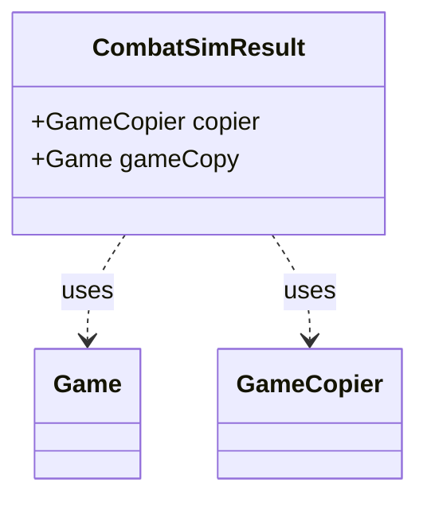

---
aliases:
  - CombatSimResult
tags:
  - java/class
  - module/forge-ai
  - pkg/forge/ai/simulation
fqn: forge.ai.simulation.GameStateEvaluator.CombatSimResult
package: forge.ai.simulation
module: forge-ai
kind: Class
---

# CombatSimResult

**Package:** `forge.ai.simulation`   **Module:** `forge-ai`   **Kind:** Class



## Relationships
**Uses:**
- [[forge.ai.simulation.GameCopier|GameCopier]]
- [[forge.game.Game|Game]]

## Design Description

CombatSimResult is a private static value holder nested within GameStateEvaluator, used internally by Forge's AI combat simulation to bundle the two artifacts produced when a hypothetical combat is played out on a forked game state. It pairs a GameCopier—the mechanism that clones the live game—with the resulting Game copy, so callers can both inspect the simulated outcome and retain the copier needed to map entities between the original and cloned games.

Its design intent is deliberately minimal: as a private static inner class with public fields and no behavior, it functions as a lightweight tuple rather than an encapsulated object, trading strict information hiding for convenience within GameStateEvaluator's evaluation logic. Keeping it private confines this coupling to its enclosing class, while the GameCopier reference signals that simulated results remain tied to their cloning context.

## Source
`forge-ai/src/main/java/forge/ai/simulation/GameStateEvaluator.java` — declaration excerpt

```java
    private static class CombatSimResult {
        public GameCopier copier;
        public Game gameCopy;
    }
```

## Python
`forge/ai/simulation/GameStateEvaluator/CombatSimResult.py`

```python
from forge.ai.simulation.GameCopier import GameCopier
from forge.game.Game import Game


class CombatSimResult:
    def __init__(self):
        self.copier: GameCopier = None
        self.gameCopy: Game = None
```
