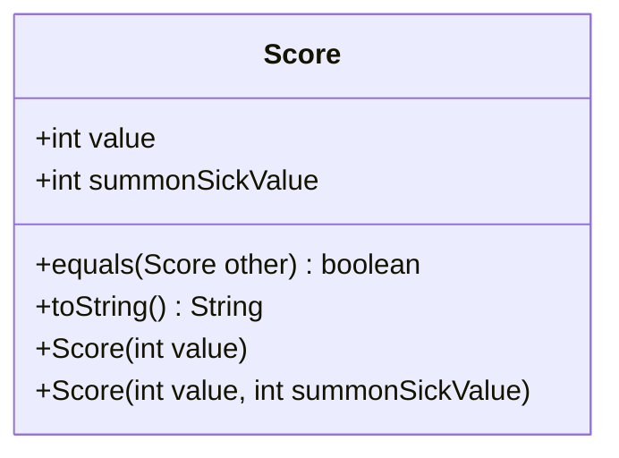

---
aliases:
  - Score
tags:
  - java/class
  - module/forge-ai
  - pkg/forge/ai/simulation
fqn: forge.ai.simulation.GameStateEvaluator.Score
package: forge.ai.simulation
module: forge-ai
kind: Class
---

# Score

**Package:** `forge.ai.simulation`   **Module:** `forge-ai`   **Kind:** Class



## Design Description

The `Score` class is a small, immutable value object nested within `GameStateEvaluator`, used by Forge's AI simulation package to quantify how favorable a hypothetical game state is. It captures two integer measures: `value`, the overall evaluation, and `summonSickValue`, an alternative score accounting for creatures still affected by summoning sickness. Both fields are declared `final` and set only through its two constructors, with the single-argument form defaulting `summonSickValue` to `value`.

As a plain data holder it implements no interface and extends only `Object`, overriding `equals` for field-wise comparison and `toString` for compact, human-readable diagnostics that surface the summon-sick figure only when it diverges. The design intent is a lightweight, comparable container the evaluator can produce and the AI's decision logic can rank when choosing among simulated moves.

## Source
`forge-ai/src/main/java/forge/ai/simulation/GameStateEvaluator.java` — declaration excerpt

```java
    public static class Score {
        public final int value;
        public final int summonSickValue;
        
        public Score(int value) {
            this.value = value;
            this.summonSickValue = value;
        }

        public Score(int value, int summonSickValue) {
            this.value = value;
            this.summonSickValue = summonSickValue;
        }

        public boolean equals(Score other) {
            if (other == null)
                return false;
            return value == other.value && summonSickValue == other.summonSickValue;
        }

        public String toString() {
            return value + (summonSickValue != value ? " (ss " + summonSickValue + ")" :"");
        }
    }
```
