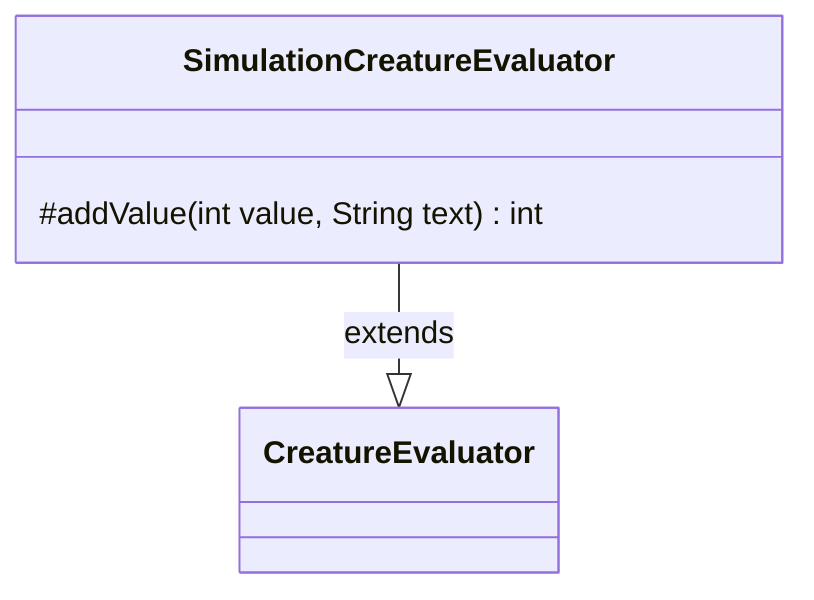

---
aliases:
  - SimulationCreatureEvaluator
tags:
  - java/class
  - module/forge-ai
  - pkg/forge/ai/simulation
fqn: forge.ai.simulation.GameStateEvaluator.SimulationCreatureEvaluator
package: forge.ai.simulation
module: forge-ai
kind: Class
---

# SimulationCreatureEvaluator

**Package:** `forge.ai.simulation`   **Module:** `forge-ai`   **Kind:** Class



## Relationships
**Extends:**
- [[forge.ai.CreatureEvaluator|CreatureEvaluator]]

## Design Description

`SimulationCreatureEvaluator` is a private inner class of `GameStateEvaluator` that specializes the AI's standard creature-scoring logic for the simulation engine. By extending `CreatureEvaluator`, it inherits the full heuristic for assigning a numeric value to a creature while overriding only the protected `addValue` hook, so it participates in the same evaluation pipeline as the base type and remains substitutable for it.

The override adds no scoring behavior of its own; instead it instruments each non-zero value contribution, emitting a `GameSimulator.debugPrint` trace of the amount and its explanatory `text` when `debugging` is enabled, then delegating to `super.addValue`. The design intent is diagnostic transparency: by hooking the single point where partial values are accumulated, it exposes a breakdown of how a creature's score is composed during simulation without altering the result, and its access to the enclosing instance's `debugging` flag keeps the tracing cheap and disabled by default.

## Source
`forge-ai/src/main/java/forge/ai/simulation/GameStateEvaluator.java` — declaration excerpt

```java
    private class SimulationCreatureEvaluator extends CreatureEvaluator {
        @Override
        protected int addValue(int value, String text) {
            if (debugging && value != 0) {
                GameSimulator.debugPrint(value + " via " + text);
            }
            return super.addValue(value, text);
        }
    }
```
