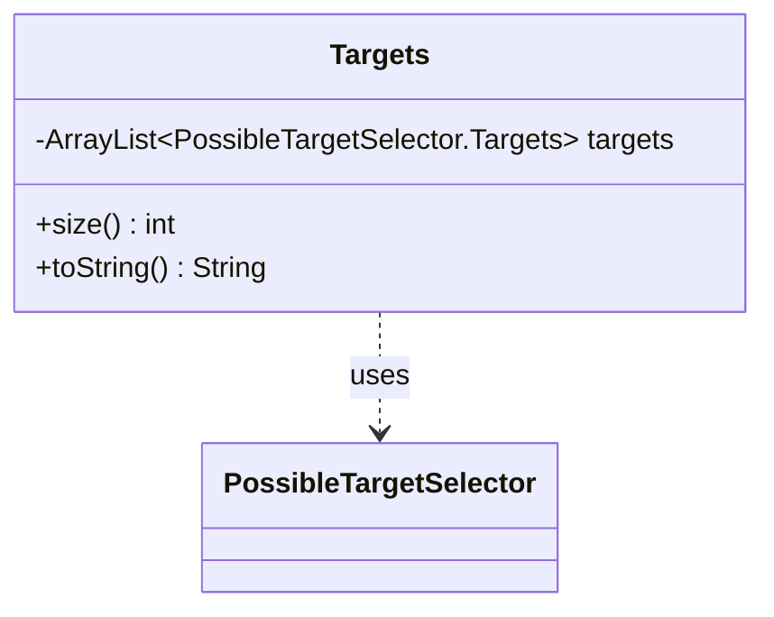

---
aliases:
  - Targets
tags:
  - java/class
  - module/forge-ai
  - pkg/forge/ai/simulation
fqn: forge.ai.simulation.MultiTargetSelector.Targets
package: forge.ai.simulation
module: forge-ai
kind: Class
---

# Targets

**Package:** `forge.ai.simulation`   **Module:** `forge-ai`   **Kind:** Class



## Relationships
**Uses:**
- [[forge.ai.simulation.PossibleTargetSelector|PossibleTargetSelector]]
- [[forge.ai.simulation.PossibleTargetSelector.Targets|Targets]]

## Design Description

`MultiTargetSelector.Targets` is a lightweight value holder representing a single, fully-resolved combination of targets for a multi-target spell or ability during AI simulation. It aggregates an ordered `ArrayList` of `PossibleTargetSelector.Targets`, where each element captures the chosen targets for one distinct targeting slot, so the class composes several single-selector results into one coherent multi-target choice.

As a static nested class it exists purely as data: it exposes `size()` to report how many sub-selections it bundles and overrides `toString()` to render its members as a comma-separated list for logging and diagnostics. It holds no targeting logic of its own, delegating that to the `PossibleTargetSelector.Targets` instances it collaborates with; the surrounding `MultiTargetSelector` is responsible for populating and evaluating these combinations. This deliberate separation keeps the structure a simple, immutable-by-convention container that the simulation can enumerate and compare cheaply.

## Source
`forge-ai/src/main/java/forge/ai/simulation/MultiTargetSelector.java` — declaration excerpt

```java
    public static class Targets {
        private ArrayList<PossibleTargetSelector.Targets> targets;

        public int size() {
            return targets.size();
        }

        @Override
        public String toString() {
            StringBuilder sb = new StringBuilder();
            for (PossibleTargetSelector.Targets tgt : targets) {
                if (sb.length() != 0) {
                    sb.append(", ");
                }
                sb.append(tgt.toString());
            }
            return sb.toString();
        }
    }
```

## Python
`forge/ai/simulation/MultiTargetSelector/Targets.py`

```python
from forge.ai.simulation.PossibleTargetSelector import PossibleTargetSelector


class Targets:
    def __init__(self):
        self.targets: list[PossibleTargetSelector.Targets] = None

    def size(self) -> int:
        return len(self.targets)

    def __str__(self) -> str:
        sb = []
        for tgt in self.targets:
            if len(sb) != 0:
                sb.append(", ")
            sb.append(str(tgt))
        return "".join(sb)
```
