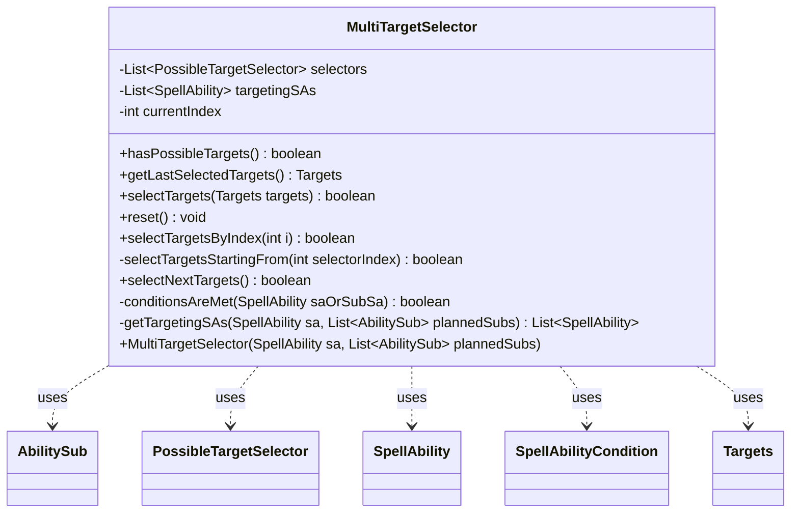

---
aliases:
  - MultiTargetSelector
tags:
  - java/class
  - module/forge-ai
  - pkg/forge/ai/simulation
fqn: forge.ai.simulation.MultiTargetSelector
package: forge.ai.simulation
module: forge-ai
kind: Class
---

# MultiTargetSelector

**Package:** `forge.ai.simulation`   **Module:** `forge-ai`   **Kind:** Class



## Relationships
**Uses:**
- [[forge.ai.simulation.MultiTargetSelector.Targets|Targets]]
- [[forge.ai.simulation.PossibleTargetSelector|PossibleTargetSelector]]
- [[forge.ai.simulation.PossibleTargetSelector.Targets|Targets]]
- [[forge.game.spellability.AbilitySub|AbilitySub]]
- [[forge.game.spellability.SpellAbility|SpellAbility]]
- [[forge.game.spellability.SpellAbilityCondition|SpellAbilityCondition]]

## Design Description

The class `MultiTargetSelector` coordinates target selection across a spell's entire ability chain, treating each individually-targeting `SpellAbility` — the root spell, its chained sub-abilities, and any `plannedSubs` representing not-yet-attached charm-style mode choices — as one dimension of a combined targeting problem. It wraps each such ability in a `PossibleTargetSelector` and exposes the aggregate as a single nested `Targets` value object, letting the AI simulator enumerate, snapshot, restore, and index whole target assignments by position.

Its notable design intent is an odometer-style enumeration: `selectNextTargets` advances the last selector first and backtracks only when it is exhausted, resetting all downstream selectors (whose legal targets depend on earlier picks) to yield a deterministic AA, AB, BA, BB ordering. The constructor filters to abilities that both use targeting and whose `SpellAbilityCondition` is currently met, keeping the search space confined to valid options.

## Source
`forge-ai/src/main/java/forge/ai/simulation/MultiTargetSelector.java`

```java
package forge.ai.simulation;

import forge.game.spellability.AbilitySub;
import forge.game.spellability.SpellAbility;
import forge.game.spellability.SpellAbilityCondition;

import java.util.ArrayList;
import java.util.List;

public class MultiTargetSelector {
    public static class Targets {
        private ArrayList<PossibleTargetSelector.Targets> targets;

        public int size() {
            return targets.size();
        }

        @Override
        public String toString() {
            StringBuilder sb = new StringBuilder();
            for (PossibleTargetSelector.Targets tgt : targets) {
                if (sb.length() != 0) {
                    sb.append(", ");
                }
                sb.append(tgt.toString());
            }
            return sb.toString();
        }
    }

    private final List<PossibleTargetSelector> selectors;
    private final List<SpellAbility> targetingSAs;
    private int currentIndex;

    public MultiTargetSelector(SpellAbility sa, List<AbilitySub> plannedSubs) {
        targetingSAs = getTargetingSAs(sa, plannedSubs);
        selectors = new ArrayList<>(targetingSAs.size());
        for (int i = 0; i < targetingSAs.size(); i++) {
            selectors.add(new PossibleTargetSelector(sa, targetingSAs.get(i), i));
        }
        currentIndex = -1;
    }

    public boolean hasPossibleTargets() {
        if (targetingSAs.isEmpty()) {
            return false;
        }
        for (PossibleTargetSelector selector : selectors) {
            if (!selector.hasPossibleTargets()) {
                return false;
            }
        }
        return true;
    }

    public Targets getLastSelectedTargets() {
        Targets targets = new Targets();
        targets.targets = new ArrayList<>(selectors.size());
        for (PossibleTargetSelector selector : selectors) {
            targets.targets.add(selector.getLastSelectedTargets());
        }
        return targets;
    }

    public boolean selectTargets(Targets targets) {
        if (targets.targets.size() != selectors.size()) {
            return false;
        }
        for (int i = 0; i < selectors.size(); i++) {
            selectors.get(i).reset();
            if (!selectors.get(i).selectTargets(targets.targets.get(i))) {
                return false;
            }
        }
        return true;
    }

    public void reset() {
        for (PossibleTargetSelector selector : selectors) {
            selector.reset();
        }
        currentIndex = -1;
    }

    public boolean selectTargetsByIndex(int i) {
        // The caller is telling us to select the i-th possible set of targets.
        if (i < currentIndex) {
            reset();
        }
        while (currentIndex < i) {
            if (!selectNextTargets()) {
                return false;
            }
        }
        return true;
    }

    private boolean selectTargetsStartingFrom(int selectorIndex) {
        // Don't reset the current selector, as it still has the correct list of targets set and has
        // to remember its current/next target index. Subsequent selectors need a reset since their
        // possible targets may change based on what was chosen for earlier ones.
        if (selectors.get(selectorIndex).selectNextTargets()) {
            for (int i = selectorIndex + 1; i < selectors.size(); i++) {
                selectors.get(i).reset();
                if (!selectors.get(i).selectNextTargets()) {
                    return false;
                }
            }
            return true;
        }
        return false;
    }

    public boolean selectNextTargets() {
        if (selectors.size() == 0) {
            return false;
        }
        if (currentIndex == -1) {
            // Select the first set of targets (calls selectNextTargets() on each selector).
            if (selectTargetsStartingFrom(0)) {
                currentIndex = 0;
                return true;
            }
            // No possible targets.
            return false;
        }
        // Subsequent call, first try selecting a new target for the last selector. If that doesn't
        // work, backtrack (decrement selector index) and try selecting targets from there.
        // This approach ensures that leaf selectors (end of list) are advanced first, before
        // previous ones, so that we get an AA,AB,BA,BB ordering.
        int selectorIndex = selectors.size() - 1;
        while (!selectTargetsStartingFrom(selectorIndex)) {
            if (selectorIndex == 0) {
                // No more possible targets.
                return false;
            }
            selectorIndex--;
        }
        currentIndex++;
        return true;
    }

    private static boolean conditionsAreMet(SpellAbility saOrSubSa) {
        SpellAbilityCondition conditions = saOrSubSa.getConditions();
        return conditions == null || conditions.areMet(saOrSubSa);
    }

    private List<SpellAbility> getTargetingSAs(SpellAbility sa, List<AbilitySub> plannedSubs) {
        List<SpellAbility> result = new ArrayList<>();
        for (SpellAbility saOrSubSa = sa; saOrSubSa != null; saOrSubSa = saOrSubSa.getSubAbility()) {
            if (saOrSubSa.usesTargeting() && conditionsAreMet(saOrSubSa)) {
                result.add(saOrSubSa);
            }
        }
        // When plannedSubs is provided, also consider them even though they've not yet been added to the
        // sub-ability chain. This is the case when we're choosing modes for a charm-style effect.
        if (plannedSubs != null) {
            for (AbilitySub sub : plannedSubs) {
                if (sub.usesTargeting() && conditionsAreMet(sub)) {
                    result.add(sub);
                }
            }
        }
        return result;
    }
}
```

## Python
`forge/ai/simulation/MultiTargetSelector.py`

```python
from forge.game.spellability.AbilitySub import AbilitySub
from forge.game.spellability.SpellAbility import SpellAbility
from forge.game.spellability.SpellAbilityCondition import SpellAbilityCondition
from forge.ai.simulation.PossibleTargetSelector import PossibleTargetSelector


class MultiTargetSelector:
    class Targets:
        def __init__(self):
            self.targets = None

        def size(self) -> int:
            return len(self.targets)

        def __str__(self) -> str:
            sb = []
            for tgt in self.targets:
                if len(sb) != 0:
                    sb.append(", ")
                sb.append(str(tgt))
            return "".join(sb)

    def __init__(self, sa: SpellAbility, plannedSubs: list[AbilitySub]):
        self.targetingSAs = self.getTargetingSAs(sa, plannedSubs)
        self.selectors = []
        for i in range(len(self.targetingSAs)):
            self.selectors.append(PossibleTargetSelector(sa, self.targetingSAs[i], i))
        self.currentIndex = -1

    def hasPossibleTargets(self) -> bool:
        if len(self.targetingSAs) == 0:
            return False
        for selector in self.selectors:
            if not selector.hasPossibleTargets():
                return False
        return True

    def getLastSelectedTargets(self) -> "MultiTargetSelector.Targets":
        targets = MultiTargetSelector.Targets()
        targets.targets = []
        for selector in self.selectors:
            targets.targets.append(selector.getLastSelectedTargets())
        return targets

    def selectTargets(self, targets: "MultiTargetSelector.Targets") -> bool:
        if len(targets.targets) != len(self.selectors):
            return False
        for i in range(len(self.selectors)):
            self.selectors[i].reset()
            if not self.selectors[i].selectTargets(targets.targets[i]):
                return False
        return True

    def reset(self) -> None:
        for selector in self.selectors:
            selector.reset()
        self.currentIndex = -1

    def selectTargetsByIndex(self, i: int) -> bool:
        # The caller is telling us to select the i-th possible set of targets.
        if i < self.currentIndex:
            self.reset()
        while self.currentIndex < i:
            if not self.selectNextTargets():
                return False
        return True

    def selectTargetsStartingFrom(self, selectorIndex: int) -> bool:
        # Don't reset the current selector, as it still has the correct list of targets set and has
        # to remember its current/next target index. Subsequent selectors need a reset since their
        # possible targets may change based on what was chosen for earlier ones.
        if self.selectors[selectorIndex].selectNextTargets():
            for i in range(selectorIndex + 1, len(self.selectors)):
                self.selectors[i].reset()
                if not self.selectors[i].selectNextTargets():
                    return False
            return True
        return False

    def selectNextTargets(self) -> bool:
        if len(self.selectors) == 0:
            return False
        if self.currentIndex == -1:
            # Select the first set of targets (calls selectNextTargets() on each selector).
            if self.selectTargetsStartingFrom(0):
                self.currentIndex = 0
                return True
            # No possible targets.
            return False
        # Subsequent call, first try selecting a new target for the last selector. If that doesn't
        # work, backtrack (decrement selector index) and try selecting targets from there.
        # This approach ensures that leaf selectors (end of list) are advanced first, before
        # previous ones, so that we get an AA,AB,BA,BB ordering.
        selectorIndex = len(self.selectors) - 1
        while not self.selectTargetsStartingFrom(selectorIndex):
            if selectorIndex == 0:
                # No more possible targets.
                return False
            selectorIndex -= 1
        self.currentIndex += 1
        return True

    @staticmethod
    def conditionsAreMet(saOrSubSa: SpellAbility) -> bool:
        conditions = saOrSubSa.getConditions()
        return conditions is None or conditions.areMet(saOrSubSa)

    def getTargetingSAs(self, sa: SpellAbility, plannedSubs: list[AbilitySub]) -> list[SpellAbility]:
        result = []
        saOrSubSa = sa
        while saOrSubSa is not None:
            if saOrSubSa.usesTargeting() and self.conditionsAreMet(saOrSubSa):
                result.append(saOrSubSa)
            saOrSubSa = saOrSubSa.getSubAbility()
        # When plannedSubs is provided, also consider them even though they've not yet been added to the
        # sub-ability chain. This is the case when we're choosing modes for a charm-style effect.
        if plannedSubs is not None:
            for sub in plannedSubs:
                if sub.usesTargeting() and self.conditionsAreMet(sub):
                    result.append(sub)
        return result
```
