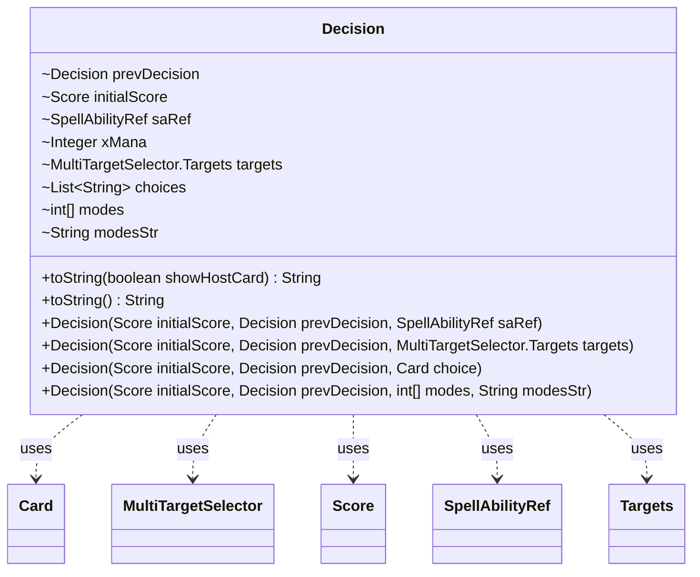

---
aliases:
  - Decision
tags:
  - java/class
  - module/forge-ai
  - pkg/forge/ai/simulation
fqn: forge.ai.simulation.Plan.Decision
package: forge.ai.simulation
module: forge-ai
kind: Class
---

# Decision

**Package:** `forge.ai.simulation`   **Module:** `forge-ai`   **Kind:** Class



## Relationships
**Uses:**
- [[forge.ai.simulation.GameStateEvaluator.Score|Score]]
- [[forge.ai.simulation.MultiTargetSelector|MultiTargetSelector]]
- [[forge.ai.simulation.MultiTargetSelector.Targets|Targets]]
- [[forge.ai.simulation.Plan.SpellAbilityRef|SpellAbilityRef]]
- [[forge.game.card.Card|Card]]

## Design Description

A nested static helper that captures one step of an AI simulation plan. Each `Decision` records the `Score` (`initialScore`) the game state held at that point and links backward to its `prevDecision`, forming a singly-linked chain that reconstructs the full sequence of AI choices. Its four constructors model the mutually exclusive kinds of choice a step can represent: casting/activating a referenced ability (`SpellAbilityRef`, optionally with an X-mana value), selecting targets (`MultiTargetSelector.Targets`), naming a card (`Card`), or picking modes (`int[]` plus a display string).

As a plain data holder it carries no behavior beyond `toString`, which renders a human-readable trace of the step — splicing the X value into the ability text and appending targets and chosen names. The package-private fields and `modesStr` "for human pretty-print consumption only" signal it is an internal record for the simulation evaluator, not a public API.

## Source
`forge-ai/src/main/java/forge/ai/simulation/Plan.java` — declaration excerpt

```java
    public static class Decision {
        final Decision prevDecision;
        final Score initialScore;

        final SpellAbilityRef saRef;
        Integer xMana;
        MultiTargetSelector.Targets targets;
        List<String> choices;
        int[] modes;
        String modesStr; // for human pretty-print consumption only

        public Decision(Score initialScore, Decision prevDecision, SpellAbilityRef saRef) {
            this.initialScore = initialScore;
            this.prevDecision = prevDecision;
            this.saRef = saRef;
        }

        public Decision(Score initialScore, Decision prevDecision, MultiTargetSelector.Targets targets) {
            this.initialScore = initialScore;
            this.prevDecision = prevDecision;
            this.saRef = null;
            this.targets = targets;
        }

        public Decision(Score initialScore, Decision prevDecision, Card choice) {
            this.initialScore = initialScore;
            this.prevDecision = prevDecision;
            this.saRef = null;
            this.choices = new ArrayList<>();
            this.choices.add(choice.getName());
        }

        public Decision(Score initialScore, Decision prevDecision, int[] modes, String modesStr) {
            this.initialScore = initialScore;
            this.prevDecision = prevDecision;
            this.saRef = null;
            this.modes = modes;
            this.modesStr = modesStr;
        }

        public String toString(boolean showHostCard) {
            StringBuilder sb = new StringBuilder();
            if (!showHostCard) {
                sb.append("[initScore=").append(initialScore).append(" ");
            }
            if (modesStr != null) {
                sb.append(modesStr);
            } else {
                String sa = saRef.toString(showHostCard);
                if (xMana != null) {
                    sa = sa.replace("(X=0)", "(X=" + xMana + ")");
                }
                sb.append(sa);
            }
            if (targets != null) {
                sb.append(" (targets: ").append(targets).append(")");
            }
            if (choices != null) {
                sb.append(" (chosen: ").append(Joiner.on(", ").join(choices)).append(")");
            }
            if (!showHostCard) {
                sb.append("]");
            }
            return sb.toString();
        }

        @Override
        public String toString() {
            return toString(false);
        }
    }
```

## Python
`forge/ai/simulation/Plan/Decision.py`

```python
from forge.ai.simulation.GameStateEvaluator.Score import Score
from forge.ai.simulation.MultiTargetSelector import MultiTargetSelector
from forge.ai.simulation.MultiTargetSelector.Targets import Targets
from forge.ai.simulation.Plan.SpellAbilityRef import SpellAbilityRef
from forge.game.card.Card import Card


class Decision:
    def __init__(self, initialScore, prevDecision, arg3, modesStr=None):
        self.prevDecision = prevDecision
        self.initialScore = initialScore

        self.saRef = None
        self.xMana = None
        self.targets = None
        self.choices = None
        self.modes = None
        self.modesStr = None

        if isinstance(arg3, SpellAbilityRef):
            # Decision(Score initialScore, Decision prevDecision, SpellAbilityRef saRef)
            self.saRef = arg3
        elif isinstance(arg3, Targets):
            # Decision(Score initialScore, Decision prevDecision, MultiTargetSelector.Targets targets)
            self.saRef = None
            self.targets = arg3
        elif isinstance(arg3, Card):
            # Decision(Score initialScore, Decision prevDecision, Card choice)
            self.saRef = None
            self.choices = []
            self.choices.append(arg3.getName())
        else:
            # Decision(Score initialScore, Decision prevDecision, int[] modes, String modesStr)
            self.saRef = None
            self.modes = arg3
            self.modesStr = modesStr

    def toString(self, showHostCard=False):
        sb = []
        if not showHostCard:
            sb.append("[initScore=")
            sb.append(str(self.initialScore))
            sb.append(" ")
        if self.modesStr is not None:
            sb.append(self.modesStr)
        else:
            sa = self.saRef.toString(showHostCard)
            if self.xMana is not None:
                sa = sa.replace("(X=0)", "(X=" + str(self.xMana) + ")")
            sb.append(sa)
        if self.targets is not None:
            sb.append(" (targets: ")
            sb.append(str(self.targets))
            sb.append(")")
        if self.choices is not None:
            sb.append(" (chosen: ")
            sb.append(", ".join(self.choices))
            sb.append(")")
        if not showHostCard:
            sb.append("]")
        return "".join(sb)

    def __str__(self):
        return self.toString(False)
```
