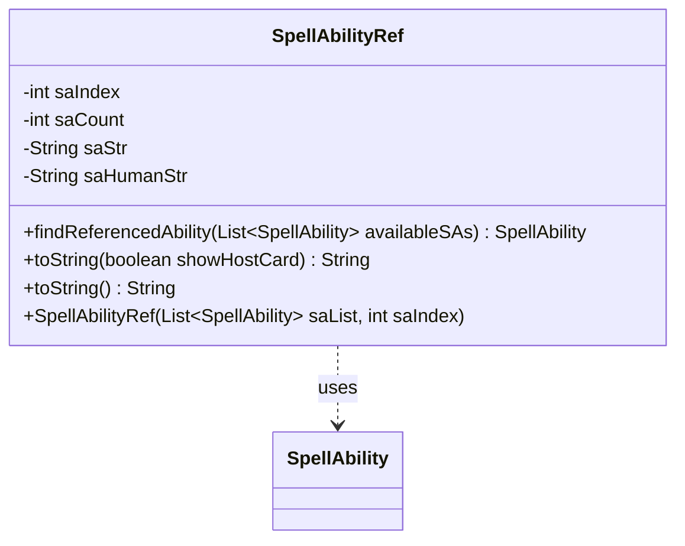

---
aliases:
  - SpellAbilityRef
tags:
  - java/class
  - module/forge-ai
  - pkg/forge/ai/simulation
fqn: forge.ai.simulation.Plan.SpellAbilityRef
package: forge.ai.simulation
module: forge-ai
kind: Class
---

# SpellAbilityRef

**Package:** `forge.ai.simulation`   **Module:** `forge-ai`   **Kind:** Class



## Relationships
**Uses:**
- [[forge.game.spellability.SpellAbility|SpellAbility]]

## Design Description

SpellAbilityRef is a static nested helper within `Plan` that captures a stable, serializable reference to a `SpellAbility` by its position in an ability list rather than by object identity. On construction it records the ability's index, the total list size, and both its machine (`saStr`) and human-readable (`saHumanStr`) string forms, deferring to `SpellAbilityPicker.abilityToString` for the latter.

Its core responsibility is re-resolution: `findReferencedAbility` locates the matching ability in a freshly supplied list, guarding correctness by requiring the list size to match and the recomputed `toString()` to equal the stored signature, returning null otherwise. This lets the AI simulation framework persist a chosen ability across regenerated game states where direct references are invalid. The immutable fields and dual `toString` overloads reflect a deliberately lightweight, value-like design whose only collaborator is the `SpellAbility` it indexes.

## Source
`forge-ai/src/main/java/forge/ai/simulation/Plan.java` — declaration excerpt

```java
    public static class SpellAbilityRef {
        private final int saIndex;
        private final int saCount;
        private final String saStr;
        private final String saHumanStr;

        public SpellAbilityRef(List<SpellAbility> saList, int saIndex) {
            this.saIndex = saIndex;
            this.saCount = saList.size();
            SpellAbility sa = saList.get(saIndex);
            this.saStr = sa.toString();
            this.saHumanStr = SpellAbilityPicker.abilityToString(sa, false);
        }

        public SpellAbility findReferencedAbility(List<SpellAbility> availableSAs) {
            if (availableSAs.size() != saCount) {
                return null;
            }
            SpellAbility sa = availableSAs.get(saIndex);
            return sa.toString().equals(saStr) ? sa : null;
        }

        public String toString(boolean showHostCard) {
            return showHostCard ? saHumanStr : saStr;
        }

        @Override
        public String toString() {
            return toString(false);
        }
    }
```

## Python
`forge/ai/simulation/Plan/SpellAbilityRef.py`

```python
from forge.game.spellability.SpellAbility import SpellAbility
from forge.ai.simulation.SpellAbilityPicker import SpellAbilityPicker


class SpellAbilityRef:
    def __init__(self, saList: list[SpellAbility], saIndex: int):
        self.saIndex = saIndex
        self.saCount = len(saList)
        sa = saList[saIndex]
        self.saStr = sa.toString()
        self.saHumanStr = SpellAbilityPicker.abilityToString(sa, False)

    def findReferencedAbility(self, availableSAs: list[SpellAbility]) -> SpellAbility:
        if len(availableSAs) != self.saCount:
            return None
        sa = availableSAs[self.saIndex]
        return sa if sa.toString() == self.saStr else None

    def toString(self, showHostCard: bool = False) -> str:
        return self.saHumanStr if showHostCard else self.saStr

    def __str__(self) -> str:
        return self.toString(False)
```
