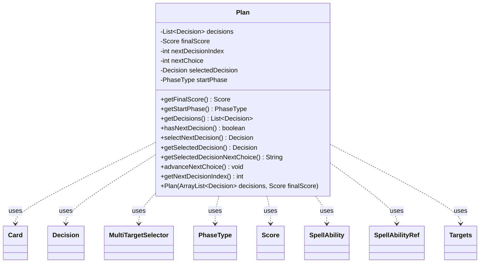

---
aliases:
  - Plan
tags:
  - java/class
  - module/forge-ai
  - pkg/forge/ai/simulation
fqn: forge.ai.simulation.Plan
package: forge.ai.simulation
module: forge-ai
kind: Class
---

# Plan

**Package:** `forge.ai.simulation`   **Module:** `forge-ai`   **Kind:** Class



## Relationships
**Uses:**
- [[forge.ai.simulation.GameStateEvaluator.Score|Score]]
- [[forge.ai.simulation.MultiTargetSelector|MultiTargetSelector]]
- [[forge.ai.simulation.MultiTargetSelector.Targets|Targets]]
- [[forge.ai.simulation.Plan.Decision|Decision]]
- [[forge.ai.simulation.Plan.SpellAbilityRef|SpellAbilityRef]]
- [[forge.game.card.Card|Card]]
- [[forge.game.phase.PhaseType|PhaseType]]
- [[forge.game.spellability.SpellAbility|SpellAbility]]


## Design Description

The `Plan` class records the complete, ordered sequence of decisions an AI player commits to during game-state simulation, paired with the projected `Score` it expects to reach. It stores an immutable `List<Decision>` plus the `startPhase`, while mutable cursors (`nextDecisionIndex`, `nextChoice`, `selectedDecision`) track playback position so a plan computed against a simulated game can later be replayed decision-by-decision against the live game. Accessors like `getFinalScore` and `getStartPhase` expose metadata, while `hasNextDecision`, `selectNextDecision`, `getSelectedDecisionNextChoice`, and `advanceNextChoice` drive sequential execution.

Its design intent lives in two nested static types. `Decision` is an immutable record of one choice—spell ability, X-mana, targets, card choices, or modes—chained backward via `prevDecision`, with overloaded constructors specializing each variant. `SpellAbilityRef` solves cross-instance referencing: because a `SpellAbility` cannot be shared between distinct simulated games, it stores a positional index plus a stringified signature and re-resolves the ability in a fresh list only when both count and signature match, guarding against state divergence.

## Source
`forge-ai/src/main/java/forge/ai/simulation/Plan.java`

```java
package forge.ai.simulation;

import com.google.common.base.Joiner;
import forge.ai.simulation.GameStateEvaluator.Score;
import forge.game.card.Card;
import forge.game.phase.PhaseType;
import forge.game.spellability.SpellAbility;

import java.util.ArrayList;
import java.util.List;

public class Plan {
    private final List<Decision> decisions;
    private final Score finalScore;
    private int nextDecisionIndex;
    private int nextChoice;
    private Decision selectedDecision;
    private PhaseType startPhase;

    public Plan(ArrayList<Decision> decisions, Score finalScore) {
        this.decisions = decisions;
        this.finalScore = finalScore;
    }

    public Score getFinalScore() {
        return finalScore;
    }

    public PhaseType getStartPhase() {
        return startPhase;
    }

    public List<Decision> getDecisions() {
        return decisions;
    }

    public boolean hasNextDecision() {
        return nextDecisionIndex < decisions.size();
    }

    public Decision selectNextDecision() {
        selectedDecision = decisions.get(nextDecisionIndex);
        nextDecisionIndex++;
        nextChoice = 0;
        return selectedDecision;
    }

    public Decision getSelectedDecision() {
        return selectedDecision;
    }

    public String getSelectedDecisionNextChoice() {
        if (selectedDecision.choices != null && nextChoice < selectedDecision.choices.size()) {
            return selectedDecision.choices.get(nextChoice);
        }
        return null;
    }

    public void advanceNextChoice() {
        nextChoice++;
    }

    public int getNextDecisionIndex() {
        return nextDecisionIndex;
    }

    public static class SpellAbilityRef {
        private final int saIndex;
        private final int saCount;
        private final String saStr;
        private final String saHumanStr;

        public SpellAbilityRef(List<SpellAbility> saList, int saIndex) {
            this.saIndex = saIndex;
            this.saCount = saList.size();
            SpellAbility sa = saList.get(saIndex);
            this.saStr = sa.toString();
            this.saHumanStr = SpellAbilityPicker.abilityToString(sa, false);
        }

        public SpellAbility findReferencedAbility(List<SpellAbility> availableSAs) {
            if (availableSAs.size() != saCount) {
                return null;
            }
            SpellAbility sa = availableSAs.get(saIndex);
            return sa.toString().equals(saStr) ? sa : null;
        }

        public String toString(boolean showHostCard) {
            return showHostCard ? saHumanStr : saStr;
        }

        @Override
        public String toString() {
            return toString(false);
        }
    }

    public static class Decision {
        final Decision prevDecision;
        final Score initialScore;

        final SpellAbilityRef saRef;
        Integer xMana;
        MultiTargetSelector.Targets targets;
        List<String> choices;
        int[] modes;
        String modesStr; // for human pretty-print consumption only

        public Decision(Score initialScore, Decision prevDecision, SpellAbilityRef saRef) {
            this.initialScore = initialScore;
            this.prevDecision = prevDecision;
            this.saRef = saRef;
        }

        public Decision(Score initialScore, Decision prevDecision, MultiTargetSelector.Targets targets) {
            this.initialScore = initialScore;
            this.prevDecision = prevDecision;
            this.saRef = null;
            this.targets = targets;
        }

        public Decision(Score initialScore, Decision prevDecision, Card choice) {
            this.initialScore = initialScore;
            this.prevDecision = prevDecision;
            this.saRef = null;
            this.choices = new ArrayList<>();
            this.choices.add(choice.getName());
        }

        public Decision(Score initialScore, Decision prevDecision, int[] modes, String modesStr) {
            this.initialScore = initialScore;
            this.prevDecision = prevDecision;
            this.saRef = null;
            this.modes = modes;
            this.modesStr = modesStr;
        }

        public String toString(boolean showHostCard) {
            StringBuilder sb = new StringBuilder();
            if (!showHostCard) {
                sb.append("[initScore=").append(initialScore).append(" ");
            }
            if (modesStr != null) {
                sb.append(modesStr);
            } else {
                String sa = saRef.toString(showHostCard);
                if (xMana != null) {
                    sa = sa.replace("(X=0)", "(X=" + xMana + ")");
                }
                sb.append(sa);
            }
            if (targets != null) {
                sb.append(" (targets: ").append(targets).append(")");
            }
            if (choices != null) {
                sb.append(" (chosen: ").append(Joiner.on(", ").join(choices)).append(")");
            }
            if (!showHostCard) {
                sb.append("]");
            }
            return sb.toString();
        }

        @Override
        public String toString() {
            return toString(false);
        }
    }
}
```

## Python
`forge/ai/simulation/Plan.py`

```python
from forge.ai.simulation.GameStateEvaluator.Score import Score
from forge.ai.simulation.MultiTargetSelector import MultiTargetSelector
from forge.ai.simulation.MultiTargetSelector.Targets import Targets
from forge.ai.simulation.SpellAbilityPicker import SpellAbilityPicker
from forge.game.card.Card import Card
from forge.game.phase.PhaseType import PhaseType
from forge.game.spellability.SpellAbility import SpellAbility


class Plan:
    def __init__(self, decisions: list, finalScore: Score):
        self.decisions = decisions
        self.finalScore = finalScore
        self.nextDecisionIndex = 0
        self.nextChoice = 0
        self.selectedDecision = None
        self.startPhase = None

    def getFinalScore(self) -> Score:
        return self.finalScore

    def getStartPhase(self) -> PhaseType:
        return self.startPhase

    def getDecisions(self) -> list:
        return self.decisions

    def hasNextDecision(self) -> bool:
        return self.nextDecisionIndex < len(self.decisions)

    def selectNextDecision(self) -> "Plan.Decision":
        self.selectedDecision = self.decisions[self.nextDecisionIndex]
        self.nextDecisionIndex += 1
        self.nextChoice = 0
        return self.selectedDecision

    def getSelectedDecision(self) -> "Plan.Decision":
        return self.selectedDecision

    def getSelectedDecisionNextChoice(self) -> str:
        if self.selectedDecision.choices is not None and self.nextChoice < len(self.selectedDecision.choices):
            return self.selectedDecision.choices[self.nextChoice]
        return None

    def advanceNextChoice(self) -> None:
        self.nextChoice += 1

    def getNextDecisionIndex(self) -> int:
        return self.nextDecisionIndex

    class SpellAbilityRef:
        def __init__(self, saList: list, saIndex: int):
            self.saIndex = saIndex
            self.saCount = len(saList)
            sa = saList[saIndex]
            self.saStr = str(sa)
            self.saHumanStr = SpellAbilityPicker.abilityToString(sa, False)

        def findReferencedAbility(self, availableSAs: list) -> SpellAbility:
            if len(availableSAs) != self.saCount:
                return None
            sa = availableSAs[self.saIndex]
            return sa if str(sa) == self.saStr else None

        def toString(self, showHostCard: bool) -> str:
            return self.saHumanStr if showHostCard else self.saStr

        def __str__(self) -> str:
            return self.toString(False)

    class Decision:
        def __init__(self, initialScore: Score, prevDecision: "Plan.Decision", arg, modesStr: str = None):
            self.initialScore = initialScore
            self.prevDecision = prevDecision

            self.saRef = None
            self.xMana = None
            self.targets = None
            self.choices = None
            self.modes = None
            self.modesStr = None  # for human pretty-print consumption only

            if isinstance(arg, Plan.SpellAbilityRef):
                self.saRef = arg
            elif isinstance(arg, Targets):
                self.targets = arg
            elif isinstance(arg, Card):
                self.choices = []
                self.choices.append(arg.getName())
            else:
                self.modes = arg
                self.modesStr = modesStr

        def toString(self, showHostCard: bool) -> str:
            sb = []
            if not showHostCard:
                sb.append("[initScore=" + str(self.initialScore) + " ")
            if self.modesStr is not None:
                sb.append(self.modesStr)
            else:
                sa = self.saRef.toString(showHostCard)
                if self.xMana is not None:
                    sa = sa.replace("(X=0)", "(X=" + str(self.xMana) + ")")
                sb.append(sa)
            if self.targets is not None:
                sb.append(" (targets: " + str(self.targets) + ")")
            if self.choices is not None:
                sb.append(" (chosen: " + ", ".join(self.choices) + ")")
            if not showHostCard:
                sb.append("]")
            return "".join(sb)

        def __str__(self) -> str:
            return self.toString(False)
```
