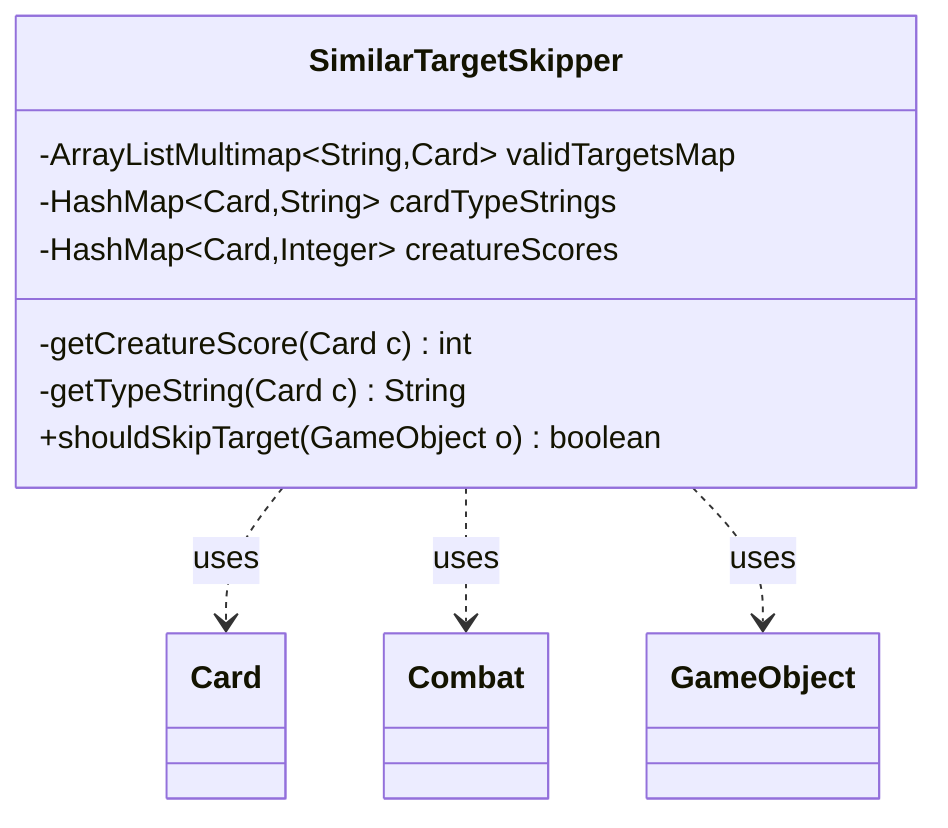

---
aliases:
  - SimilarTargetSkipper
tags:
  - java/class
  - module/forge-ai
  - pkg/forge/ai/simulation
fqn: forge.ai.simulation.PossibleTargetSelector.SimilarTargetSkipper
package: forge.ai.simulation
module: forge-ai
kind: Class
---

# SimilarTargetSkipper

**Package:** `forge.ai.simulation`   **Module:** `forge-ai`   **Kind:** Class



## Relationships
**Uses:**
- [[forge.game.GameObject|GameObject]]
- [[forge.game.card.Card|Card]]
- [[forge.game.combat.Combat|Combat]]

## Design Description

`SimilarTargetSkipper` is a private static helper used by `PossibleTargetSelector` within Forge's AI simulation layer to prune redundant targeting choices during move evaluation. Its sole responsibility, exposed through `shouldSkipTarget(GameObject)`, is to recognize when a candidate `Card` target is functionally equivalent to one already accepted, so the simulator can avoid re-exploring branches that would yield identical outcomes. Equivalence is judged by name, controller/owner, spell-ability count, type string, and—for creatures—combat-evaluated score plus combat state queried from `Combat`.

The design is deliberately performance-minded: it caches type strings and creature scores in per-instance maps, indexes accepted targets by name via an `ArrayListMultimap` to limit comparisons, and orders equality checks cheapest-first as documented in the inline comments. It collaborates with `Card`, `Combat`, and `GameObject` purely as read-only inputs, and a TODO notes that non-card targets such as stack spells are not yet handled, signaling intentionally narrow current scope.

## Source
`forge-ai/src/main/java/forge/ai/simulation/PossibleTargetSelector.java` — declaration excerpt

```java
    private static class SimilarTargetSkipper {
        private final ArrayListMultimap<String, Card> validTargetsMap = ArrayListMultimap.create();
        private final HashMap<Card, String> cardTypeStrings = new HashMap<>();
        private HashMap<Card, Integer> creatureScores;

        private int getCreatureScore(Card c) {
            if (creatureScores != null) {
                Integer score = creatureScores.get(c);
                if (score != null) {
                    return score;
                }
            } else {
                creatureScores = new HashMap<>();
            }

            int score = ComputerUtilCard.evaluateCreature(c);
            creatureScores.put(c, score);
            return score;
        }

        private String getTypeString(Card c) {
            String str = cardTypeStrings.get(c);
            if (str != null) {
                return str;
            }
            str = c.getType().toString();
            cardTypeStrings.put(c, str);
            return str;
        }

        public boolean shouldSkipTarget(GameObject o) {
            // TODO: Support non-card targets, such as spells on the stack.
            if (!(o instanceof Card c)) {
                return false;
            }

            Combat combat = c.getGame().getCombat();
            for (Card existingTarget : validTargetsMap.get(c.getName())) {
                // Note: Checks are ordered from cheapest to more expensive ones. For example, type equals()
                // ends up calling toString() on the type object and is more expensive than the checks above it.
                if (c.getController() != existingTarget.getController() || c.getOwner() != existingTarget.getOwner()) {
                    continue;
                }
                if (c.getSpellAbilities().size() != existingTarget.getSpellAbilities().size()) {
                    continue;
                }
                // Note: This doesn't just do equals() on the types because a) it doesn't exist and b) if
                // it existed and just used toString() comparison it would be less efficient than doing it
                // in this class, which caches the strings.
                if (!getTypeString(existingTarget).equals(getTypeString(c))) {
                    continue;
                }
                if (c.isCreature()) {
                    if (!existingTarget.isCreature()) {
                        continue;
                    }
                    if (getCreatureScore(c) != getCreatureScore(existingTarget)) {
                        continue;
                    }
                    if (combat != null) {
                        if (combat.getDefenderByAttacker(c) != combat.getDefenderByAttacker(existingTarget)) {
                            // Either attacking different entities or one is attacking and the other is not.
                            continue;
                        }
                        
                        if (combat.isBlocked(c) || combat.isBlocked(existingTarget) ||
                            combat.isBlocking(c) || combat.isBlocking(existingTarget)) {
                            // If either is blocked or blocking, consider them separately as well.
                            continue;
                        }
                    }
                }
                return true;
            }
            validTargetsMap.put(c.getName(), c);
            return false;
        }
    }
```

## Python
`forge/ai/simulation/PossibleTargetSelector/SimilarTargetSkipper.py`

```python
from forge.game.GameObject import GameObject
from forge.game.card.Card import Card
from forge.game.combat.Combat import Combat
from forge.ai.ComputerUtilCard import ComputerUtilCard


class SimilarTargetSkipper:
    def __init__(self):
        self.validTargetsMap: dict[str, list[Card]] = {}
        self.cardTypeStrings: dict[Card, str] = {}
        self.creatureScores: dict[Card, int] = None

    def getCreatureScore(self, c: Card) -> int:
        if self.creatureScores is not None:
            score = self.creatureScores.get(c)
            if score is not None:
                return score
        else:
            self.creatureScores = {}

        score = ComputerUtilCard.evaluateCreature(c)
        self.creatureScores[c] = score
        return score

    def getTypeString(self, c: Card) -> str:
        str_ = self.cardTypeStrings.get(c)
        if str_ is not None:
            return str_
        str_ = c.getType().toString()
        self.cardTypeStrings[c] = str_
        return str_

    def shouldSkipTarget(self, o: GameObject) -> bool:
        # TODO: Support non-card targets, such as spells on the stack.
        if not isinstance(o, Card):
            return False
        c = o

        combat = c.getGame().getCombat()
        for existingTarget in self.validTargetsMap.get(c.getName(), []):
            # Note: Checks are ordered from cheapest to more expensive ones. For example, type equals()
            # ends up calling toString() on the type object and is more expensive than the checks above it.
            if c.getController() != existingTarget.getController() or c.getOwner() != existingTarget.getOwner():
                continue
            if c.getSpellAbilities().size() != existingTarget.getSpellAbilities().size():
                continue
            # Note: This doesn't just do equals() on the types because a) it doesn't exist and b) if
            # it existed and just used toString() comparison it would be less efficient than doing it
            # in this class, which caches the strings.
            if self.getTypeString(existingTarget) != self.getTypeString(c):
                continue
            if c.isCreature():
                if not existingTarget.isCreature():
                    continue
                if self.getCreatureScore(c) != self.getCreatureScore(existingTarget):
                    continue
                if combat is not None:
                    if combat.getDefenderByAttacker(c) != combat.getDefenderByAttacker(existingTarget):
                        # Either attacking different entities or one is attacking and the other is not.
                        continue

                    if (combat.isBlocked(c) or combat.isBlocked(existingTarget) or
                            combat.isBlocking(c) or combat.isBlocking(existingTarget)):
                        # If either is blocked or blocking, consider them separately as well.
                        continue
            return True
        self.validTargetsMap.setdefault(c.getName(), []).append(c)
        return False
```
