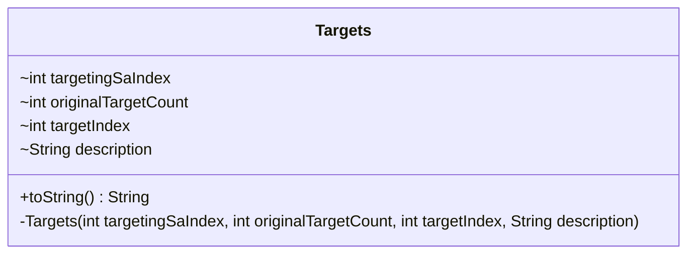

---
aliases:
  - Targets
tags:
  - java/class
  - module/forge-ai
  - pkg/forge/ai/simulation
fqn: forge.ai.simulation.PossibleTargetSelector.Targets
package: forge.ai.simulation
module: forge-ai
kind: Class
---

# Targets

**Package:** `forge.ai.simulation`   **Module:** `forge-ai`   **Kind:** Class



## Design Description

A factory-produced, immutable value object representing one concrete targeting choice within the AI's simulation framework. Nested statically inside `PossibleTargetSelector`, it records which spell ability is being targeted (`targetingSaIndex`), how many targets the original ability had (`originalTargetCount`), the selected target slot (`targetIndex`), and a human-readable `description`. All fields are `final`, and the private constructor restricts instantiation to the enclosing selector, which acts as the factory.

The constructor enforces an invariant: a non-sentinel `targetIndex` must fall within the valid range, throwing `IllegalArgumentException` otherwise (`-1` signals "no specific target"). By overriding `toString()` to return the stored `description`, the class supports readable logging and debugging of the AI's enumerated targeting options during decision simulation.

## Source
`forge-ai/src/main/java/forge/ai/simulation/PossibleTargetSelector.java` — declaration excerpt

```java
    public static class Targets {
        final int targetingSaIndex;
        final int originalTargetCount;
        final int targetIndex;
        final String description;

        private Targets(int targetingSaIndex, int originalTargetCount, int targetIndex, String description)  {
            this.targetingSaIndex = targetingSaIndex;
            this.originalTargetCount = originalTargetCount;
            this.targetIndex = targetIndex;
            this.description = description;

            if (targetIndex != -1 && (targetIndex < 0 || targetIndex >= originalTargetCount)) {
                throw new IllegalArgumentException("Invalid targetIndex=" + targetIndex);
            }
        }

        @Override
        public String toString() {
            return description;
        }
    }
```

## Python
`forge/ai/simulation/PossibleTargetSelector/Targets.py`

```python
from forge.ai.simulation.PossibleTargetSelector import PossibleTargetSelector


class Targets:
    def __init__(self, targetingSaIndex: int, originalTargetCount: int, targetIndex: int, description: str):
        self.targetingSaIndex = targetingSaIndex
        self.originalTargetCount = originalTargetCount
        self.targetIndex = targetIndex
        self.description = description

        if targetIndex != -1 and (targetIndex < 0 or targetIndex >= originalTargetCount):
            raise ValueError("Invalid targetIndex=" + str(targetIndex))

    def __str__(self) -> str:
        return self.description
```
