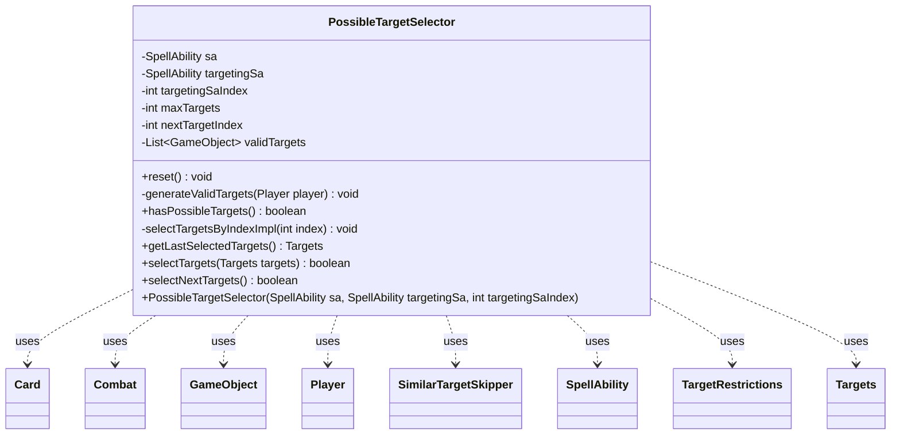

---
aliases:
  - PossibleTargetSelector
tags:
  - java/class
  - module/forge-ai
  - pkg/forge/ai/simulation
fqn: forge.ai.simulation.PossibleTargetSelector
package: forge.ai.simulation
module: forge-ai
kind: Class
---

# PossibleTargetSelector

**Package:** `forge.ai.simulation`   **Module:** `forge-ai`   **Kind:** Class



## Relationships
**Uses:**
- [[forge.ai.simulation.PossibleTargetSelector.SimilarTargetSkipper|SimilarTargetSkipper]]
- [[forge.ai.simulation.PossibleTargetSelector.Targets|Targets]]
- [[forge.game.GameObject|GameObject]]
- [[forge.game.card.Card|Card]]
- [[forge.game.combat.Combat|Combat]]
- [[forge.game.player.Player|Player]]
- [[forge.game.spellability.SpellAbility|SpellAbility]]
- [[forge.game.spellability.TargetRestrictions|TargetRestrictions]]

## Design Description

PossibleTargetSelector enumerates the legal target combinations an AI may choose for a single targeting `SpellAbility`, supporting `forge.ai.simulation`'s look-ahead AI that scores hypothetical plays. Built around a host `SpellAbility` and a specific `targetingSa` (located by `targetingSaIndex`), it queries `TargetRestrictions` for candidate `GameObject`s and offers cursor-style iteration via `selectNextTargets`, plus deterministic replay of a prior choice through the immutable `Targets` memento from `getLastSelectedTargets`. It collaborates with `Player`, `Card`, and `Combat` to read game state and evenly divides allocations such as counters when applying a selection.

A central design intent is pruning the search space: the nested `SimilarTargetSkipper` collapses functionally interchangeable single-target candidates—comparing name, controller/owner, type, ability count, creature score, and combat status—so equivalent targets aren't simulated redundantly. Its checks are deliberately ordered cheapest-first and cache type strings and creature scores for efficiency.

## Source
`forge-ai/src/main/java/forge/ai/simulation/PossibleTargetSelector.java`

```java
package forge.ai.simulation;

import com.google.common.collect.ArrayListMultimap;
import forge.ai.ComputerUtilCard;
import forge.game.GameObject;
import forge.game.ability.AbilityUtils;
import forge.game.card.Card;
import forge.game.combat.Combat;
import forge.game.player.Player;
import forge.game.spellability.SpellAbility;
import forge.game.spellability.TargetRestrictions;

import java.util.ArrayList;
import java.util.HashMap;
import java.util.List;

public class PossibleTargetSelector {
    private final SpellAbility sa;
    private final SpellAbility targetingSa;
    private final int targetingSaIndex;
    private int maxTargets;
    private int nextTargetIndex;
    private final List<GameObject> validTargets = new ArrayList<>();

    public static class Targets {
        final int targetingSaIndex;
        final int originalTargetCount;
        final int targetIndex;
        final String description;

        private Targets(int targetingSaIndex, int originalTargetCount, int targetIndex, String description)  {
            this.targetingSaIndex = targetingSaIndex;
            this.originalTargetCount = originalTargetCount;
            this.targetIndex = targetIndex;
            this.description = description;

            if (targetIndex != -1 && (targetIndex < 0 || targetIndex >= originalTargetCount)) {
                throw new IllegalArgumentException("Invalid targetIndex=" + targetIndex);
            }
        }

        @Override
        public String toString() {
            return description;
        }
    }

    public PossibleTargetSelector(SpellAbility sa, SpellAbility targetingSa, int targetingSaIndex) {
        this.sa = sa;
        this.targetingSa = targetingSa;
        this.targetingSaIndex = targetingSaIndex;
        reset();
    }

    public void reset() {
        nextTargetIndex = 0;
        validTargets.clear();
        generateValidTargets(sa.getHostCard().getController());
    }

    private void generateValidTargets(Player player) {
        if (targetingSa == null) {
            return;
        }
        sa.setActivatingPlayer(player);
        targetingSa.resetTargets();
        TargetRestrictions tgt = targetingSa.getTargetRestrictions();
        maxTargets = tgt.getMaxTargets(sa.getHostCard(), targetingSa);

        SimilarTargetSkipper skipper = new SimilarTargetSkipper();
        for (GameObject o : tgt.getAllCandidates(targetingSa, true)) {
            if (maxTargets == 1 && skipper.shouldSkipTarget(o)) {
                continue;
            }
            validTargets.add(o);
        }
    }

    private static class SimilarTargetSkipper {
        private final ArrayListMultimap<String, Card> validTargetsMap = ArrayListMultimap.create();
        private final HashMap<Card, String> cardTypeStrings = new HashMap<>();
        private HashMap<Card, Integer> creatureScores;

        private int getCreatureScore(Card c) {
            if (creatureScores != null) {
                Integer score = creatureScores.get(c);
                if (score != null) {
                    return score;
                }
            } else {
                creatureScores = new HashMap<>();
            }

            int score = ComputerUtilCard.evaluateCreature(c);
            creatureScores.put(c, score);
            return score;
        }

        private String getTypeString(Card c) {
            String str = cardTypeStrings.get(c);
            if (str != null) {
                return str;
            }
            str = c.getType().toString();
            cardTypeStrings.put(c, str);
            return str;
        }

        public boolean shouldSkipTarget(GameObject o) {
            // TODO: Support non-card targets, such as spells on the stack.
            if (!(o instanceof Card c)) {
                return false;
            }

            Combat combat = c.getGame().getCombat();
            for (Card existingTarget : validTargetsMap.get(c.getName())) {
                // Note: Checks are ordered from cheapest to more expensive ones. For example, type equals()
                // ends up calling toString() on the type object and is more expensive than the checks above it.
                if (c.getController() != existingTarget.getController() || c.getOwner() != existingTarget.getOwner()) {
                    continue;
                }
                if (c.getSpellAbilities().size() != existingTarget.getSpellAbilities().size()) {
                    continue;
                }
                // Note: This doesn't just do equals() on the types because a) it doesn't exist and b) if
                // it existed and just used toString() comparison it would be less efficient than doing it
                // in this class, which caches the strings.
                if (!getTypeString(existingTarget).equals(getTypeString(c))) {
                    continue;
                }
                if (c.isCreature()) {
                    if (!existingTarget.isCreature()) {
                        continue;
                    }
                    if (getCreatureScore(c) != getCreatureScore(existingTarget)) {
                        continue;
                    }
                    if (combat != null) {
                        if (combat.getDefenderByAttacker(c) != combat.getDefenderByAttacker(existingTarget)) {
                            // Either attacking different entities or one is attacking and the other is not.
                            continue;
                        }
                        
                        if (combat.isBlocked(c) || combat.isBlocked(existingTarget) ||
                            combat.isBlocking(c) || combat.isBlocking(existingTarget)) {
                            // If either is blocked or blocking, consider them separately as well.
                            continue;
                        }
                    }
                }
                return true;
            }
            validTargetsMap.put(c.getName(), c);
            return false;
        }
    }

    public boolean hasPossibleTargets() {
        return !validTargets.isEmpty();
    }

    private void selectTargetsByIndexImpl(int index) {
        targetingSa.resetTargets();

        // TODO this currently checks from max amount to just one but it doesn't check all combinations
        while (targetingSa.getTargets().size() < maxTargets && index < validTargets.size()) {
            targetingSa.getTargets().add(validTargets.get(index++));
        }

        // Divide up counters, since AI is expected to do this. For now,
        // divided evenly with left-overs going to the first target.
        if (targetingSa.isDividedAsYouChoose()) {
            final int targetCount = targetingSa.getTargets().getTargetCards().size();
            if (targetCount > 0) {
                final String amountStr = targetingSa.getParam("CounterNum");
                final int amount = AbilityUtils.calculateAmount(sa.getHostCard(), amountStr, targetingSa);
                final int amountPerCard = amount / targetCount;
                int amountLeftOver = amount - (amountPerCard * targetCount);
                for (GameObject target : targetingSa.getTargets()) {
                    targetingSa.addDividedAllocation(target, amountPerCard + amountLeftOver);
                    amountLeftOver = 0;
                }
            }
        }
    }

    public Targets getLastSelectedTargets() {
        return new Targets(targetingSaIndex, validTargets.size(), nextTargetIndex - 1, targetingSa.getTargets().toString());
    }

    public boolean selectTargets(Targets targets) {
        if (targets.originalTargetCount != validTargets.size() || targets.targetingSaIndex != targetingSaIndex) {
            System.err.println("Expected: " + validTargets.size() + " " + targetingSaIndex + " got: " + targets.originalTargetCount + " " + targets.targetingSaIndex);
            return false;
        }
        selectTargetsByIndexImpl(targets.targetIndex);
        this.nextTargetIndex = targets.targetIndex + 1;
        return true;
    }

    public boolean selectNextTargets() {
        if (nextTargetIndex >= validTargets.size()) {
            return false;
        }
        selectTargetsByIndexImpl(nextTargetIndex);
        nextTargetIndex++;
        return true;
    }
}
```

## Python
`forge/ai/simulation/PossibleTargetSelector.py`

```python
from forge.ai.ComputerUtilCard import ComputerUtilCard
from forge.game.GameObject import GameObject
from forge.game.ability.AbilityUtils import AbilityUtils
from forge.game.card.Card import Card
from forge.game.combat.Combat import Combat
from forge.game.player.Player import Player
from forge.game.spellability.SpellAbility import SpellAbility
from forge.game.spellability.TargetRestrictions import TargetRestrictions

import sys
from collections import defaultdict
from typing import List


class PossibleTargetSelector:
    class Targets:
        def __init__(self, targetingSaIndex: int, originalTargetCount: int, targetIndex: int, description: str):
            self.targetingSaIndex = targetingSaIndex
            self.originalTargetCount = originalTargetCount
            self.targetIndex = targetIndex
            self.description = description

            if targetIndex != -1 and (targetIndex < 0 or targetIndex >= originalTargetCount):
                raise ValueError("Invalid targetIndex=" + str(targetIndex))

        def __str__(self) -> str:
            return self.description

    def __init__(self, sa: SpellAbility, targetingSa: SpellAbility, targetingSaIndex: int):
        self.sa = sa
        self.targetingSa = targetingSa
        self.targetingSaIndex = targetingSaIndex
        self.maxTargets = 0
        self.nextTargetIndex = 0
        self.validTargets: List[GameObject] = []
        self.reset()

    def reset(self) -> None:
        self.nextTargetIndex = 0
        self.validTargets.clear()
        self.generateValidTargets(self.sa.getHostCard().getController())

    def generateValidTargets(self, player: Player) -> None:
        if self.targetingSa is None:
            return
        self.sa.setActivatingPlayer(player)
        self.targetingSa.resetTargets()
        tgt = self.targetingSa.getTargetRestrictions()
        self.maxTargets = tgt.getMaxTargets(self.sa.getHostCard(), self.targetingSa)

        skipper = PossibleTargetSelector.SimilarTargetSkipper()
        for o in tgt.getAllCandidates(self.targetingSa, True):
            if self.maxTargets == 1 and skipper.shouldSkipTarget(o):
                continue
            self.validTargets.append(o)

    class SimilarTargetSkipper:
        def __init__(self):
            self.validTargetsMap: dict[str, list[Card]] = defaultdict(list)
            self.cardTypeStrings: dict[Card, str] = {}
            self.creatureScores: dict[Card, int] = None

        def getCreatureScore(self, c: Card) -> int:
            if self.creatureScores is not None:
                score = self.creatureScores.get(c)
                if score is not None:
                    return score
            else:
                self.creatureScores = {}

            score = ComputerUtilCard.evaluateCreature(c)
            self.creatureScores[c] = score
            return score

        def getTypeString(self, c: Card) -> str:
            str_ = self.cardTypeStrings.get(c)
            if str_ is not None:
                return str_
            str_ = c.getType().toString()
            self.cardTypeStrings[c] = str_
            return str_

        def shouldSkipTarget(self, o: GameObject) -> bool:
            # TODO: Support non-card targets, such as spells on the stack.
            if not isinstance(o, Card):
                return False
            c = o

            combat = c.getGame().getCombat()
            for existingTarget in self.validTargetsMap[c.getName()]:
                # Note: Checks are ordered from cheapest to more expensive ones. For example, type equals()
                # ends up calling toString() on the type object and is more expensive than the checks above it.
                if c.getController() != existingTarget.getController() or c.getOwner() != existingTarget.getOwner():
                    continue
                if c.getSpellAbilities().size() != existingTarget.getSpellAbilities().size():
                    continue
                # Note: This doesn't just do equals() on the types because a) it doesn't exist and b) if
                # it existed and just used toString() comparison it would be less efficient than doing it
                # in this class, which caches the strings.
                if self.getTypeString(existingTarget) != self.getTypeString(c):
                    continue
                if c.isCreature():
                    if not existingTarget.isCreature():
                        continue
                    if self.getCreatureScore(c) != self.getCreatureScore(existingTarget):
                        continue
                    if combat is not None:
                        if combat.getDefenderByAttacker(c) != combat.getDefenderByAttacker(existingTarget):
                            # Either attacking different entities or one is attacking and the other is not.
                            continue

                        if (combat.isBlocked(c) or combat.isBlocked(existingTarget) or
                                combat.isBlocking(c) or combat.isBlocking(existingTarget)):
                            # If either is blocked or blocking, consider them separately as well.
                            continue
                return True
            self.validTargetsMap[c.getName()].append(c)
            return False

    def hasPossibleTargets(self) -> bool:
        return len(self.validTargets) != 0

    def selectTargetsByIndexImpl(self, index: int) -> None:
        self.targetingSa.resetTargets()

        # TODO this currently checks from max amount to just one but it doesn't check all combinations
        while self.targetingSa.getTargets().size() < self.maxTargets and index < len(self.validTargets):
            self.targetingSa.getTargets().add(self.validTargets[index])
            index += 1

        # Divide up counters, since AI is expected to do this. For now,
        # divided evenly with left-overs going to the first target.
        if self.targetingSa.isDividedAsYouChoose():
            targetCount = self.targetingSa.getTargets().getTargetCards().size()
            if targetCount > 0:
                amountStr = self.targetingSa.getParam("CounterNum")
                amount = AbilityUtils.calculateAmount(self.sa.getHostCard(), amountStr, self.targetingSa)
                amountPerCard = amount // targetCount
                amountLeftOver = amount - (amountPerCard * targetCount)
                for target in self.targetingSa.getTargets():
                    self.targetingSa.addDividedAllocation(target, amountPerCard + amountLeftOver)
                    amountLeftOver = 0

    def getLastSelectedTargets(self) -> "PossibleTargetSelector.Targets":
        return PossibleTargetSelector.Targets(self.targetingSaIndex, len(self.validTargets), self.nextTargetIndex - 1, self.targetingSa.getTargets().toString())

    def selectTargets(self, targets: "PossibleTargetSelector.Targets") -> bool:
        if targets.originalTargetCount != len(self.validTargets) or targets.targetingSaIndex != self.targetingSaIndex:
            sys.stderr.write("Expected: " + str(len(self.validTargets)) + " " + str(self.targetingSaIndex) + " got: " + str(targets.originalTargetCount) + " " + str(targets.targetingSaIndex) + "\n")
            return False
        self.selectTargetsByIndexImpl(targets.targetIndex)
        self.nextTargetIndex = targets.targetIndex + 1
        return True

    def selectNextTargets(self) -> bool:
        if self.nextTargetIndex >= len(self.validTargets):
            return False
        self.selectTargetsByIndexImpl(self.nextTargetIndex)
        self.nextTargetIndex += 1
        return True
```
