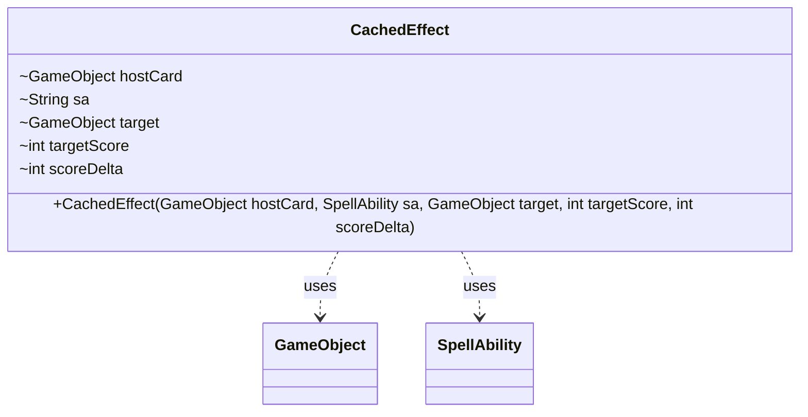

---
aliases:
  - CachedEffect
tags:
  - java/class
  - module/forge-ai
  - pkg/forge/ai/simulation
fqn: forge.ai.simulation.SimulationController.CachedEffect
package: forge.ai.simulation
module: forge-ai
kind: Class
---

# CachedEffect

**Package:** `forge.ai.simulation`   **Module:** `forge-ai`   **Kind:** Class



## Relationships
**Uses:**
- [[forge.game.GameObject|GameObject]]
- [[forge.game.spellability.SpellAbility|SpellAbility]]

## Design Description

CachedEffect is a private static value-holder nested within SimulationController, used by the AI's simulation engine to memoize the outcome of evaluating a spell or ability. It captures a snapshot of a single cached evaluation: the host GameObject, a string rendering of the originating SpellAbility, the affected target GameObject, and two integer metrics—the target's score and the resulting score delta—that quantify the move's assessed value.

As an immutable record (all fields are final and set once in the constructor), it collaborates with GameObject and SpellAbility purely as a passive data carrier rather than acting on them. Notably, the constructor stores `sa.toString()` instead of the live SpellAbility reference, deliberately decoupling the cache entry from mutable game state so the cached scoring remains stable and comparable across the controller's lookahead simulation passes.

## Source
`forge-ai/src/main/java/forge/ai/simulation/SimulationController.java` — declaration excerpt

```java
    private static class CachedEffect {
        final GameObject hostCard;
        final String sa;
        final GameObject target;
        final int targetScore;
        final int scoreDelta;

        public CachedEffect(GameObject hostCard, SpellAbility sa, GameObject target, int targetScore, int scoreDelta) {
            this.hostCard = hostCard;
            this.sa = sa.toString();
            this.target = target;
            this.targetScore = targetScore;
            this.scoreDelta = scoreDelta;
        }
    }
```
