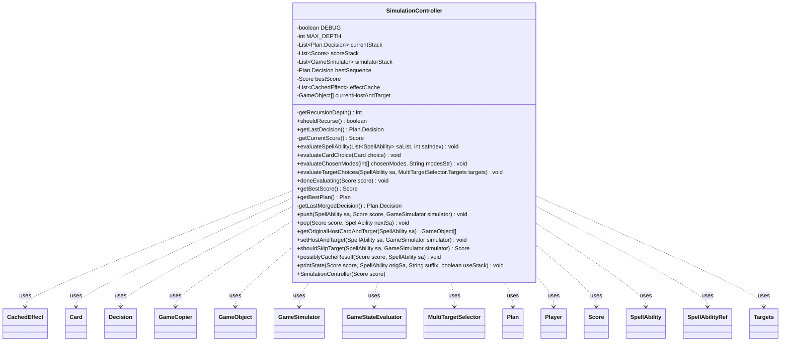

---
aliases:
  - SimulationController
tags:
  - java/class
  - module/forge-ai
  - pkg/forge/ai/simulation
fqn: forge.ai.simulation.SimulationController
package: forge.ai.simulation
module: forge-ai
kind: Class
---

# SimulationController

**Package:** `forge.ai.simulation`   **Module:** `forge-ai`   **Kind:** Class



## Relationships
**Uses:**
- [[forge.ai.simulation.GameCopier|GameCopier]]
- [[forge.ai.simulation.GameSimulator|GameSimulator]]
- [[forge.ai.simulation.GameStateEvaluator|GameStateEvaluator]]
- [[forge.ai.simulation.GameStateEvaluator.Score|Score]]
- [[forge.ai.simulation.MultiTargetSelector|MultiTargetSelector]]
- [[forge.ai.simulation.MultiTargetSelector.Targets|Targets]]
- [[forge.ai.simulation.Plan|Plan]]
- [[forge.ai.simulation.Plan.Decision|Decision]]
- [[forge.ai.simulation.Plan.SpellAbilityRef|SpellAbilityRef]]
- [[forge.ai.simulation.SimulationController.CachedEffect|CachedEffect]]
- [[forge.game.GameObject|GameObject]]
- [[forge.game.card.Card|Card]]
- [[forge.game.player.Player|Player]]
- [[forge.game.spellability.SpellAbility|SpellAbility]]

## Design Description

SimulationController orchestrates Forge's AI lookahead search, driving the recursive simulation of candidate plays to find the highest-scoring line of action. It maintains parallel stacks of decisions, scores, and GameSimulator instances representing the current exploration path, and remembers the best-scoring decision sequence found so far. As the AI evaluates spell abilities, card choices, modes, and targets, the controller appends linked Plan.Decision nodes; once exploration completes, getBestPlan walks the prevDecision chain backwards and merges target, choice, and mode sub-decisions into their parent ability to assemble a coherent Plan.

Though it implements no interface, the class is the stateful coordinator binding GameSimulator, GameCopier, and GameStateEvaluator.Score together. Two design choices stand out: a bounded recursion depth (MAX_DEPTH) caps search cost, and a CachedEffect memoization layer—reverse-mapping copied game objects back to their originals via GameCopier—lets the AI skip re-simulating previously seen negative-delta host/target/ability combinations.

## Source
`forge-ai/src/main/java/forge/ai/simulation/SimulationController.java`

```java
package forge.ai.simulation;

import forge.ai.simulation.GameStateEvaluator.Score;
import forge.game.GameObject;
import forge.game.card.Card;
import forge.game.player.Player;
import forge.game.spellability.SpellAbility;

import java.util.ArrayList;
import java.util.Collections;
import java.util.List;

public class SimulationController {
    private static boolean DEBUG = false;
    private static int MAX_DEPTH = 3;

    private List<Plan.Decision> currentStack;
    private List<Score> scoreStack;
    private List<GameSimulator> simulatorStack;
    private Plan.Decision bestSequence; // last action of sequence
    private Score bestScore;
    private List<CachedEffect> effectCache = new ArrayList<>();
    private GameObject[] currentHostAndTarget;

    private static class CachedEffect {
        final GameObject hostCard;
        final String sa;
        final GameObject target;
        final int targetScore;
        final int scoreDelta;

        public CachedEffect(GameObject hostCard, SpellAbility sa, GameObject target, int targetScore, int scoreDelta) {
            this.hostCard = hostCard;
            this.sa = sa.toString();
            this.target = target;
            this.targetScore = targetScore;
            this.scoreDelta = scoreDelta;
        }
    }

    public SimulationController(Score score) {
        bestScore = score;
        scoreStack = new ArrayList<>();
        scoreStack.add(score);
        simulatorStack = new ArrayList<>();
        currentStack = new ArrayList<>();
    }
    
    private int getRecursionDepth() {
        return scoreStack.size() - 1;
    }

    public boolean shouldRecurse() {
        return bestScore.value != Integer.MAX_VALUE && getRecursionDepth() < MAX_DEPTH;
    }

    public Plan.Decision getLastDecision() {
        if (currentStack.isEmpty()) {
            return null;
        }
        return currentStack.get(currentStack.size() - 1);
    }

    private Score getCurrentScore() {
        return scoreStack.get(scoreStack.size() - 1);
    }

    public void evaluateSpellAbility(List<SpellAbility> saList, int saIndex) {
        currentStack.add(new Plan.Decision(getCurrentScore(), getLastDecision(), new Plan.SpellAbilityRef(saList, saIndex)));
    }

    public void evaluateCardChoice(Card choice) {
        currentStack.add(new Plan.Decision(getCurrentScore(), getLastDecision(), choice));
    }

    public void evaluateChosenModes(int[] chosenModes, String modesStr) {
        currentStack.add(new Plan.Decision(getCurrentScore(), getLastDecision(), chosenModes, modesStr));
    }

    public void evaluateTargetChoices(SpellAbility sa, MultiTargetSelector.Targets targets) {
        currentStack.add(new Plan.Decision(getCurrentScore(), getLastDecision(), targets));
    }

    public void doneEvaluating(Score score) {
        // if we're here during a deeper level this hasn't been called for the level above yet
        // in such case we need to check that this decision has really lead to the improvement in score
        if (getLastDecision().initialScore.value < score.value && score.value > bestScore.value) {
            bestScore = score;
            bestSequence = getLastDecision();
        }
        currentStack.remove(currentStack.size() - 1);
    }

    public Score getBestScore() {
        return bestScore;
    }

    public Plan getBestPlan() {
        if (!currentStack.isEmpty()) {
            throw new RuntimeException("getBestPlan() expects currentStack to be empty!");
        }

        ArrayList<Plan.Decision> sequence = new ArrayList<>();
        Plan.Decision current = bestSequence;
        while (current != null) {
            sequence.add(current);
            current = current.prevDecision;
        }
        Collections.reverse(sequence);
        // Merge targets & choices into their parents.
        int writeIndex = 0;
        for (int i = 0; i < sequence.size(); i++) {
            Plan.Decision d = sequence.get(i);
            if (d.saRef != null) {
                sequence.set(writeIndex, d);
                writeIndex++;
            } else if (d.targets != null) {
                sequence.get(writeIndex - 1).targets = d.targets;
            } else if (d.choices != null) {
                Plan.Decision to = sequence.get(writeIndex - 1);
                if (to.choices == null) {
                    to.choices = new ArrayList<>();
                }
                to.choices.addAll(d.choices);
            } else if (d.modes != null) {
                sequence.get(writeIndex - 1).modes = d.modes;
                sequence.get(writeIndex - 1).modesStr = d.modesStr;
            }
        }
        sequence.subList(writeIndex, sequence.size()).clear();
        return new Plan(sequence, getBestScore());
    }

    private Plan.Decision getLastMergedDecision() {
        MultiTargetSelector.Targets targets = null;
        List<String> choices = new ArrayList<>();
        int[] modes = null;
        String modesStr = null;

        Plan.Decision d = currentStack.get(currentStack.size() - 1);
        while (d.saRef == null) {
            if (d.targets != null) {
                targets = d.targets;
            } else if (d.choices != null) {
                // Since we're iterating backwards, add to the front.
                choices.addAll(0, d.choices);
            } else if (d.modes != null) {
                modes = d.modes;
                modesStr = d.modesStr;
            }
            d = d.prevDecision;
        }

        Plan.Decision merged  = new Plan.Decision(d.initialScore, d.prevDecision, d.saRef);
        merged.targets = targets;
        if (!choices.isEmpty()) {
            merged.choices = choices;
        }
        merged.modes = modes;
        merged.modesStr = modesStr;
        merged.xMana = d.xMana;
        return merged;
    }

    public void push(SpellAbility sa, Score score, GameSimulator simulator) {
        GameSimulator.debugPrint("Recursing DEPTH=" + getRecursionDepth());
        GameSimulator.debugPrint("  With: " + sa);
        scoreStack.add(score);
        simulatorStack.add(simulator);
    }

    public void pop(Score score, SpellAbility nextSa) {
        scoreStack.remove(scoreStack.size() - 1);
        simulatorStack.remove(simulatorStack.size() - 1);
        GameSimulator.debugPrint("DEPTH"+getRecursionDepth()+" best score " + score + " " + nextSa);
    }

    public GameObject[] getOriginalHostCardAndTarget(SpellAbility sa) {
        SpellAbility saOrSubSa = sa;
        while (saOrSubSa != null && !saOrSubSa.usesTargeting()) {
            saOrSubSa = saOrSubSa.getSubAbility();
        }

        if (saOrSubSa == null || saOrSubSa.getTargets() == null || saOrSubSa.getTargets().size() != 1) {
            return null;
        }
        GameObject target = saOrSubSa.getTargets().get(0);
        GameObject originalTarget = target;
        if (!(target instanceof Card)) {  return null; }
        Card hostCard = sa.getHostCard();
        for (int i = simulatorStack.size() - 1; i >= 0; i--) {
            if (target == null || hostCard == null) {
                // This could happen when evaluating something that couldn't exist
                // in the original game - for example, targeting a token that came
                // into being as a result of simulating something earlier. Unfortunately,
                // we can't cache this case.
                return null;
            }
            GameCopier copier = simulatorStack.get(i).getGameCopier();
            if (copier.getCopiedGame() != hostCard.getGame()) {
                throw new RuntimeException("Expected hostCard and copier game to match!");
            }
            if (copier.getCopiedGame() != ((Card) target).getGame()) {
                throw new RuntimeException("Expected target and copier game to match!");
            }
            target = copier.reverseFind(target);
            hostCard = (Card) copier.reverseFind(hostCard);
        }
        return new GameObject[] { hostCard, target, originalTarget };
    }

    public void setHostAndTarget(SpellAbility sa, GameSimulator simulator) {
        simulatorStack.add(simulator);
        currentHostAndTarget = getOriginalHostCardAndTarget(sa);
        simulatorStack.remove(simulatorStack.size() - 1);
    }

    public Score shouldSkipTarget(SpellAbility sa, GameSimulator simulator) {
        simulatorStack.add(simulator);
        GameObject[] hostAndTarget = getOriginalHostCardAndTarget(sa);
        simulatorStack.remove(simulatorStack.size() - 1);
        if (hostAndTarget != null) {
            String saString = sa.toString();
            for (CachedEffect effect : effectCache) {
                if (effect.hostCard == hostAndTarget[0] && effect.target == hostAndTarget[1] && effect.sa.equals(saString)) {
                    GameStateEvaluator evaluator = new GameStateEvaluator();
                    Player player = sa.getActivatingPlayer();
                    int cardScore = evaluator.evalCard(player.getGame(), player, (Card) hostAndTarget[2]);
                    if (cardScore == effect.targetScore) {
                        Score currentScore = getCurrentScore();
                        // TODO: summonSick score?
                        return new Score(currentScore.value + effect.scoreDelta, currentScore.summonSickValue);
                    }
                }
            }
        }
        return null;
    }

    public void possiblyCacheResult(Score score, SpellAbility sa) {
        String cached = "";

        // TODO: Why is the check below needed by tests?
        if (!currentStack.isEmpty()) {
            Plan.Decision d = currentStack.get(currentStack.size() - 1);
            int scoreDelta = score.value - d.initialScore.value;
            // Needed to make sure below is only executed when target decisions are ended.
            // Also, only cache negative effects - so that in those cases we don't need to
            // recurse.
            if (scoreDelta <= 0 && d.targets != null) {
                // FIXME: Support more than one target in this logic.
                GameObject[] hostAndTarget = currentHostAndTarget;
                if (currentHostAndTarget != null) {
                    GameStateEvaluator evaluator = new GameStateEvaluator();
                    Player player = sa.getActivatingPlayer();
                    int cardScore = evaluator.evalCard(player.getGame(), player, (Card) hostAndTarget[2]);
                    effectCache.add(new CachedEffect(hostAndTarget[0], sa, hostAndTarget[1], cardScore, scoreDelta));
                    cached = " (added to cache)";
                }
            }
        }

        currentHostAndTarget = null;
        printState(score, sa, cached, true);
    }

    public void printState(Score score, SpellAbility origSa, String suffix, boolean useStack) {
        if (!DEBUG) {
            return;
        }

        int recursionDepth = getRecursionDepth();
        for (int i = 0; i < recursionDepth; i++)
            System.err.print("  ");
        String str;
        if (useStack && !currentStack.isEmpty()) {
            str = getLastMergedDecision().toString(true);
        } else {
            str = SpellAbilityPicker.abilityToString(origSa);
        }
        System.err.println(recursionDepth + ": [" + score.value + "] " + str + suffix);
    }
}
```

## Python
`forge/ai/simulation/SimulationController.py`

```python
from forge.ai.simulation.GameStateEvaluator import GameStateEvaluator
from forge.ai.simulation.GameStateEvaluator.Score import Score
from forge.ai.simulation.GameCopier import GameCopier
from forge.ai.simulation.GameSimulator import GameSimulator
from forge.ai.simulation.MultiTargetSelector import MultiTargetSelector
from forge.ai.simulation.MultiTargetSelector.Targets import Targets
from forge.ai.simulation.Plan import Plan
from forge.ai.simulation.Plan.Decision import Decision
from forge.ai.simulation.Plan.SpellAbilityRef import SpellAbilityRef
from forge.ai.simulation.SimulationController.CachedEffect import CachedEffect
from forge.game.GameObject import GameObject
from forge.game.card.Card import Card
from forge.game.player.Player import Player
from forge.game.spellability.SpellAbility import SpellAbility


class SimulationController:
    DEBUG = False
    MAX_DEPTH = 3

    class CachedEffect:
        def __init__(self, hostCard, sa, target, targetScore, scoreDelta):
            self.hostCard = hostCard
            self.sa = str(sa)
            self.target = target
            self.targetScore = targetScore
            self.scoreDelta = scoreDelta

    def __init__(self, score):
        self.bestScore = score
        self.scoreStack = []
        self.scoreStack.append(score)
        self.simulatorStack = []
        self.currentStack = []
        self.bestSequence = None
        self.effectCache = []
        self.currentHostAndTarget = None

    def getRecursionDepth(self):
        return len(self.scoreStack) - 1

    def shouldRecurse(self):
        return self.bestScore.value != float("inf") and self.getRecursionDepth() < SimulationController.MAX_DEPTH

    def getLastDecision(self):
        if not self.currentStack:
            return None
        return self.currentStack[len(self.currentStack) - 1]

    def getCurrentScore(self):
        return self.scoreStack[len(self.scoreStack) - 1]

    def evaluateSpellAbility(self, saList, saIndex):
        self.currentStack.append(Plan.Decision(self.getCurrentScore(), self.getLastDecision(), Plan.SpellAbilityRef(saList, saIndex)))

    def evaluateCardChoice(self, choice):
        self.currentStack.append(Plan.Decision(self.getCurrentScore(), self.getLastDecision(), choice))

    def evaluateChosenModes(self, chosenModes, modesStr):
        self.currentStack.append(Plan.Decision(self.getCurrentScore(), self.getLastDecision(), chosenModes, modesStr))

    def evaluateTargetChoices(self, sa, targets):
        self.currentStack.append(Plan.Decision(self.getCurrentScore(), self.getLastDecision(), targets))

    def doneEvaluating(self, score):
        # if we're here during a deeper level this hasn't been called for the level above yet
        # in such case we need to check that this decision has really lead to the improvement in score
        if self.getLastDecision().initialScore.value < score.value and score.value > self.bestScore.value:
            self.bestScore = score
            self.bestSequence = self.getLastDecision()
        self.currentStack.pop(len(self.currentStack) - 1)

    def getBestScore(self):
        return self.bestScore

    def getBestPlan(self):
        if self.currentStack:
            raise RuntimeError("getBestPlan() expects currentStack to be empty!")

        sequence = []
        current = self.bestSequence
        while current is not None:
            sequence.append(current)
            current = current.prevDecision
        sequence.reverse()
        # Merge targets & choices into their parents.
        writeIndex = 0
        for i in range(len(sequence)):
            d = sequence[i]
            if d.saRef is not None:
                sequence[writeIndex] = d
                writeIndex += 1
            elif d.targets is not None:
                sequence[writeIndex - 1].targets = d.targets
            elif d.choices is not None:
                to = sequence[writeIndex - 1]
                if to.choices is None:
                    to.choices = []
                to.choices.extend(d.choices)
            elif d.modes is not None:
                sequence[writeIndex - 1].modes = d.modes
                sequence[writeIndex - 1].modesStr = d.modesStr
        del sequence[writeIndex:len(sequence)]
        return Plan(sequence, self.getBestScore())

    def getLastMergedDecision(self):
        targets = None
        choices = []
        modes = None
        modesStr = None

        d = self.currentStack[len(self.currentStack) - 1]
        while d.saRef is None:
            if d.targets is not None:
                targets = d.targets
            elif d.choices is not None:
                # Since we're iterating backwards, add to the front.
                choices[0:0] = d.choices
            elif d.modes is not None:
                modes = d.modes
                modesStr = d.modesStr
            d = d.prevDecision

        merged = Plan.Decision(d.initialScore, d.prevDecision, d.saRef)
        merged.targets = targets
        if choices:
            merged.choices = choices
        merged.modes = modes
        merged.modesStr = modesStr
        merged.xMana = d.xMana
        return merged

    def push(self, sa, score, simulator):
        GameSimulator.debugPrint("Recursing DEPTH=" + str(self.getRecursionDepth()))
        GameSimulator.debugPrint("  With: " + str(sa))
        self.scoreStack.append(score)
        self.simulatorStack.append(simulator)

    def pop(self, score, nextSa):
        self.scoreStack.pop(len(self.scoreStack) - 1)
        self.simulatorStack.pop(len(self.simulatorStack) - 1)
        GameSimulator.debugPrint("DEPTH" + str(self.getRecursionDepth()) + " best score " + str(score) + " " + str(nextSa))

    def getOriginalHostCardAndTarget(self, sa):
        saOrSubSa = sa
        while saOrSubSa is not None and not saOrSubSa.usesTargeting():
            saOrSubSa = saOrSubSa.getSubAbility()

        if saOrSubSa is None or saOrSubSa.getTargets() is None or saOrSubSa.getTargets().size() != 1:
            return None
        target = saOrSubSa.getTargets().get(0)
        originalTarget = target
        if not isinstance(target, Card):
            return None
        hostCard = sa.getHostCard()
        for i in range(len(self.simulatorStack) - 1, -1, -1):
            if target is None or hostCard is None:
                # This could happen when evaluating something that couldn't exist
                # in the original game - for example, targeting a token that came
                # into being as a result of simulating something earlier. Unfortunately,
                # we can't cache this case.
                return None
            copier = self.simulatorStack[i].getGameCopier()
            if copier.getCopiedGame() != hostCard.getGame():
                raise RuntimeError("Expected hostCard and copier game to match!")
            if copier.getCopiedGame() != target.getGame():
                raise RuntimeError("Expected target and copier game to match!")
            target = copier.reverseFind(target)
            hostCard = copier.reverseFind(hostCard)
        return [hostCard, target, originalTarget]

    def setHostAndTarget(self, sa, simulator):
        self.simulatorStack.append(simulator)
        self.currentHostAndTarget = self.getOriginalHostCardAndTarget(sa)
        self.simulatorStack.pop(len(self.simulatorStack) - 1)

    def shouldSkipTarget(self, sa, simulator):
        self.simulatorStack.append(simulator)
        hostAndTarget = self.getOriginalHostCardAndTarget(sa)
        self.simulatorStack.pop(len(self.simulatorStack) - 1)
        if hostAndTarget is not None:
            saString = str(sa)
            for effect in self.effectCache:
                if effect.hostCard == hostAndTarget[0] and effect.target == hostAndTarget[1] and effect.sa == saString:
                    evaluator = GameStateEvaluator()
                    player = sa.getActivatingPlayer()
                    cardScore = evaluator.evalCard(player.getGame(), player, hostAndTarget[2])
                    if cardScore == effect.targetScore:
                        currentScore = self.getCurrentScore()
                        # TODO: summonSick score?
                        return Score(currentScore.value + effect.scoreDelta, currentScore.summonSickValue)
        return None

    def possiblyCacheResult(self, score, sa):
        cached = ""

        # TODO: Why is the check below needed by tests?
        if self.currentStack:
            d = self.currentStack[len(self.currentStack) - 1]
            scoreDelta = score.value - d.initialScore.value
            # Needed to make sure below is only executed when target decisions are ended.
            # Also, only cache negative effects - so that in those cases we don't need to
            # recurse.
            if scoreDelta <= 0 and d.targets is not None:
                # FIXME: Support more than one target in this logic.
                hostAndTarget = self.currentHostAndTarget
                if self.currentHostAndTarget is not None:
                    evaluator = GameStateEvaluator()
                    player = sa.getActivatingPlayer()
                    cardScore = evaluator.evalCard(player.getGame(), player, hostAndTarget[2])
                    self.effectCache.append(SimulationController.CachedEffect(hostAndTarget[0], sa, hostAndTarget[1], cardScore, scoreDelta))
                    cached = " (added to cache)"

        self.currentHostAndTarget = None
        self.printState(score, sa, cached, True)

    def printState(self, score, origSa, suffix, useStack):
        if not SimulationController.DEBUG:
            return

        recursionDepth = self.getRecursionDepth()
        for i in range(recursionDepth):
            sys.stderr.write("  ")
        if useStack and self.currentStack:
            str_ = self.getLastMergedDecision().toString(True)
        else:
            str_ = SpellAbilityPicker.abilityToString(origSa)
        sys.stderr.write(str(recursionDepth) + ": [" + str(score.value) + "] " + str_ + suffix + "\n")
```
