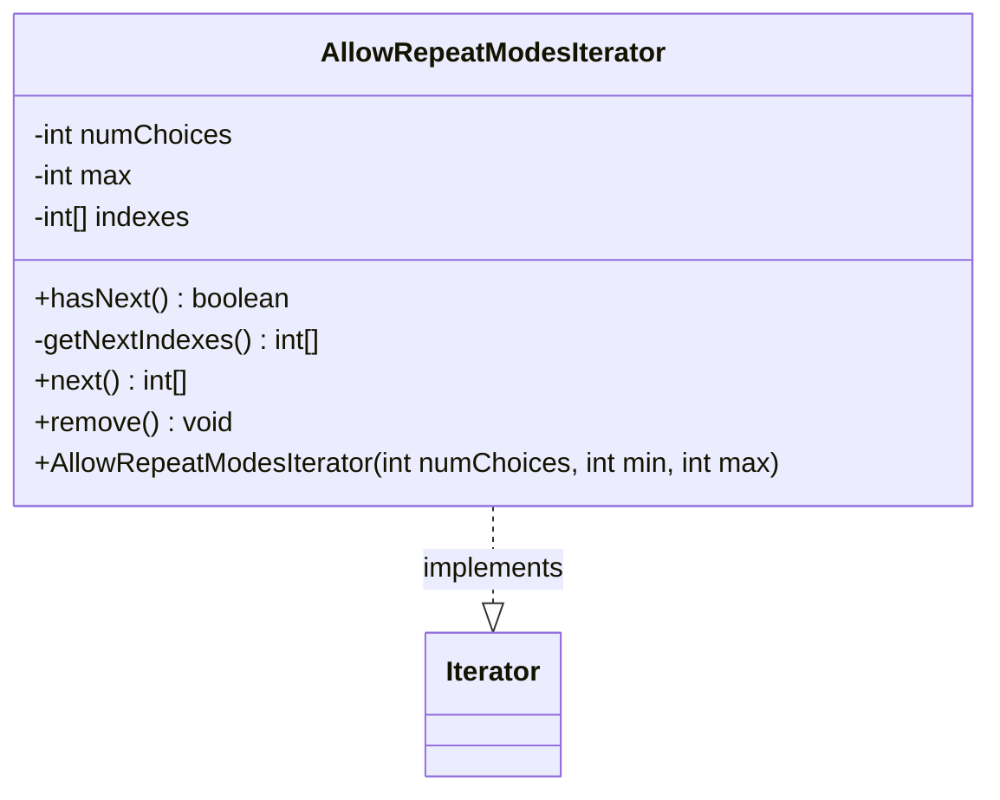

---
aliases:
  - AllowRepeatModesIterator
tags:
  - java/class
  - module/forge-ai
  - pkg/forge/ai/simulation
fqn: forge.ai.simulation.SpellAbilityChoicesIterator.AllowRepeatModesIterator
package: forge.ai.simulation
module: forge-ai
kind: Class
---

# AllowRepeatModesIterator

**Package:** `forge.ai.simulation`   **Module:** `forge-ai`   **Kind:** Class



## Design Description

The `AllowRepeatModesIterator` is a private static helper nested within `SpellAbilityChoicesIterator` that enumerates the possible mode-selection combinations the AI simulation can try for a multi-mode spell or ability. Implementing `Iterator<int[]>`, each `next()` yields an `int[]` of choice indexes — one entry per selected mode — where modes may repeat and lengths grow from `min` up to `max`. It collaborates with the surrounding simulation machinery that drives speculative play, supplying candidate choice vectors to evaluate.

Notably, the iteration is generated lazily: `getNextIndexes()` computes the successor in odometer fashion (incrementing the rightmost index below its ceiling, otherwise extending the array) and returns a fresh array rather than mutating shared state, so results handed to callers stay stable. A null `indexes` field doubles as the exhaustion sentinel, `remove()` is unsupported, and a TODO flags that order-equivalent combinations are not yet deduplicated — a known efficiency gap in the search space.

## Source
`forge-ai/src/main/java/forge/ai/simulation/SpellAbilityChoicesIterator.java` — declaration excerpt

```java
    private static class AllowRepeatModesIterator implements Iterator<int[]> {
        private final int numChoices;
        private final int max;
        private int[] indexes;

        public AllowRepeatModesIterator(int numChoices, int min, int max) {
            this.numChoices = numChoices;
            this.max = max;
            this.indexes = new int[min];
        }

        @Override
        public boolean hasNext() {
            return indexes != null;
        }

        // Note: This returns a new int[] array and doesn't modify indexes in place,
        // since that gets returned to the caller.
        private int[] getNextIndexes() {
            // TODO: In some cases, ordering has no effect - e.g. AAB and BAA are equivalent.
            // We should detect those and skip equivalent modes.
            for (int i = indexes.length - 1; i >= 0; i--) {
                if (indexes[i] < numChoices - 1) {
                    int[] nextIndexes = new int[indexes.length];
                    System.arraycopy(indexes, 0, nextIndexes, 0, i);
                    nextIndexes[i] = indexes[i] + 1;
                    return nextIndexes;
                }
            }
            if (indexes.length < max) {
                return new int[indexes.length + 1];
            }
            return null;
        }

        @Override
        public int[] next() {
            if (indexes == null) {
                throw new NoSuchElementException();
            }
            int[] result = indexes;
            indexes = getNextIndexes();
            return result;
        }

        @Override
        public void remove() {
            throw new UnsupportedOperationException();
        }
    }
```
