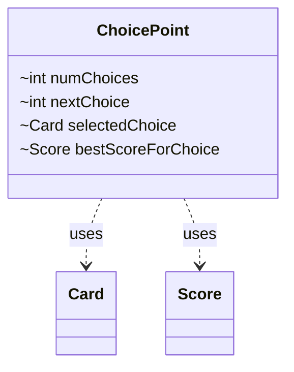

---
aliases:
  - ChoicePoint
tags:
  - java/class
  - module/forge-ai
  - pkg/forge/ai/simulation
fqn: forge.ai.simulation.SpellAbilityChoicesIterator.ChoicePoint
package: forge.ai.simulation
module: forge-ai
kind: Class
---

# ChoicePoint

**Package:** `forge.ai.simulation`   **Module:** `forge-ai`   **Kind:** Class



## Relationships
**Uses:**
- [[forge.ai.simulation.GameStateEvaluator.Score|Score]]
- [[forge.game.card.Card|Card]]

## Design Description

ChoicePoint is a private static helper nested within `SpellAbilityChoicesIterator`, serving as a lightweight mutable record that captures the state of a single decision node during the AI's simulation-based search over spell-ability choices. Each instance tracks how many options exist at this point (`numChoices`), which option to try next (`nextChoice`), the currently selected `Card`, and the best `Score` achieved for that choice so far—the latter initialized to `Integer.MIN_VALUE` so any real evaluation supersedes it.

As a plain data-holder it declares no behavior, depending only on `Card` for the choices it represents and on `GameStateEvaluator.Score` for ranking them. Its package-private fields and private scoping signal deliberate encapsulation: it exists purely as internal bookkeeping for the enclosing iterator's branch-and-evaluate traversal rather than as a reusable abstraction.

## Source
`forge-ai/src/main/java/forge/ai/simulation/SpellAbilityChoicesIterator.java` — declaration excerpt

```java
    private static class ChoicePoint {
        int numChoices = -1;
        int nextChoice = 0;
        Card selectedChoice;
        Score bestScoreForChoice = new Score(Integer.MIN_VALUE);
    }
```

## Python
`forge/ai/simulation/SpellAbilityChoicesIterator/ChoicePoint.py`

```python
from forge.ai.simulation.GameStateEvaluator.Score import Score
from forge.game.card.Card import Card


class ChoicePoint:
    def __init__(self):
        self.numChoices: int = -1
        self.nextChoice: int = 0
        self.selectedChoice: Card = None
        self.bestScoreForChoice: Score = Score(-2147483648)
```
