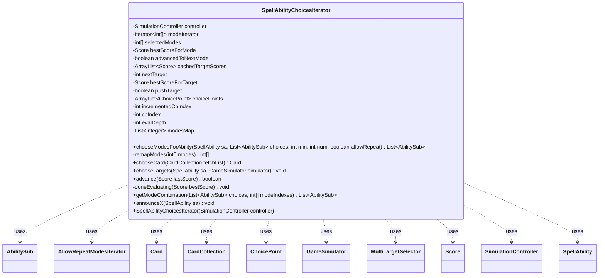

---
aliases:
  - SpellAbilityChoicesIterator
tags:
  - java/class
  - module/forge-ai
  - pkg/forge/ai/simulation
fqn: forge.ai.simulation.SpellAbilityChoicesIterator
package: forge.ai.simulation
module: forge-ai
kind: Class
---

# SpellAbilityChoicesIterator

**Package:** `forge.ai.simulation`   **Module:** `forge-ai`   **Kind:** Class



## Relationships
**Uses:**
- [[forge.ai.simulation.GameSimulator|GameSimulator]]
- [[forge.ai.simulation.GameStateEvaluator.Score|Score]]
- [[forge.ai.simulation.MultiTargetSelector|MultiTargetSelector]]
- [[forge.ai.simulation.SimulationController|SimulationController]]
- [[forge.ai.simulation.SpellAbilityChoicesIterator.AllowRepeatModesIterator|AllowRepeatModesIterator]]
- [[forge.ai.simulation.SpellAbilityChoicesIterator.ChoicePoint|ChoicePoint]]
- [[forge.game.card.Card|Card]]
- [[forge.game.card.CardCollection|CardCollection]]
- [[forge.game.spellability.AbilitySub|AbilitySub]]
- [[forge.game.spellability.SpellAbility|SpellAbility]]

## Design Description

`SpellAbilityChoicesIterator` enumerates, for the simulation-based AI, every combination of decisions a `SpellAbility` may demand—mode selection, target selection, and card choices—surfacing the current candidate through `chooseModesForAbility`, `chooseTargets`, `chooseCard`, and `announceX`. Constructed with and owned by a `SimulationController`, it serves as the choice-generation engine driving the `GameSimulator`: each accessor yields one option while `advance(Score)` steps to the next combination, feeding best-seen `Score`s back to the controller so a depth-first search can prune and rank branches.

The class is deliberately a stateful, resumable iterator over a nested choice space ordered modes → targets → choices. It builds its mode iterators lazily—`CombinatoricsUtils` combinations, or the nested `AllowRepeatModesIterator` for repeatable modes—filters untargetable modes through `modesMap`/`remapModes`, and caches per-target `Score`s so pre-judged targets are skipped. It rebuilds `MultiTargetSelector` each pass because the `SpellAbility` differs per simulation, and tracks `evalDepth` to assert balanced push/pop of controller evaluations.

## Source
`forge-ai/src/main/java/forge/ai/simulation/SpellAbilityChoicesIterator.java`

```java
package forge.ai.simulation;

import forge.ai.ComputerUtilAbility;
import forge.ai.ComputerUtilCost;
import forge.ai.simulation.GameStateEvaluator.Score;
import forge.game.card.Card;
import forge.game.card.CardCollection;
import forge.game.spellability.AbilitySub;
import forge.game.spellability.SpellAbility;
import org.apache.commons.math3.util.CombinatoricsUtils;

import java.util.*;

public class SpellAbilityChoicesIterator {
    private final SimulationController controller;

    private Iterator<int[]> modeIterator;
    private int[] selectedModes;
    private Score bestScoreForMode = new Score(Integer.MIN_VALUE);
    private boolean advancedToNextMode;

    private ArrayList<Score> cachedTargetScores;
    private int nextTarget = 0;
    private Score bestScoreForTarget = new Score(Integer.MIN_VALUE);
    private boolean pushTarget = true;

    private static class ChoicePoint {
        int numChoices = -1;
        int nextChoice = 0;
        Card selectedChoice;
        Score bestScoreForChoice = new Score(Integer.MIN_VALUE);
    }
    private final ArrayList<ChoicePoint> choicePoints = new ArrayList<>();
    private int incrementedCpIndex = 0;
    private int cpIndex = -1;

    private int evalDepth;
    // Maps from filtered mode indexes to original ones.
    private List<Integer> modesMap;

    public SpellAbilityChoicesIterator(SimulationController controller) {
        this.controller = controller;
    }

    public List<AbilitySub> chooseModesForAbility(SpellAbility sa, List<AbilitySub> choices, int min, int num, boolean allowRepeat) {
        if (modeIterator == null) {
            // Skip modes that don't have legal targets.
            modesMap = new ArrayList<>();
            int origIndex = -1;
            for (AbilitySub sub : choices) {
                origIndex++;
                if (!ComputerUtilAbility.isFullyTargetable(sub)) {
                    continue;
                }
                modesMap.add(origIndex);
            }
            // TODO: Do we need to do something special to support cards that have extra costs
            // when choosing more modes, like Blessed Alliance?
            if (modesMap.isEmpty()) {
                return null;
            } else if (!allowRepeat) {
                modeIterator = CombinatoricsUtils.combinationsIterator(modesMap.size(), num);
            } else {
                // Note: When allowRepeat is true, it does result in many possibilities being tried.
                // We should ideally prune some of those at a higher level.
                modeIterator = new AllowRepeatModesIterator(modesMap.size(), min, num);
            }
            selectedModes = remapModes(modeIterator.next());
            advancedToNextMode = true;
        }
        // Note: If modeIterator already existed, selectedModes would have been updated in advance().
        List<AbilitySub> result = getModeCombination(choices, selectedModes);
        if (advancedToNextMode) {
            StringBuilder sb = new StringBuilder();
            for (AbilitySub sub : result) {
                if (sb.length() > 0) {
                    sb.append(" ");
                } else {
                    sb.append(sub.getHostCard().getName()).append(" -> ");
                }
                sb.append(sub);
            }
            controller.evaluateChosenModes(selectedModes, sb.toString());
            evalDepth++;
            advancedToNextMode = false;
        }
        return result;
    }

    private int[] remapModes(int[] modes) {
        for (int i = 0; i < modes.length; i++) {
            modes[i] = modesMap.get(modes[i]);
        }
        return modes;
    }

    public Card chooseCard(CardCollection fetchList) {
        cpIndex++;
        if (cpIndex >= choicePoints.size()) {
            choicePoints.add(new ChoicePoint());
        }
        ChoicePoint cp = choicePoints.get(cpIndex);
        // Prune duplicates.
        HashSet<String> uniqueCards = new HashSet<>();
        for (Card card : fetchList) {
            if (uniqueCards.add(card.getName()) && uniqueCards.size() == cp.nextChoice + 1) {
                cp.selectedChoice = card;
            }
        }
        if (cp.selectedChoice == null) {
            throw new RuntimeException();
        }
        cp.numChoices = uniqueCards.size();
        if (cpIndex >= incrementedCpIndex) {
            controller.evaluateCardChoice(cp.selectedChoice);
            evalDepth++;
        }
        return cp.selectedChoice;
    }

    public void chooseTargets(SpellAbility sa, GameSimulator simulator) {
        // Note: Can't just keep a TargetSelector object cached because it's
        // responsible for setting state on a SA and the SA object changes each
        // time since it's a different simulation.
        MultiTargetSelector selector = new MultiTargetSelector(sa, null);
        if (selector.hasPossibleTargets()) {
            if (cachedTargetScores == null) {
                cachedTargetScores = new ArrayList<>();
                nextTarget = -1;
                for (int i = 0; selector.selectNextTargets(); i++) {
                    Score score = controller.shouldSkipTarget(sa, simulator);
                    cachedTargetScores.add(score);
                    if (score != null) {
                        controller.printState(score, sa, " - via estimate (skipped)", false);
                    } else if (nextTarget == -1) {
                        nextTarget = i;
                    }
                }
                selector.reset();
                // If all targets were cached, we unfortunately have to evaluate the first target again
                // because at this point we're already running the simulation code and there's no turning
                // back. This used to be not possible when the PossibleTargetSelector was controlling the
                // flow. :(
                if (nextTarget == -1) { nextTarget = 0; }
            }
            selector.selectTargetsByIndex(nextTarget);
            controller.setHostAndTarget(sa, simulator);
            // The hierarchy is modes -> targets -> choices[]. In the presence of choices, we want to call
            // evaluate just once at the top level.
            if (pushTarget) {
                controller.evaluateTargetChoices(sa, selector.getLastSelectedTargets());
                evalDepth++;
                pushTarget = false;
            }
        }
    }

    public boolean advance(Score lastScore) {
        cpIndex = -1;
        for (ChoicePoint cp : choicePoints) {
            if (lastScore.value > cp.bestScoreForChoice.value) {
                cp.bestScoreForChoice = lastScore;
            }
        }
        if (lastScore.value > bestScoreForTarget.value) {
            bestScoreForTarget = lastScore;
        }
        if (lastScore.value > bestScoreForMode.value) {
            bestScoreForMode = lastScore;
        }

        if (!choicePoints.isEmpty()) {
            for (int i = choicePoints.size() - 1; i >= 0; i--) {
                ChoicePoint cp = choicePoints.get(i);
                if (cp.nextChoice + 1 < cp.numChoices) {
                    cp.nextChoice++;
                    // Remove tail of the list.
                    incrementedCpIndex = i;
                    for (int j = choicePoints.size() - 1; j >= i; j--) {
                        doneEvaluating(choicePoints.get(j).bestScoreForChoice);
                    }
                    choicePoints.subList(i + 1, choicePoints.size()).clear();
                    return true;
                }
            }
            for (int i = choicePoints.size() - 1; i >= 0; i--) {
                doneEvaluating(choicePoints.get(i).bestScoreForChoice);
            }
            choicePoints.clear();
        }
        if (cachedTargetScores != null) {
            pushTarget = true;
            doneEvaluating(bestScoreForTarget);
            bestScoreForTarget = new Score(Integer.MIN_VALUE);
            while (nextTarget + 1 < cachedTargetScores.size()) {
                nextTarget++;
                if (cachedTargetScores.get(nextTarget) == null) {
                    return true;
                }
            }
            nextTarget = -1;
            cachedTargetScores = null;
        }
        if (modeIterator != null) {
            doneEvaluating(bestScoreForMode);
            bestScoreForMode = new Score(Integer.MIN_VALUE);
            if (modeIterator.hasNext()) {
                selectedModes = remapModes(modeIterator.next());
                advancedToNextMode = true;
                return true;
            }
            modeIterator = null;
        }

        if (evalDepth != 0) {
            throw new RuntimeException("" + evalDepth);
        }
        return false;
    }

    private void doneEvaluating(Score bestScore) {
        controller.doneEvaluating(bestScore);
        evalDepth--;
    }

    public static List<AbilitySub> getModeCombination(List<AbilitySub> choices, int[] modeIndexes) {
        ArrayList<AbilitySub> modes = new ArrayList<>();
        for (int modeIndex : modeIndexes) {
            modes.add(choices.get(modeIndex));
        }
        return modes;
    }

    public void announceX(SpellAbility sa) {
        // TODO this should also iterate over all possible values
        // (currently no additional complexity to keep performance reasonable)
        if (sa.costHasManaX()) {
            Integer x = ComputerUtilCost.setMaxXValue(sa, sa.getActivatingPlayer(), sa.isTrigger());
            controller.getLastDecision().xMana = x;
        }
    }

    private static class AllowRepeatModesIterator implements Iterator<int[]> {
        private final int numChoices;
        private final int max;
        private int[] indexes;

        public AllowRepeatModesIterator(int numChoices, int min, int max) {
            this.numChoices = numChoices;
            this.max = max;
            this.indexes = new int[min];
        }

        @Override
        public boolean hasNext() {
            return indexes != null;
        }

        // Note: This returns a new int[] array and doesn't modify indexes in place,
        // since that gets returned to the caller.
        private int[] getNextIndexes() {
            // TODO: In some cases, ordering has no effect - e.g. AAB and BAA are equivalent.
            // We should detect those and skip equivalent modes.
            for (int i = indexes.length - 1; i >= 0; i--) {
                if (indexes[i] < numChoices - 1) {
                    int[] nextIndexes = new int[indexes.length];
                    System.arraycopy(indexes, 0, nextIndexes, 0, i);
                    nextIndexes[i] = indexes[i] + 1;
                    return nextIndexes;
                }
            }
            if (indexes.length < max) {
                return new int[indexes.length + 1];
            }
            return null;
        }

        @Override
        public int[] next() {
            if (indexes == null) {
                throw new NoSuchElementException();
            }
            int[] result = indexes;
            indexes = getNextIndexes();
            return result;
        }

        @Override
        public void remove() {
            throw new UnsupportedOperationException();
        }
    }
}
```

## Python
`forge/ai/simulation/SpellAbilityChoicesIterator.py`

```python
from forge.ai.ComputerUtilAbility import ComputerUtilAbility
from forge.ai.ComputerUtilCost import ComputerUtilCost
from forge.ai.simulation.GameStateEvaluator.Score import Score
from forge.ai.simulation.GameSimulator import GameSimulator
from forge.ai.simulation.MultiTargetSelector import MultiTargetSelector
from forge.ai.simulation.SimulationController import SimulationController
from forge.game.card.Card import Card
from forge.game.card.CardCollection import CardCollection
from forge.game.spellability.AbilitySub import AbilitySub
from forge.game.spellability.SpellAbility import SpellAbility

import itertools

_INT_MIN = -2147483648


class SpellAbilityChoicesIterator:
    class ChoicePoint:
        def __init__(self):
            self.numChoices = -1
            self.nextChoice = 0
            self.selectedChoice = None
            self.bestScoreForChoice = Score(_INT_MIN)

    class _CombinationsIterator:
        # Iterates over combinations of `num` indexes out of `numChoices`,
        # mirroring CombinatoricsUtils.combinationsIterator. Exposes a
        # hasNext()/next() interface so it can be used interchangeably with
        # AllowRepeatModesIterator.
        def __init__(self, numChoices, num):
            self._it = itertools.combinations(range(numChoices), num)
            self._advance()

        def _advance(self):
            try:
                self._nextval = list(next(self._it))
            except StopIteration:
                self._nextval = None

        def hasNext(self):
            return self._nextval is not None

        def next(self):
            if self._nextval is None:
                raise StopIteration()
            result = self._nextval
            self._advance()
            return result

    def __init__(self, controller: SimulationController):
        self.controller = controller

        self.modeIterator = None
        self.selectedModes = None
        self.bestScoreForMode = Score(_INT_MIN)
        self.advancedToNextMode = False

        self.cachedTargetScores = None
        self.nextTarget = 0
        self.bestScoreForTarget = Score(_INT_MIN)
        self.pushTarget = True

        self.choicePoints = []
        self.incrementedCpIndex = 0
        self.cpIndex = -1

        self.evalDepth = 0
        # Maps from filtered mode indexes to original ones.
        self.modesMap = None

    def chooseModesForAbility(self, sa: SpellAbility, choices: list[AbilitySub], min: int, num: int, allowRepeat: bool) -> list[AbilitySub]:
        if self.modeIterator is None:
            # Skip modes that don't have legal targets.
            self.modesMap = []
            origIndex = -1
            for sub in choices:
                origIndex += 1
                if not ComputerUtilAbility.isFullyTargetable(sub):
                    continue
                self.modesMap.append(origIndex)
            # TODO: Do we need to do something special to support cards that have extra costs
            # when choosing more modes, like Blessed Alliance?
            if len(self.modesMap) == 0:
                return None
            elif not allowRepeat:
                self.modeIterator = SpellAbilityChoicesIterator._CombinationsIterator(len(self.modesMap), num)
            else:
                # Note: When allowRepeat is true, it does result in many possibilities being tried.
                # We should ideally prune some of those at a higher level.
                self.modeIterator = SpellAbilityChoicesIterator.AllowRepeatModesIterator(len(self.modesMap), min, num)
            self.selectedModes = self.remapModes(self.modeIterator.next())
            self.advancedToNextMode = True
        # Note: If modeIterator already existed, selectedModes would have been updated in advance().
        result = self.getModeCombination(choices, self.selectedModes)
        if self.advancedToNextMode:
            sb = ""
            for sub in result:
                if len(sb) > 0:
                    sb += " "
                else:
                    sb += sub.getHostCard().getName() + " -> "
                sb += str(sub)
            self.controller.evaluateChosenModes(self.selectedModes, sb)
            self.evalDepth += 1
            self.advancedToNextMode = False
        return result

    def remapModes(self, modes):
        for i in range(len(modes)):
            modes[i] = self.modesMap[modes[i]]
        return modes

    def chooseCard(self, fetchList: CardCollection) -> Card:
        self.cpIndex += 1
        if self.cpIndex >= len(self.choicePoints):
            self.choicePoints.append(SpellAbilityChoicesIterator.ChoicePoint())
        cp = self.choicePoints[self.cpIndex]
        # Prune duplicates.
        uniqueCards = set()
        for card in fetchList:
            if card.getName() not in uniqueCards:
                uniqueCards.add(card.getName())
                if len(uniqueCards) == cp.nextChoice + 1:
                    cp.selectedChoice = card
        if cp.selectedChoice is None:
            raise RuntimeError()
        cp.numChoices = len(uniqueCards)
        if self.cpIndex >= self.incrementedCpIndex:
            self.controller.evaluateCardChoice(cp.selectedChoice)
            self.evalDepth += 1
        return cp.selectedChoice

    def chooseTargets(self, sa: SpellAbility, simulator: GameSimulator) -> None:
        # Note: Can't just keep a TargetSelector object cached because it's
        # responsible for setting state on a SA and the SA object changes each
        # time since it's a different simulation.
        selector = MultiTargetSelector(sa, None)
        if selector.hasPossibleTargets():
            if self.cachedTargetScores is None:
                self.cachedTargetScores = []
                self.nextTarget = -1
                i = 0
                while selector.selectNextTargets():
                    score = self.controller.shouldSkipTarget(sa, simulator)
                    self.cachedTargetScores.append(score)
                    if score is not None:
                        self.controller.printState(score, sa, " - via estimate (skipped)", False)
                    elif self.nextTarget == -1:
                        self.nextTarget = i
                    i += 1
                selector.reset()
                # If all targets were cached, we unfortunately have to evaluate the first target again
                # because at this point we're already running the simulation code and there's no turning
                # back. This used to be not possible when the PossibleTargetSelector was controlling the
                # flow. :(
                if self.nextTarget == -1:
                    self.nextTarget = 0
            selector.selectTargetsByIndex(self.nextTarget)
            self.controller.setHostAndTarget(sa, simulator)
            # The hierarchy is modes -> targets -> choices[]. In the presence of choices, we want to call
            # evaluate just once at the top level.
            if self.pushTarget:
                self.controller.evaluateTargetChoices(sa, selector.getLastSelectedTargets())
                self.evalDepth += 1
                self.pushTarget = False

    def advance(self, lastScore: Score) -> bool:
        self.cpIndex = -1
        for cp in self.choicePoints:
            if lastScore.value > cp.bestScoreForChoice.value:
                cp.bestScoreForChoice = lastScore
        if lastScore.value > self.bestScoreForTarget.value:
            self.bestScoreForTarget = lastScore
        if lastScore.value > self.bestScoreForMode.value:
            self.bestScoreForMode = lastScore

        if len(self.choicePoints) != 0:
            for i in range(len(self.choicePoints) - 1, -1, -1):
                cp = self.choicePoints[i]
                if cp.nextChoice + 1 < cp.numChoices:
                    cp.nextChoice += 1
                    # Remove tail of the list.
                    self.incrementedCpIndex = i
                    for j in range(len(self.choicePoints) - 1, i - 1, -1):
                        self.doneEvaluating(self.choicePoints[j].bestScoreForChoice)
                    del self.choicePoints[i + 1:]
                    return True
            for i in range(len(self.choicePoints) - 1, -1, -1):
                self.doneEvaluating(self.choicePoints[i].bestScoreForChoice)
            self.choicePoints.clear()
        if self.cachedTargetScores is not None:
            self.pushTarget = True
            self.doneEvaluating(self.bestScoreForTarget)
            self.bestScoreForTarget = Score(_INT_MIN)
            while self.nextTarget + 1 < len(self.cachedTargetScores):
                self.nextTarget += 1
                if self.cachedTargetScores[self.nextTarget] is None:
                    return True
            self.nextTarget = -1
            self.cachedTargetScores = None
        if self.modeIterator is not None:
            self.doneEvaluating(self.bestScoreForMode)
            self.bestScoreForMode = Score(_INT_MIN)
            if self.modeIterator.hasNext():
                self.selectedModes = self.remapModes(self.modeIterator.next())
                self.advancedToNextMode = True
                return True
            self.modeIterator = None

        if self.evalDepth != 0:
            raise RuntimeError("" + str(self.evalDepth))
        return False

    def doneEvaluating(self, bestScore: Score) -> None:
        self.controller.doneEvaluating(bestScore)
        self.evalDepth -= 1

    @staticmethod
    def getModeCombination(choices: list[AbilitySub], modeIndexes) -> list[AbilitySub]:
        modes = []
        for modeIndex in modeIndexes:
            modes.append(choices[modeIndex])
        return modes

    def announceX(self, sa: SpellAbility) -> None:
        # TODO this should also iterate over all possible values
        # (currently no additional complexity to keep performance reasonable)
        if sa.costHasManaX():
            x = ComputerUtilCost.setMaxXValue(sa, sa.getActivatingPlayer(), sa.isTrigger())
            self.controller.getLastDecision().xMana = x

    class AllowRepeatModesIterator:
        def __init__(self, numChoices, min, max):
            self.numChoices = numChoices
            self.max = max
            self.indexes = [0] * min

        def hasNext(self):
            return self.indexes is not None

        # Note: This returns a new int[] array and doesn't modify indexes in place,
        # since that gets returned to the caller.
        def getNextIndexes(self):
            # TODO: In some cases, ordering has no effect - e.g. AAB and BAA are equivalent.
            # We should detect those and skip equivalent modes.
            for i in range(len(self.indexes) - 1, -1, -1):
                if self.indexes[i] < self.numChoices - 1:
                    nextIndexes = [0] * len(self.indexes)
                    for j in range(i):
                        nextIndexes[j] = self.indexes[j]
                    nextIndexes[i] = self.indexes[i] + 1
                    return nextIndexes
            if len(self.indexes) < self.max:
                return [0] * (len(self.indexes) + 1)
            return None

        def next(self):
            if self.indexes is None:
                raise StopIteration()
            result = self.indexes
            self.indexes = self.getNextIndexes()
            return result

        def remove(self):
            raise NotImplementedError()
```
