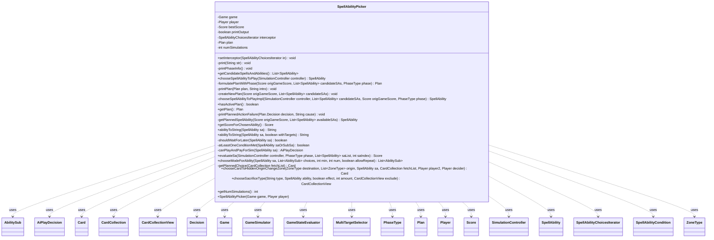

---
aliases:
  - SpellAbilityPicker
tags:
  - java/class
  - module/forge-ai
  - pkg/forge/ai/simulation
fqn: forge.ai.simulation.SpellAbilityPicker
package: forge.ai.simulation
module: forge-ai
kind: Class
---

# SpellAbilityPicker

**Package:** `forge.ai.simulation`   **Module:** `forge-ai`   **Kind:** Class



## Relationships
**Uses:**
- [[forge.ai.AiPlayDecision|AiPlayDecision]]
- [[forge.ai.simulation.GameSimulator|GameSimulator]]
- [[forge.ai.simulation.GameStateEvaluator|GameStateEvaluator]]
- [[forge.ai.simulation.GameStateEvaluator.Score|Score]]
- [[forge.ai.simulation.MultiTargetSelector|MultiTargetSelector]]
- [[forge.ai.simulation.Plan|Plan]]
- [[forge.ai.simulation.Plan.Decision|Decision]]
- [[forge.ai.simulation.SimulationController|SimulationController]]
- [[forge.ai.simulation.SpellAbilityChoicesIterator|SpellAbilityChoicesIterator]]
- [[forge.game.Game|Game]]
- [[forge.game.card.Card|Card]]
- [[forge.game.card.CardCollection|CardCollection]]
- [[forge.game.card.CardCollectionView|CardCollectionView]]
- [[forge.game.phase.PhaseType|PhaseType]]
- [[forge.game.player.Player|Player]]
- [[forge.game.spellability.AbilitySub|AbilitySub]]
- [[forge.game.spellability.SpellAbility|SpellAbility]]
- [[forge.game.spellability.SpellAbilityCondition|SpellAbilityCondition]]
- [[forge.game.zone.ZoneType|ZoneType]]


## Design Description

The Design Description in the note is already complete and well-written. Since the task is to output the description prose for this class, here it is:

SpellAbilityPicker is the AI's simulation-based decision engine, selecting which spell or ability the controlling Player should play in a given Game state. It enumerates legal, affordable candidate abilities (filtering via `canPlayAndPayForSim`), then evaluates each by running GameSimulator playouts scored through GameStateEvaluator's Score, choosing the highest-scoring action. Beyond a single choice, it formulates a multi-step Plan—optionally deferring actions to a later PhaseType (e.g. after declare-blockers) when that yields an equal-or-better outcome—and later replays planned decisions, targets, modes, and choices.

As a standalone coordinator (no supertype), it orchestrates collaborators: SimulationController for recursive evaluation, SpellAbilityChoicesIterator and an optional interceptor to enumerate choice combinations, and MultiTargetSelector for targeting. Notable design intent includes deterministic random seeding for reproducible simulations, summon-sick discounting to discourage premature creature plays, and instant-holding heuristics to compare against sorcery-speed options.

## Source
`forge-ai/src/main/java/forge/ai/simulation/SpellAbilityPicker.java`

```java
package forge.ai.simulation;

import forge.ai.*;
import forge.ai.ability.ChangeZoneAi;
import forge.ai.ability.LearnAi;
import forge.ai.simulation.GameStateEvaluator.Score;
import forge.game.Game;
import forge.game.ability.ApiType;
import forge.game.card.*;
import forge.game.phase.PhaseType;
import forge.game.player.Player;
import forge.game.spellability.AbilitySub;
import forge.game.spellability.SpellAbility;
import forge.game.spellability.SpellAbilityCondition;
import forge.game.zone.ZoneType;
import forge.util.MyRandom;
import forge.util.TextUtil;

import java.util.ArrayList;
import java.util.List;
import java.util.Random;
import java.util.Set;

public class SpellAbilityPicker {
    private Game game;
    private Player player;
    private Score bestScore;
    private boolean printOutput = false;
    private SpellAbilityChoicesIterator interceptor;

    private Plan plan;
    private int numSimulations;

    public SpellAbilityPicker(Game game, Player player) {
        this.game = game;
        this.player = player;
    }

    public void setInterceptor(SpellAbilityChoicesIterator in) {
        this.interceptor = in;
    }

    private void print(String str) {
        if (printOutput) {
            System.out.println(str);
        }
    }

    private void printPhaseInfo() {
        String phaseStr = game.getPhaseHandler().getPhase().toString();
        if (game.getPhaseHandler().getPlayerTurn() != player) {
            phaseStr = "opponent " + phaseStr;
        }
        print("---- choose ability  (phase = " + phaseStr + ")");
    }

    public List<SpellAbility> getCandidateSpellsAndAbilities() {
        CardCollection cards = ComputerUtilAbility.getAvailableCards(game, player);
        cards = ComputerUtilCard.dedupeCards(cards);
        List<SpellAbility> all = ComputerUtilAbility.getSpellAbilities(cards, player);
        List<SpellAbility> candidateSAs = ComputerUtilAbility.getOriginalAndAltCostAbilities(all, player);
        int writeIndex = 0;
        for (SpellAbility sa : candidateSAs) {
            if (sa.isManaAbility()) {
                continue;
            }
            sa.setActivatingPlayer(player);

            AiPlayDecision opinion = canPlayAndPayForSim(sa);
            // print("  " + opinion + ": " + sa);
            // PhaseHandler ph = game.getPhaseHandler();
            // System.out.printf("Ai thinks '%s' of %s -> %s @ %s %s >>> \n", opinion, sa.getHostCard(), sa, Lang.getPossesive(ph.getPlayerTurn().getName()), ph.getPhase());

            if (opinion != AiPlayDecision.WillPlay)
                continue;
            candidateSAs.set(writeIndex, sa);
            writeIndex++;
        }
        candidateSAs.subList(writeIndex, candidateSAs.size()).clear();
        return candidateSAs;
    }

    public SpellAbility chooseSpellAbilityToPlay(SimulationController controller) {
        //printOutput = controller == null;

        // Pass if top of stack is owned by me.
        if (!game.getStack().isEmpty() && game.getStack().peekAbility().getActivatingPlayer().equals(player)) {
            return null;
        }

        Score origGameScore = new GameStateEvaluator().getScoreForGameState(game, player);
        List<SpellAbility> candidateSAs = getCandidateSpellsAndAbilities();
        if (controller != null) {
            // This is a recursion during a higher-level simulation. Just return the head of the best
            // sequence directly, no need to create a Plan object.
            return chooseSpellAbilityToPlayImpl(controller, candidateSAs, origGameScore, null);
        }

        printPhaseInfo();
        SpellAbility sa = getPlannedSpellAbility(origGameScore, candidateSAs);
        if (sa != null) {
            return sa;
        }
        createNewPlan(origGameScore, candidateSAs);
        return getPlannedSpellAbility(origGameScore, candidateSAs);
    }

    private Plan formulatePlanWithPhase(Score origGameScore, List<SpellAbility> candidateSAs, PhaseType phase) {
        SimulationController controller = new SimulationController(origGameScore);
        SpellAbility sa = chooseSpellAbilityToPlayImpl(controller, candidateSAs, origGameScore, phase);
        if (sa != null) {
            return controller.getBestPlan();
        }
        return null;
    }

    private void printPlan(Plan plan, String intro) {
        if (plan == null) {
            print(intro + ": no plan!");
        }
        print(intro +" plan with score " + plan.getFinalScore() + ":");
        int i = 0;
        for (Plan.Decision d : plan.getDecisions()) {
            print(++i + ". " + d);
        }
    }

    private void createNewPlan(Score origGameScore, List<SpellAbility> candidateSAs) {
        plan = null;

        Plan bestPlan = formulatePlanWithPhase(origGameScore, candidateSAs, null);
        if (bestPlan == null) {
            print("No good plan at this time");
            return;
        }

        PhaseType currentPhase = game.getPhaseHandler().getPhase();
        if (currentPhase.isBefore(PhaseType.COMBAT_DECLARE_BLOCKERS)) {
            List<SpellAbility> candidateSAs2 = new ArrayList<>();
            for (SpellAbility sa : candidateSAs) {
                if (!SpellAbilityAi.isSorcerySpeed(sa, player)) {
                    if (printOutput) {
                        System.err.println("Not sorcery: " + sa);
                    }
                    candidateSAs2.add(sa);
                }
            }
            if (!candidateSAs2.isEmpty()) {
                if (printOutput) {
                    System.err.println("Formula plan with phase bloom");
                }
                Plan afterBlockersPlan = formulatePlanWithPhase(origGameScore, candidateSAs2, PhaseType.COMBAT_DECLARE_BLOCKERS);
                if (afterBlockersPlan != null && afterBlockersPlan.getFinalScore().value >= bestPlan.getFinalScore().value) {
                    printPlan(afterBlockersPlan, "After blockers");
                    print("Deciding to wait until after declare blockers.");
                    return;
                }
            }
        }

        printPlan(bestPlan, "Current phase (" + currentPhase + ")");
        plan = bestPlan;
    }

    private SpellAbility chooseSpellAbilityToPlayImpl(SimulationController controller, List<SpellAbility> candidateSAs, Score origGameScore, PhaseType phase) {
        long startTime = System.currentTimeMillis();

        SpellAbility bestSa = null;
        Score bestSaValue = origGameScore;
        print("Evaluating... (orig score = " + origGameScore +  ")");
        for (int i = 0; i < candidateSAs.size(); i++) {
            Score value = evaluateSa(controller, phase, candidateSAs, i);
            if (value.value > bestSaValue.value) {
                bestSaValue = value;
                bestSa = candidateSAs.get(i);
            }
        }

        // To make the AI hold-off on playing creatures in MAIN1 if they give no other benefits,
        // check the score for the bestSA while counting summon sick creatures for 0.
        // Do it here on the best SA, rather than for all evaluations, so that if the best SA
        // is indeed a creature spell, we don't pick something else to play now and then have
        // no mana to play the truly best SA post-combat.
        if (bestSa != null && bestSaValue.summonSickValue <= origGameScore.summonSickValue) {
            bestSa = null;
        }

        long execTime = System.currentTimeMillis() - startTime;
        print("BEST: " + abilityToString(bestSa) + " SCORE: " + bestSaValue.summonSickValue + " TIME: " + execTime);
        this.bestScore = bestSaValue;
        return bestSa;
    }

    public boolean hasActivePlan() {
        return plan != null && plan.hasNextDecision();
    }

    public Plan getPlan() {
        return plan;
    }

    private void printPlannedActionFailure(Plan.Decision decision, String cause) {
        print("Failed to continue planned action (" + decision.saRef + "). Cause:");
        print("  " + cause + "!");
        plan = null;
    }

    private SpellAbility getPlannedSpellAbility(Score origGameScore, List<SpellAbility> availableSAs) {
        if (!hasActivePlan()) {
            plan = null;
            return null;
        }
        PhaseType startPhase = plan.getStartPhase();
        if (startPhase != null && game.getPhaseHandler().getPhase().isBefore(startPhase)) {
            print("Waiting until phase " + startPhase + " to proceed with the plan.");
            return null;
        }
        Plan.Decision decision = plan.selectNextDecision();
        if (!decision.initialScore.equals(origGameScore)) {
            printPlannedActionFailure(decision, "Unexpected game score (" + decision.initialScore + " vs. expected " + origGameScore + ")");
            return null;
        }
        SpellAbility sa = decision.saRef.findReferencedAbility(availableSAs);
        if (sa == null) {
            printPlannedActionFailure(decision, "Couldn't find spell/ability!");
            return null;
        }
        // If modes != null, targeting will be done in chooseModeForAbility().
        if (decision.modes == null && decision.targets != null) {
            MultiTargetSelector selector = new MultiTargetSelector(sa, null);
            if (!selector.selectTargets(decision.targets)) {
                printPlannedActionFailure(decision, "Bad targets");
                return null;
            }
        }
        if (decision.xMana != null) {
            sa.setXManaCostPaid(decision.xMana);
        }
        print("Planned decision " + plan.getNextDecisionIndex() + ": " + decision);
        return sa;
    }

    public Score getScoreForChosenAbility() {
        return bestScore;
    }

    public static String abilityToString(SpellAbility sa) {
        return abilityToString(sa, true);
    }
    public static String abilityToString(SpellAbility sa, boolean withTargets) {
        StringBuilder saString = new StringBuilder("N/A");
        if (sa != null) {
            saString = new StringBuilder(sa.toString());
            String cardName = sa.getHostCard().getName();
            if (!cardName.isEmpty()) {
                saString = new StringBuilder(TextUtil.fastReplace(saString.toString(), cardName, "<$>"));
            }
            if (saString.length() > 40) {
                saString = new StringBuilder(saString.substring(0, 40) + "...");
            }
            if (withTargets) {
                SpellAbility saOrSubSa = sa;
                do {
                    if (saOrSubSa.usesTargeting()) {
                        saString.append(" (targets: ").append(saOrSubSa.getTargets()).append(")");
                    }
                    saOrSubSa = saOrSubSa.getSubAbility();
                } while (saOrSubSa != null);
            }
            saString.insert(0, sa.getHostCard() + " -> ");
        }
        return saString.toString();
    }

    private boolean shouldWaitForLater(final SpellAbility sa) {
        final PhaseType phase = game.getPhaseHandler().getPhase();
        final boolean isEarlyPhase = phase == PhaseType.UNTAP || phase == PhaseType.UPKEEP || phase == PhaseType.DRAW;

        // Until the AI can be made smarter, hold off playing instants until MAIN1,
        // so that they can be compared to sorcery-speed spells. Else, the AI is too
        // eager to play them.
        if (isEarlyPhase) {
            // Only hold off if this spell can actually be played in MAIN1.
            final SpellAbilityCondition conditions = sa.getConditions();
            if (conditions == null) {
                return true;
            }
            Set<PhaseType> phases = conditions.getPhases();
            return phases.isEmpty() || phases.contains(PhaseType.MAIN1);
        }

        return false;
    }

    private boolean atLeastOneConditionMet(SpellAbility saOrSubSa) {
        do {
            SpellAbilityCondition conditions = saOrSubSa.getConditions();
            if (conditions == null || conditions.areMet(saOrSubSa)) {
                return true;
            }
            saOrSubSa = saOrSubSa.getSubAbility();
        } while (saOrSubSa != null);
        return false;
    }

    private AiPlayDecision canPlayAndPayForSim(final SpellAbility sa) {
        if (!sa.checkRestrictions(sa.getHostCard(), player)) {
            return AiPlayDecision.CantPlaySa;
        }

        if (sa.isLandAbility()) {
            return AiPlayDecision.WillPlay;
        }
        if (!sa.isLegalAfterStack()) {
            return AiPlayDecision.CantPlaySa;
        }
        if (!sa.canPlay()) {
            return AiPlayDecision.CantPlaySa;
        }

        // Note: Can't just check condition on the top ability, because it may have
        // sub-abilities without conditions (e.g. wild slash's main ability has a
        // main ability with conditions but the burn sub-ability has none).
        if (!atLeastOneConditionMet(sa)) {
            return AiPlayDecision.CantPlaySa;
        }

        if (!ComputerUtilCost.canPayCost(sa, player, sa.isTrigger())) {
            return AiPlayDecision.CantAfford;
        }
        if (!ComputerUtilAbility.isFullyTargetable(sa)) {
            return AiPlayDecision.TargetingFailed;
        }
        if (shouldWaitForLater(sa)) {
            return AiPlayDecision.AnotherTime;
        }

        return AiPlayDecision.WillPlay;
    }

    public Score evaluateSa(final SimulationController controller, PhaseType phase, List<SpellAbility> saList, int saIndex) {
        controller.evaluateSpellAbility(saList, saIndex);
        SpellAbility sa = saList.get(saIndex);

        // Use a deterministic random seed when evaluating different choices of a spell ability.
        // This is needed as otherwise random effects may result in a different number of choices
        // each iteration, which will break the logic in SpellAbilityChoicesIterator.
        Random origRandom = MyRandom.getRandom();
        long randomSeedToUse = origRandom.nextLong();

        Score bestScore = new Score(Integer.MIN_VALUE);
        final SpellAbilityChoicesIterator choicesIterator = new SpellAbilityChoicesIterator(controller);
        Score lastScore;
        do {
            // TODO: MyRandom should be an instance on the game object, so that we could do
            // simulations in parallel without messing up global state.
            MyRandom.setRandom(new Random(randomSeedToUse));
            GameSimulator simulator = new GameSimulator(controller, game, player, phase);
            simulator.setInterceptor(choicesIterator);
            // I feel like something here is making a wrong assumption about what the target is
            lastScore = simulator.simulateSpellAbility(sa);
            numSimulations++;
            if (lastScore.value > bestScore.value) {
                bestScore = lastScore;
            }
        } while (choicesIterator.advance(lastScore));
        controller.doneEvaluating(bestScore);
        MyRandom.setRandom(origRandom);
        return bestScore;
    }

    public List<AbilitySub> chooseModeForAbility(SpellAbility sa, List<AbilitySub> choices, int min, int num, boolean allowRepeat) {
        if (interceptor != null) {
            return interceptor.chooseModesForAbility(sa, choices, min, num, allowRepeat);
        }
        if (plan != null && plan.getSelectedDecision() != null && plan.getSelectedDecision().modes != null) {
            Plan.Decision decision = plan.getSelectedDecision();
            // TODO: Validate that there's no discrepancies between choices and modes?
            List<AbilitySub> plannedModes = SpellAbilityChoicesIterator.getModeCombination(choices, decision.modes);
            if (plan.getSelectedDecision().targets != null) {
                MultiTargetSelector selector = new MultiTargetSelector(sa, plannedModes);
                if (!selector.selectTargets(decision.targets)) {
                    printPlannedActionFailure(decision, "Bad targets for modes");
                    return null;
                }
            }
            return plannedModes;
        }
        return null;
    }

    private Card getPlannedChoice(CardCollection fetchList) {
        // TODO: Make the below more robust?
        if (plan != null && plan.getSelectedDecision() != null) {
            String choice = plan.getSelectedDecisionNextChoice();
            for (Card c : fetchList) {
                if (c.getName().equals(choice)) {
                    print("  Planned choice: " + c);
                    return c;
                }
            }
            print("Failed to use planned choice (" + choice + "). Not found!");
        }
        return null;
    }

    public Card chooseCardToHiddenOriginChangeZone(ZoneType destination, List<ZoneType> origin, SpellAbility sa,
            CardCollection fetchList, Player player2, Player decider) {
        if (fetchList.size() >= 2) {
            if (interceptor != null) {
                return interceptor.chooseCard(fetchList);
            }
            Card card = getPlannedChoice(fetchList);
            if (card != null) {
                plan.advanceNextChoice();
                return card;
            }
        }
        if (sa.getApi() == ApiType.Learn) {
            return LearnAi.chooseCardToLearn(fetchList, decider, sa);
        } else {
            return ChangeZoneAi.chooseCardToHiddenOriginChangeZone(destination, origin, sa, fetchList, player2, decider);
        }
    }

    public CardCollectionView chooseSacrificeType(String type, SpellAbility ability, final boolean effect, int amount, final CardCollectionView exclude) {
        if (amount == 1) {
            Card source = ability.getHostCard();
            CardCollection cardList = CardLists.getValidCards(player.getCardsIn(ZoneType.Battlefield), type.split(";"), source.getController(), source, ability);
            cardList = CardLists.filter(cardList, CardPredicates.canBeSacrificedBy(ability, effect));
            if (cardList.size() >= 2) {
                if (interceptor != null) {
                    return new CardCollection(interceptor.chooseCard(cardList));
                }
                Card card = getPlannedChoice(cardList);
                if (card != null) {
                    plan.advanceNextChoice();
                    return new CardCollection(card);
                }
            }
        }
        return ComputerUtil.chooseSacrificeType(player, type, ability, ability.getTargetCard(), effect, amount, exclude);
    }

    public int getNumSimulations() {
        return numSimulations;
    }
}
```

## Python
`forge/ai/simulation/SpellAbilityPicker.py`

```python
from forge.ai.AiPlayDecision import AiPlayDecision
from forge.ai.simulation.GameSimulator import GameSimulator
from forge.ai.simulation.GameStateEvaluator import GameStateEvaluator
from forge.ai.simulation.GameStateEvaluator.Score import Score
from forge.ai.simulation.MultiTargetSelector import MultiTargetSelector
from forge.ai.simulation.Plan import Plan
from forge.ai.simulation.Plan.Decision import Decision
from forge.ai.simulation.SimulationController import SimulationController
from forge.ai.simulation.SpellAbilityChoicesIterator import SpellAbilityChoicesIterator
from forge.game.Game import Game
from forge.game.card.Card import Card
from forge.game.card.CardCollection import CardCollection
from forge.game.card.CardCollectionView import CardCollectionView
from forge.game.phase.PhaseType import PhaseType
from forge.game.player.Player import Player
from forge.game.spellability.AbilitySub import AbilitySub
from forge.game.spellability.SpellAbility import SpellAbility
from forge.game.spellability.SpellAbilityCondition import SpellAbilityCondition
from forge.game.zone.ZoneType import ZoneType

from forge.ai.ComputerUtil import ComputerUtil
from forge.ai.ComputerUtilAbility import ComputerUtilAbility
from forge.ai.ComputerUtilCard import ComputerUtilCard
from forge.ai.ComputerUtilCost import ComputerUtilCost
from forge.ai.SpellAbilityAi import SpellAbilityAi
from forge.ai.ability.ChangeZoneAi import ChangeZoneAi
from forge.ai.ability.LearnAi import LearnAi
from forge.game.ability.ApiType import ApiType
from forge.game.card.CardLists import CardLists
from forge.game.card.CardPredicates import CardPredicates
from forge.util.MyRandom import MyRandom
from forge.util.TextUtil import TextUtil

from java.util import Random


class SpellAbilityPicker:
    def __init__(self, game: Game, player: Player):
        self.game = game
        self.player = player
        self.bestScore = None
        self.printOutput = False
        self.interceptor = None
        self.plan = None
        self.numSimulations = 0

    def setInterceptor(self, in_: SpellAbilityChoicesIterator) -> None:
        self.interceptor = in_

    def print(self, str: str) -> None:
        if self.printOutput:
            print(str)

    def printPhaseInfo(self) -> None:
        phaseStr = self.game.getPhaseHandler().getPhase().toString()
        if self.game.getPhaseHandler().getPlayerTurn() != self.player:
            phaseStr = "opponent " + phaseStr
        self.print("---- choose ability  (phase = " + phaseStr + ")")

    def getCandidateSpellsAndAbilities(self) -> list[SpellAbility]:
        cards = ComputerUtilAbility.getAvailableCards(self.game, self.player)
        cards = ComputerUtilCard.dedupeCards(cards)
        all = ComputerUtilAbility.getSpellAbilities(cards, self.player)
        candidateSAs = ComputerUtilAbility.getOriginalAndAltCostAbilities(all, self.player)
        writeIndex = 0
        for sa in candidateSAs:
            if sa.isManaAbility():
                continue
            sa.setActivatingPlayer(self.player)

            opinion = self.canPlayAndPayForSim(sa)
            # print("  " + opinion + ": " + sa);
            # PhaseHandler ph = game.getPhaseHandler();
            # System.out.printf("Ai thinks '%s' of %s -> %s @ %s %s >>> \n", opinion, sa.getHostCard(), sa, Lang.getPossesive(ph.getPlayerTurn().getName()), ph.getPhase());

            if opinion != AiPlayDecision.WillPlay:
                continue
            candidateSAs[writeIndex] = sa
            writeIndex += 1
        del candidateSAs[writeIndex:len(candidateSAs)]
        return candidateSAs

    def chooseSpellAbilityToPlay(self, controller: SimulationController) -> SpellAbility:
        # printOutput = controller == null;

        # Pass if top of stack is owned by me.
        if not self.game.getStack().isEmpty() and self.game.getStack().peekAbility().getActivatingPlayer().equals(self.player):
            return None

        origGameScore = GameStateEvaluator().getScoreForGameState(self.game, self.player)
        candidateSAs = self.getCandidateSpellsAndAbilities()
        if controller is not None:
            # This is a recursion during a higher-level simulation. Just return the head of the best
            # sequence directly, no need to create a Plan object.
            return self.chooseSpellAbilityToPlayImpl(controller, candidateSAs, origGameScore, None)

        self.printPhaseInfo()
        sa = self.getPlannedSpellAbility(origGameScore, candidateSAs)
        if sa is not None:
            return sa
        self.createNewPlan(origGameScore, candidateSAs)
        return self.getPlannedSpellAbility(origGameScore, candidateSAs)

    def formulatePlanWithPhase(self, origGameScore: Score, candidateSAs: list[SpellAbility], phase: PhaseType) -> Plan:
        controller = SimulationController(origGameScore)
        sa = self.chooseSpellAbilityToPlayImpl(controller, candidateSAs, origGameScore, phase)
        if sa is not None:
            return controller.getBestPlan()
        return None

    def printPlan(self, plan: Plan, intro: str) -> None:
        if plan is None:
            self.print(intro + ": no plan!")
        self.print(intro + " plan with score " + plan.getFinalScore() + ":")
        i = 0
        for d in plan.getDecisions():
            i += 1
            self.print(str(i) + ". " + d)

    def createNewPlan(self, origGameScore: Score, candidateSAs: list[SpellAbility]) -> None:
        self.plan = None

        bestPlan = self.formulatePlanWithPhase(origGameScore, candidateSAs, None)
        if bestPlan is None:
            self.print("No good plan at this time")
            return

        currentPhase = self.game.getPhaseHandler().getPhase()
        if currentPhase.isBefore(PhaseType.COMBAT_DECLARE_BLOCKERS):
            candidateSAs2 = []
            for sa in candidateSAs:
                if not SpellAbilityAi.isSorcerySpeed(sa, self.player):
                    if self.printOutput:
                        import sys
                        print("Not sorcery: " + str(sa), file=sys.stderr)
                    candidateSAs2.append(sa)
            if len(candidateSAs2) != 0:
                if self.printOutput:
                    import sys
                    print("Formula plan with phase bloom", file=sys.stderr)
                afterBlockersPlan = self.formulatePlanWithPhase(origGameScore, candidateSAs2, PhaseType.COMBAT_DECLARE_BLOCKERS)
                if afterBlockersPlan is not None and afterBlockersPlan.getFinalScore().value >= bestPlan.getFinalScore().value:
                    self.printPlan(afterBlockersPlan, "After blockers")
                    self.print("Deciding to wait until after declare blockers.")
                    return

        self.printPlan(bestPlan, "Current phase (" + str(currentPhase) + ")")
        self.plan = bestPlan

    def chooseSpellAbilityToPlayImpl(self, controller: SimulationController, candidateSAs: list[SpellAbility], origGameScore: Score, phase: PhaseType) -> SpellAbility:
        startTime = System.currentTimeMillis()

        bestSa = None
        bestSaValue = origGameScore
        self.print("Evaluating... (orig score = " + str(origGameScore) + ")")
        for i in range(len(candidateSAs)):
            value = self.evaluateSa(controller, phase, candidateSAs, i)
            if value.value > bestSaValue.value:
                bestSaValue = value
                bestSa = candidateSAs[i]

        # To make the AI hold-off on playing creatures in MAIN1 if they give no other benefits,
        # check the score for the bestSA while counting summon sick creatures for 0.
        # Do it here on the best SA, rather than for all evaluations, so that if the best SA
        # is indeed a creature spell, we don't pick something else to play now and then have
        # no mana to play the truly best SA post-combat.
        if bestSa is not None and bestSaValue.summonSickValue <= origGameScore.summonSickValue:
            bestSa = None

        execTime = System.currentTimeMillis() - startTime
        self.print("BEST: " + self.abilityToString(bestSa) + " SCORE: " + str(bestSaValue.summonSickValue) + " TIME: " + str(execTime))
        self.bestScore = bestSaValue
        return bestSa

    def hasActivePlan(self) -> bool:
        return self.plan is not None and self.plan.hasNextDecision()

    def getPlan(self) -> Plan:
        return self.plan

    def printPlannedActionFailure(self, decision: Decision, cause: str) -> None:
        self.print("Failed to continue planned action (" + decision.saRef + "). Cause:")
        self.print("  " + cause + "!")
        self.plan = None

    def getPlannedSpellAbility(self, origGameScore: Score, availableSAs: list[SpellAbility]) -> SpellAbility:
        if not self.hasActivePlan():
            self.plan = None
            return None
        startPhase = self.plan.getStartPhase()
        if startPhase is not None and self.game.getPhaseHandler().getPhase().isBefore(startPhase):
            self.print("Waiting until phase " + str(startPhase) + " to proceed with the plan.")
            return None
        decision = self.plan.selectNextDecision()
        if not decision.initialScore.equals(origGameScore):
            self.printPlannedActionFailure(decision, "Unexpected game score (" + str(decision.initialScore) + " vs. expected " + str(origGameScore) + ")")
            return None
        sa = decision.saRef.findReferencedAbility(availableSAs)
        if sa is None:
            self.printPlannedActionFailure(decision, "Couldn't find spell/ability!")
            return None
        # If modes != null, targeting will be done in chooseModeForAbility().
        if decision.modes is None and decision.targets is not None:
            selector = MultiTargetSelector(sa, None)
            if not selector.selectTargets(decision.targets):
                self.printPlannedActionFailure(decision, "Bad targets")
                return None
        if decision.xMana is not None:
            sa.setXManaCostPaid(decision.xMana)
        self.print("Planned decision " + str(self.plan.getNextDecisionIndex()) + ": " + str(decision))
        return sa

    def getScoreForChosenAbility(self) -> Score:
        return self.bestScore

    @staticmethod
    def abilityToString(sa: SpellAbility, withTargets: bool = True) -> str:
        saString = "N/A"
        if sa is not None:
            saString = sa.toString()
            cardName = sa.getHostCard().getName()
            if not cardName.isEmpty():
                saString = TextUtil.fastReplace(saString, cardName, "<$>")
            if len(saString) > 40:
                saString = saString[0:40] + "..."
            if withTargets:
                saOrSubSa = sa
                while True:
                    if saOrSubSa.usesTargeting():
                        saString = saString + " (targets: " + str(saOrSubSa.getTargets()) + ")"
                    saOrSubSa = saOrSubSa.getSubAbility()
                    if saOrSubSa is None:
                        break
            saString = str(sa.getHostCard()) + " -> " + saString
        return saString

    def shouldWaitForLater(self, sa: SpellAbility) -> bool:
        phase = self.game.getPhaseHandler().getPhase()
        isEarlyPhase = phase == PhaseType.UNTAP or phase == PhaseType.UPKEEP or phase == PhaseType.DRAW

        # Until the AI can be made smarter, hold off playing instants until MAIN1,
        # so that they can be compared to sorcery-speed spells. Else, the AI is too
        # eager to play them.
        if isEarlyPhase:
            # Only hold off if this spell can actually be played in MAIN1.
            conditions = sa.getConditions()
            if conditions is None:
                return True
            phases = conditions.getPhases()
            return phases.isEmpty() or phases.contains(PhaseType.MAIN1)

        return False

    def atLeastOneConditionMet(self, saOrSubSa: SpellAbility) -> bool:
        while True:
            conditions = saOrSubSa.getConditions()
            if conditions is None or conditions.areMet(saOrSubSa):
                return True
            saOrSubSa = saOrSubSa.getSubAbility()
            if saOrSubSa is None:
                break
        return False

    def canPlayAndPayForSim(self, sa: SpellAbility) -> AiPlayDecision:
        if not sa.checkRestrictions(sa.getHostCard(), self.player):
            return AiPlayDecision.CantPlaySa

        if sa.isLandAbility():
            return AiPlayDecision.WillPlay
        if not sa.isLegalAfterStack():
            return AiPlayDecision.CantPlaySa
        if not sa.canPlay():
            return AiPlayDecision.CantPlaySa

        # Note: Can't just check condition on the top ability, because it may have
        # sub-abilities without conditions (e.g. wild slash's main ability has a
        # main ability with conditions but the burn sub-ability has none).
        if not self.atLeastOneConditionMet(sa):
            return AiPlayDecision.CantPlaySa

        if not ComputerUtilCost.canPayCost(sa, self.player, sa.isTrigger()):
            return AiPlayDecision.CantAfford
        if not ComputerUtilAbility.isFullyTargetable(sa):
            return AiPlayDecision.TargetingFailed
        if self.shouldWaitForLater(sa):
            return AiPlayDecision.AnotherTime

        return AiPlayDecision.WillPlay

    def evaluateSa(self, controller: SimulationController, phase: PhaseType, saList: list[SpellAbility], saIndex: int) -> Score:
        controller.evaluateSpellAbility(saList, saIndex)
        sa = saList[saIndex]

        # Use a deterministic random seed when evaluating different choices of a spell ability.
        # This is needed as otherwise random effects may result in a different number of choices
        # each iteration, which will break the logic in SpellAbilityChoicesIterator.
        origRandom = MyRandom.getRandom()
        randomSeedToUse = origRandom.nextLong()

        bestScore = Score(Integer.MIN_VALUE)
        choicesIterator = SpellAbilityChoicesIterator(controller)
        while True:
            # TODO: MyRandom should be an instance on the game object, so that we could do
            # simulations in parallel without messing up global state.
            MyRandom.setRandom(Random(randomSeedToUse))
            simulator = GameSimulator(controller, self.game, self.player, phase)
            simulator.setInterceptor(choicesIterator)
            # I feel like something here is making a wrong assumption about what the target is
            lastScore = simulator.simulateSpellAbility(sa)
            self.numSimulations += 1
            if lastScore.value > bestScore.value:
                bestScore = lastScore
            if not choicesIterator.advance(lastScore):
                break
        controller.doneEvaluating(bestScore)
        MyRandom.setRandom(origRandom)
        return bestScore

    def chooseModeForAbility(self, sa: SpellAbility, choices: list[AbilitySub], min: int, num: int, allowRepeat: bool) -> list[AbilitySub]:
        if self.interceptor is not None:
            return self.interceptor.chooseModesForAbility(sa, choices, min, num, allowRepeat)
        if self.plan is not None and self.plan.getSelectedDecision() is not None and self.plan.getSelectedDecision().modes is not None:
            decision = self.plan.getSelectedDecision()
            # TODO: Validate that there's no discrepancies between choices and modes?
            plannedModes = SpellAbilityChoicesIterator.getModeCombination(choices, decision.modes)
            if self.plan.getSelectedDecision().targets is not None:
                selector = MultiTargetSelector(sa, plannedModes)
                if not selector.selectTargets(decision.targets):
                    self.printPlannedActionFailure(decision, "Bad targets for modes")
                    return None
            return plannedModes
        return None

    def getPlannedChoice(self, fetchList: CardCollection) -> Card:
        # TODO: Make the below more robust?
        if self.plan is not None and self.plan.getSelectedDecision() is not None:
            choice = self.plan.getSelectedDecisionNextChoice()
            for c in fetchList:
                if c.getName().equals(choice):
                    self.print("  Planned choice: " + str(c))
                    return c
            self.print("Failed to use planned choice (" + choice + "). Not found!")
        return None

    def chooseCardToHiddenOriginChangeZone(self, destination: ZoneType, origin: list[ZoneType], sa: SpellAbility,
            fetchList: CardCollection, player2: Player, decider: Player) -> Card:
        if fetchList.size() >= 2:
            if self.interceptor is not None:
                return self.interceptor.chooseCard(fetchList)
            card = self.getPlannedChoice(fetchList)
            if card is not None:
                self.plan.advanceNextChoice()
                return card
        if sa.getApi() == ApiType.Learn:
            return LearnAi.chooseCardToLearn(fetchList, decider, sa)
        else:
            return ChangeZoneAi.chooseCardToHiddenOriginChangeZone(destination, origin, sa, fetchList, player2, decider)

    def chooseSacrificeType(self, type: str, ability: SpellAbility, effect: bool, amount: int, exclude: CardCollectionView) -> CardCollectionView:
        if amount == 1:
            source = ability.getHostCard()
            cardList = CardLists.getValidCards(self.player.getCardsIn(ZoneType.Battlefield), type.split(";"), source.getController(), source, ability)
            cardList = CardLists.filter(cardList, CardPredicates.canBeSacrificedBy(ability, effect))
            if cardList.size() >= 2:
                if self.interceptor is not None:
                    return CardCollection(self.interceptor.chooseCard(cardList))
                card = self.getPlannedChoice(cardList)
                if card is not None:
                    self.plan.advanceNextChoice()
                    return CardCollection(card)
        return ComputerUtil.chooseSacrificeType(self.player, type, ability, ability.getTargetCard(), effect, amount, exclude)

    def getNumSimulations(self) -> int:
        return self.numSimulations
```
