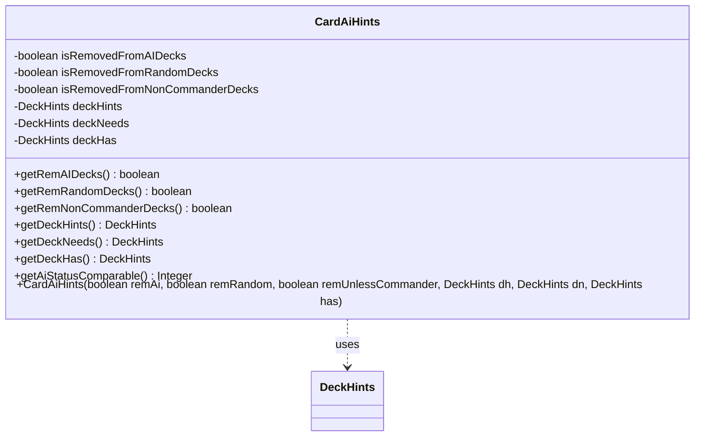

---
aliases:
  - CardAiHints
tags:
  - java/class
  - module/forge-core
  - pkg/forge/card
fqn: forge.card.CardAiHints
package: forge.card
module: forge-core
kind: Class
---

# CardAiHints

**Package:** `forge.card`   **Module:** `forge-core`   **Kind:** Class



## Relationships
**Uses:**
- [[forge.card.DeckHints|DeckHints]]


## Design Description

CardAiHints is an immutable value object in `forge.card` that packages a single card's AI deck-building metadata. It holds three boolean exclusion flags—whether the card is barred from AI decks, random decks, and non-commander (commander-only) decks—together with three `DeckHints` instances capturing the archetypes the card hints toward, the synergies it needs, and the capabilities it provides. Every field is `final` and set only through the constructor, with the class exposing nothing but getters, marking it as a deliberately read-only carrier of card configuration data.

Its single collaborator is `DeckHints`, which it aggregates and hands off to deck-generation and AI selection logic. The `getAiStatusComparable()` method folds the removal flags into an ordinal rank, letting callers sort or prioritize cards by AI suitability through a single comparable value rather than inspecting the raw booleans.

## Source
`forge-core/src/main/java/forge/card/CardAiHints.java`

```java
package forge.card;

/** 
 * CardAiHints holds all the different types of card hints for AI decks.
 *
 */
public class CardAiHints {

    private final boolean isRemovedFromAIDecks;
    private final boolean isRemovedFromRandomDecks;
    private final boolean isRemovedFromNonCommanderDecks;

    private final DeckHints deckHints;
    private final DeckHints deckNeeds;
    private final DeckHints deckHas;

    public CardAiHints(boolean remAi, boolean remRandom, boolean remUnlessCommander, DeckHints dh, DeckHints dn, DeckHints has) {
        isRemovedFromAIDecks = remAi;
        isRemovedFromRandomDecks = remRandom;
        isRemovedFromNonCommanderDecks = remUnlessCommander;
        deckHints = dh;
        deckNeeds = dn;
        deckHas = has;
    }

    /**
     * Gets the rem ai decks.
     * 
     * @return the rem ai decks
     */
    public boolean getRemAIDecks() {
        return this.isRemovedFromAIDecks;
    }

    /**
     * Gets the rem random decks.
     * 
     * @return the rem random decks
     */
    public boolean getRemRandomDecks() {
        return this.isRemovedFromRandomDecks;
    }

    /**
     * Gets the rem random decks.
     *
     * @return the rem random decks
     */
    public boolean getRemNonCommanderDecks() {
        return this.isRemovedFromNonCommanderDecks;
    }

        /**
         * @return the deckHints
         */
    public DeckHints getDeckHints() {
        return deckHints;
    }

    /**
     * @return the deckHints
     */
    public DeckHints getDeckNeeds() {
        return deckNeeds;
    }

    /**
     * @return the deckHints
     */
    public DeckHints getDeckHas() {
        return deckHas;
    }

    /**
     * Gets the ai status comparable.
     * 
     * @return the ai status comparable
     */
    public Integer getAiStatusComparable() {
        if (this.isRemovedFromAIDecks && this.isRemovedFromRandomDecks) {
            return 3;
        } else if (this.isRemovedFromAIDecks) {
            return 4;
        } else if (this.isRemovedFromRandomDecks) {
            return 2;
        } else {
            return 1;
        }
    }

}
```

## Python
`forge/card/CardAiHints.py`

```python
from forge.card.DeckHints import DeckHints


class CardAiHints:
    """
    CardAiHints holds all the different types of card hints for AI decks.
    """

    def __init__(self, remAi: bool, remRandom: bool, remUnlessCommander: bool, dh: DeckHints, dn: DeckHints, has: DeckHints):
        self.isRemovedFromAIDecks = remAi
        self.isRemovedFromRandomDecks = remRandom
        self.isRemovedFromNonCommanderDecks = remUnlessCommander
        self.deckHints = dh
        self.deckNeeds = dn
        self.deckHas = has

    def getRemAIDecks(self) -> bool:
        """
        Gets the rem ai decks.

        @return the rem ai decks
        """
        return self.isRemovedFromAIDecks

    def getRemRandomDecks(self) -> bool:
        """
        Gets the rem random decks.

        @return the rem random decks
        """
        return self.isRemovedFromRandomDecks

    def getRemNonCommanderDecks(self) -> bool:
        """
        Gets the rem random decks.

        @return the rem random decks
        """
        return self.isRemovedFromNonCommanderDecks

    def getDeckHints(self) -> DeckHints:
        """
        @return the deckHints
        """
        return self.deckHints

    def getDeckNeeds(self) -> DeckHints:
        """
        @return the deckHints
        """
        return self.deckNeeds

    def getDeckHas(self) -> DeckHints:
        """
        @return the deckHints
        """
        return self.deckHas

    def getAiStatusComparable(self) -> int:
        """
        Gets the ai status comparable.

        @return the ai status comparable
        """
        if self.isRemovedFromAIDecks and self.isRemovedFromRandomDecks:
            return 3
        elif self.isRemovedFromAIDecks:
            return 4
        elif self.isRemovedFromRandomDecks:
            return 2
        else:
            return 1
```
