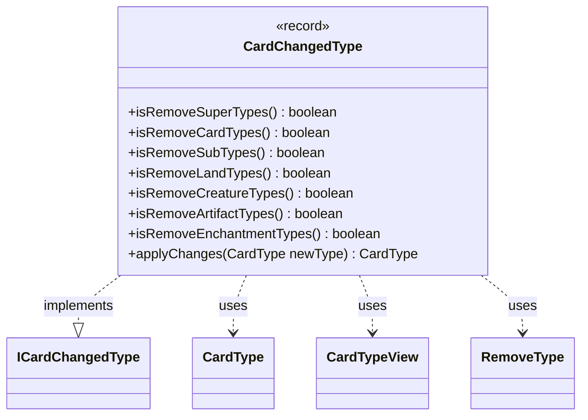

---
aliases:
  - CardChangedType
tags:
  - java/record
  - module/forge-core
  - pkg/forge/card
fqn: forge.card.CardChangedType
package: forge.card
module: forge-core
kind: Record
---

# CardChangedType

**Package:** `forge.card` &nbsp; **Module:** `forge-core` &nbsp; **Kind:** Record



## Relationships
**Implements:**
- [[forge.card.ICardChangedType|ICardChangedType]]
**Uses:**
- [[forge.card.CardType|CardType]]
- [[forge.card.CardTypeView|CardTypeView]]
- [[forge.card.RemoveType|RemoveType]]


## Design Description

CardChangedType is an immutable record encapsulating one set of type-altering instructions for a Magic card and applying them to a mutable `CardType`. It carries the types to add and remove (as `CardTypeView` values), a flag granting all creature types, and a `Set<RemoveType>` of wholesale category-removal flags (super, card, sub, land, creature, artifact, and enchantment types). As the concrete implementation of `ICardChangedType`, it exposes boolean predicates over that flag set plus a single `applyChanges` operation that mutates a supplied `CardType` and returns it.

The design intent is to model the game's layered type-modification rules through a fixed application order: broad category removals first (honoring rule 205.1a, which retains instant and sorcery types), then targeted subtype pruning via `CardType` predicates, then explicit removals and additions, and finally reconciliation of the all-creature-types flag and excluded creature subtypes. By keeping the specification declarative and stateless while delegating type knowledge to `CardType` and `CardTypeView`, it cleanly separates *what* changes from *how* types are interpreted.

## Source
`forge-core/src/main/java/forge/card/CardChangedType.java`

```java
/*
 * Forge: Play Magic: the Gathering.
 * Copyright (C) 2011  Forge Team
 *
 * This program is free software: you can redistribute it and/or modify
 * it under the terms of the GNU General Public License as published by
 * the Free Software Foundation, either version 3 of the License, or
 * (at your option) any later version.
 * 
 * This program is distributed in the hope that it will be useful,
 * but WITHOUT ANY WARRANTY; without even the implied warranty of
 * MERCHANTABILITY or FITNESS FOR A PARTICULAR PURPOSE.  See the
 * GNU General Public License for more details.
 * 
 * You should have received a copy of the GNU General Public License
 * along with this program.  If not, see <http://www.gnu.org/licenses/>.
 */
package forge.card;

import java.util.Set;

import com.google.common.collect.Lists;

import forge.card.CardType.CoreType;
import forge.util.IterableUtil;

public record CardChangedType(CardTypeView addType, CardTypeView removeType, boolean addAllCreatureTypes, Set<RemoveType> remove) implements ICardChangedType {

    public final boolean isRemoveSuperTypes() {
        return remove.contains(RemoveType.SuperTypes);
    }

    public final boolean isRemoveCardTypes() {
        return remove.contains(RemoveType.CardTypes);
    }

    public final boolean isRemoveSubTypes() {
        return remove.contains(RemoveType.SubTypes);
    }

    @Override
    public final boolean isRemoveLandTypes() {
        return remove.contains(RemoveType.LandTypes);
    }

    public final boolean isRemoveCreatureTypes() {
        return remove.contains(RemoveType.CreatureTypes);
    }

    public final boolean isRemoveArtifactTypes() {
        return remove.contains(RemoveType.ArtifactTypes);
    }

    public final boolean isRemoveEnchantmentTypes() {
        return remove.contains(RemoveType.EnchantmentTypes);
    }

    @Override
    public CardType applyChanges(CardType newType) {
        if (isRemoveCardTypes()) {
            // 205.1a However, an object with either the instant or sorcery card type retains that type.
            newType.coreTypes.retainAll(CoreType.spellTypes);
        }
        if (isRemoveSuperTypes()) {
            newType.supertypes.clear();
        }
        if (isRemoveSubTypes()) {
            newType.subtypes.clear();
        } else if (!newType.subtypes.isEmpty()) {
            if (isRemoveLandTypes()) {
                newType.subtypes.removeIf(CardType::isALandType);
            }
            if (isRemoveCreatureTypes()) {
                newType.subtypes.removeIf(CardType::isACreatureType);
                // need to remove AllCreatureTypes too when removing creature Types
                newType.allCreatureTypes = false;
            }
            if (isRemoveArtifactTypes()) {
                newType.subtypes.removeIf(CardType::isAnArtifactType);
            }
            if (isRemoveEnchantmentTypes()) {
                newType.subtypes.removeIf(CardType::isAnEnchantmentType);
            }
        }
        if (removeType() != null) {
            newType.removeAll(removeType());
        }
        if (addType() != null) {
            newType.addAll(addType());
            if (addType().hasAllCreatureTypes()) {
                newType.allCreatureTypes = true;
            }
        }
        if (addAllCreatureTypes()) {
            newType.allCreatureTypes = true;
        }
        // remove specific creature types from all creature types
        if (removeType() != null && newType.allCreatureTypes) {
            newType.excludedCreatureSubtypes.addAll(Lists.newArrayList(IterableUtil.filter(removeType().getSubtypes(), CardType::isACreatureType)));
        }
        return newType;
    }
}
```

## Python
`forge/card/CardChangedType.py`

```python
from forge.card.ICardChangedType import ICardChangedType
from forge.card.CardType import CardType
from forge.card.CardTypeView import CardTypeView
from forge.card.RemoveType import RemoveType


class CardChangedType(ICardChangedType):
    def __init__(self, addType: CardTypeView, removeType: CardTypeView, addAllCreatureTypes: bool, remove: set[RemoveType]):
        self._addType = addType
        self._removeType = removeType
        self._addAllCreatureTypes = addAllCreatureTypes
        self._remove = remove

    def addType(self) -> CardTypeView:
        return self._addType

    def removeType(self) -> CardTypeView:
        return self._removeType

    def addAllCreatureTypes(self) -> bool:
        return self._addAllCreatureTypes

    def remove(self) -> set[RemoveType]:
        return self._remove

    def isRemoveSuperTypes(self) -> bool:
        return RemoveType.SuperTypes in self._remove

    def isRemoveCardTypes(self) -> bool:
        return RemoveType.CardTypes in self._remove

    def isRemoveSubTypes(self) -> bool:
        return RemoveType.SubTypes in self._remove

    def isRemoveLandTypes(self) -> bool:
        return RemoveType.LandTypes in self._remove

    def isRemoveCreatureTypes(self) -> bool:
        return RemoveType.CreatureTypes in self._remove

    def isRemoveArtifactTypes(self) -> bool:
        return RemoveType.ArtifactTypes in self._remove

    def isRemoveEnchantmentTypes(self) -> bool:
        return RemoveType.EnchantmentTypes in self._remove

    def applyChanges(self, newType: CardType) -> CardType:
        if self.isRemoveCardTypes():
            # 205.1a However, an object with either the instant or sorcery card type retains that type.
            newType.coreTypes.intersection_update(CardType.CoreType.spellTypes)
        if self.isRemoveSuperTypes():
            newType.supertypes.clear()
        if self.isRemoveSubTypes():
            newType.subtypes.clear()
        elif newType.subtypes:
            if self.isRemoveLandTypes():
                newType.subtypes.difference_update({s for s in newType.subtypes if CardType.isALandType(s)})
            if self.isRemoveCreatureTypes():
                newType.subtypes.difference_update({s for s in newType.subtypes if CardType.isACreatureType(s)})
                # need to remove AllCreatureTypes too when removing creature Types
                newType.allCreatureTypes = False
            if self.isRemoveArtifactTypes():
                newType.subtypes.difference_update({s for s in newType.subtypes if CardType.isAnArtifactType(s)})
            if self.isRemoveEnchantmentTypes():
                newType.subtypes.difference_update({s for s in newType.subtypes if CardType.isAnEnchantmentType(s)})
        if self.removeType() is not None:
            newType.removeAll(self.removeType())
        if self.addType() is not None:
            newType.addAll(self.addType())
            if self.addType().hasAllCreatureTypes():
                newType.allCreatureTypes = True
        if self.addAllCreatureTypes():
            newType.allCreatureTypes = True
        # remove specific creature types from all creature types
        if self.removeType() is not None and newType.allCreatureTypes:
            newType.excludedCreatureSubtypes.update(
                s for s in self.removeType().getSubtypes() if CardType.isACreatureType(s)
            )
        return newType
```
