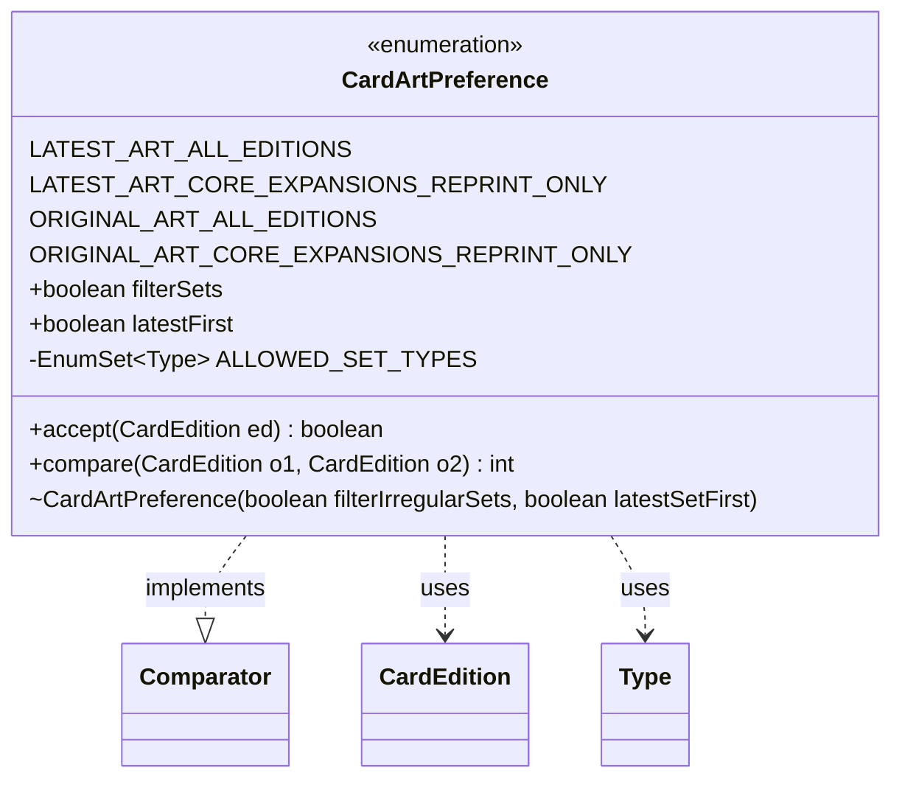

---
aliases:
  - CardArtPreference
tags:
  - java/enum
  - module/forge-core
  - pkg/forge/card
fqn: forge.card.CardDb.CardArtPreference
package: forge.card
module: forge-core
kind: Enum
---

# CardArtPreference

**Package:** `forge.card`   **Module:** `forge-core`   **Kind:** Enum



## Relationships
**Uses:**
- [[forge.card.CardEdition|CardEdition]]
- [[forge.card.CardEdition.Type|Type]]

## Design Description

CardArtPreference is a self-contained enum within CardDb that encodes a user's policy for selecting which printing of a card to use when a card appears across multiple editions. Each of its four constants combines two boolean flags—`filterSets`, which restricts selection to regular Core, Expansion, and Reprint sets, and `latestFirst`, which controls whether newer or original printings are preferred—giving the cross product of "latest vs. original art" and "all editions vs. core/expansion/reprint only."

By implementing `Comparator<CardEdition>`, the enum serves as a pluggable ordering strategy that callers pass to edition-selection logic: `compare` first segregates allowed set types ahead of irregular ones when filtering is enabled, then orders by release date in the configured direction. The companion `accept` predicate exposes the same filtering rule for membership tests. It collaborates only with `CardEdition` and its `Type`, keeping art-preference policy cohesively expressed as data plus behavior on each constant rather than scattered conditional logic.

## Source
`forge-core/src/main/java/forge/card/CardDb.java` — declaration excerpt

```java
    public enum CardArtPreference implements Comparator<CardEdition> {
        LATEST_ART_ALL_EDITIONS(false, true),
        LATEST_ART_CORE_EXPANSIONS_REPRINT_ONLY(true, true),
        ORIGINAL_ART_ALL_EDITIONS(false, false),
        ORIGINAL_ART_CORE_EXPANSIONS_REPRINT_ONLY(true, false);

        public final boolean filterSets;
        public final boolean latestFirst;

        CardArtPreference(boolean filterIrregularSets, boolean latestSetFirst) {
            filterSets = filterIrregularSets;
            latestFirst = latestSetFirst;
        }

        private static final EnumSet<Type> ALLOWED_SET_TYPES = EnumSet.of(Type.CORE, Type.EXPANSION, Type.REPRINT);

        public boolean accept(CardEdition ed) {
            if (ed == null) return false;
            return !filterSets || ALLOWED_SET_TYPES.contains(ed.getType());
        }

        @Override
        public int compare(CardEdition o1, CardEdition o2) {
            if (o1 == o2)
                return 0;
            if(filterSets && (ALLOWED_SET_TYPES.contains(o1.getType()) != ALLOWED_SET_TYPES.contains(o2.getType())))
                return ALLOWED_SET_TYPES.contains(o1.getType()) ? -1 : 1;
            return (latestFirst ? -1 : 1) * o1.getDate().compareTo(o2.getDate());
        }
    }
```
