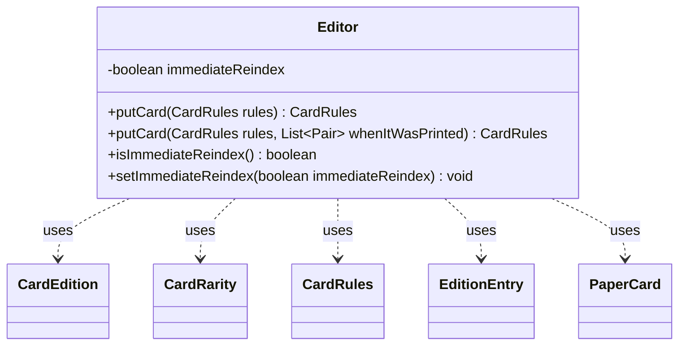

---
aliases:
  - Editor
tags:
  - java/class
  - module/forge-core
  - pkg/forge/card
fqn: forge.card.CardDb.Editor
package: forge.card
module: forge-core
kind: Class
---

# Editor

**Package:** `forge.card`   **Module:** `forge-core`   **Kind:** Class



## Relationships
**Uses:**
- [[forge.card.CardEdition|CardEdition]]
- [[forge.card.CardEdition.EditionEntry|EditionEntry]]
- [[forge.card.CardRarity|CardRarity]]
- [[forge.card.CardRules|CardRules]]
- [[forge.item.PaperCard|PaperCard]]

## Design Description

The `Editor` is a nested helper class within `CardDb` that provides controlled, mutating write access to the card database, functioning much like a `Map.put` for card definitions. Its core method, `putCard`, registers a `CardRules` entry by primary name—either updating an existing entry in place via `reinitializeFromRules` or inserting a new one—then materializes the corresponding `PaperCard` printings from each `CardEdition`'s `EditionEntry` data (rarity, collector number, artist, variant), falling back to an unknown edition when no printing data exists.

As a focused mutator collaborating with `CardRules`, `CardEdition`, `EditionEntry`, `CardRarity`, and `PaperCard`, it deliberately separates write concerns from the enclosing database's read API. Its notable design intent is the `immediateReindex` flag, which lets callers defer reindexing so an entire batch of cards can be added before a single, more efficient `reIndex` pass.

## Source
`forge-core/src/main/java/forge/card/CardDb.java` — declaration excerpt

```java
    public class Editor {
        private boolean immediateReindex = true;

        public CardRules putCard(CardRules rules) {
            return putCard(rules, null); /* will use data from editions folder */
        }

        public CardRules putCard(CardRules rules, List<Pair<String, CardRarity>> whenItWasPrinted) {
            // works similarly to Map<K,V>, returning prev. value
            String cardName = rules.getName();

            CardRules result = rulesByPrimaryName.get(cardName);
            if (result != null && result.getName().equals(cardName)) { // change properties only
                result.reinitializeFromRules(rules);
                return result;
            }

            result = rulesByPrimaryName.put(cardName, rules);

            // 1. generate all paper cards from edition data we have (either explicit, or found in res/editions, or add to unknown edition)
            List<PaperCard> paperCards = new ArrayList<>();
            if (null == whenItWasPrinted || whenItWasPrinted.isEmpty()) {
                // @friarsol: Not performant Each time we "putCard" we loop through ALL CARDS IN ALL editions
                // @leriomaggio: DONE! re-using here the same strategy implemented for lazy-loading!
                for (CardEdition e : editions.getOrderedEditions()) {
                    int artIdx = IPaperCard.DEFAULT_ART_INDEX;
                    for (EditionEntry cis : e.getCardInSet(cardName))
                        paperCards.add(new PaperCard(rules, e.getCode(), cis.rarity(), artIdx++, false,
                                                     cis.collectorNumber(), cis.artistName(), cis.getFunctionalVariantName()));
                }
            } else {
                String lastEdition = null;
                int artIdx = 0;
                for (Pair<String, CardRarity> tuple : whenItWasPrinted) {
                    if (!tuple.getKey().equals(lastEdition)) {
                        artIdx = IPaperCard.DEFAULT_ART_INDEX;  // reset artIndex
                        lastEdition = tuple.getKey();
                    }
                    CardEdition ed = editions.get(lastEdition);
                    if (ed == null) {
                        continue;
                    }
                    List<EditionEntry> cardsInSet = ed.getCardInSet(cardName);
                    if (cardsInSet.isEmpty())
                        continue;
                    int cardInSetIndex = Math.max(artIdx-1, 0); // make sure doesn't go below zero
                    EditionEntry cds = cardsInSet.get(cardInSetIndex);  // use ArtIndex to get the right Coll. Number
                    paperCards.add(new PaperCard(rules, lastEdition, tuple.getValue(), artIdx++, false,
                                                 cds.collectorNumber(), cds.artistName(), cds.getFunctionalVariantName()));
                }
            }
            if (paperCards.isEmpty()) {
                paperCards.add(new PaperCard(rules, CardEdition.UNKNOWN_CODE, CardRarity.Special));
            }
            // 2. add them to db
            for (PaperCard paperCard : paperCards) {
                addCard(paperCard);
            }
            // 3. reindex can be temporary disabled and run after the whole batch of rules is added to db.
            if (immediateReindex) {
                reIndex();
            }
            return result;
        }

        public boolean isImmediateReindex() {
            return immediateReindex;
        }

        public void setImmediateReindex(boolean immediateReindex) {
            this.immediateReindex = immediateReindex;
        }
    }
```
