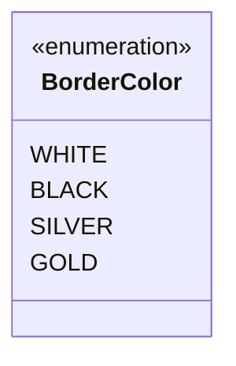

---
aliases:
  - BorderColor
tags:
  - java/enum
  - module/forge-core
  - pkg/forge/card
fqn: forge.card.CardEdition.BorderColor
package: forge.card
module: forge-core
kind: Enum
---

# BorderColor

**Package:** `forge.card`   **Module:** `forge-core`   **Kind:** Enum



## Design Description

BorderColor is a small nested enumeration declared within `forge.card.CardEdition` that enumerates the four physical card-border colors used across Magic: The Gathering printings: WHITE, BLACK, SILVER, and GOLD. Its sole responsibility is to provide a fixed, type-safe vocabulary for describing the border treatment of a given edition, replacing free-form strings or magic constants with a constrained, self-documenting set of values.

As a member type of CardEdition, it serves a supporting role: an edition references one BorderColor to record how its cards are bordered, letting rendering and rules code branch on a known set of cases. The design intent is minimal and deliberate—the enum carries no fields, constructors, or behavior, signaling that border color is purely a categorical attribute rather than an entity with its own logic.

## Source
`forge-core/src/main/java/forge/card/CardEdition.java` — declaration excerpt

```java
    public enum BorderColor {
        WHITE,
        BLACK,
        SILVER,
        GOLD
    }
```

## Python
`forge/card/CardEdition/BorderColor.py`

```python
from forge.card.CardEdition import CardEdition


class BorderColor:
    WHITE = "WHITE"
    BLACK = "BLACK"
    SILVER = "SILVER"
    GOLD = "GOLD"
```
