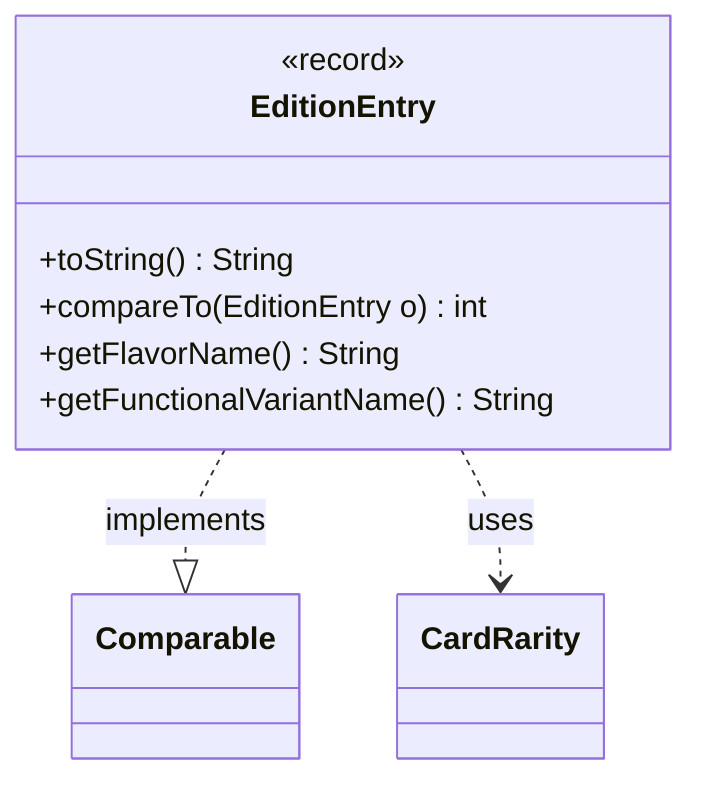

---
aliases:
  - EditionEntry
tags:
  - java/record
  - module/forge-core
  - pkg/forge/card
fqn: forge.card.CardEdition.EditionEntry
package: forge.card
module: forge-core
kind: Record
---

# EditionEntry

**Package:** `forge.card`   **Module:** `forge-core`   **Kind:** Record



## Relationships
**Uses:**
- [[forge.card.CardRarity|CardRarity]]

## Design Description

EditionEntry is an immutable record nested within `CardEdition` that captures a single card's printing details within a set: its name, collector number, rarity, artist, and an open-ended map of extra parameters. It implements `Comparable` to define a canonical sort order—first by name (case-insensitive), then by a normalized collector number, then by rarity—so entries can be ordered consistently in collections and listings.

Beyond storage, it provides presentation and accessor logic: `toString()` renders a compact human-readable form that conditionally includes collector number, meaningful rarity (suppressing `CardRarity.Unknown`/`Token`), artist, and serialized extra parameters. The `getFlavorName()` and `getFunctionalVariantName()` helpers expose specific well-known keys ("flavorname", "variant") from the extraParams map, keeping that loosely-typed bag's conventions encapsulated. Its sole domain collaborator is `CardRarity`.

## Source
`forge-core/src/main/java/forge/card/CardEdition.java` — declaration excerpt

```java
    public record EditionEntry(String name, String collectorNumber, CardRarity rarity, String artistName, Map<String, String> extraParams) implements Comparable<EditionEntry> {

        public String toString() {
            StringBuilder sb = new StringBuilder();
            if (collectorNumber != null) {
                sb.append(collectorNumber);
                sb.append(' ');
            }
            if (rarity != CardRarity.Unknown && rarity != CardRarity.Token) {
                sb.append(rarity);
                sb.append(' ');
            }
            sb.append(name);
            if (artistName != null) {
                sb.append(" @");
                sb.append(artistName);
            }
            if (extraParams != null) {
                sb.append(" $");
                sb.append(extraParams.entrySet().stream().map(e -> String.format("\"%s\"=\"%s\"", e.getKey(), e.getValue())).collect(Collectors.joining(", ")));
            }
            return sb.toString();
        }

        @Override
        public int compareTo(EditionEntry o) {
            final int nameCmp = name.compareToIgnoreCase(o.name);
            if (0 != nameCmp) {
                return nameCmp;
            }
            String thisCollNr = getSortableCollectorNumber(collectorNumber);
            String othrCollNr = getSortableCollectorNumber(o.collectorNumber);
            final int collNrCmp = thisCollNr.compareTo(othrCollNr);
            if (0 != collNrCmp) {
                return collNrCmp;
            }
            return rarity.compareTo(o.rarity);
        }

        public String getFlavorName() {
            if (extraParams == null)
                return null;
            return extraParams.get("flavorname");
        }

        public String getFunctionalVariantName() {
            if (extraParams == null)
                return null;
            return extraParams.get("variant");
        }
    }
```

## Python
`forge/card/CardEdition/EditionEntry.py`

```python
from forge.card.CardEdition import CardEdition
from forge.card.CardRarity import CardRarity
from dataclasses import dataclass
from typing import Optional


@dataclass(frozen=True)
class EditionEntry:
    name: str
    collectorNumber: str
    rarity: CardRarity
    artistName: str
    extraParams: dict[str, str]

    def toString(self) -> str:
        sb = []
        if self.collectorNumber is not None:
            sb.append(self.collectorNumber)
            sb.append(' ')
        if self.rarity != CardRarity.Unknown and self.rarity != CardRarity.Token:
            sb.append(str(self.rarity))
            sb.append(' ')
        sb.append(self.name)
        if self.artistName is not None:
            sb.append(" @")
            sb.append(self.artistName)
        if self.extraParams is not None:
            sb.append(" $")
            sb.append(", ".join('"%s"="%s"' % (k, v) for k, v in self.extraParams.items()))
        return "".join(sb)

    def __str__(self) -> str:
        return self.toString()

    def compareTo(self, o: "EditionEntry") -> int:
        nameCmp = (self.name.lower() > o.name.lower()) - (self.name.lower() < o.name.lower())
        if 0 != nameCmp:
            return nameCmp
        thisCollNr = CardEdition.getSortableCollectorNumber(self.collectorNumber)
        othrCollNr = CardEdition.getSortableCollectorNumber(o.collectorNumber)
        collNrCmp = (thisCollNr > othrCollNr) - (thisCollNr < othrCollNr)
        if 0 != collNrCmp:
            return collNrCmp
        return self.rarity.compareTo(o.rarity)

    def getFlavorName(self) -> Optional[str]:
        if self.extraParams is None:
            return None
        return self.extraParams.get("flavorname")

    def getFunctionalVariantName(self) -> Optional[str]:
        if self.extraParams is None:
            return None
        return self.extraParams.get("variant")
```
