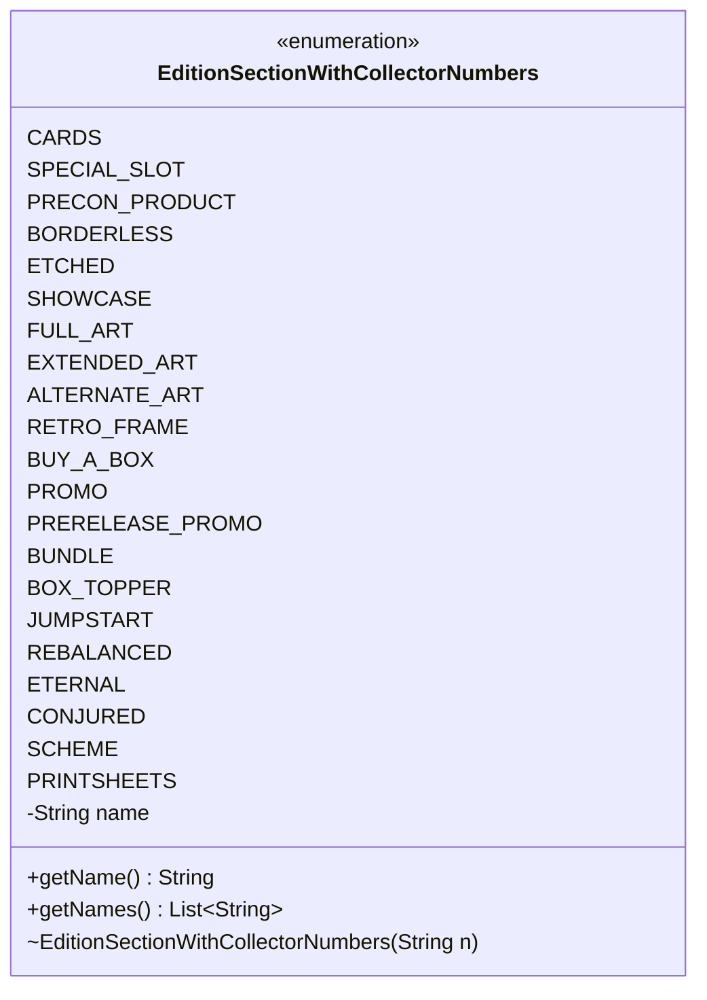

---
aliases:
  - EditionSectionWithCollectorNumbers
tags:
  - java/enum
  - module/forge-core
  - pkg/forge/card
fqn: forge.card.CardEdition.EditionSectionWithCollectorNumbers
package: forge.card
module: forge-core
kind: Enum
---

# EditionSectionWithCollectorNumbers

**Package:** `forge.card`   **Module:** `forge-core`   **Kind:** Enum



## Design Description

A configurable enumeration of card-edition section types, each pairing an enum constant with a lowercase display name used to identify collector-numbered printsheet groupings within an edition (e.g. borderless, etched, showcase, promo variants). Nested inside `CardEdition`, it models the named slots a set's cards can be organized into when parsing and representing edition data.

Each constant carries an immutable `name` string supplied through its constructor and exposed via `getName()`. The static `getNames()` helper iterates all values to return the full list of section names, supporting lookups that match parsed textual section headers against the enum. The design favors a simple value-with-label pattern: a fixed, type-safe vocabulary of section categories whose human-readable forms stay decoupled from the constant identifiers, allowing the display strings to differ from the Java naming conventions.

## Source
`forge-core/src/main/java/forge/card/CardEdition.java` — declaration excerpt

```java
    // commonly used printsheets with collector number
    public enum EditionSectionWithCollectorNumbers {
        CARDS("cards"),
        SPECIAL_SLOT("special slot"), //to help with convoluted boosters
        PRECON_PRODUCT("precon product"),
        BORDERLESS("borderless"),
        ETCHED("etched"),
        SHOWCASE("showcase"),
        FULL_ART("full art"),
        EXTENDED_ART("extended art"),
        ALTERNATE_ART("alternate art"),
        RETRO_FRAME("retro frame"),
        BUY_A_BOX("buy a box"),
        PROMO("promo"),
        PRERELEASE_PROMO("prerelease promo"),
        BUNDLE("bundle"),
        BOX_TOPPER("box topper"),
        JUMPSTART("jumpstart"),
        REBALANCED("rebalanced"),
        ETERNAL("eternal"),
        CONJURED("conjured"),
        SCHEME("scheme"),
        PRINTSHEETS("printsheets");

        private final String name;

        EditionSectionWithCollectorNumbers(final String n) { this.name = n; }

        public String getName() {
            return name;
        }

        public static List<String> getNames() {
            List<String> list = new ArrayList<>();
            for (EditionSectionWithCollectorNumbers s : EditionSectionWithCollectorNumbers.values()) {
                String sName = s.getName();
                list.add(sName);
            }
            return list;
        }
    }
```
